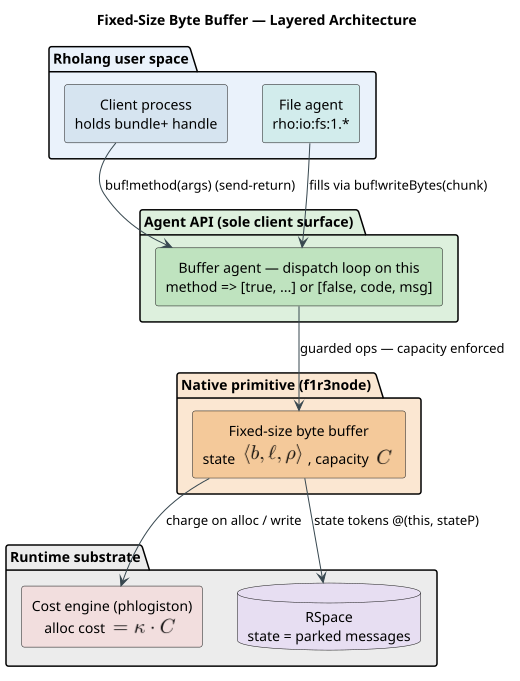
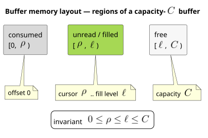
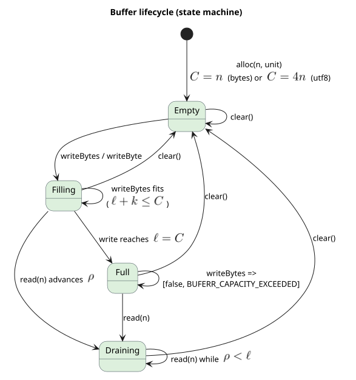
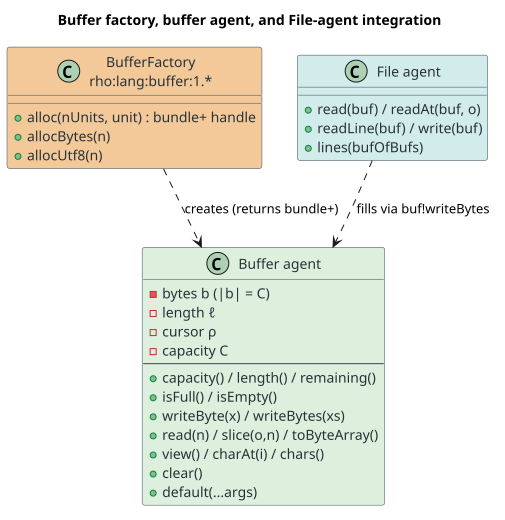
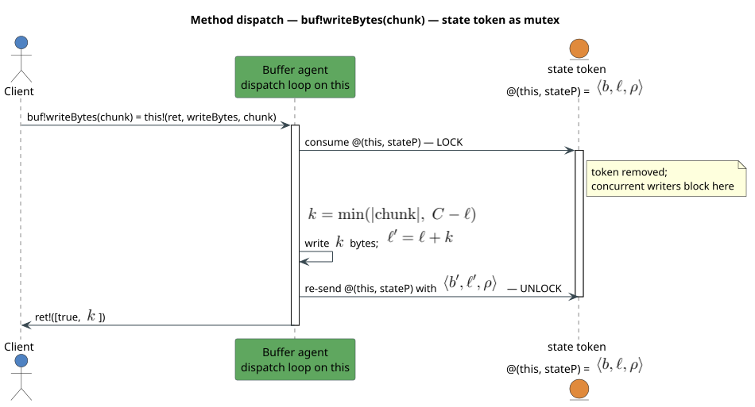
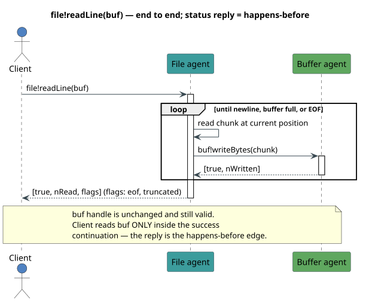
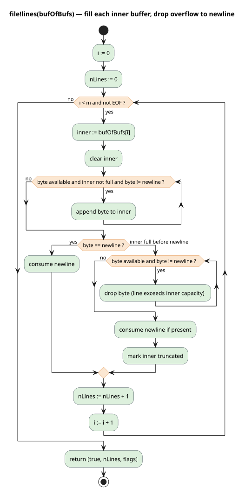

# Fixed-Size Byte Buffer Primitive

Dylon Edwards ([dylon.devo@gmail.com](mailto:dylon.devo@gmail.com))  
Michael Stay ([director.research@f1r3fly.io](mailto:director.research@f1r3fly.io))  
2026-07-23

We propose a **fixed-size byte buffer**: a mutable, fixed-capacity region of bytes
that a Rholang program allocates once and reuses, exposed *only* through a
channel-based **agent** API. The buffer is the tool that lets the
[File I/O](../../approved/2026-02-06-File-IO/2026-02-06-File-IO.md) surface read
arbitrarily large files in bounded memory: a caller preallocates a buffer of a
chosen capacity, and read calls fill it in place rather than materializing the
whole file (or a whole line) as a fresh value. Because Rholang values are
immutable and only messages parked on channels are mutable, the buffer cannot be
an ordinary value without breaking that invariant and inviting unprincipled data
races; wrapping the mutable bytes in an agent resolves both problems at once. This
document specifies the buffer's semantics, its agent API, its integration with the
File agent, Greg Meredith's fixed-size `lines()` (a buffer of buffers), the
memory-cost model, a formal operational semantics, and a concrete implementation
plan for the f1r3fly interpreter.

---

## Table of contents

1. [Motivation](#1-motivation)
2. [Background and terminology](#2-background-and-terminology)
3. [Design overview](#3-design-overview)
4. [The fixed-size byte buffer primitive](#4-the-fixed-size-byte-buffer-primitive)
5. [The agent API](#5-the-agent-api)
6. [Filling a buffer from a File](#6-filling-a-buffer-from-a-file)
7. [Efficiency for large files](#7-efficiency-for-large-files)
8. [Fixed-size `lines()`: a buffer of buffers](#8-fixed-size-lines-a-buffer-of-buffers)
9. [Encoding (UTF-8)](#9-encoding-utf-8)
10. [Concurrency, invariants, and safety](#10-concurrency-invariants-and-safety)
11. [Cost accounting and memory metering](#11-cost-accounting-and-memory-metering)
12. [Formal semantics](#12-formal-semantics)
13. [Implementation in the interpreter](#13-implementation-in-the-interpreter)
14. [Examples](#14-examples)
15. [Alternatives](#15-alternatives)
16. [Open questions and future work](#16-open-questions-and-future-work)
17. [References](#17-references)

---

## 1. Motivation

The File I/O proposal exposes files as agents and offers whole-file text methods
(`text()`, `lines()`) and byte methods (`read(n)`, `write(bytes)`). Two failure
modes motivated this proposal during design discussion:

- **A terabyte file.** `lines()` "reads the entire file, splits the string … and
  returns the resulting list of strings," and `text()` returns the whole file as a
  single `String`. Neither imposes a bound; on a file larger than memory, both
  abort the deploy (or the node).

- **A terabyte line.** Even a forward-only `readLine()` is unbounded when a single
  line is enormous — there is no place to say "read at most this many bytes."

Both stem from the same gap: **there is no way for a caller to preallocate a
bounded region and have a read fill it in place.** Every `read(n)` in File I/O
returns a *fresh* `ByteArray`, so the only bound is the caller-chosen `n`, and each
call allocates anew. There is also no hook by which a platform can *charge* for the
memory a read commits; the File I/O proposal explicitly defers cost accounting to a
later document.

In discussion, Greg Meredith proposed splitting the concern into **two
complementary APIs**:

1. a **streaming API** — character streams and streams of character streams
   (specified separately by Mike Stay); and
2. a **fixed-size buffer datatype primitive** — the subject of this document —
   where the caller allocates a bounded buffer and read calls fill it, dropping the
   remainder of an over-long line rather than growing without bound.

This proposal delivers (2): the primitive, its agent API, and the File-integration
calls that make bounded, efficient, large-file reads possible, and that give cost
accounting a concrete, statically sized unit to charge.

---

## 2. Background and terminology

This section defines every term, symbol, and acronym used later, so the design can
be read without external references.

### 2.1 Rholang, the ρ-calculus, and immutability

Rholang is the smart-contract language of the f1r3fly node; its formal basis is the
**reflective higher-order calculus** (ρ-calculus) of
[Meredith & Radestock (2005)](https://doi.org/10.1016/j.entcs.2005.05.016), itself
a reflective extension of the **π-calculus** of
[Milner, Parrow & Walker (1992)](https://doi.org/10.1016/0890-5401%2892%2990008-4).
Two properties of Rholang are load-bearing for this design:

- **Values are immutable.** A map, list, string, or byte array, once constructed,
  never changes; an "update" produces a *new* value.
- **The only mutable state is the tuplespace.** The single locus of change is the
  multiset of messages **parked on channels**. "Mutation" is modelled as
  *consuming* a message from a channel and *producing* a (possibly different)
  message in its place.

A **channel** (equivalently, a **name**) is an address in the tuplespace. In
Rholang a name may be *quoted* from a process with `@P` and a name `x` may be
*reified* back to a process with `*x`. An **unforgeable name** is a name that
cannot be guessed or reconstructed — only obtained by being given it — and is the
substrate for capabilities.

### 2.2 Agents

An **agent** (per the
[Agents FIP](../../approved/2025-08-20-Agents/Agents.md)) is object-style state
emulated on top of concurrent processes: a constructor sets up instance-local state
and returns a reference to the instance, and methods read and update that state.
The desugaring is

```
⟦agent fooCtor {
  constructor(<fooPtrns>) { Pc } |
  method fooMethod1(<ptrns1>) { P1 } |
  ... |
  default(...@args) { Q }
}⟧
=
for(r, <fooPtrns> <= fooCtor) {
  new this, private in {
    for(...@args <= this) {
      match args {
        [ *return, "fooMethod1", <ptrns1> ] => ⟦P1⟧
        ...
        _ => ⟦Q⟧
      }
    } |
    ⟦Pc⟧ |
    r!(bundle+{*this})
  }
}
```

with the call sugar `⟦for(z <- x!y(...args)) { P }⟧ = ⟦for(z <- x!?("y", ...args)) { P }⟧`.
Three points matter here:

- **Instance state lives on compound channels** keyed by the instance's unforgeable
  `this` (or `private`) name, e.g. `@(*this, *stateP)`. Reading state that must not
  change uses the **peek** operator `<<-` (non-destructive receive); mutating it
  uses the linear receive `<-` (destructive), which *removes* the token.
- **`bundle+{*this}`** is a **write-only** capability over the instance channel: a
  holder may *send* method invocations but cannot *receive* on it, so it can never
  observe or forge the instance's internal traffic. This is an **object capability**
  (**ocap**) in the sense of [Dennis & Van Horn (1966)](https://doi.org/10.1145/365230.365252)
  and [Miller (2006)](http://www.erights.org/talks/thesis/markm-thesis.pdf): the
  reference *is* the authority.
- **A `default` clause is mandatory**, because a message of unexpected shape that
  reached `this` with no matching arm would deadlock the agent.

The [Private Methods FIP](../../approved/2026-01-28-Private-Methods/2026-01-28-Private-Methods.md)
adds a parallel dispatcher on the `private` channel for methods the client can
never call; we use it for the buffer's internal helpers.

### 2.3 Byte arrays and the calling / result conventions

Rholang's existing byte container is **`ByteArray`**, an *immutable* arbitrary-size
value that already backs the cryptographic system processes. The buffer
interoperates with `ByteArray` at every read/write boundary but is *not* a
`ByteArray`: it is mutable and fixed-capacity.

We adopt the File I/O conventions verbatim so that try/catch sugar, attenuation
forwarders, and membranes work over buffer agents uniformly:

- A method call `agent!method(...args)` is sugar for a message
  `agent!(retCh, "method", args...)`.
- Every method returns a list, either `[true, result]` on success or
  `[false, errorCode, errorMessage]` on failure, surfaced by the sugar

  ```
  try @result <- agent!method(...args) {
    // success: result is bound
  } catch @[code, msg] {
    // failure
  }
  ```

  with the empty-success form `try <- agent!method(...) { … }` for methods that
  return `[true]` alone.

### 2.4 Phlogiston (cost accounting)

Every Rholang operation is charged in **phlogiston** (gas). A deploy carries a phlo
budget; an operation calls `charge(cost)`, and when the budget goes negative the
deploy aborts with `OutOfPhlogistonsError`. Charging *rate-limits* work but does not
by itself *cap* live memory — a point §11 addresses directly.

### 2.5 UTF-8 and Unicode terms

A **code point** is an integer in the Unicode codespace. **UTF-8**
([RFC 3629](https://doi.org/10.17487/RFC3629)) encodes each code point as a
sequence of one to four bytes; a **code unit** is one such byte. A multi-byte
sequence must not be split across a boundary if the bytes are to be decoded as
text. The maximum encoded length of a code point is **4 bytes**, the fact that
fixes the char-sizing formula in §4.

### 2.6 Notation

| Symbol | Meaning |
| --- | --- |
| $`C`$ | buffer capacity, in bytes (fixed at allocation) |
| $`\ell`$ | fill level: number of bytes written, $`0 \le \ell \le C`$ |
| $`\rho`$ | read cursor: bytes already consumed, $`0 \le \rho \le \ell`$ |
| $`b`$ | the backing byte sequence, with $`\lvert b\rvert = C`$ |
| $`\kappa`$ | phlogiston cost per byte of capacity (a platform constant) |
| $`F`$ | size of a file being read, in bytes |
| $`m`$ | number of inner buffers in a buffer of buffers |
| $`n`$ | allocation argument (bytes, or UTF-8 chars) |

The buffer's complete state is the 4-tuple $`\langle b, \ell, \rho, C\rangle`$
with the standing invariant

```math
0 \;\le\; \rho \;\le\; \ell \;\le\; C \;=\; |b|.
```

---

## 3. Design overview

The design has two layers, shown in Figure 1.



*Figure 1 — Layered architecture. Clients (and the File agent) reach the buffer
**only** through the agent API; the native primitive and its cost/RSpace substrate
are never touched directly.*

- **Native primitive layer.** Inside the interpreter, a buffer is a fixed-capacity
  region of bytes $`b`$ (conceptually a `Vec<u8>` of length $`C`$) together with
  the fill level $`\ell`$ and read cursor $`\rho`$. Capacity is enforced
  *structurally*: a write that would exceed $`C`$ writes only what fits (or is
  refused). This is a **hard** memory bound, not merely a gas-based rate limit.

- **Agent API layer (the sole client surface).** Clients never obtain the raw
  region. They hold a `bundle+` **handle** to a buffer **agent** and interact by
  sending method messages. This single decision buys three properties at once:

  1. **Immutability is preserved.** The handle is an ordinary immutable Rholang
     value (an unforgeable name); the mutation lives where Rholang already permits
     it — in messages parked on the agent's state channel.
  2. **Races become principled.** Concurrent method messages are *serialized* by the
     agent's single-state-token mutex (§10), so invariants hold under contention.
  3. **Authority is explicit.** The `bundle+` handle is an object capability: to use
     a buffer you must have been given its handle.

This is exactly the resolution reached in discussion: *"We can have fixed-size
mutable buffers, but clients can only access them through a library that wraps them
in an agent API,"* which "would be consistent with everything else."

---

## 4. The fixed-size byte buffer primitive

### 4.1 State and lifecycle

A buffer is created empty at a fixed capacity and then filled, drained, and
optionally cleared for reuse. Figure 2 shows the byte layout; Figure 3 the
lifecycle.



*Figure 2 — Layout of a capacity-$`C`$ buffer. Bytes $`[0,\rho)`$ have been
consumed by `read`; $`[\rho,\ell)`$ are filled but unread; $`[\ell,C)`$ are
free.*



*Figure 3 — Lifecycle. `clear()` returns any state to `Empty`, enabling reuse
without reallocation.*

### 4.2 Allocation and the two sizing units

A buffer is allocated by **capacity**, chosen in one of two units:

- **bytes** — $`C = n`$; or
- **UTF-8 characters** — $`C = 4n`$.

The factor of four is the maximum UTF-8 encoded length of a code point
([RFC 3629](https://doi.org/10.17487/RFC3629)). Sizing by characters therefore
guarantees room for $`n`$ code points *of any width*:

```math
C \;=\;
\begin{cases}
n, & \text{unit} = \texttt{"bytes"},\\[2pt]
4n, & \text{unit} = \texttt{"utf8"}.
\end{cases}
```

Capacity is immutable for the buffer's lifetime; only $`\ell`$ and $`\rho`$
change. This is what makes the memory footprint statically known (§11) and the
region safe to reuse across reads (§7).

---

## 5. The agent API

### 5.1 The factory

Buffers are minted by a factory agent reached through the versioned registry,
mirroring File I/O's `` `rho:io:fs:1.*` ``:

```
new getBuf(`rho:lang:buffer:1.*`), notify in {
  for (buffers <- getBuf!?(*notify)) {
    // buffers is the factory agent
  }
}
```

| Method | Returns | Notes |
| --- | --- | --- |
| `alloc(nUnits, unit)` | `[true, buf]` | `unit ∈ {"bytes","utf8"}`; `buf` is a `bundle+` handle to a fresh, empty buffer |
| `allocBytes(n)` | `[true, buf]` | sugar for `alloc(n, "bytes")` |
| `allocUtf8(n)` | `[true, buf]` | sugar for `alloc(n, "utf8")` |
| `allocRows(m, innerN, innerUnit)` | `[true, rows]` | a **buffer of buffers**: `m` inner buffers, each of capacity derived from `(innerN, innerUnit)` (§8) |

`alloc` charges the allocation cost of §11 and may fail with
`[false, BUFERR_INVALID_CAPACITY, …]` (non-positive or over-limit capacity),
`[false, BUFERR_INVALID_UNIT, …]`, or `[false, FSERR_QUOTA_EXCEEDED, …]` when a
quota agent declines the memory (the File I/O quota hook, reused unchanged).

### 5.2 Instance methods

Every instance method follows the calling and result conventions of §2.3. Figure 4
summarizes the surface.



*Figure 4 — The factory mints buffer agents (returning `bundle+` handles); the File
agent fills them via `buf!writeBytes`.*

**Queries (non-mutating; implemented with peek `<<-`).**

| Method | Returns |
| --- | --- |
| `capacity()` | `[true, C]` |
| `length()` | `[true, ℓ]` |
| `remaining()` | `[true, C - ℓ]` |
| `isEmpty()` / `isFull()` | `[true, ℓ == 0]` / `[true, ℓ == C]` |

**Writes (mutating).**

| Method | Returns | Semantics |
| --- | --- | --- |
| `writeByte(x)` | `[true, k]` with `k ∈ {0,1}` | append one byte if room; `k = 0` and `[false, BUFERR_CAPACITY_EXCEEDED, …]` when full |
| `writeBytes(xs)` | `[true, k]` | append $`k = \min(\lvert xs\rvert,\; C - \ell)`$ bytes; a **short write** ($`k < \lvert xs\rvert`$) signals the buffer filled |

**Reads (mutating cursor / non-mutating).**

| Method | Returns | Semantics |
| --- | --- | --- |
| `read(n)` | `[true, bytes]` | consume $`\min(n,\ \ell-\rho)`$ bytes from $`\rho`$, advancing it; drains the buffer |
| `slice(offset, n)` | `[true, bytes]` | positional copy of $`[\text{offset}, \text{offset}+n)`$; no cursor move; `[false, BUFERR_OUT_OF_RANGE, …]` if out of $`[0,\ell]`$ |
| `toByteArray()` | `[true, bytes]` | copy of the filled region $`[0,\ell)`$ |

**Text view (UTF-8; see §9).**

| Method | Returns | Semantics |
| --- | --- | --- |
| `view()` | `[true, str]` | decode $`[0,\ell)`$ as UTF-8; `[false, BUFERR_BAD_ENCODING, …]` if the region is not valid UTF-8 |
| `charAt(i)` | `[true, str]` | the `i`-th code point of the decoded view |
| `chars()` | `[true, iter]` | a character iterator over the decoded view |

**Reset.**

| Method | Returns | Semantics |
| --- | --- | --- |
| `clear()` | `[true]` | $`\ell \leftarrow 0,\ \rho \leftarrow 0`$ — reuse without reallocation |
| `default(...@args)` | `[false, BUFERR_UNSUPPORTED, …]` | mandatory catch-all |

### 5.3 Error codes

Error codes are `SCREAMING_SNAKE`, matching File I/O's `FSERR_*` family:

`BUFERR_CAPACITY_EXCEEDED`, `BUFERR_INVALID_CAPACITY`, `BUFERR_INVALID_UNIT`,
`BUFERR_OUT_OF_RANGE`, `BUFERR_EMPTY`, `BUFERR_BAD_ENCODING`,
`BUFERR_UNSUPPORTED`, `BUFERR_REVOKED`. The File I/O code `FSERR_QUOTA_EXCEEDED` is
reused for admission control at allocation.

### 5.4 Method dispatch and the mutex

Figure 5 shows a single `writeBytes` call end to end, making the state-token mutex
of §10 concrete.



*Figure 5 — `buf!writeBytes(chunk)` desugars to a message on `this`; the dispatch
loop **consumes** the single state token (acquiring the lock), writes
$`k = \min(\lvert \mathrm{chunk}\rvert,\ C-\ell)`$ bytes, **re-sends** the token (releasing
the lock), and replies `[true, k]`. Any concurrent writer blocks on the absent
token.*

---

## 6. Filling a buffer from a File

The point of the primitive is that the **File agent fills the buffer**. We add
buffer-targeted variants of the File I/O byte methods; they are the reusable,
bounded-memory counterparts of the existing allocating `read(n) -> ByteArray`.

| Method | Returns | Semantics |
| --- | --- | --- |
| `file!read(buf)` | `[true, nRead, eof]` | fill `buf` from the current position (up to `remaining()`), advancing the position by `nRead` |
| `file!readAt(buf, offset)` | `[true, nRead, eof]` | positional fill; does not move the position |
| `file!readLine(buf)` | `[true, nRead, flags]` | fill up to one line — through the newline or until the buffer fills; `flags` is a map `{"eof": Bool, "truncated": Bool}` |
| `file!write(buf)` | `[true, nWritten]` | drain the filled region $`[0,\ell)`$ of `buf` to the file at the current position |

`readLine` sets `truncated` when the line is longer than the buffer: the buffer is
filled to capacity and the newline is *not* consumed, so a subsequent `readLine`
into a cleared buffer continues the same line. (The alternative "drop the overflow"
policy is exactly what `lines()` does across a buffer of buffers — §8.)

### 6.1 Resolving the invalidation and race questions

Two questions were raised in discussion about `file!readLine(bufToFill)`. Both
dissolve under the agent model.

**"If `result` is the filled buffer, what is `bufToFill` now — is it invalidated?"**
It is not. The reply is a **status** value, not a buffer. `bufToFill` is a *channel
handle* — an immutable reference to the mutable agent — and passing it to
`readLine` neither copies nor replaces it. After the call it denotes the same
buffer, now filled. There is no second "result buffer" to reconcile, so the correct
shape is simply

```
try @[nRead, flags] <- file!readLine(buf) {
  // buf is filled; read it here
} catch @[code, msg] {
  // handle error
}
```

**"With the `try <- file!readLine(bufToFill) { … }` shape, won't the body race the
fill?"** No — provided the body reads `buf` only in the success continuation. The
reply is the **happens-before** edge in the sense of
[Lamport (1978)](https://doi.org/10.1145/359545.359563): the File agent finishes
writing the buffer *before* it sends the status, and the client reads the buffer
*after* receiving it. The success continuation is therefore strictly ordered after
the last write. Figure 6 makes the ordering explicit.



*Figure 6 — `file!readLine(buf)`: the File agent fills the buffer via
`buf!writeBytes`, then replies. The status reply is the happens-before edge; the
`buf` handle is unchanged and still valid. The client reads `buf` only inside the
success continuation.*

Concurrent messages from *other* processes that hold the same handle are still
serialized by the buffer's mutex, so no write can interleave mid-byte; but a program
that wants a coherent line should observe the **single-writer** discipline — only
one filler (here, the File agent) writes between `clear()` and the read. This mirrors
the actor discipline of [Agha (1986)](https://doi.org/10.7551/mitpress/1086.001.0001):
one mailbox, messages processed one at a time.

---

## 7. Efficiency for large files

Beyond safety, the buffer is the *efficient* way to read a large file, because it
is **preallocated once and reused**. Reading a file of $`F`$ bytes with a single
capacity-$`C`$ buffer performs

```math
\left\lceil \frac{F}{C} \right\rceil \text{ fills}, \qquad
\text{peak live memory} = \Theta(C) \ \text{— independent of } F,
```

and allocates **no** intermediate `ByteArray` per read. Contrast the two whole-file
paths and the allocating byte path:

| Approach | Peak memory | Allocations |
| --- | --- | --- |
| `text()` / `lines()` | $`\Theta(F)`$ | whole file (+ per-line) |
| repeated `read(n) -> ByteArray` | $`\Theta(n)`$ | one fresh `ByteArray` **per call** |
| reused fixed-size buffer | $`\Theta(C)`$ | **one**, at allocation |

The reuse pattern is: `clear()` the buffer, `file!readLine(buf)` (or `file!read(buf)`),
process the filled region, repeat. Preallocation here is not a premature
optimization — it is the mechanism that makes the memory bound hold. The idea
generalizes the region discipline of
[Tofte & Talpin (1997)](https://doi.org/10.1006/inco.1996.2613): a statically sized
region whose lifetime and footprint are known up front.

---

## 8. Fixed-size `lines()`: a buffer of buffers

Greg Meredith's fixed-size `lines()` reads many lines at once into a **fixed-size
buffer whose elements are themselves fixed-size buffers**. It fills each inner
buffer up to its capacity; if a line overflows, it **drops characters until the next
newline** and resumes into the next inner buffer. This bounds *both* the number of
lines and the length of each, so total memory is

```math
C_{\mathrm{total}} \;=\; m \cdot C_{\mathrm{inner}},
```

for $`m`$ inner buffers each of capacity $`C_{\mathrm{inner}}`$.

### 8.1 The outer buffer

`buffers!allocRows(m, innerN, innerUnit)` allocates the outer buffer and its $`m`$
inner buffers in one call. The outer buffer supports:

| Method | Returns | Semantics |
| --- | --- | --- |
| `count()` | `[true, nFilled]` | number of inner buffers filled by the last `lines()` |
| `capacityRows()` | `[true, m]` | number of inner buffers |
| `getAt(i)` | `[true, inner]` | handle to inner buffer `i` (a byte buffer per §5) |
| `clear()` | `[true]` | clears every inner buffer and resets `count` |

`file!lines(rows)` fills the rows and returns `[true, nLines, flags]`, where `flags`
reports `eof` and whether any line was `truncated`.

### 8.2 The fill algorithm (literate)

Figure 7 is the flowchart; here is the same algorithm in literate form. We read one
line per inner buffer, and we treat "line too long" by discarding the overflow so
the buffer bound is never exceeded.



*Figure 7 — `file!lines(bufOfBufs)`: fill each inner buffer to a newline or its
capacity; on overflow, drop to the next newline and mark the inner buffer
truncated.*

⟨*fill the outer buffer* 8.2⟩ ≡
```
i ← 0 ; nLines ← 0 ; truncatedAny ← false
while i < m and not atEOF:
    inner ← rows.getAt(i)
    inner.clear()
    ⟨fill one inner buffer up to a newline or capacity 8.2a⟩
    ⟨if the line overflowed, drop to the newline 8.2b⟩
    nLines ← nLines + 1
    i ← i + 1
return [true, nLines, {"eof": atEOF, "truncated": truncatedAny}]
```

⟨*fill one inner buffer up to a newline or capacity* 8.2a⟩ ≡
```
while byteAvailable and not inner.isFull() and peek() ≠ '\n':
    inner.writeByte(next())
```
We stop for one of three reasons: the newline arrived, the inner buffer filled, or
the file ended. The next chunk distinguishes them.

⟨*if the line overflowed, drop to the newline* 8.2b⟩ ≡
```
if peek() = '\n':
    next()                      # consume the newline; the line fit
else if inner.isFull():
    while byteAvailable and peek() ≠ '\n':
        next()                  # discard the overflow — bounded memory preserved
    if byteAvailable: next()    # consume the terminating newline if present
    truncatedAny ← true
# else: EOF with no trailing newline — the partial line stands
```

The discipline that keeps memory bounded is in 8.2b: once an inner buffer is full,
further bytes of that line are **read and dropped**, never stored. The peak memory
for the whole call is $`m \cdot C_{\mathrm{inner}}`$, fixed before the first byte
is read.

---

## 9. Encoding (UTF-8)

Following the discussion decision to *"require UTF-8 for the moment … and add other
encodings later,"* the buffer stores **raw bytes** and decodes on demand.

- **`writeBytes` / `writeByte`** are encoding-agnostic: they move bytes.
- **`view()` / `charAt` / `chars()`** decode $`[0,\ell)`$ as UTF-8
  ([RFC 3629](https://doi.org/10.17487/RFC3629)). If the region ends in the middle
  of a multi-byte sequence — which happens naturally when a fixed-capacity fill
  splits a code point at $`\ell`$ — `view()` returns `[false, BUFERR_BAD_ENCODING, …]`
  rather than emitting a replacement character, so truncation is never silent. A
  caller that wants only whole code points sizes the buffer with the `"utf8"` unit
  and relies on the File agent to stop fills on code-point boundaries.

The byte→text boundary is exactly the `view()` method — the place File I/O currently
leaves implicit. Because decoding is confined to the buffer, adding another encoding
later (per Mike's note that changing a File agent's encoding "would need to reset
positions of readers and writers") is a localized change: a decoding parameter on
the view methods and an encoding field on the File agent, with no change to the
byte-level surface.

---

## 10. Concurrency, invariants, and safety

### 10.1 The state-token mutex

The agent keeps its state in a **single message** on an instance-scoped channel,
`@(*this, *stateP)!(⟨b, ℓ, ρ⟩)`. A mutating method does

```
for (@state <- @(*this, *stateP)) { /* critical section */ @(*this, *stateP)!(state') }
```

The linear receive `<-` **removes** the only token; any concurrent mutator blocks on
the empty channel until the token is re-sent. This is a mutex whose critical section
is precisely the span between consume and re-send — the same single-token ownership
that the [Agents FIP](../../approved/2025-08-20-Agents/Agents.md) `Stack` uses.
Non-mutating queries use the peek operator `<<-`, which reads without removing the
token and so never contends. The mutual exclusion is the "linear resource" discipline
of [Girard's linear logic (1987)](https://doi.org/10.1016/0304-3975%2887%2990045-4):
the state token is consumed exactly once per critical section and then reproduced.

### 10.2 Invariants maintained

Under this serialization the standing invariant $`0 \le \rho \le \ell \le C`$
holds after every method, because each method re-establishes it before re-sending
the token:

- `writeBytes` sets $`\ell' = \ell + k`$ with $`k \le C - \ell`$, so
  $`\ell' \le C`$;
- `read` sets $`\rho' = \rho + m`$ with $`m \le \ell - \rho`$, so
  $`\rho' \le \ell`$;
- `clear` sets $`\ell' = \rho' = 0`$.

Capacity $`C`$ is never mutated, so $`\lvert b\rvert = C`$ is trivially preserved.

### 10.3 Object-capability safety

A buffer is reachable only via its `bundle+` handle, which is write-only and
unforgeable: a process that was never given the handle can neither read nor mutate
the buffer, and even a holder cannot observe the agent's internal state channel. In
capability terms ([Miller 2006](http://www.erights.org/talks/thesis/markm-thesis.pdf),
[Dennis & Van Horn 1966](https://doi.org/10.1145/365230.365252)) the buffer is a
first-class, delegable, attenuable resource: a holder may forward the handle, wrap
it in a membrane, or hand out a read-only forwarder — all with the same machinery
File I/O already uses for file handles.

---

## 11. Cost accounting and memory metering

A fixed capacity turns memory into something a platform can **charge for
statically**, which is what §1's opening concern requires.

- **Allocation cost.** `alloc` charges phlogiston proportional to capacity,

  ```math
  \mathrm{cost}_{\mathrm{alloc}}(C) \;=\; \kappa \cdot C,
  ```

  for a platform constant $`\kappa`$. Because $`C`$ is declared up front and
  never grows, the charge is known before any byte is read.

- **Write cost.** `writeBytes` charges in proportion to the bytes actually written,
  $`k`$; refused (over-capacity) bytes are never charged, because they are never
  stored.

- **Structural cap.** Charging alone rate-limits but does not cap live memory. The
  buffer additionally enforces capacity *structurally* — a write past $`C`$ is
  refused — so the live footprint of a buffer is hard-bounded by $`C`$ regardless
  of budget. This is the qualitative improvement over gas-only accounting, and it is
  what makes "read a terabyte file" safe on a node with a gigabyte of memory.

- **Admission control.** Allocation consults the same quota agent as File I/O; a
  refusal is reported as `[false, FSERR_QUOTA_EXCEEDED, …]`.

This proposal is therefore the **memory-cost primitive** that File I/O's deferred
"Cost accounting" section can build on: a fixed-size buffer is a unit of memory
whose cost is $`\kappa \cdot C`$ and whose footprint cannot exceed $`C`$.

---

## 12. Formal semantics

We give a small-step operational semantics for the primitive as transitions over the
configuration $`\langle b,\ \ell,\ \rho,\ C\rangle`$, with $`b`$ a byte sequence
of length $`C`$, $`0^{C}`$ the all-zero sequence of length $`C`$, $`w`$ a
byte sequence argument, $`b[i{:}j]`$ the subsequence at indices $`[i,j)`$, and
$`b[i{:}j] := w`$ the overwrite of that subsequence by $`w`$. Each rule also
yields the method's return value $`\mathsf{ret}`$. The agent layer serializes
these transitions (§10), so they are the semantics of the buffer under any
interleaving of method calls.

**Allocation.** Capacity follows the sizing unit of §4.2.

```math
\dfrac{\;\text{unit} = \texttt{"bytes"} \quad C = n\;}
      {\ \texttt{alloc}(n,\text{unit}) \;\Rightarrow\; \langle 0^{C},\ 0,\ 0,\ C\rangle\ }
\quad\text{(Alloc-Bytes)}
```

```math
\dfrac{\;\text{unit} = \texttt{"utf8"} \quad C = 4n\;}
      {\ \texttt{alloc}(n,\text{unit}) \;\Rightarrow\; \langle 0^{C},\ 0,\ 0,\ C\rangle\ }
\quad\text{(Alloc-Utf8)}
```

**Write that fits.**

```math
\dfrac{\;\ell + |w| \le C \quad k = |w|\;}
      {\ \langle b,\ \ell,\ \rho,\ C\rangle
        \;\overset{\texttt{writeBytes}(w)}{\longrightarrow}\;
        \langle b[\ell{:}\ell{+}k] := w,\ \ell{+}k,\ \rho,\ C\rangle,\ \ \mathsf{ret}=k\ }
\quad\text{(Write-Fits)}
```

**Write that overflows** (short write; only $`C-\ell`$ bytes are stored).

```math
\dfrac{\;\ell < C \quad \ell + |w| > C \quad k = C - \ell\;}
      {\ \langle b,\ \ell,\ \rho,\ C\rangle
        \;\overset{\texttt{writeBytes}(w)}{\longrightarrow}\;
        \langle b[\ell{:}C] := w[0{:}k],\ C,\ \rho,\ C\rangle,\ \ \mathsf{ret}=k\ }
\quad\text{(Write-Overflow)}
```

**Write to a full buffer** (refused).

```math
\dfrac{\;\ell = C\;}
      {\ \langle b,\ \ell,\ \rho,\ C\rangle
        \;\overset{\texttt{writeBytes}(w)}{\longrightarrow}\;
        \langle b,\ \ell,\ \rho,\ C\rangle,\ \ \mathsf{ret}=[\,\texttt{false},\ \texttt{BUFERR\_CAPACITY\_EXCEEDED}\,]\ }
\quad\text{(Write-Full)}
```

**Read** (drains from the cursor).

```math
\dfrac{\;m = \min(n,\ \ell - \rho)\;}
      {\ \langle b,\ \ell,\ \rho,\ C\rangle
        \;\overset{\texttt{read}(n)}{\longrightarrow}\;
        \langle b,\ \ell,\ \rho{+}m,\ C\rangle,\ \ \mathsf{ret}=b[\rho{:}\rho{+}m]\ }
\quad\text{(Read)}
```

**Clear** (reuse).

```math
\ \langle b,\ \ell,\ \rho,\ C\rangle
  \;\overset{\texttt{clear}}{\longrightarrow}\;
  \langle b,\ 0,\ 0,\ C\rangle
\quad\text{(Clear)}
```

**Soundness of the invariant.** Let $`I(\langle b,\ell,\rho,C\rangle) \equiv 0 \le \rho \le \ell \le C = \lvert b\rvert`$.
$`I`$ holds after (Alloc-\*) since $`\rho=\ell=0 \le C`$ and $`\lvert 0^{C}\rvert=C`$. Each
other rule preserves $`I`$: (Write-Fits) and (Write-Overflow) leave $`\rho`$
unchanged and set $`\ell' \le C`$, keeping $`\rho \le \ell'`$ because
$`\rho \le \ell \le \ell'`$; (Read) leaves $`\ell`$ unchanged and sets
$`\rho' = \rho + m \le \rho + (\ell-\rho) = \ell`$; (Clear) sets
$`\rho'=\ell'=0`$; none mutates $`C`$ or $`\lvert b\rvert`$. By induction over any
sequence of transitions, every reachable configuration satisfies $`I`$ — so no
method can drive the buffer out of bounds, which is the safety property the native
layer relies on.

---

## 13. Implementation in the interpreter

This section is the concrete plan for the f1r3fly node (the Rust implementation
under `rholang/src/rust/interpreter/`, with the datatype schema in the `models`
crate). We recommend grounding the buffer as a **native system process** with an
**opaque handle**, and we give the exact touch points. The
[Numeric Types FIP](../../approved/2025-11-13-Numeric-Types/Numeric%20Types.md) is
the template for adding a primitive; the
[Reifying RSpaces FIP](../../approved/2025-09-26-Reifying-RSpaces/Reifying%20RSpaces.md)
is the template for first-classing mutable state that lives in RSpace.

### 13.1 Recommended design: native factory + opaque handle

- **Factory as a system process.** Register `` `rho:lang:buffer:1.*` `` in
  `std_system_processes()` (in `rho_runtime.rs`), with handlers in
  `system_processes.rs`, exactly as File I/O and the crypto processes register their
  URNs. The factory's `alloc` allocates a native, capacity-bounded region and returns
  a handle.

- **Buffer handle as a new `GUnforgeable` variant.** Model the handle on
  `GPrivate` / `GSysAuthToken`: add a variant to the `oneof unf_instance` of
  `GUnforgeable` in `models/src/main/protobuf/RhoTypes.proto` (the unforgeable group,
  around line 480). The handle is opaque and forgery-proof — it carries an instance
  id, not the bytes — so the mutable region can be enforced natively while the
  Rholang-facing value remains an ordinary unforgeable name that `bundle+` can wrap.

- **Bytes in the native region, cost through the existing engine.** The region is a
  native `Vec<u8>` with $`\ell`$ and $`\rho`$; capacity and writes are enforced
  in the handler (rejecting past $`C`$, per §12). Allocation charges
  $`\kappa\cdot C`$ via a new `buffer_alloc_cost` in
  `accounting/costs.rs`; any state parked in RSpace is charged per encoded byte
  through `storage/charging_rspace.rs`.

### 13.2 Touch-point map

| File | Change |
| --- | --- |
| `models/src/main/protobuf/RhoTypes.proto` | new `oneof unf_instance` variant for the buffer handle |
| `models/src/lib.rs` | manual `PartialEq` / `Hash` arms for the new unforgeable variant |
| `models/src/rust/rholang/sorter/expr_sort_matcher.rs` | scoring arm so terms canonicalize identically (consensus-critical) |
| `rholang/src/rust/interpreter/rho_runtime.rs` | register `` `rho:lang:buffer:1.*` `` in `std_system_processes()` |
| `rholang/src/rust/interpreter/system_processes.rs` | native handlers: `alloc`, `writeByte`, `writeBytes`, `read`, `slice`, `view`, `clear`, queries |
| `rholang/src/rust/interpreter/reduce.rs` | `get_unforgeable_type` and dispatch for the handle |
| `rholang/src/rust/interpreter/accounting/costs.rs` | `buffer_alloc_cost(C) = κ·C`; per-byte write cost |
| `rholang/src/rust/interpreter/storage/charging_rspace.rs` | ensure parked buffer state is charged per byte |
| `rholang/src/rust/interpreter/pretty_printer.rs` | printing of the handle |
| `rholang/src/rust/interpreter/matcher/spatial_matcher.rs` | pattern matching over the handle |
| `node/src/rust/api/web_api.rs` | JSON display of the handle |

The `models/src/rust/rho_type.rs` wrapper `RhoByteArray` is the nearest existing
pattern for the `ByteArray` interop at `writeBytes` / `toByteArray`.

### 13.3 The agent wrapper

The Rholang-facing agent layer is a thin library over the native handle, written in
the [Agents](../../approved/2025-08-20-Agents/Agents.md) style: a `constructor` that
stores the native handle on `@(*this, *handleP)`, one `method` per §5 call that
forwards to the native handler under the state-token mutex, `private` helpers for
the UTF-8 boundary check, and the mandatory `default`. Clients receive
`bundle+{*this}`; they never see the native handle.

---

## 14. Examples

All examples use the method-call and try/catch sugar of §2.3; `stdout` / `stderr`
are the File I/O standard streams.

### 14.1 Allocate, fill, and read back as text

```
new getBuf(`rho:lang:buffer:1.*`), notify in {
  for (buffers <- getBuf!?(*notify)) {
    try @buf <- buffers!alloc(64, "bytes") {
      try @k <- buf!writeBytes("Hello, Rholang".toByteArray()) {
        try @s <- buf!view() {
          stdout!(s)                       // prints: Hello, Rholang
        } catch @[code, msg] { stderr!([code, msg]) }
      } catch @[code, msg] { stderr!([code, msg]) }
    } catch @[code, msg] { stderr!([code, msg]) }
  }
}
```

### 14.2 Bounded, reusing, line-by-line read of a huge file

One buffer is allocated once and cleared between lines, so peak memory is
$`\Theta(C)`$ no matter how large the file is.

```
new getFS(`rho:io:fs:1.*`), getBuf(`rho:lang:buffer:1.*`),
    notifyFS, notifyBuf, loop, process in {
  for (fs <- getFS!?(*notifyFS) & buffers <- getBuf!?(*notifyBuf)) {
    try @file <- fs!openFile("huge.log") {
      try @line <- buffers!alloc(4096, "bytes") {   // preallocate ONCE
        contract loop(_) = {
          try <- line!clear() {                      // reuse: reset ℓ, ρ
            try @[nRead, flags] <- file!readLine(line) {
              if (nRead > 0) {
                try @s <- line!view() {
                  process!(s) |
                  match flags.get("eof") {
                    true  => file!close()
                    false => loop!(Nil)
                  }
                } catch @[code, msg] { stderr!([code, msg]) }
              } else {
                file!close()
              }
            } catch @[code, msg] { stderr!([code, msg]) }
          } catch @[code, msg] { stderr!([code, msg]) }
        } | loop!(Nil)
      } catch @[code, msg] { stderr!([code, msg]) }
    } catch @[code, msg] { stderr!([code, msg]) }
  }
}
```

### 14.3 Fixed-size `lines()` over a buffer of buffers

Read up to 128 lines, each capped at 8 KiB; over-long lines are truncated. Peak
memory is $`128 \cdot 8192`$ bytes = 1 MiB, fixed in advance.

```
new getFS(`rho:io:fs:1.*`), getBuf(`rho:lang:buffer:1.*`),
    notifyFS, notifyBuf, forEachRow in {
  for (fs <- getFS!?(*notifyFS) & buffers <- getBuf!?(*notifyBuf)) {
    try @file <- fs!openFile("huge.log") {
      try @rows <- buffers!allocRows(128, 8192, "bytes") {
        try @[nLines, flags] <- file!lines(rows) {
          // iterate the filled inner buffers
          new iter in {
            contract iter(@i) = {
              if (i < nLines) {
                try @inner <- rows!getAt(i) {
                  try @s <- inner!view() {
                    stdout!(s) | iter!(i + 1)
                  } catch @[code, msg] { stderr!([code, msg]) }
                } catch @[code, msg] { stderr!([code, msg]) }
              } else {
                file!close()
              }
            } | iter!(0)
          }
        } catch @[code, msg] { stderr!([code, msg]) }
      } catch @[code, msg] { stderr!([code, msg]) }
    } catch @[code, msg] { stderr!([code, msg]) }
  }
}
```

---

## 15. Alternatives

- **Pass-by-copy with offsets.** Instead of passing a buffer handle, pass a file
  offset and length and return a fresh `ByteArray`. This is the current
  `readAt(offset, n)`. It avoids a new primitive but reallocates on every read and
  offers no reuse and no structural memory cap — the very costs §7 removes. Retained
  as the low-level byte path, not as the bounded-read mechanism.

- **Persistent (immutable) vectors.** One could keep values immutable and avoid
  copies with structural sharing — e.g. RRB vectors
  ([Stucki, Rompf, Ureche & Bagwell 2015](https://doi.org/10.1145/2784731.2784739)),
  the persistent structures of
  [Okasaki (1998)](https://doi.org/10.1017/CBO9780511530104), or Rust's
  [`rpds`](https://github.com/orium/rpds) — as raised in discussion
  ([Understanding Clojure's Persistent Vectors](https://hypirion.com/musings/understanding-persistent-vector-pt-1)).
  These are excellent for *sharing* immutable data cheaply, and are worth adopting
  for Rholang's existing immutable collections; but they do **not** give a *fixed*
  memory cap (a persistent vector still grows with its contents) and add a
  logarithmic factor per access. They solve a different problem (memory-efficient
  immutability) than the one here (a hard, preallocated bound), so they belong in
  the collections layer, not the buffer.

- **A value-typed buffer (`Expr` variant).** Adding a mutable buffer as a ground
  `Expr` value would contradict Rholang's value immutability and force
  consensus-critical equality/sort/matcher handling of a mutable term. Rejected:
  mutation does not belong in the value layer.

- **A raw mutable value with no agent.** Exposing the mutable region directly, with
  a channel-based mutex bolted on by each client, reintroduces exactly the
  unprincipled races the agent wrapper prevents and leaks the region as a forgeable
  reference. Rejected in favor of the agent API, consistent with the actor
  discipline of [Agha (1986)](https://doi.org/10.7551/mitpress/1086.001.0001).

---

## 16. Open questions and future work

- **Companion streaming API.** The character-stream / stream-of-character-streams
  API is specified separately (Mike Stay). The buffer is the bounded backing store a
  stream can fill; the two should share the UTF-8 boundary logic of §9.

- **Encodings beyond UTF-8.** Adding UTF-16/Latin-1/etc. means a decoding parameter
  on the view methods and an encoding field on the File agent; per the discussion,
  changing a File agent's encoding must reset reader/writer positions.

- **Persistent-structure investigation.** Whether Rholang's immutable collections
  are implemented as deltas (persistent) or copies was logged for investigation; if
  they are copies today, adopting `rpds`-style structures (§15) is a separate,
  high-value change to the collections layer.

- **Buffer resizing / growable views.** This proposal is deliberately fixed-capacity.
  A separate growable buffer (with its own, non-static cost model) could be layered
  on later without changing this primitive.

- **Zero-copy views.** `view()` currently copies on decode; a zero-copy string view
  over the live region is possible but interacts with the mutex (the view must not
  outlive a subsequent mutation) and is left as future work.

- **`readLine` truncation policy.** §6 has `readLine` *hold* the overflow (fill to
  capacity, leave the newline) while `lines()` *drops* it. A per-call option to
  select hold-vs-drop may be worth adding once usage patterns are clearer.

---

## 17. References

1. R. Milner, J. Parrow, D. Walker. *A calculus of mobile processes, I.* Information
   and Computation 100(1):1–40, 1992.
   DOI [10.1016/0890-5401(92)90008-4](https://doi.org/10.1016/0890-5401%2892%2990008-4).
2. L. G. Meredith, M. Radestock. *A Reflective Higher-order Calculus.* Electronic
   Notes in Theoretical Computer Science 141(5):49–67, 2005.
   DOI [10.1016/j.entcs.2005.05.016](https://doi.org/10.1016/j.entcs.2005.05.016).
3. L. G. Meredith, M. Radestock. *Namespace Logic: A Logic for a Reflective
   Higher-Order Calculus.* Lecture Notes in Computer Science, 2005.
   DOI [10.1007/11580850_19](https://doi.org/10.1007/11580850_19).
4. F. Yergeau. *UTF-8, a transformation format of ISO 10646.* RFC 3629, 2003.
   DOI [10.17487/RFC3629](https://doi.org/10.17487/RFC3629).
5. L. Lamport. *Time, Clocks, and the Ordering of Events in a Distributed System.*
   Communications of the ACM 21(7):558–565, 1978.
   DOI [10.1145/359545.359563](https://doi.org/10.1145/359545.359563).
6. J. B. Dennis, E. C. Van Horn. *Programming semantics for multiprogrammed
   computations.* Communications of the ACM 9(3):143–155, 1966.
   DOI [10.1145/365230.365252](https://doi.org/10.1145/365230.365252).
7. G. Agha. *Actors: A Model of Concurrent Computation in Distributed Systems.* MIT
   Press, 1986.
   DOI [10.7551/mitpress/1086.001.0001](https://doi.org/10.7551/mitpress/1086.001.0001).
8. J.-Y. Girard. *Linear logic.* Theoretical Computer Science 50(1):1–101, 1987.
   DOI [10.1016/0304-3975(87)90045-4](https://doi.org/10.1016/0304-3975%2887%2990045-4).
9. M. Tofte, J.-P. Talpin. *Region-Based Memory Management.* Information and
   Computation 132(2):109–176, 1997.
   DOI [10.1006/inco.1996.2613](https://doi.org/10.1006/inco.1996.2613).
10. C. Okasaki. *Purely Functional Data Structures.* Cambridge University Press,
    1998. DOI [10.1017/CBO9780511530104](https://doi.org/10.1017/CBO9780511530104).
11. N. Stucki, T. Rompf, V. Ureche, P. Bagwell. *RRB vector: a practical general
    purpose immutable sequence.* Proc. 20th ACM SIGPLAN International Conference on
    Functional Programming (ICFP), 2015.
    DOI [10.1145/2784731.2784739](https://doi.org/10.1145/2784731.2784739).
12. M. S. Miller. *Robust Composition: Towards a Unified Approach to Access Control
    and Concurrency Control.* PhD thesis, Johns Hopkins University, 2006.
    <http://www.erights.org/talks/thesis/markm-thesis.pdf>.
13. J. V. L'orange. *Understanding Clojure's Persistent Vectors, pt. 1.* 2014.
    <https://hypirion.com/musings/understanding-persistent-vector-pt-1>.
14. `rpds` — Persistent data structures for Rust. <https://github.com/orium/rpds>.
15. The Unicode Consortium. *The Unicode Standard.*
    <https://www.unicode.org/versions/latest/>.

### Related F1r3fly proposals

- [Agents](../../approved/2025-08-20-Agents/Agents.md) — the agent desugaring and
  state-token model this design builds on.
- [Private Methods](../../approved/2026-01-28-Private-Methods/2026-01-28-Private-Methods.md)
  — the private dispatcher used for the buffer's internal helpers.
- [File IO](../../approved/2026-02-06-File-IO/2026-02-06-File-IO.md) — the motivating
  consumer and the source of the calling / result / error conventions.
- [Numeric Types](../../approved/2025-11-13-Numeric-Types/Numeric%20Types.md) — the
  precedent for adding a primitive to the interpreter.
- [Reifying RSpaces](../../approved/2025-09-26-Reifying-RSpaces/Reifying%20RSpaces.md)
  — the precedent for first-classing mutable state that lives in RSpace.
- [Versioned Registry](../../approved/2025-09-16-Versioned-Registry/Versioned%20Registry.md)
  and [Lookahead](../../approved/2026-01-08-Lookahead/2026-01-08-Lookahead.md) — the
  `` `rho:…:1.*` `` lookup and the `!?` send-return operator used throughout.
