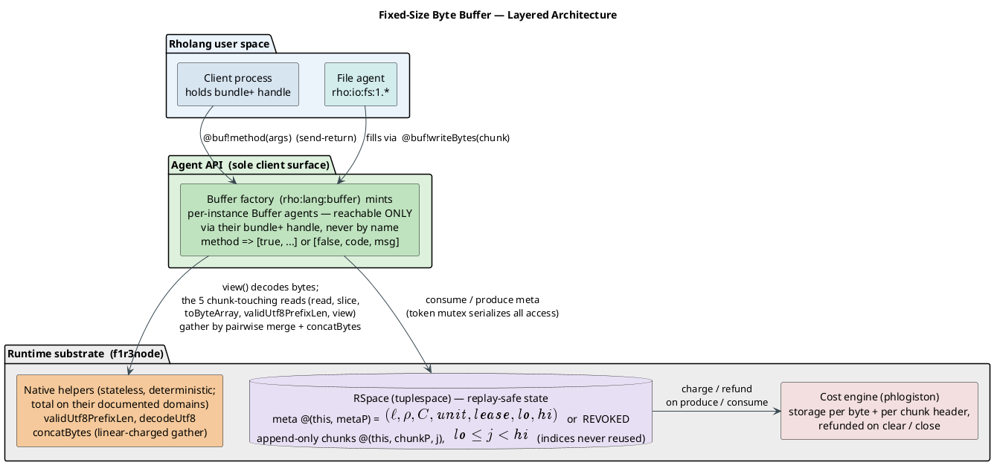
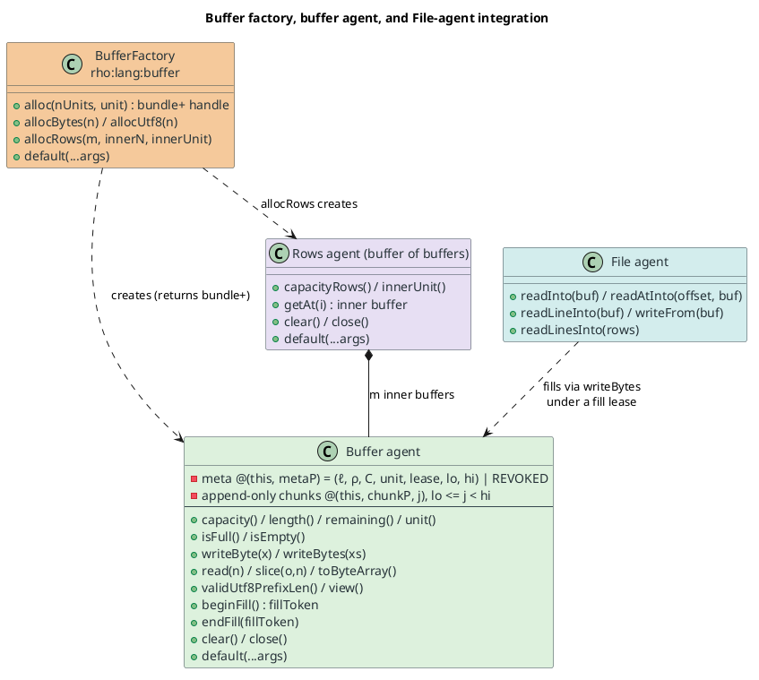

# Fixed-Size Byte Buffer Primitive

Dylon Edwards ([dylon.devo@gmail.com](mailto:dylon.devo@gmail.com))  
Michael Stay ([director.research@f1r3fly.io](mailto:director.research@f1r3fly.io))  
2026-07-23

We propose a **fixed-size byte buffer**: a mutable, fixed-capacity sequence of bytes
that a Rholang program allocates once and reuses, exposed *only* through a
channel-based **agent** API. The buffer is the tool that lets the
[File I/O](../../approved/2026-02-06-File-IO/2026-02-06-File-IO.md) surface read
arbitrarily large files in bounded memory: a caller preallocates a buffer of a
chosen capacity, and read calls fill it in place rather than materializing the
whole file (or a whole line) as a fresh value. Because Rholang values are immutable
and the only mutable state is messages parked on channels (the **tuplespace**), the
buffer's bytes live in the tuplespace as an agent's private state — never as native
heap outside it — so the design is **deterministic-replay- and consensus-safe** by
construction, and unprincipled data races are impossible (the agent serializes every
access that touches the bytes). This document specifies the buffer's semantics, its
agent API, its integration with the File agent, Greg Meredith's fixed-size line
reader (a buffer of buffers), the memory-cost model, a formal operational semantics,
and a concrete — and deliberately minimal — implementation plan for the f1r3fly
interpreter.

---

## Table of contents

1. [Motivation](#1-motivation)
2. [Background and terminology](#2-background-and-terminology)
3. [Design overview](#3-design-overview)
4. [The fixed-size byte buffer](#4-the-fixed-size-byte-buffer)
5. [The agent API](#5-the-agent-api)
6. [Filling a buffer from a File](#6-filling-a-buffer-from-a-file)
7. [Efficiency for large files](#7-efficiency-for-large-files)
8. [Fixed-size line reading: a buffer of buffers](#8-fixed-size-line-reading-a-buffer-of-buffers)
9. [Encoding (UTF-8)](#9-encoding-utf-8)
10. [Concurrency, invariants, and safety](#10-concurrency-invariants-and-safety)
11. [Cost accounting and memory metering](#11-cost-accounting-and-memory-metering)
12. [Formal semantics](#12-formal-semantics)
13. [Implementation in the interpreter](#13-implementation-in-the-interpreter)
14. [Examples](#14-examples)
15. [Alternatives](#15-alternatives)
16. [Open questions and future work](#16-open-questions-and-future-work)
17. [References](#17-references)

---

## 1. Motivation

The File I/O proposal exposes files as agents and offers whole-file text methods
(`text()`, `lines()`) and byte methods (`read(n)`, `write(bytes)`). Two failure
modes motivated this proposal during design discussion:

- **A terabyte file.** `lines()` "reads the entire file, splits the string … and
  returns the resulting list of strings," and `text()` returns the whole file as a
  single `String`. Neither imposes a bound; on a file larger than memory, both
  abort the deploy (or the node).

- **A terabyte line.** Even a forward-only `readLine()` is unbounded when a single
  line is enormous — there is no place to say "read at most this many bytes."

Both stem from the same gap: **there is no way for a caller to preallocate a
bounded region and have a read fill it in place.** Every `read(n)` in File I/O
returns a *fresh* `ByteArray`, so the only bound is the caller-chosen `n`, and each
call allocates anew. There is also no hook by which a platform can *charge* for the
memory a read commits; the File I/O proposal explicitly defers cost accounting to a
later document.

In discussion, Greg Meredith proposed splitting the concern into **two
complementary APIs**:

1. a **streaming API** — character streams and streams of character streams
   (specified separately by Mike Stay); and
2. a **fixed-size buffer datatype primitive** — the subject of this document —
   where the caller allocates a bounded buffer and read calls fill it, dropping the
   remainder of an over-long line rather than growing without bound.

This proposal delivers (2): the buffer, its agent API, and the File-integration
calls that make bounded, efficient, large-file reads possible, and that give cost
accounting a concrete, statically sized unit to charge.

---

## 2. Background and terminology

This section defines every term, symbol, and acronym used later, so the design can
be read without external references.

### 2.1 Rholang, the ρ-calculus, and immutability

Rholang is the smart-contract language of the f1r3fly node; its formal basis is the
**reflective higher-order calculus** (ρ-calculus) of
[Meredith & Radestock (2005)](https://doi.org/10.1016/j.entcs.2005.05.016), itself
a reflective extension of the **π-calculus** of
[Milner, Parrow & Walker (1992)](https://doi.org/10.1016/0890-5401%2892%2990008-4);
its companion [*Namespace Logic*](https://doi.org/10.1007/11580850_19) supplies the
logic for reasoning about the names this design treats as capabilities.
Two properties of Rholang are load-bearing for this design:

- **Values are immutable.** A map, list, string, or byte array, once constructed,
  never changes; an "update" produces a *new* value.
- **The only mutable state is the tuplespace.** The single locus of change is the
  multiset of messages **parked on channels**. "Mutation" is modelled as
  *consuming* a message from a channel and *producing* a (possibly different)
  message in its place. Crucially, the tuplespace is **content-addressed and
  checkpointed**, so anything stored there is reproduced identically under
  deterministic replay (§13.1) — the property this design relies on for consensus
  safety.

A **channel** (equivalently, a **name**) is an address in the tuplespace. In
Rholang a name may be *quoted* from a process with `@P` and a name `x` may be
*reified* back to a process with `*x`. An **unforgeable name** is a name that
cannot be guessed or reconstructed — only obtained by being given it — and is the
substrate for capabilities.

### 2.2 Agents

An **agent** (per the
[Agents FIP](../../approved/2025-08-20-Agents/Agents.md)) is object-style state
emulated on top of concurrent processes: a constructor sets up instance-local state
and returns a reference to the instance, and methods read and update that state.
The desugaring is

```
⟦agent fooCtor {
  constructor(<fooPtrns>) { Pc } |
  method fooMethod1(<ptrns1>) { P1 } |
  ... |
  default(...@args) { Q }
}⟧
=
for(r, <fooPtrns> <= fooCtor) {
  new this, private in {
    for(...@args <= this) {
      match args {
        [ *return, "fooMethod1", <ptrns1> ] => ⟦P1⟧
        ...
        _ => ⟦Q⟧
      }
    } |
    ⟦Pc⟧ |
    r!(bundle+{*this})
  }
}
```

with the call sugar `⟦for(z <- x!y(...args)) { P }⟧ = ⟦for(z <- x!?("y", ...args)) { P }⟧`.
Five points matter here:

- **Instance state lives on compound channels** keyed by the instance's unforgeable
  `this` (or `private`) name, e.g. `@(*this, *stateP)`. The Agents `Stack` stores
  each element on its own channel, `@(*this, *elemP, index)`, and — critically — the
  element **count** on `@(*this, *sizeP)`, so it can enumerate them. The buffer uses
  the same chunk-per-channel-plus-count pattern (§13).
- **Reading** state that must not change uses the **peek** operator `<<-` (a
  non-destructive receive); **mutating** it uses the linear receive `<-`
  (destructive), which *removes* the token.
- **Pattern matching is shape- and arity-strict.** A tuple pattern matches only a
  tuple of identical arity; a receive whose pattern does not match simply does not
  fire, and the caller waits. This is why every state receive in §10.1 binds a
  **free variable** and dispatches with `match` — a shape-specific pattern would
  block rather than answer whenever the state took a different shape.
- **`bundle+{*this}`** is a **write-only** capability over the instance channel: a
  holder may *send* method invocations but cannot *receive* on it, so it can never
  observe or forge the instance's internal traffic. (`bundle+` is Rholang's
  write-only bundle, `BundleType::BundleWrite`; the in-tree `NonNegativeNumber.rho`
  returns `bundle+{*this}` from a per-instance agent, and the Agents FIP's `Stack`
  example does so through the agent sugar.) This is an **object capability**
  (**ocap**) in the sense of
  [Dennis & Van Horn (1966)](https://doi.org/10.1145/365230.365252) and
  [Miller (2006)](http://www.erights.org/talks/thesis/markm-thesis.pdf): the
  reference *is* the authority.
- **A `default` clause is mandatory**, because a message of unexpected shape that
  reached `this` with no matching arm would leave the call **unanswered forever**. The
  agent itself survives — its dispatcher is a *persistent* receive, so an unmatched
  `match` simply evaluates nothing and the instance stays usable — but the caller
  blocks on a reply that never comes. (Contrast §10.1, where a payload of unexpected
  shape reaching the *linear* metadata token would consume it without re-parking, and
  so would brick the buffer itself; that is why the token's `match` carries its own
  catch-all arm.) This proposal has
  exactly **three** publicly reachable dispatchers — the factory (§5.1), the buffer
  instance (§5.2), and the rows agent (§8.1) — and each carries one.

The [Private Methods FIP](../../approved/2026-01-28-Private-Methods/2026-01-28-Private-Methods.md)
adds a parallel dispatcher on the `private` channel for methods the client can never
call, and requires a `private default` of any agent that declares one. **This proposal
declares none**, so no `private` dispatcher arises and that obligation does not apply.
Its internal helpers — notably the chunk gather of §11, and likewise the chunk-removal
loop behind `clear`/`close` (§10.1) and the $`m`$-fold iteration behind `allocRows` and
the rows agent's own `clear`/`close` (§8.1) — are instead module-level `contract`s
bound by the library's own `new`, exactly as the Agents FIP's `Stack` binds its
`merge`. Their names never escape the library, so they are already unreachable by
clients without a second dispatcher. Buffer *state* reaches them as arguments rather
than as captured scope — the instance included, since a module-level contract has no
lexical `*this` — while the field **tags** (`metaP`, `chunkP`) are captured from that
same `new`, as `elemP` is in the `Stack`.

### 2.3 Byte arrays and the calling / result conventions

Rholang's existing byte container is **`ByteArray`**, an *immutable* arbitrary-size
value that already backs the cryptographic system processes. The buffer
interoperates with `ByteArray` at every read/write boundary but is *not* a
`ByteArray`: it is mutable and fixed-capacity, and its bytes live as agent state in
the tuplespace.

We adopt the File I/O conventions verbatim so that try/catch sugar, attenuation
forwarders, and membranes work over buffer agents uniformly:

- A method call `agent!method(...args)` is sugar for a message
  `agent!(retCh, "method", args...)`.
- Every method returns a list, **either `[true, result]` on success or
  `[false, errorCode, errorMessage]` on failure**, surfaced by the sugar

  ```
  try @[result] <- agent!method(...args) {
    // success: result is bound
  } catch @[code, msg] {
    // failure
  }
  ```

  with the empty-success form `try <- agent!method(...) { … }` for methods that
  return `[true]` alone. A method call written in *statement* position — where its
  reply is not bound — carries the empty continuation `.`, as in `agent!method(...).`;
  in *source* position (after `try … <-` or inside a `for`) it does not. Both forms
  appear in §14.

**Success carries exactly one `result`.** A method that must return several values
packs them into a single compound `result` (a list or map), e.g. a method returning
a count and a flag map returns `[true, [n, flags]]`. The try-pattern is used
**verbatim**: `try @P <- …` desugars to `let @P <- rest`, where `rest` is the tail
after the leading `true` — so `rest = [result]` on every success. A caller therefore
binds a single result with `try @[result] <- …`, and destructures a compound result
with `try @[[n, flags]] <- …`. Flat multi-element success tuples (`[true, a, b]`) are
**not** used: they would leave `rest` with more than one element and match neither
form. *(File I/O's prose renders this desugaring as wrapping the try-pattern in an
extra `[…]`; the Rholang parser and its desugaring corpus apply the pattern verbatim,
and this proposal follows the parser.)*

### 2.4 Phlogiston (cost accounting)

Every Rholang operation is charged in **phlogiston** (gas). A deploy carries a phlo
budget; an operation calls `charge(cost)` (in `accounting/mod.rs`), and when the
budget goes negative the deploy aborts with `OutOfPhlogistonsError`. Producing data
onto a channel is charged for the encoded size of the channel *and* the datum
(`storage_cost_produce`), and **removing** it via a matching consume is refunded
(`refund_for_removing_produces`); the COMM event itself carries a small,
non-refunded cost. Installing a persistent receive (as the agent desugaring does,
once per instance) is charged `storage_cost_consume` over the continuation body and
is likewise not refunded. §11 accounts for all three.

### 2.5 UTF-8 and Unicode terms

A **code point** is an integer in the Unicode codespace. **UTF-8**
([RFC 3629](https://doi.org/10.17487/RFC3629)) encodes each code point as a
sequence of one to four bytes; a **code unit** is one such byte. A multi-byte
sequence must not be split across a boundary if the bytes are to be decoded as
text. The maximum encoded length of a code point is **4 bytes**, the fact that
fixes the char-sizing formula in §4.

### 2.6 Notation

| Symbol | Meaning |
| --- | --- |
| $`C`$ | buffer capacity, in bytes (fixed at allocation) |
| $`\ell`$ | fill level: number of bytes written, $`0 \le \ell \le C`$ |
| $`\rho`$ | read cursor: bytes already consumed, $`0 \le \rho \le \ell`$ |
| $`b`$ | the logical byte sequence, with $`\lvert b\rvert = C`$ |
| $`\nu`$ | number of stored chunks (one per accepted write), $`\nu \ge 0`$ |
| $`L`$ | platform limit on a single allocation's total capacity, so $`C \le L`$ (and $`m \cdot C_{\mathrm{inner}} \le L`$ for §8) |
| $`F`$ | size of a file being read, in bytes |
| $`m`$ | number of inner buffers in a buffer of buffers (§8) |
| $`n`$ | a count argument: the allocation size in §4.2/§5.1, and the requested length of `read(n)` / `slice(o,n)` |
| $`k`$ | bytes accepted by a single write; an **accepted write** is one with $`k \ge 1`$, which is what parks a chunk (a $`k = 0`$ write parks nothing, §5.2) |
| $`r`$ | bytes returned by a single `read` |
| $`x`$ | the single byte argument of `writeByte` |
| $`o`$ | the offset argument of `slice` |
| $`\mathit{lo},\ \mathit{hi}`$ | the half-open range of live chunk indices; chunk $`j`$ exists for $`\mathit{lo} \le j < \mathit{hi}`$, and $`\nu = \mathit{hi}-\mathit{lo}`$ |
| $`\mathit{lease}`$ | the fill-lease field: the active `fillToken`, or none (§10.2) |
| $`\mathit{unit}`$ | the sizing unit fixed at allocation, `"bytes"` or `"utf8"` (§4.2); immutable, and queryable via `unit()` |

The buffer's **sequential-byte state** — the configuration §12 reasons over — is the
4-tuple $`\langle b, \ell, \rho, C\rangle`$; the immutable $`\mathit{unit}`$ and the
mutable $`\mathit{lease}`$ and $`\mathit{lo},\mathit{hi}`$ are carried alongside it in the
metadata token (§10.1). The standing invariant is

```math
0 \;\le\; \rho \;\le\; \ell \;\le\; C \;=\; \lvert b\rvert.
```

---

## 3. Design overview

The design has one client-facing layer and three tiny runtime helpers, shown in
Figure 1.



*Figure 1 — Layered architecture. Clients (and the File agent) reach the buffer
**only** through the agent API. The buffer's mutable bytes live in RSpace (the
tuplespace) as the agent's private state; the sole native additions are three
stateless, deterministic helpers — two for UTF-8 and one linear-charged
concatenation.*

- **The buffer is an agent whose state lives in the tuplespace.** There is no native
  mutable region. Following the [Agents](../../approved/2025-08-20-Agents/Agents.md)
  `Stack` pattern, the agent keeps a metadata token
  `@(*this, *metaP)!((ℓ, ρ, C, unit, lease, lo, hi))` and stores the bytes as **append-only
  chunks** on `@(*this, *chunkP, j)`, one chunk per accepted write, for
  $`j \in [\mathit{lo},\mathit{hi})`$; the concatenation of chunks $`\mathit{lo}`$
  through $`\mathit{hi}-1`$, in index order, is exactly $`b[0{:}\ell)`$. A write parks the incoming `ByteArray` **as it arrives**, without
  splitting it into cells; only a short write needs a single `slice` to trim the
  accepted prefix, so a write is one produce and costs $`O(k)`$.
  Because this state is ordinary tuplespace data, it is content-addressed,
  checkpointed, and reproduced exactly under deterministic replay — so the buffer is
  **consensus-safe** (§13.1). Capacity is enforced by the agent's own arithmetic: a
  write that would exceed $`C`$ writes only what fits.

- **The agent API is the sole client surface.** Clients never obtain raw bytes; they
  hold a `bundle+` **handle** to a buffer agent and interact by sending method
  messages. This single decision buys three properties at once:

  1. **Immutability is preserved.** The handle is an ordinary immutable Rholang
     value (an unforgeable name); the mutation lives where Rholang already permits
     it — in messages parked on the agent's channels.
  2. **Races become principled.** Every *named* method acquires the single metadata
     token first (§10), so all access is *serialized* and invariants hold under
     contention.
  3. **Authority is explicit.** The `bundle+` handle is an object capability: to use
     a buffer you must have been given its handle.

- **Three stateless native helpers.** The interpreter already offers
  `"…".toUtf8Bytes()` (String → UTF-8 bytes) but no inverse. The buffer's text view
  (§9) needs bytes → String, so we add `validUtf8PrefixLen` and
  `decodeUtf8`, plus a linear-charged `concatBytes` used to reassemble chunks (§13.3) —
  three **stateless, deterministic** primitives, each **total on its documented
  domain** (§13.3 pins those domains and the off-domain behaviour). Being pure
  functions of their argument they are **replay-deterministic**; but adding them
  to the method table is a **protocol change** — on an older validator the lookup
  misses and the reducer raises an *uncatchable* `ReduceError("Unimplemented
  method")`, aborting the deploy, so that validator diverges from a newer one on both
  post-state and cost. They therefore require coordinated activation (§13.3). Being
  purely **additive**, however, they reprice no existing operation, so — unlike a
  cost-table change — they cannot invalidate already-produced history; this proposal
  deliberately depends on no such repricing (§11, §16).

This is exactly the resolution reached in discussion: *"We can have fixed-size
mutable buffers, but clients can only access them through a library that wraps them
in an agent API,"* which "would be consistent with everything else." A *native*
mutable region was considered and **rejected** because it would be invisible to
deterministic replay (§15).

---

## 4. The fixed-size byte buffer

### 4.1 State and lifecycle

A buffer is created empty at a fixed capacity, then filled, drained, cleared for
reuse, and finally closed. Figure 2 shows the logical byte layout; Figure 3 the
lifecycle.


*Figure 2 — Logical layout of a capacity-$`C`$ buffer. Bytes $`[0,\rho)`$ have been
consumed by `read`; $`[\rho,\ell)`$ are filled but unread; $`[\ell,C)`$ are free.*


*Figure 3 — Lifecycle, with each state's defining predicate. `clear()` returns any
state to `Empty` (refunding the stored chunks) for reuse without a new allocation;
`close()` moves the buffer to the terminal `Closed` state, in which every **named**
method answers `BUFERR_REVOKED` (an unknown method still answers
`BUFERR_UNSUPPORTED`).*

### 4.2 Allocation and the two sizing units

A buffer is allocated by **capacity**, chosen in one of two units:

- **bytes** — $`C = n`$; or
- **UTF-8 characters** — $`C = 4n`$.

The factor of four is the maximum UTF-8 encoded length of a code point
([RFC 3629](https://doi.org/10.17487/RFC3629)). Sizing by characters therefore
guarantees room for $`n`$ code points *of any width*:

```math
C \;=\; \mathrm{cap}(n, \text{unit}) \;=\;
\begin{cases}
n, & \text{unit} = \texttt{"bytes"},\\[2pt]
4n, & \text{unit} = \texttt{"utf8"}.
\end{cases}
```

Capacity **and the sizing unit** are immutable for the buffer's lifetime — the unit is
retained in the metadata token and exposed by `unit()` (§5.2) precisely so the File
agent can apply the boundary rule of §6. The mutable fields are $`\ell`$,
$`\rho`$, the lease, and the chunk range $`\mathit{lo},\mathit{hi}`$ (whence
$`\nu = \mathit{hi}-\mathit{lo}`$). This is what makes the footprint statically known (§11)
and the buffer safe to reuse across reads (§7).

---

## 5. The agent API

### 5.1 The factory

Buffers are minted by a **factory** — a stateful library agent published to the
registry under the name `rho:lang:buffer`, alongside the other blessed
standard-library contracts (`rho:lang:nonNegativeNumber`, `rho:lang:stack`, …).
Registry names are resolved with the registry-lookup channel, the idiom every
in-tree `rho:lang:*` consumer uses:

```
new rl(`rho:registry:lookup`), ch in {
  rl!(`rho:lang:buffer`, *ch) |
  for (@(_, buffers) <- ch) {
    // buffers is ProcSort (bound by a quoted pattern), so it is quoted at use:
    // @buffers!alloc(...)
    Nil
  }
}
```

*(This is deliberately **not** the `` new x(`uri`) `` form used for system processes
such as `` `rho:io:fs:1.*` ``: that form resolves against the interpreter's URN map,
which contains system processes only. See §13.2 for the versioning caveat.)*

| Method | Returns | Notes |
| --- | --- | --- |
| `alloc(nUnits, unit)` | `[true, buf]` | $`\mathit{unit} \in \{\texttt{"bytes"},\texttt{"utf8"}\}`$; `buf` is a `bundle+` handle to a fresh, empty buffer |
| `allocBytes(n)` | `[true, buf]` | sugar for `alloc(n, "bytes")` |
| `allocUtf8(n)` | `[true, buf]` | sugar for `alloc(n, "utf8")` |
| `allocRows(m, innerN, innerUnit)` | `[true, rows]` | a **buffer of buffers** (a distinct outer type, §8): `m` inner byte buffers, each allocated by `alloc(innerN, innerUnit)` |
| `default(...@args)` | `[false, BUFERR_UNSUPPORTED, msg]` | mandatory catch-all (§2.2); the factory is publicly reachable, so an unknown method must be answered rather than left to deadlock |

`alloc` may fail with `[false, BUFERR_INVALID_ARGUMENT, msg]` (a non-`Int` `nUnits`),
`[false, BUFERR_INVALID_CAPACITY, msg]` ($`n \le 0`$ or $`C > L`$),
`[false, BUFERR_INVALID_UNIT, msg]`, or
`[false, FSERR_QUOTA_EXCEEDED, msg]` when a quota agent declines the reservation
(the File I/O quota hook, reused unchanged). `allocRows` fails the same way, and
additionally with `[false, BUFERR_INVALID_CAPACITY, msg]` when $`m \le 0`$ or the
aggregate $`m \cdot C_{\mathrm{inner}}`$ exceeds $`L`$; on any failure it allocates
no inner buffers.

### 5.2 Instance methods

Every instance method follows the calling and result conventions of §2.3, and every
**named** method first checks for revocation (§10.1) — on a `close()`d buffer every
named method returns `[false, BUFERR_REVOKED, msg]`. An *unrecognized* method is
answered by the `default` arm, which is the dispatcher's `match` fall-through and
never acquires the metadata token, so it returns `BUFERR_UNSUPPORTED` regardless of
buffer state. Figure 4 summarizes the surface.



*Figure 4 — The factory mints buffer agents (returning `bundle+` handles); the File
agent fills them via `@buf!writeBytes` under a fill lease.*

**Pure-metadata queries (non-mutating; they hold the metadata token like every other
method, §10.1).**

| Method | Returns |
| --- | --- |
| `capacity()` | `[true, C]` |
| `length()` | `[true, ℓ]` |
| `remaining()` | `[true, C - ℓ]` |
| `isEmpty()` / `isFull()` | `[true, ℓ == 0]` / `[true, ℓ == C]` |
| `unit()` | `[true, "bytes"]` or `[true, "utf8"]` — the sizing unit fixed at allocation; the File agent reads it to decide whether to fill on code-point boundaries (§6) |

**Writes (mutating; hold the metadata token).**

| Method | Returns | Semantics |
| --- | --- | --- |
| `writeByte(x)` | `[true, 1]`, `[false, BUFERR_CAPACITY_EXCEEDED, msg]`, or `[false, BUFERR_INVALID_ARGUMENT, msg]` | append one byte if room; error when full; `x` must be an `Int` in $`[0,255]`$ |
| `writeBytes(xs)` | `[true, k]` or `[false, BUFERR_INVALID_ARGUMENT, msg]` | rejects a non-`ByteArray` `xs`; otherwise appends $`k = \min(\lvert xs\rvert,\; C - \ell)`$ bytes as **one** new chunk; a **short write** ($`k < \lvert xs\rvert`$) signals the buffer filled. A write with $`k = 0`$ parks **no** chunk and leaves $`\mathit{hi}`$ unchanged, so a full buffer cannot accumulate empty chunks |

**Chunk-touching reads (hold the metadata token, then gather chunks).**

| Method | Returns | Semantics |
| --- | --- | --- |
| `read(n)` | `[true, bytes]` | consume $`r = \max(0,\ \min(n,\ \ell-\rho))`$ bytes from $`\rho`$, advancing it; drains the buffer |
| `slice(offset, n)` | `[true, bytes]` | positional copy of $`[\text{offset}, \text{offset}+n)`$; no cursor move; `[false, BUFERR_OUT_OF_RANGE, msg]` unless $`0 \le \text{offset} \le \text{offset}+n \le \ell`$ |
| `toByteArray()` | `[true, bytes]` | copy of the filled region $`[0,\ell)`$ |
| `validUtf8PrefixLen()` | `[true, j]` | largest `j ≤ ℓ` with bytes `[0,j)` valid UTF-8 (§9) |
| `view()` | `[true, str]` | decode $`[0,\ell)`$ as UTF-8; `[false, BUFERR_BAD_ENCODING, msg]` if that region is not wholly valid UTF-8 |

While a fill lease is held, every chunk-touching read returns
`[false, BUFERR_FILLING, msg]` (§10.2). The agent cannot distinguish callers, so this
applies to **any** caller, including the lease holder.

**Fill lease and lifecycle.**

| Method | Returns | Semantics |
| --- | --- | --- |
| `beginFill()` | `[true, fillToken]` or `[false, BUFERR_FILLING, msg]` | acquire the exclusive **fill lease**; `fillToken` is a fresh unforgeable capability that `endFill` must present; fails if a lease is already held |
| `endFill(fillToken)` | `[true]` or `[false, BUFERR_FILLING, msg]` | release the lease iff `fillToken` matches the active lease |
| `clear()` | `[true]` | $`\ell \leftarrow 0,\ \rho \leftarrow 0`$; consumes the stored chunks (refunding their storage, awaiting every removal before re-parking the token) and advances $`\mathit{lo}`$ to $`\mathit{hi}`$ so indices are never reused (§10.1). Also releases any held lease, so an abandoned lease is recoverable |
| `close()` | `[true]` | consume the stored chunks (refunding their storage, awaiting every removal) and replace the metadata token with the **revoked tombstone** `REVOKED`; every subsequent named method matches the tombstone and returns `[false, BUFERR_REVOKED, msg]` |
| `default(...@args)` | `[false, BUFERR_UNSUPPORTED, msg]` | mandatory catch-all; precedes token acquisition, so it answers even on a closed buffer |

`clear()` and `close()` are deliberately **not** lease-gated: they are the recovery
path for a lease whose holder died or dropped its `fillToken` (§10.2).

### 5.3 Error codes

Error codes are `SCREAMING_SNAKE`, matching File I/O's `FSERR_*` family:

| Code | Raised when |
| --- | --- |
| `BUFERR_CAPACITY_EXCEEDED` | `writeByte` on a full buffer |
| `BUFERR_INVALID_CAPACITY` | `alloc`/`allocRows` with a non-positive or over-limit capacity ($`C > L`$) |
| `BUFERR_INVALID_UNIT` | `alloc`/`allocRows` with $`\mathit{unit} \notin \{\texttt{"bytes"},\texttt{"utf8"}\}`$ |
| `BUFERR_OUT_OF_RANGE` | `slice` outside $`[0,\ell]`$, or `getAt` outside $`[0,m)`$ (§8.1) |
| `BUFERR_BAD_ENCODING` | `view` on bytes that are not valid UTF-8 |
| `BUFERR_FILLING` | a chunk-touching read while a lease is held; `beginFill` on an already-leased buffer; or `endFill` with a non-matching token |
| `BUFERR_REVOKED` | any **named** method on a `close()`d buffer (an unknown method still answers `BUFERR_UNSUPPORTED`); also the answer from the defensive `_` arm of §10.1, should the metadata token ever hold an unrecognized payload — a state unreachable by construction, reported as revoked because the buffer is then permanently unusable |
| `BUFERR_INVALID_ARGUMENT` | an argument of the wrong type (e.g. a non-`Int` where an integer is required) **or outside its domain** (e.g. `writeByte(x)` with $`x \notin [0,255]`$) |
| `BUFERR_UNSUPPORTED` | an unknown method (the `default` arm), in any buffer state |

The File I/O code `FSERR_QUOTA_EXCEEDED` is reused for admission control at
allocation.

### 5.4 Method dispatch and the mutex

Figure 5 shows a single `writeBytes` call end to end, making the metadata-token
mutex of §10 concrete. The accepted bytes are parked as **one** new chunk at index $`\mathit{hi}`$ and the
range is extended (a $`k = 0`$ write parks nothing and leaves $`\mathit{hi}`$ alone,
§5.2), so the write is a single produce of $`k`$ bytes — $`O(k)`$, never
$`O(C)`$, and with no splitting into cells (§11).


*Figure 5 — `@buf!writeBytes(chunk)` desugars to a message on `this`; the dispatch
loop **consumes** the metadata token (acquiring the lock), parks
$`k = \min(\lvert \mathrm{chunk}\rvert,\ C-\ell)`$ bytes as one new chunk,
**re-sends** the token (releasing the lock), and replies `[true, k]`. Any concurrent
access blocks on the absent token.*

---

## 6. Filling a buffer from a File

The point of the buffer is that the **File agent fills it**. We add buffer-targeted
methods to the File agent. To avoid colliding with File I/O's existing File-agent
methods — the byte-level `read(n)`, `readAt(offset, n)`, `write(bytes)` and the
line-based `lines()`, all dispatched by name — the buffer-filling variants take **distinct names**
(`…Into` / `…From`), and keep File I/O's offset-first argument order. They realize
Mike Stay's `readLine(bufToFill)` idea under collision-free names.

| Method | Returns | Semantics |
| --- | --- | --- |
| `file!readInto(buf)` | `[true, [nRead, eof]]` | fill `buf` from the current position (up to `remaining()`), advancing the position by `nRead` |
| `file!readAtInto(offset, buf)` | `[true, [nRead, eof]]` | positional fill; does not move the position |
| `file!readLineInto(buf)` | `[true, [nRead, flags]]` | fill up to one line — through the line terminator (§8.2) or until the buffer fills; `flags` is a map `{"eof": Bool, "truncated": Bool}` |
| `file!writeFrom(buf)` | `[true, nWritten]` | drain the filled region $`[0,\ell)`$ of `buf` to the file at the current position |

**Failure surface.** Each of these returns `[false, code, msg]` with: the buffer-side
codes `BUFERR_FILLING` (another fill is in progress on that buffer) and
`BUFERR_REVOKED` (the buffer was closed); and File I/O's own codes, in particular
`FSERR_BUSY`, `FSERR_CLOSED`, and `FSERR_IO`. They inherit File I/O's concurrency
partition unchanged: `readInto`, `readAtInto`, and `writeFrom` are **byte-level**
methods — they take the same implicit range locks, accept the same `{"wait": true}`
option, and yield `FSERR_BUSY` on conflict — while `readLineInto` and
`readLinesInto` (§8) are **line-based**, so mixing a line-based call with an
in-flight byte-level call on the same file yields `FSERR_BUSY` as File I/O
specifies.

A File fill method reads the buffer's `unit()` (§5.2) to decide how to fill. For a
buffer whose unit is `"utf8"`, `readInto`/`readLineInto` fill **only up to a
code-point boundary**: they never leave a partial multi-byte sequence at
$`\ell`$, so `view()` on such a buffer succeeds provided the source bytes are valid
UTF-8 and the buffer was filled only by these methods (§9). Concretely they fill to
the largest code-point boundary that fits within `remaining()` $`= C-\ell`$ (so up to
3 bytes may remain free), and `nRead` is the number of bytes *appended* by this call;
the held-back bytes of a straddling code point are read on
the next fill.

In every one of these methods `eof` is true **iff no unread bytes remain in the file
after the call** — the same predicate §8.2 uses for `atEOF`. (Consequently an empty
file yields one call returning `nRead = 0` with `eof` true.)

`readLineInto` writes the line's **content and not its terminator**, and consumes the
terminator from the file — matching the buffer-of-buffers reader of §8.2. Like
`readInto` it is a cursor method: it advances the file's byte position past the
content **and** past the terminator it consumed, so a subsequent call reads the next
line. `nRead` is therefore the number of content bytes written, and is **0 for a blank
line** — for every terminator of §8.2, since none of them is ever written to the
buffer; callers must use the `eof` flag, not `nRead`, to detect end of input.

`readLineInto` sets `truncated` when the buffer fills before a terminator arrives —
that is, when the line does not fit in `remaining()`, which for a partially filled
buffer is less than $`C`$ (the same remaining-based condition §8.2b uses). The buffer
is filled (respecting the boundary rule) and the terminator is *not* consumed, so a
subsequent `readLineInto` into a cleared buffer continues the same line. (The
alternative "drop the overflow" policy is what the buffer-of-buffers line reader
does — §8.)

**Normative sequencing.** `writeFrom` is a *drain*, not a fill: it does **not** take
the lease, and behaves as an ordinary chunk-touching read of $`[0,\ell)`$ (so it is
refused with `BUFERR_FILLING` while someone else holds the lease). Each of the three
fill methods, by contrast, **must** perform its work under the
buffer's fill lease and **await each `writeBytes` acknowledgment** (via the
send-return sugar `@buf!writeBytes(chunk)`, which desugars to `!?`) before proceeding,
and reply to the client **only after** releasing the lease. Concretely it runs
`beginFill()` to obtain `fillToken`; then, in sequence (`;`), an awaited
`@buf!writeBytes(chunk)` per chunk; then `endFill(fillToken)`; then the client reply —
never placing a `writeBytes` in parallel (`|`) with the client reply. **It must
release the lease on every exit path**, including I/O errors: on failure it calls
`endFill(fillToken)` before returning the error — and **replies even if that
`endFill` itself fails**, which is reachable, since §6.1 permits a co-holder to
`clear()` or `close()` mid-lease and both drop the lease, after which the agent's token
no longer matches. In that case the lease is no longer ours to release — either it is
free, or a later `beginFill()` has granted it to a new filler who owns its release — so
the failure is ignorable either way, and what matters is that the client is always
answered. A failed fill therefore never strands the lease. This ordering is what makes
§6.1's happens-before argument sound.

One sort detail matters for anyone implementing these methods, and it is easy to get
backwards. The handle arrives as a method argument, and the fill methods use it in
**channel** position — so it must be **re-quoted at use**: `@buf!writeBytes(…)`, never
a bare `buf!writeBytes(…)`.

The reason is visible in §2.2's desugaring. An agent method's formals are not a name
binder; they are spliced into the dispatcher's `match` **list pattern**,
`[ *return, "readInto", buf ]`, which is a *process* context. The formal therefore
binds **ProcSort** — identically whether it is written `buf` or `@buf`, because the
desugaring **strips the quote** rather than splicing it literally (a literal splice
would not parse: `@buf` inside a list pattern is rejected outright), so both surface
spellings emit the same pattern variable — and sending on a ProcSort variable is
rejected at normalization, the compiler reporting a proc variable *used in a name
context*.
Note that `*return` is starred in that same pattern precisely so the return channel
binds as a *name*, which is what makes the bare `return!(…)` beside it legal; `*buf` is
not an alternative here, because the eval form `*x` is admissible in a hand-written
pattern but is **not a legal formal** in the surface sugar at all.

So the File agent re-quotes exactly as §14's clients do, and for the same reason — the
convention is uniform, not split between library and client code. §11's gather is the
one place that differs, and legitimately: it is a module-level `contract`, whose
formals *are* a genuine name binder, which is why its `ret` parameter is bare and
`ret!(…)` is a legal send. Client code that receives a handle from a
*registry* or a return channel likewise binds it quoted and re-quotes at use.

### 6.1 Resolving the invalidation and race questions

Two questions were raised in discussion about `file!readLine(bufToFill)`. Both
dissolve under the agent model.

**"If `result` is the filled buffer, what is `bufToFill` now — is it invalidated?"**
It is not. The reply is a **status** value, not a buffer. `bufToFill` is a *channel
handle* — an immutable reference to the mutable agent — and passing it to
`readLineInto` neither copies nor replaces it. After the call it denotes the same
buffer, now filled. There is no second "result buffer" to reconcile, so the correct
shape is simply

```
try @[[nRead, flags]] <- @file!readLineInto(buf) {
  // buf is filled; read it here
  Nil
} catch @[code, msg] {
  // handle error
  Nil
}
```

**"With the `try <- … { … }` shape, won't the body race the fill?"** No — because
the File agent fills under the exclusive fill lease and **sequences** its buffer
writes before replying (the normative rule above). The reply is then the
**happens-before** edge in the sense of
[Lamport (1978)](https://doi.org/10.1145/359545.359563): the File agent finishes
writing the buffer *before* it sends the status, and the client reads the buffer
*after* receiving it. The success continuation is therefore strictly ordered after
the last write. Figure 6 makes the ordering explicit.


*Figure 6 — `file!readLineInto(buf)`: the File agent acquires the fill lease
(receiving `fillToken`), fills via awaited `@buf!writeBytes`, releases the lease with
`endFill(fillToken)`, then replies. The status reply is the happens-before edge; the
`buf` handle is unchanged and still valid; chunk-touching reads see `BUFERR_FILLING`
until the lease is released.*

Because every chunk-touching read holds the metadata token and checks the lease field
**atomically** under it (§10.2), a second holder of the same `bundle+` handle that
issues `read()`/`view()` during a fill gets `BUFERR_FILLING` rather than observing a
half-filled buffer. This mirrors the actor discipline of
[Agha (1986)](https://doi.org/10.7551/mitpress/1086.001.0001): one mailbox, messages
processed one at a time, with the lease making the multi-message fill atomic with
respect to reads.

**Disclosure — what the lease does not do.** The lease gates chunk-touching *reads*
and authenticates *release*; it does not constrain a co-holder of the `bundle+`
handle, who may still write, `clear()`, or `close()` during a lease, or call
`beginFill()` and never release it. The last case would otherwise brick every read;
it is recoverable because `clear()` and `close()` are deliberately not lease-gated
(§5.2) and both drop the lease. Write-content coherence — that the bytes form one
coherent line — therefore relies on the *single-filler* discipline (the File agent is
the sole writer for the duration of its lease), exactly as an ocap grants authority
to whoever holds it.

---

## 7. Efficiency for large files

Beyond safety, the buffer is the *efficient* way to read a large file, because it
is **preallocated once and reused**. Reading a file of $`F \ge 1`$ bytes with a single
capacity-$`C`$ buffer via `readInto` on a `"bytes"`-unit buffer performs

```math
\left\lceil \frac{F}{C} \right\rceil \text{ fills}, \qquad
\text{peak tuplespace-resident bytes} = \Theta(C) \ \text{— independent of } F,
```

because `clear()` **refunds** the stored chunks between reads (§11), so at most one
buffer's worth is resident at a time. Contrast the two whole-file paths and the
allocating byte path:

| Approach | Peak resident bytes | Fresh values allocated |
| --- | --- | --- |
| `text()` / `lines()` | $`\Theta(F)`$ | whole file (+ per-line) |
| repeated `read(n) -> ByteArray` | $`\Theta(n)`$ | one fresh `ByteArray` **per call** |
| reused fixed-size buffer | $`\Theta(C)`$ | none beyond the transient chunks, refunded on reuse |

The reuse pattern is: `clear()` the buffer, `file!readLineInto(buf)` (or
`file!readInto(buf)`), process the filled region, repeat. Preallocation here is not
a premature optimization — it is the mechanism that bounds the resident footprint.
The idea echoes the statically **scoped** region discipline of
[Tofte & Talpin (1997)](https://doi.org/10.1006/inco.1996.2613): a region whose
lifetime is known up front and whose contents are released at a well-defined point
(here, `clear()`/`close()`).

---

## 8. Fixed-size line reading: a buffer of buffers

Greg Meredith's fixed-size line reader reads many lines at once into a **fixed-size
buffer whose elements are themselves fixed-size buffers**. It fills each inner
buffer up to its capacity; if a line overflows, it **drops characters until the next
terminator** and resumes into the next inner buffer. This bounds *both* the number of
lines and the length of each, so total resident memory is

```math
C_{\mathrm{total}} \;=\; m \cdot C_{\mathrm{inner}},
```

for $`m`$ inner buffers each of capacity $`C_{\mathrm{inner}}`$.

### 8.1 The outer buffer (a distinct type)

`@buffers!allocRows(m, innerN, innerUnit)` allocates the outer buffer and its $`m`$
inner byte buffers in one call. The outer buffer is a **distinct type** — a
fixed-size buffer whose elements are inner-buffer handles, not bytes — so it has its
own small method surface:

| Method | Returns | Semantics |
| --- | --- | --- |
| `capacityRows()` | `[true, m]` | number of inner buffers |
| `innerUnit()` | `[true, unit]` | the sizing unit shared by every inner buffer, so the line reader can apply §6's boundary rule |
| `getAt(i)` | `[true, inner]` | handle to inner buffer `i`; `[false, BUFERR_OUT_OF_RANGE, msg]` unless $`0 \le i < m`$ |
| `clear()` | `[true]` | clears every inner buffer |
| `close()` | `[true]` | closes every inner buffer and revokes the outer handle (the same tombstone mechanism as §5.2) |
| `default(...@args)` | `[false, BUFERR_UNSUPPORTED, msg]` | mandatory catch-all (§2.2) |

`file!readLinesInto(rows)` fills the rows and returns `[true, [nLines, flags]]`,
where `flags` reports `eof` and whether any line was `truncated`; it fails with the
same codes as the other File fill methods (§6).

### 8.2 The fill algorithm (literate)

Figure 7 is the flowchart; here is the same algorithm in literate form. We read one
line per inner buffer, and we treat "line too long" by discarding the overflow so
the buffer bound is never exceeded. When the inner buffers were allocated with the
`"utf8"` unit, "full" is interpreted per §9 (stop on the last code-point boundary
that fits), so `view()` on a filled inner buffer succeeds whenever the source is
valid UTF-8.

*For legibility the pseudocode and Figure 7 elide the per-inner-buffer lease
bracketing; a conforming implementation wraps each inner fill in
`beginFill()` … `endFill(fillToken)` exactly as §6 requires, releasing on every exit
path.*


*Figure 7 — `file!readLinesInto(rows)`: fill each inner buffer to a line terminator
(§8.2) or its capacity; only when the inner buffer is **full before** a terminator,
drop to the next terminator and mark it truncated; a final partial line at EOF stands,
un-truncated.*

⟨*fill the outer buffer* 8.2⟩ ≡
```
i ← 0 ; nLines ← 0 ; truncatedAny ← false
while i < m and not atEOF:
    inner ← rows.getAt(i)
    inner.clear()
    ⟨fill one inner buffer up to a terminator or capacity 8.2a⟩
    ⟨if the inner buffer overflowed, drop to the terminator 8.2b⟩
    nLines ← nLines + 1
    i ← i + 1
return [true, [nLines, {"eof": atEOF, "truncated": truncatedAny}]]
```

⟨*fill one inner buffer up to a terminator or capacity* 8.2a⟩ ≡
```
while byteAvailable and hasRoom(inner) and not atTerminator():
    inner.writeByte(next())
```
`byteAvailable` is true while the file has an unread byte and `next()` consumes and
returns it; `next()` is only evaluated when `byteAvailable` holds. Terminator
recognition needs up to three bytes of lookahead (LS and PS are three bytes each), so
it is expressed by `atTerminator()` below rather than by a single-byte `peek`.

**What counts as a line terminator.** File I/O splits `lines()` on the regular
expression `\R`, "Unicode line break", and streams `mapReduceLines` on the same
notion, so this FIP adopts **exactly** that set rather than a narrower one — otherwise
`readLinesInto` would not be a faithful bounded-memory substitute for `lines()`, which
is its entire purpose (§1). The set is the one enumerated in Table 5-1 of
[The Unicode Standard, Version 16.0.0](https://www.unicode.org/versions/Unicode16.0.0/)
§5.8 ("Newline Guidelines"), taken over its UTF-8 encoding:

| Terminator | Code point(s) | UTF-8 bytes |
| --- | --- | --- |
| CRLF | U+000D U+000A | `0D 0A` |
| LF — line feed | U+000A | `0A` |
| VT — vertical tab | U+000B | `0B` |
| FF — form feed | U+000C | `0C` |
| CR — carriage return | U+000D | `0D` |
| NEL — next line | U+0085 | `C2 85` |
| LS — line separator | U+2028 | `E2 80 A8` |
| PS — paragraph separator | U+2029 | `E2 80 A9` |

`atTerminator()` is true iff the unread bytes begin with one of these sequences,
matched **longest-first** so that CRLF is one terminator and not two; `termLen()`
$`\in \{1,2,3\}`$ is that sequence's length and `skipTerminator()` consumes exactly
`termLen()` bytes. A candidate that would run past the end of the file does not match,
so a lone `C2` at EOF is content, not a terminator; and `atTerminator()` implies
`byteAvailable`, which is why the guards below need not repeat it. The multi-byte
members are recognised by their UTF-8 encodings, which is what makes the reader agree
with `lines()` on text; a caller holding arbitrary **binary** data should use
`readInto` (§6), which is terminator-agnostic.

`hasRoom(inner)` is the fill predicate
of §6: for a `"bytes"`-unit inner buffer it is
just `not inner.isFull()`; for a `"utf8"`-unit one it additionally requires room for
the *whole* next code point, so a fill never splits one (and may leave up to 3 bytes
free). "The next code point" is judged at its **lead** byte: once room has been
reserved there, the continuation bytes of that same code point are always admitted, so
the byte-at-a-time loop above can never strand a partially written code point. It is
deliberately not `isFull()` alone, which cannot express the boundary rule. We stop for one of three reasons: a terminator arrived, the inner buffer ran out
of room, or the file ended. The next chunk distinguishes them.

⟨*if the inner buffer overflowed, drop to the terminator* 8.2b⟩ ≡
```
if atTerminator():
    skipTerminator()            # consume the terminator; the line fit
else if byteAvailable and not hasRoom(inner):
    while byteAvailable and not atTerminator():
        next()                  # discard the overflow — bounded memory preserved
    if atTerminator(): skipTerminator()   # consume the terminator if present
    truncatedAny ← true
# else: EOF with no trailing terminator — the partial line stands, un-truncated
```

The discipline that keeps memory bounded is in 8.2b: once an inner buffer is full,
further bytes of that line are **read and dropped**, never stored. The peak resident
memory for the whole call is $`m \cdot C_{\mathrm{inner}}`$, fixed before the first
byte is read.

The byte-by-byte `next()` / `writeByte` above expresses the fill *logic*; for
efficiency (per §11) an implementation reads a block from the file, locates the
terminator within it, and fills the inner buffer with a single bulk `writeBytes` of
the bytes before it — one chunk per line rather than one per byte.

---

## 9. Encoding (UTF-8)

Following the discussion decision to *"require UTF-8 for the moment … and add other
encodings later,"* the buffer stores **raw bytes** and decodes on demand.

- **`writeBytes` / `writeByte`** are encoding-agnostic: they move bytes.
- **`view()`** decodes $`[0,\ell)`$ as UTF-8
  ([RFC 3629](https://doi.org/10.17487/RFC3629)) via the native primitives of §13.3.
  If that region is not wholly valid UTF-8 — whether it ends mid-sequence or contains
  an interior malformed byte — `view()` returns `[false, BUFERR_BAD_ENCODING, msg]`
  rather than substituting replacement characters, so corruption is never silent.

Two mechanisms let a UTF-8-aware caller avoid that failure:

1. **Boundary-aware fill.** For a buffer allocated with the `"utf8"` unit,
   `readInto`/`readLineInto` (§6) and the buffer-of-buffers reader (§8.2) stop on the
   last complete code-point boundary and hold back the bytes of a straddling code
   point for the next fill. Consequently `view()` succeeds on a `"utf8"`-unit buffer
   that was filled **exclusively** by those methods **from a source that is itself
   valid UTF-8**. The guarantee does not extend to `readAtInto` (a positional fill may
   begin mid-code-point, leaving an invalid *leading* sequence), to a binary source, or
   to bytes a co-holder wrote directly with `writeBytes`/`writeByte`, which are
   encoding-agnostic.
2. **Explicit prefix query.** For a raw `"bytes"` buffer, `validUtf8PrefixLen()`
   returns the largest `j ≤ ℓ` with `[0,j)` valid UTF-8; a caller can `slice(0, j)`
   and carry the tail forward.

The byte→text boundary is exactly the `view()` step — the place File I/O currently
leaves implicit. Because decoding is confined to the buffer, adding another encoding
later (per Mike's note that changing a File agent's encoding "would need to reset
positions of readers and writers") is a localized change: a decoding parameter on
`view()` and an encoding field on the File agent, with no change to the byte-level
surface.

---

## 10. Concurrency, invariants, and safety

### 10.1 The metadata-token mutex and the revocation check

The agent keeps its metadata in a **single message** on an instance-scoped channel,
`@(*this, *metaP)`, whose payload is either the live 7-tuple
`(ℓ, ρ, C, unit, lease, lo, hi)` or, after `close()`, the sentinel string `"REVOKED"`. Its bytes live as
append-only chunk messages on `@(*this, *chunkP, j)` for $`j \in [\mathit{lo},\mathit{hi})`$.
Chunk indices are **monotonic**: a write parks at index $`\mathit{hi}`$ and increments
it, and `clear()` advances $`\mathit{lo}`$ to $`\mathit{hi}`$ rather than resetting to
zero, so **an index is never reused**. That alone rules out a stale removal from an
earlier epoch colliding with a freshly written chunk.

Because Rholang patterns are shape- and arity-strict (§2.2), **every** method binds
the payload with a *free variable* and dispatches with `match` — never with a
shape-specific pattern, which would block instead of answering whenever the payload
were the tombstone:

```
for (@meta <- @(*this, *metaP)) {
  match meta {
    "REVOKED" => { @(*this, *metaP)!("REVOKED") | return!([false, "BUFERR_REVOKED", "buffer is closed"]) }
    (ell, rho, cap, unit, lease, lo, hi) => { /* critical section */ @(*this, *metaP)!((ell', rho', cap, unit, lease', lo', hi')) }
    _ => { @(*this, *metaP)!(meta) | return!([false, "BUFERR_REVOKED", "buffer state unrecognized"]) }
  }
}
```

The third arm is unreachable by construction — `@(*this, *metaP)` is instance-private
and only ever carries the 7-tuple or the tombstone — but it is present deliberately.
A `match` with no matching arm in Rholang *silently does nothing*, so a payload of any
third shape would consume the token and never re-park it, **bricking the buffer
permanently**. The catch-all makes the mutex robust by construction rather than by
invariant, at the cost of one arm.

The linear receive `<-` **removes** the only metadata token; any concurrent access
waits until it is re-sent. This is a mutex whose critical section is precisely the
span between consume and re-send — the same single-token ownership that the
[Agents FIP](../../approved/2025-08-20-Agents/Agents.md) `Stack` uses. **Every**
method — the mutating ones, the chunk-touching reads, *and* the pure-metadata
queries — acquires the token this way and re-parks it, so the mutex is uniform and
every *named* method reaches the revocation check. (The `default` arm is the
dispatcher's fall-through: it answers `BUFERR_UNSUPPORTED` without taking the token,
so it neither blocks nor needs the check.) Three consequences matter:

- **Chunk access is by linear receive and explicit re-send, not peek.** To read chunk
  $`j`$ the agent does `for (@seg <- @(*this,*chunkP,j)) { @(*this,*chunkP,j)!(seg) | … }`
  — the pattern `NonNegativeNumber.rho` uses for its value store. We deliberately do
  **not** use the peek operator `<<-` here: RSpace implements a peek as a *removal
  followed by an asynchronous re-produce*, scheduled concurrently with the
  continuation, so a peeked chunk channel is transiently empty at a moment the agent
  cannot observe or order. A linear receive plus an explicit re-send is *not* sequenced
  ahead of the continuation either — `|` schedules it as a parallel branch — but it is
  sound for a different and sufficient reason: the re-send is an **unconditional term
  of the library's own process** — the agent method's, or the module-level gather's
  when the read runs through §11 — so it can neither be lost nor guarded away, and
  every other consumer of chunk $`j`$ must acquire the metadata token first. A transient
  absence can therefore only *delay* another reader, never expose it to a missing or
  half-restored chunk. A peek would in fact also restore the datum unconditionally (the runtime awaits its
  re-produce before the COMM handler returns), so peek is not *unsafe* here; we prefer
  the explicit re-send because it keeps the restoring produce inside the library's own
  term, making this argument self-contained rather than contingent on the runtime's
  peek machinery. That preference is **not free**, and it is worth naming the price:
  the runtime's restoring produce is issued directly rather than through `eval_send`,
  so it pays **no substitution charge**, whereas the explicit re-send pays
  $`\Theta(\text{chunk})`$. Peeking the merge's leaves would therefore remove one full
  $`\Theta(\ell)`$ term from every gather (§11) — roughly a third of a $`\nu = 1`$
  read. We take the self-contained argument over the constant factor; a future revision
  that is willing to lean on the peek machinery could reclaim it.
- **Reads never race a reset.** Chunk access happens **inside** the metadata critical
  section, so a read can never observe a chunk that a concurrent `clear`/`close` is
  removing. Correspondingly, `clear()` and `close()` **must await every chunk removal
  before re-parking the metadata token**, on every exit path — the same normative
  sequencing §6 imposes on the File agent. Without that rule a removal could still be
  in flight after the token is released; with it, plus monotonic indices, both the
  stale-data and the lost-chunk outcomes are excluded.
- **The channel is never left empty.** `close()` re-parks the `REVOKED` tombstone
  rather than consuming the token outright, so a post-`close` call is *answered* with
  `BUFERR_REVOKED` instead of blocking forever. This is how §12's terminal state
  $`\dagger`$ is realized.

The mutual exclusion is the "linear resource" discipline of
[Girard's linear logic (1987)](https://doi.org/10.1016/0304-3975%2887%2990045-4):
the metadata token is consumed exactly once per critical section and then reproduced.

### 10.2 The fill lease (multi-write atomicity)

A multi-write fill (§6) must be atomic with respect to reads, so the buffer carries a
**fill lease** in the `lease` field of the metadata token. `beginFill()`, holding the
token, checks `lease == none`; if free it mints a fresh unforgeable `fillToken`, sets
`lease := fillToken`, and returns `[true, fillToken]` (otherwise
`[false, BUFERR_FILLING, msg]`). `endFill(fillToken)`, holding the token, sets
`lease := none` **iff** the presented token matches the active lease (else
`[false, BUFERR_FILLING, msg]`) — so a co-holder cannot release another filler's
lease. A chunk-touching read, holding the token, checks `lease == none` and returns
`[false, BUFERR_FILLING, msg]` if a lease is held. Because the lease check and the read
both happen **under the same token**, there is no check-then-act window: a read either
precedes `beginFill` (and completes before the fill starts) or follows it (and sees
the lease).

**Abandonment.** A lease whose holder dies or loses its `fillToken` would otherwise
brick every read forever, so `clear()` and `close()` are **not** lease-gated and both
clear the lease (§5.2). They are the recovery path; §6 additionally requires a File
fill method to release the lease on *every* exit path, including error paths.

### 10.3 Invariants maintained

Under this serialization the standing invariant $`0 \le \rho \le \ell \le C`$
holds after every named method, because each method re-establishes it before re-sending
the token:

- `writeBytes` sets $`\ell' = \ell + k`$ with $`k \le C - \ell`$, and `writeByte` sets
  $`\ell' = \ell + 1`$ only when $`\ell < C`$, so in both cases $`\ell' \le C`$;
- `read` sets $`\rho' = \rho + r`$ with $`r \le \ell - \rho`$, so
  $`\rho' \le \ell`$;
- `clear` sets $`\ell' = \rho' = 0`$.

Capacity $`C`$ is never mutated, so $`\lvert b\rvert = C`$ is trivially preserved.

### 10.4 Object-capability safety

A buffer is reachable only via its `bundle+` handle, which is write-only and
unforgeable: a process that was never given the handle can neither read nor mutate
the buffer, and even a holder cannot observe the agent's internal channels. In
capability terms ([Miller 2006](http://www.erights.org/talks/thesis/markm-thesis.pdf),
[Dennis & Van Horn 1966](https://doi.org/10.1145/365230.365252)) the buffer is a
first-class, delegable, attenuable resource: a holder may forward the handle, wrap
it in a membrane, or hand out a read-only forwarder — all with the same machinery
File I/O already uses for file handles.

---

## 11. Cost accounting and memory metering

Because the bytes live in the tuplespace, the buffer reuses the platform's existing
storage-cost machinery rather than inventing a new charge. All four **cost** components below
(allocation, writes, reads, reuse) are disclosed, including the two that are *not*
proportional to the bytes stored; the final two bullets state a resulting property and
a policy hook rather than a charge.

- **Allocation** charges the metadata token **and** the agent instance's persistent
  method dispatcher. The Agents desugaring installs one persistent receive per
  instance, charged `storage_cost_consume` over the continuation body — a constant in
  $`C`$, but a real per-instance constant, and **not** refunded (a persistent consume
  earns no refund, and `close()` does not remove the dispatcher; only deploy-end
  garbage collection does). No byte memory is committed until bytes are written.

- **Writes** charge storage for the bytes parked plus one chunk-channel header: a
  `writeBytes(xs)` of $`k`$ accepted bytes parks **one** chunk, paying
  `storage_cost_produce` — which charges the encoded length of both the datum and its
  channel `@(*this, *chunkP, j)`. Because the incoming `ByteArray` is stored as it
  arrives, there is **no splitting into cells** — at most one `slice` trims the
  accepted prefix on a short write, charged $`O(k)`$ — so a write is $`O(k)`$ and a
  bulk fill loop is linear in the bytes processed. `writeByte` parks a one-byte chunk
  per call, so byte-at-a-time filling accumulates one chunk (and one header) per
  byte; **bulk `writeBytes` is the efficient fill path**, and the File agent always
  fills in bulk.

- **Reads pay for reassembly.** Gathering $`\nu`$ chunks costs on two counts, and
  neither is free. First, each chunk is read by a linear receive and immediately
  re-sent (§10.1). The *storage* halves cancel — the receive's
  `refund_for_removing_produces` offsets the re-send's `storage_cost_produce`, and
  `storage_cost_produce` ignores the random state, so the two agree exactly — but
  **every send additionally pays an unrefunded substitution charge proportional to its
  payload**: `eval_send` routes each datum through `substitute_and_charge`, which
  charges `encoded_len()`, and the engine's only negative charges are the two
  *storage* refunds. A read therefore costs the caller a genuine $`\Theta(\ell)`$ in
  phlo — not merely validator work — plus an $`O(\nu)`$ residue of constant-size event
  charges (a consume COMM plus an unmatched re-produce per chunk, and — once the gather
  of §11 runs — a further $`O(\nu)`$ merge-invocation and result COMMs). Second, the chunks
  must be concatenated, and the existing `++` on `ByteArray` would copy
  $`\Theta(\ell\nu)`$ bytes in the worst case while `byte_array_append_cost` charges
  only *logarithmically* in the left operand although the implementation copies both —
  an **under-charge**. The buffer therefore does not use `++`; it calls the
  linear-charged `concatBytes` primitive of §13.3.

  **The gather is a balanced pairwise merge, and this FIP specifies it normatively**,
  because the obvious linear fold is quadratic in disguise. Since $`\nu`$ is dynamic,
  a fold must be a recursive contract that threads its accumulator through a *send* at
  each step, and by the substitution rule above step $`t`$ pays for the
  $`\approx t\ell/\nu`$ bytes it carries; summing over $`t`$ gives $`\Theta(\ell\nu)`$.
  At $`\nu = 64`$ chunks of 16 KiB that is roughly 34 M phlo where a linear price would
  be about 1 M. Merging pairwise avoids the growing accumulator altogether:

  ⟨*gather the chunks* $`[\mathit{lo},\mathit{hi})`$ 11a⟩ ≡
  ```
  merge(buf, lo, hi):
      if hi - lo = 0:
          return the zero-length ByteArray   # empty buffer — nothing to gather
      if hi - lo = 1:
          return chunk(buf, lo)         # leaf: one linear receive, then re-send
      mid ← lo + (hi - lo) / 2
      a ← merge(buf, lo, mid)           # the two halves are independent,
      b ← merge(buf, mid, hi)           #   so they are evaluated in parallel
      return [a, b].concatBytes()       # a two-element list *literal*
  ```

  The gather is a **module-level** `contract merge(@buf, @lo, @hi, ret)`, bound by the
  library's own `new` (§2.2), so it has no lexical `*this`: the instance travels as its
  first argument, while the field tag `chunkP` stays *captured* from that same `new`.
  The two call forms therefore differ, and the distinction is easy to lose: the **entry**
  call, made from inside a buffer method where `this` *is* bound, passes `merge!(*this, …)`;
  every **recursive** call, made inside `merge` where it is not, threads the
  already-bound parameter, `merge!(buf, …)`. Its leaf receives on `@(buf, *chunkP, j)`,
  which is the very channel §10.1 writes as `@(*this, *chunkP, j)` from inside the
  agent — the entry call substitutes $`\mathit{buf} \mapsto {*}\mathit{this}`$, so the
  two denote one and the same unforgeable name. This mirrors the Agents FIP's `Stack`
  exactly, whose `merge` takes `@stack` as its first parameter, reads
  `@(stack, *elemP, begin)`, recurses as `merge!(stack, …)`, and is entered from the
  agent as `merge!(*this, 0, size, …)`.

  **The $`\nu = 0`$ arm is load-bearing, not defensive.** Without it
  $`\texttt{merge}(\mathit{buf},\mathit{lo},\mathit{lo})`$ computes
  $`\mathit{mid} = \mathit{lo}`$ and recurses into *itself*, twice, forever — and every
  step is positively charged, so the caller's whole budget burns to
  `OutOfPhlogistonsError` rather than the read returning a value. That path is
  ordinary: a freshly allocated buffer, a freshly `clear()`ed one, and a blank line all
  leave $`\nu = 0`$ (a write of $`k = 0`$ parks no chunk, §5.2), while §12 specifies
  every chunk-touching read to *succeed* there. The Agents FIP's own `merge` carries
  the same arm (`0 => ret!([])`), and this one returns the value §13.3 pins for
  `concatBytes` on the empty list.

  The two halves are joined rather than sequenced, which is what makes them parallel:

  ```
  new retA, retB in {
    merge!(buf, lo, mid, *retA) | merge!(buf, mid, hi, *retB) |
    for (@a <- retA & @b <- retB) { ret!([a, b].concatBytes()) }
  }
  ```

  Reading `a ← merge(…)` as two `;`-sequenced awaited calls would yield the same total
  charge but a $`\Theta(\nu)`$ span, silently forfeiting property 2 below.

  Level $`d`$ of the merge tree holds $`\nu/2^{d}`$ nodes of $`2^{d}\ell/\nu`$ bytes
  each, so every level moves $`\Theta(\ell)`$ bytes. The leaves are level $`d = 0`$, so
  $`d`$ ranges over $`0 \ldots \lceil\log_{2}\nu\rceil`$ — that is
  $`\lceil\log_{2}\nu\rceil + 1`$ levels, the extra one being the leaf level whose
  receive-and-re-send §11 already priced at $`\Theta(\ell)`$. Counting the substitution and
  `concatBytes` charges together, the gather is therefore
  $`\Theta\!\left(\ell\,(1 + \lceil\log_{2}\nu\rceil)\right)`$ — which is also the real
  work it performs, so the charge tracks the work rather than merely bounding it.
  Three properties make this the right shape rather than merely a cheaper one:

  1. It **never uses `++`**. Every argument list is a two-element *literal*, so list
     append is off the critical path entirely. That also removes a portability trap:
     `list_append_cost` is charged on the **left** operand's element count in the Rust
     reducer but on the **right** operand's in the Scala one, so any `++`-based fold
     would have to pick a direction that is optimal on one reducer and pessimal on the
     other. A merge over literals is priced identically on both.
  2. The two halves are **independent**, so they evaluate in parallel: the merge's
     span is $`\Theta(\log\nu)`$ rather than the fold's $`\Theta(\nu)`$.
  3. It degenerates correctly at **both** ends. At $`\nu = 1`$ the recursion is a
     single leaf, costing $`\Theta(\ell)`$ with no `concatBytes` call at all — exactly
     the bulk-fill shape the File agent produces. At $`\nu = 0`$ it is the constant
     arm, returning the zero-length `ByteArray` in $`O(1)`$.

  So for $`\nu \ge 1`$ the read path costs
  $`\Theta\!\left(\ell\,(1 + \lceil\log_{2}\nu\rceil) + \nu\right)`$ — which is
  $`\Theta(\ell + \nu)`$ at the recommended $`\nu = 1`$ and $`\Theta(\ell\log\nu + \nu)`$
  for $`\nu \ge 2`$ — honestly priced and without repricing anything. (The formula is
  stated for $`\nu \ge 1`$ because $`\log_{2}0`$ is undefined; the $`\nu = 0`$ case is
  the constant arm above, $`O(1)`$.) Note this is the
  cost of *each* read: `read(n)` advances $`\rho`$ but removes no chunk, so draining a
  buffer in $`\nu`$ successive calls re-gathers each time.

  Reads are therefore *not* free, and this proposal does not claim
  they are. Two mitigations apply, and we recommend both: **(i)** keep $`\nu`$ small by
  filling in bulk, which collapses $`\log\nu`$ (the File-agent path parks one chunk per
  fill, giving $`\nu = 1`$), and **(ii)** gather with the pairwise merge and the
  linear-charged `concatBytes`, never with an accumulating fold or a chain of `++`.
  We chose the
  **additive** remedy deliberately: adding `concatBytes` is the same class of protocol
  change as §13.3's other primitives, whereas **repricing an existing operation is
  strictly more consensus-critical** — replay compares recorded against recomputed phlo
  and rejects on `ReplayCostMismatch`, so a repriced table invalidates *already-produced
  history* unless it is activated behind a version gate. Correcting
  `byte_array_append_cost` remains worthwhile for `++`'s own sake, but this proposal
  deliberately does **not** depend on it (§16). Without that correction a caller
  could buy disproportionate copying with a many-chunk buffer, a pre-existing pricing
  gap this design would otherwise amplify.

- **Reuse is refunded.** `clear()` and `close()` consume the $`\nu = \mathit{hi}-\mathit{lo}`$
  parked chunks — an exactly-known range, since $`\mathit{lo}`$ and $`\mathit{hi}`$ are
  carried in the metadata token, and they **await every removal before re-parking the
  token** (§10.1) — and the
  engine **refunds** their byte storage (`refund_for_removing_produces`); each removal
  is a COMM whose small event cost is *not* refunded, so reuse costs $`O(\nu)`$ event
  phlo on top. `close()` additionally leaves the constant-size tombstone, and neither
  `clear()` nor `close()` reclaims the per-instance dispatcher.

- **Bounded footprint.** The agent refuses to park beyond $`C`$ bytes (its
  `writeBytes` arithmetic short-writes at $`\ell = C`$), so a buffer's resident byte
  footprint is hard-bounded by $`C`$, plus $`\nu`$ chunk-channel headers and the
  one-time dispatcher. For the intended bulk-fill pattern $`\nu`$ is small and the
  footprint is $`\Theta(C)`$. This is what makes "read a terabyte file" safe on a node
  with a gigabyte of memory — **without** any native heap outside the replay-safe
  tuplespace.

- **Admission control.** Allocation consults the same quota agent as File I/O; a
  refusal is reported as `[false, FSERR_QUOTA_EXCEEDED, msg]`.

This gives File I/O's deferred "Cost accounting" section a concrete, statically
sized, **refundable** unit of memory to charge, implemented with existing storage
accounting plus one *additive* primitive — `concatBytes` (§13.3) — and **no
repricing of any existing operation**.

---

## 12. Formal semantics

We give a small-step operational semantics for the **sequential** behavior of the
buffer as transitions over the logical configuration
$`\langle b,\ \ell,\ \rho,\ C\rangle`$, with $`b`$ a byte sequence of length $`C`$,
$`0^{C}`$ the all-zero sequence of length $`C`$, $`w`$ a byte-sequence argument,
$`b[i{:}j]`$ the subsequence at indices $`[i,j)`$, $`b[i{:}j] := w`$ the
overwrite of that subsequence by $`w`$, and $`\langle x\rangle`$ the one-element
sequence holding the byte $`x`$ (angle brackets denote a *sequence* here; the
four-place $`\langle b,\ell,\rho,C\rangle`$ is the configuration tuple). Each rule yields the method's return value
$`\mathsf{ret}`$. We write $`\Rightarrow`$ for *allocation* (a constructor producing
an initial configuration, not a transition of an existing buffer),
$`\overset{\mu}{\longrightarrow}`$ for a transition of an existing buffer under
method $`\mu`$, and $`\bot`$ for "no configuration is produced" (the constructor
fails and no buffer comes into existence).

Six things are deliberately **outside** this sequential system. They are enumerated
here so that the coverage of the rule set — and the *Soundness of the invariant*
argument that closes this section — can be checked against a closed list:

1. **The sizing unit.** It is carried in the metadata token beside the configuration
   rather than inside it, so two buffers with identical
   $`\langle b,\ell,\rho,C\rangle`$ may differ in `unit()`. The rules below therefore
   say nothing about that method's return value; §4.2 fixes it at allocation and it
   never changes. (A malformed `unit` *argument* is not covered by this carve-out: it
   is handled in-system by (Alloc-BadUnit).)
2. **The fill lease**, and its interleaving-dependent `BUFERR_FILLING` returns
   (§10.2). Every chunk-touching **read** rule below, (Read) included, states the
   outcome *given* that no lease is held — writes, `clear` and `close` are not
   lease-gated (§6.1). When one is held, the method returns `BUFERR_FILLING` and
   leaves the configuration unchanged.
3. **Quota admission**, whose `FSERR_QUOTA_EXCEEDED` outcome depends on an external
   quota agent (§5.1, §11). The allocation rules describe the outcome *given* that
   admission succeeds.
4. **Unrecognized methods.** They never reach a rule below: the dispatcher's `default`
   arm answers `BUFERR_UNSUPPORTED` without acquiring the metadata token (§5.2). This
   is why (Revoked) quantifies only over *named* methods.
5. **Ill-typed arguments.** The library's type guards (§13.2) reject a *numeric* or
   *`ByteArray`* argument of the wrong type with `BUFERR_INVALID_ARGUMENT` before any
   rule below applies. An argument of the right type but outside its *domain* —
   notably `writeByte(x)` with $`x \notin [0,255]`$ — is **in** scope, and is covered
   by (WriteByte-BadValue).
6. **The outer buffer-of-buffers type** of §8.1 (`allocRows`, `getAt`, `capacityRows`,
   `innerUnit`, its own `clear`/`close`, and its `default`), which is a container of
   handles rather than of bytes and carries no $`\langle b,\ell,\rho,C\rangle`$
   configuration of its own. Its inner buffers are governed by the rules below.

**Allocation.** Capacity is $`C = \mathrm{cap}(n,\text{unit})`$ per §4.2, and $`L`$
is the platform capacity limit (§2.6). The rules are stated over the **unit count**
$`n`$ rather than over $`C`$, using the per-unit bound

```math
n_{\max}(\text{unit}) \;=\;
\begin{cases}
L, & \text{unit} = \texttt{"bytes"},\\[2pt]
\lfloor L/4 \rfloor, & \text{unit} = \texttt{"utf8"},
\end{cases}
```

which for integer $`n > 0`$ is equivalent to $`\mathrm{cap}(n,\text{unit}) \le L`$ but
— crucially — is decidable **without performing the multiplication**. This is not
cosmetic: Rholang's `Int` multiplication is *checked*, so evaluating $`4n`$ for
$`n \ge 2^{61}`$ raises `ReduceError("Arithmetic overflow in multiplication")`, and
that error is **uncatchable** (§13.2) — it would abort the deploy instead of returning
the `BUFERR_INVALID_CAPACITY` that (Alloc-BadCap) promises, making the rule's own
outcome unreachable on part of its guard. Testing $`n`$ first closes that gap, and
§13.2 requires the implementation to order the checks the same way. The four rules are
**mutually exclusive** and exhaust the input space, so `alloc` is deterministic: an
invalid unit is rejected by (Alloc-BadUnit); a valid unit with a non-positive or
over-limit count by (Alloc-BadCap); and only a valid unit with
$`0 < n \le n_{\max}(\text{unit})`$ allocates.

```math
\dfrac{\;\text{unit} = \texttt{"bytes"} \quad 0 < n \le n_{\max}(\text{unit}) \quad C = \mathrm{cap}(n,\text{unit}) = n\;}
      {\ \texttt{alloc}(n,\text{unit}) \;\Rightarrow\; \langle 0^{C},\ 0,\ 0,\ C\rangle,\ \ \mathsf{ret}=[\texttt{true},\,\texttt{buf}]\ }
\quad\text{(Alloc-Bytes)}
```

```math
\dfrac{\;\text{unit} = \texttt{"utf8"} \quad 0 < n \le n_{\max}(\text{unit}) \quad C = \mathrm{cap}(n,\text{unit}) = 4n\;}
      {\ \texttt{alloc}(n,\text{unit}) \;\Rightarrow\; \langle 0^{C},\ 0,\ 0,\ C\rangle,\ \ \mathsf{ret}=[\texttt{true},\,\texttt{buf}]\ }
\quad\text{(Alloc-Utf8)}
```

```math
\dfrac{\;\text{unit} \in \{\texttt{"bytes"},\texttt{"utf8"}\} \quad (\,n \le 0 \ \text{ or }\ n > n_{\max}(\text{unit})\,)\;}
      {\ \texttt{alloc}(n,\text{unit}) \;\Rightarrow\; \bot,\ \ \mathsf{ret}=[\,\texttt{false},\ \mathtt{BUFERR\_INVALID\_CAPACITY},\ \mathit{msg}\,]\ }
\quad\text{(Alloc-BadCap)}
```

```math
\dfrac{\;\text{unit} \notin \{\texttt{"bytes"},\texttt{"utf8"}\}\;}
      {\ \texttt{alloc}(n,\text{unit}) \;\Rightarrow\; \bot,\ \ \mathsf{ret}=[\,\texttt{false},\ \mathtt{BUFERR\_INVALID\_UNIT},\ \mathit{msg}\,]\ }
\quad\text{(Alloc-BadUnit)}
```

**`writeBytes` — always a (possibly short) success.** With
$`k = \min(\lvert w\rvert,\ C-\ell)`$ (the premise $`\ell \le C`$ is guaranteed by
the invariant $`I`$ below and is stated only to make the rule self-contained):

```math
\dfrac{\;\ell \le C \quad k = \min(\lvert w\rvert,\ C-\ell)\;}
      {\ \langle b,\ \ell,\ \rho,\ C\rangle
        \;\overset{\texttt{writeBytes}(w)}{\longrightarrow}\;
        \langle b[\ell{:}\ell{+}k] := w[0{:}k],\ \ell{+}k,\ \rho,\ C\rangle,\ \ \mathsf{ret}=[\texttt{true},\,k]\ }
\quad\text{(Write)}
```

At $`\ell = C`$ this gives $`k = 0`$ and $`\mathsf{ret}=[\texttt{true},0]`$ — the
short-write signal of a full buffer; there is no separate error rule for
`writeBytes`.

**`writeByte` — all-or-nothing.** The three rules below are **mutually exclusive** and
exhaust the input space — the value check precedes the capacity check — so `writeByte`
is deterministic.

```math
\dfrac{\;\ell < C \quad 0 \le x \le 255\;}
      {\ \langle b,\ \ell,\ \rho,\ C\rangle
        \;\overset{\texttt{writeByte}(x)}{\longrightarrow}\;
        \langle b[\ell{:}\ell{+}1] := \langle x\rangle,\ \ell{+}1,\ \rho,\ C\rangle,\ \ \mathsf{ret}=[\texttt{true},\,1]\ }
\quad\text{(WriteByte-Fits)}
```

```math
\dfrac{\;\ell = C \quad 0 \le x \le 255\;}
      {\ \langle b,\ \ell,\ \rho,\ C\rangle
        \;\overset{\texttt{writeByte}(x)}{\longrightarrow}\;
        \langle b,\ \ell,\ \rho,\ C\rangle,\ \ \mathsf{ret}=[\texttt{false},\ \mathtt{BUFERR\_CAPACITY\_EXCEEDED},\ \mathit{msg}]\ }
\quad\text{(WriteByte-Full)}
```

```math
\dfrac{\;x \notin [0,255]\;}
      {\ \langle b,\ \ell,\ \rho,\ C\rangle
        \;\overset{\texttt{writeByte}(x)}{\longrightarrow}\;
        \langle b,\ \ell,\ \rho,\ C\rangle,\ \ \mathsf{ret}=[\texttt{false},\ \mathtt{BUFERR\_INVALID\_ARGUMENT},\ \mathit{msg}]\ }
\quad\text{(WriteByte-BadValue)}
```

**Read** (drains from the cursor); $`r = \max\!\big(0,\ \min(n,\ \ell - \rho)\big)`$
so a non-positive $`n`$ reads nothing:

```math
\dfrac{\;r = \max\!\big(0,\ \min(n,\ \ell - \rho)\big)\;}
      {\ \langle b,\ \ell,\ \rho,\ C\rangle
        \;\overset{\texttt{read}(n)}{\longrightarrow}\;
        \langle b,\ \ell,\ \rho{+}r,\ C\rangle,\ \ \mathsf{ret}=[\texttt{true},\,b[\rho{:}\rho{+}r]]\ }
\quad\text{(Read)}
```

**Clear** (reuse) and **Close** (terminal revoked state $`\dagger`$):

```math
\ \langle b,\ \ell,\ \rho,\ C\rangle
  \;\overset{\texttt{clear}}{\longrightarrow}\;
  \langle b,\ 0,\ 0,\ C\rangle,\ \ \mathsf{ret}=[\texttt{true}]
\quad\text{(Clear)}
\qquad
\ \langle b,\ \ell,\ \rho,\ C\rangle
  \;\overset{\texttt{close}}{\longrightarrow}\;
  \dagger,\ \ \mathsf{ret}=[\texttt{true}]
\quad\text{(Close)}
```

```math
\dagger \;\overset{\mu}{\longrightarrow}\; \dagger,\ \ \mathsf{ret}=[\texttt{false},\ \mathtt{BUFERR\_REVOKED},\ \mathit{msg}]
\quad\text{for every named method } \mu \text{ of §5.2}
\quad\text{(Revoked)}
```

The revoked state $`\dagger`$ is *realized* as the constant-size `REVOKED` tombstone
left on the metadata channel by `close()`, which every named method matches before
doing anything else (§5.2, §10.1) — the channel is never left empty, so a post-`close` call
is **answered** rather than blocked.

**Non-mutating methods.** `capacity`, `length`, `remaining`, `isEmpty`, `isFull`,
`unit`, `validUtf8PrefixLen`, `slice`, `toByteArray`, `view`, and `beginFill`/`endFill`
leave
the configuration $`\langle b,\ \ell,\ \rho,\ C\rangle`$ **unchanged** and only
compute a return value (e.g. `slice(o,n)` returns $`b[o{:}o{+}n]`$ when
$`0 \le o \le o{+}n \le \ell`$, else `BUFERR_OUT_OF_RANGE`). `beginFill`/`endFill`
additionally toggle the lease field, and — like the chunk-touching reads — are
*conditional*: they may instead return `BUFERR_FILLING` depending on the lease state,
which §10.2 specifies operationally.

**Soundness of the invariant.** Let
$`I(\langle b,\ell,\rho,C\rangle) \equiv 0 \le \rho \le \ell \le C = \lvert b\rvert`$.
$`I`$ holds after (Alloc-Bytes)/(Alloc-Utf8) since $`\rho=\ell=0`$, $`C > 0`$, and
$`\lvert 0^{C}\rvert=C`$; (Alloc-BadCap)/(Alloc-BadUnit) produce no configuration.
Each state-changing rule preserves $`I`$: (Write) and (WriteByte-Fits) leave
$`\rho`$ unchanged and set $`\ell' \le C`$, keeping $`\rho \le \ell'`$ because
$`\rho \le \ell \le \ell'`$; (WriteByte-Full) and (WriteByte-BadValue) are identity on the configuration; (Read) leaves $`\ell`$
unchanged and sets $`\rho' = \rho + r`$ with $`0 \le r \le \ell-\rho`$, so
$`0 \le \rho' \le \ell`$; (Clear) sets $`\rho'=\ell'=0`$; (Close) leaves the buffer
domain for the terminal $`\dagger`$; (Revoked) maps $`\dagger`$ to itself and so is
vacuous for $`I`$, whose scope is non-terminal configurations; and every non-mutating
method leaves the configuration unchanged, hence preserves $`I`$ vacuously. No rule
mutates $`C`$ or $`\lvert b\rvert`$. By induction over any sequence of transitions,
**every reachable non-terminal configuration satisfies $`I`$** — so no method can
drive the buffer out of bounds, which is the safety property the storage layer relies
on.

---

## 13. Implementation in the interpreter

This section is the concrete — and deliberately small — plan for the f1r3fly node.
The buffer is a **blessed standard-library Rholang agent** (bound at genesis, §13.2)
written in the [Agents](../../approved/2025-08-20-Agents/Agents.md) style, plus
**three** stateless native primitives. The
[Reifying RSpaces FIP](../../approved/2025-09-26-Reifying-RSpaces/Reifying%20RSpaces.md)
is the precedent for keeping mutable state in RSpace; the
[Numeric Types FIP](../../approved/2025-11-13-Numeric-Types/Numeric%20Types.md) is
the precedent for adding ground operations.

### 13.1 Why the bytes must live in the tuplespace

Block validation **replays** every deploy and checks that the recomputed post-state
hash matches the block's claim; that hash is derived solely from the RSpace history
trie, and `reset(root)` reconstructs state only from that trie. A native mutable
`Vec<u8>` held in a system process would be **invisible** to the trie, the post-state
hash, and `reset` — so a validator replaying the block (on another node, or after a
restart between play and replay) could not reproduce the bytes a later `read()`/
`view()` returns, diverging on the post-state and rejecting the block. The bytes
therefore **must** be tuplespace data. This proposal keeps them there, exactly as the
Agents `Stack` keeps its elements there (on channels keyed by the deterministic
`GPrivate` `*this`, which replay identically), so replay-safety, checkpointing, and
garbage collection are inherited. (A native-region design is recorded and rejected in
§15.)

### 13.2 The Rholang buffer library

Written with the Agents sugar; its factory is published to the registry as
`rho:lang:buffer`:

- **State.** A metadata token `@(*this, *metaP)` holding either
  `(ℓ, ρ, C, unit, lease, lo, hi)` or the `REVOKED` tombstone, and byte **chunks**
  `@(*this, *chunkP, j)!(segment)`, one per accepted write, for
  $`j \in [\mathit{lo},\mathit{hi})`$ — the `Stack`'s `@(*this, *elemP, index)` +
  `@(*this, *sizeP)` pattern applied to `ByteArray` segments. Indices are
  **monotonic**: a write parks at $`\mathit{hi}`$ and increments it; `clear()` advances
  $`\mathit{lo}`$ to $`\mathit{hi}`$, so an index is never reused. Because the range is
  carried in the token, `clear`/`close` know exactly which chunks to consume (and
  refund) and reads know exactly which to gather; chunk lengths are recovered by
  scanning the chunks in index order.
- **Methods.** Each §5 method consumes the metadata token with a free-variable
  pattern, matches the tombstone first (§10.1), does its work, re-sends the token, and
  replies: writes park one chunk in $`O(k)`$; the five chunk-touching reads of §5.2 —
  `read`, `slice`, `toByteArray`, `validUtf8PrefixLen` and `view` — read each chunk
  with a linear receive and re-send it (§10.1), gathering by the pairwise merge of
  §11; `clear`/`close`
  consume the chunks, **awaiting every removal before re-parking the token**
  (triggering the storage refund of §11). `view()` calls the native primitives of
  §13.3. `writeByte` converts its `Int` to a one-byte `ByteArray` in Rholang (a
  16-entry hex-digit map plus the existing `hexToBytes`), since the interpreter has no
  `Int`→`ByteArray` primitive; this needs no addition to the native footprint. The fill lease is the `lease` field of the token. Every method that takes a
  numeric argument guards it with `match x { Int => … _ => [false, BUFERR_INVALID_ARGUMENT, msg] }`
  before any arithmetic, checks that `writeByte`'s argument lies in $`[0,255]`$, and
  guards every `ByteArray` argument the same way — an unguarded comparison against a non-`Int`, or a later concatenation of a
  wrongly-typed chunk, raises an
  *uncatchable* interpreter error. `NonNegativeNumber.rho` guards its **constructor**
  argument this way; this proposal applies the rule to **every** numeric argument, which
  is deliberately stronger than the in-tree precedent (whose `add`/`sub` are themselves
  exposed to the abort).

  The type guard alone is not enough for the *allocation* arguments, because Rholang's
  `Int` multiplication is **checked** — `checked_mul`, raising
  `ReduceError("Arithmetic overflow in multiplication")`, which is likewise
  uncatchable. Three sites would otherwise be exposed: $`4n`$ in
  $`\mathrm{cap}(n,\texttt{"utf8"})`$, $`4\cdot\texttt{innerN}`$ for an inner buffer,
  and the aggregate $`m \cdot C_{\mathrm{inner}}`$ in `allocRows`. Each must therefore
  **bound its argument before multiplying**, exactly as §12 states the rules: reject
  $`n > n_{\max}(\text{unit})`$, and reject
  $`m > \lfloor L / C_{\mathrm{inner}} \rfloor`$, with
  `[false, BUFERR_INVALID_CAPACITY, msg]`. Ordering the checks this way is what makes
  (Alloc-BadCap)'s promised return value reachable across the whole of its guard rather
  than only on the part where the product happens to fit. The same discipline covers
  the *division* in that second bound: `ReduceError("Division by zero")` is uncatchable
  too, and $`C_{\mathrm{inner}} \ge 1`$ holds because `innerN` has already been
  rejected unless $`\texttt{innerN} > 0`$ — so the quotient is only ever formed on a
  positive divisor.
- **Handle.** The constructor returns `bundle+{*this}` — an ordinary `GPrivate`
  unforgeable name, exactly as `NonNegativeNumber.rho` does. **No new ground type or
  unforgeable variant is introduced**, so none of the proto / sorter / score /
  equality-hash / spatial-matcher / pretty-printer / web-API surgery a new datatype
  would require is needed.
- **Publication is a genesis change (consensus-critical).** The standard-library
  `rho:lang:*` names are bound only by **blessed genesis deploys** signed with fixed
  system keys and wired through `StandardDeploys` (as `nonNegativeNumber` and `stack`
  are). Shipping the buffer therefore requires: a `Buffer.rho` source, a blessed
  keypair, a `StandardDeploys` entry (public key, timestamp, deploy function), the
  genesis-sequence wiring, and an entry in `Registry.rho`'s signed shorthand table
  mapping `rho:lang:buffer` to the buffer's precomputed `rho:id:…` hash — all part of
  the genesis contract set, not a runtime `insert`. *(Versioning: the bootstrap
  shorthand lookup is exact-match, so a versioned name such as `rho:lang:buffer:1.*`
  is available only if the
  [Versioned Registry](../../approved/2025-09-16-Versioned-Registry/Versioned%20Registry.md)
  proposal extends that lookup; until then the unversioned `rho:lang:buffer` is the
  binding, as §5.1 uses.)* The precedent to follow is `NonNegativeNumber.rho` — a
  stateful, per-instance factory that returns `bundle+{*this}` — **not**
  `treeHashMap` (which threads its state through an external handle argument and is
  effectively stateless), and not the deployed `Stack.rho` (which dispatches on a
  shared contract name and returns a raw name rather than a `bundle+` instance
  handle).
- **Lifecycle & GC.** `close()` is the eager reclamation path: it consumes the chunk
  messages — **refunding** their storage immediately, within the deploy — and leaves
  the `REVOKED` tombstone so later calls are answered rather than blocked (§10.1). It
  does **not** remove the instance's persistent method dispatcher (§11); that, the
  tombstone, and any unclosed buffer's chunks are reclaimed only by the
  [Garbage Collection FIP](../../under-review/2026-01-27-Garbage-Collection/2026-01-27-Garbage-Collection.md),
  which runs **at deploy end**, reference-counts names reachable from public
  channels, and — because its removal is not a COMM — issues **no refund**. A handle
  that has been published on a public channel pins its instance for the rest of the
  deploy. `close()` is therefore the only in-deploy, refunding reclamation, and
  callers that churn many buffers should use it.

### 13.3 The three native primitives

The interpreter already exposes `"…".toUtf8Bytes()` (String → UTF-8 bytes) in the
`reduce.rs` method table, but no inverse (a tree-wide scan finds no `ByteArray`→String
decode), and `++` is priced logarithmically though it copies. We add three pure
methods, each returning a **single ground
value** rather than an agent-level `[false, code, msg]` tuple, and — decisively —
**none of the three may raise anywhere in its domain**, since a raised
`InterpreterError` aborts the deploy uncatchably.

The three do not share the *same* domain, and the difference matters enough to state
plainly. The two UTF-8 helpers are total on **all** of `ByteArray`: every byte string,
well-formed or not, has a defined result, so no input whatsoever can make a direct
caller abort. `concatBytes` cannot reach that bar, because its domain
`List[ByteArray]` **is not a Rholang type** — lists are heterogeneous, so element
types are not settled by the receiver match that decides `ByteArray`. Its two
off-domain cases are pinned separately, because only one of them has a precedent. A
**wrong receiver** — `concatBytes` on a non-`List` — raises
`MethodNotDefined { method: "concatBytes", other_type }`, which is what `hexToBytes`,
`slice` and some thirty other methods already raise on a receiver mismatch; that is
the in-tree convention, and this adds only a new instance of it. (`nth` is the
outlier, raising a bare `ReduceError`; we follow the majority.) A **wrong element** —
a `List` holding a non-`ByteArray` — has **no** in-tree precedent, because no existing
method has a `List[T]` domain, so this FIP pins it rather than inheriting it: it
raises `MethodNotDefined` naming the offending element's type. Both are deterministic,
so neither is a divergence surface. The buffer library
never relies on that boundary: it calls `concatBytes` solely on lists it assembled
itself, from chunks it parked itself behind the `ByteArray` argument guard of §13.2,
so it is in-domain by construction. Determinism everywhere, plus totality within each
documented domain, is what keeps all three safe for direct callers as well as for the
buffer library:

| File | Change |
| --- | --- |
| `rholang/src/rust/interpreter/reduce.rs` | add `"validUtf8PrefixLen"`: `ByteArray -> Int` (the largest valid-UTF-8 prefix length) and `"decodeUtf8"`: `ByteArray -> String` — both **total**, so neither ever raises. `decodeUtf8` substitutes U+FFFD for each maximal ill-formed subsequence exactly as [The Unicode Standard, Version 16.0.0](https://www.unicode.org/versions/Unicode16.0.0/) §3.9 ("Unicode Encoding Forms"), whose "U+FFFD Substitution of Maximal Subparts" prescribes — equivalently Rust's `String::from_utf8_lossy` — so the mapping is pinned and identical on every validator. Mirrors `to_utf8_bytes_method` |
| `rholang/src/rust/interpreter/reduce.rs` | add `"concatBytes"` on `List`: `List[ByteArray] -> ByteArray`, concatenating elements in list order — the buffer's chunk gather (§11), charged linearly in the total byte length so the read path is honestly priced. **Domain and off-domain behaviour are pinned**, since an unpinned choice is a divergence surface: the domain is every list *all* of whose elements are `ByteArray`, including the empty list, for which the result is the zero-length `ByteArray`; a non-`List` receiver, or a list holding a non-`ByteArray` element, raises `MethodNotDefined { method: "concatBytes", other_type }` — the convention `hexToBytes` and `slice` already follow for a receiver mismatch — and it is **not** silently element-skipping, which would corrupt a gather rather than fail it |
| `rholang/src/rust/interpreter/accounting/costs.rs` | a cost for each, proportional to total byte length (mirroring `hex_to_bytes_cost`); charged via `charge` in `accounting/mod.rs` |
| `rholang/src/rust/interpreter/rho_type.rs` | reuse `RhoByteArray` / `RhoString` for the interop — no new type |

The buffer library uses `concatBytes` for every chunk gather — always through the
balanced pairwise merge that §11 mandates, so every argument list is a two-element
literal and no accumulating fold is ever built — and composes the two
UTF-8 helpers so that the U+FFFD substitution is never observed:
`view()` computes `j = bytes.validUtf8PrefixLen()`; if `j == ℓ` it returns
`[true, bytes.decodeUtf8()]`, else it synthesizes `[false, BUFERR_BAD_ENCODING, msg]`
in Rholang. The library therefore owns the `BUFERR_*` string while the primitives stay
pure, deterministic, `blake2b256_hash`-shaped functions that are replay-safe and need
no consensus-critical sort/score work. This is the entirety of the native footprint;
everything else is the Rholang library of §13.2 and the storage/GC machinery that
already exists.

**These native additions are consensus-critical and need coordinated activation.**
The method table is consulted unconditionally, so a validator without these entries
raises an uncatchable `ReduceError("Unimplemented method")` and aborts a deploy that a
newer validator completes — a post-state *and* cost divergence between node versions.
All three are *additive*: they introduce new method names and never reprice an
existing operation, so they cannot invalidate already-produced history the way a
cost-table change would (§11). They must nonetheless ship behind the same version gate
as any other protocol change — the counterpart, for the native half, of §13.2's
genesis-deploy requirement for the Rholang half.

---

## 14. Examples

All examples use the method-call and try/catch sugar of §2.3, resolve the factory
through the registry (§5.1), and bind the standard streams from their legacy URNs
(`rho:io:stdout` / `rho:io:stderr`, exposed by File I/O). *(These legacy streams are
fire-and-forget: `stdout!(s)` returns no acknowledgment, so lines emitted from
parallel branches may interleave; for guaranteed in-order output, use `fs!stdout()`
and its awaited `appendLines`.)*

### 14.1 Allocate, fill, and read back as text

```
new rl(`rho:registry:lookup`), ch,
    stdout(`rho:io:stdout`), stderr(`rho:io:stderr`) in {
  rl!(`rho:lang:buffer`, *ch) |
  for (@(_, buffers) <- ch) {
    try @[buf] <- @buffers!alloc(64, "bytes") {
      try @[k] <- @buf!writeBytes("Hello, Rholang".toUtf8Bytes()) {
        try @[s] <- @buf!view() {
          stdout!(s) |                       // prints: Hello, Rholang
          @buf!close().
        } catch @[code, msg] { stderr!([code, msg]) }
      } catch @[code, msg] { stderr!([code, msg]) }
    } catch @[code, msg] { stderr!([code, msg]) }
  }
}
```

### 14.2 Bounded, reusing, line-by-line read of a huge file

One buffer is allocated once and cleared between lines, so peak resident memory is
$`\Theta(C)`$ no matter how large the file is. Each line is sent to `stdout`.
Termination keys off the `eof` flag rather than `nRead`, because `readLineInto`
excludes the line terminator and so returns `nRead = 0` for a blank line (§6).

```
new getFS(`rho:io:fs:1.*`), rl(`rho:registry:lookup`), ch,
    stdout(`rho:io:stdout`), stderr(`rho:io:stderr`),
    notifyFS, loop in {
  rl!(`rho:lang:buffer`, *ch) |
  for (fs <- getFS!?(*notifyFS) & @(_, buffers) <- ch) {
    try @[file] <- fs!openFile("huge.log") {
      try @[line] <- @buffers!allocUtf8(1024) {         // preallocate ONCE (utf8-sized)
        contract loop(_) = {
          try <- @line!clear() {                        // reuse: reset ℓ, ρ (refunds chunks)
            try @[[_, flags]] <- @file!readLineInto(line) {
              try @[s] <- @line!view() {
                stdout!(s) |                       // a blank line prints as ""
                match flags.get("eof") {
                  true  => { @file!close(). | @line!close(). }
                  false => loop!(Nil)
                }
              } catch @[code, msg] { stderr!([code, msg]) }
            } catch @[code, msg] { stderr!([code, msg]) }
          } catch @[code, msg] { stderr!([code, msg]) }
        } | loop!(Nil)
      } catch @[code, msg] { stderr!([code, msg]) }
    } catch @[code, msg] { stderr!([code, msg]) }
  }
}
```

### 14.3 Fixed-size line reading over a buffer of buffers

Read up to 128 lines, each inner buffer holding 8192 UTF-8 characters (32 KiB of byte
capacity). Because the `"utf8"` **unit** makes the fill boundary-aware, `view()`
succeeds on every filled row provided the file is valid UTF-8 (§9); over-long lines
are truncated. The
buffer bytes are $`128 \cdot 4 \cdot 8192`$ = 4 MiB, fixed in advance; the 129 agent
instances — 128 inner buffers plus the outer rows agent, each with its own dispatcher
(§8.1) — and their chunk headers are additional, per §11.

```
new getFS(`rho:io:fs:1.*`), rl(`rho:registry:lookup`), ch,
    stdout(`rho:io:stdout`), stderr(`rho:io:stderr`),
    notifyFS in {
  rl!(`rho:lang:buffer`, *ch) |
  for (fs <- getFS!?(*notifyFS) & @(_, buffers) <- ch) {
    try @[file] <- fs!openFile("huge.log") {
      try @[rows] <- @buffers!allocRows(128, 8192, "utf8") {
        try @[[nLines, _]] <- @file!readLinesInto(rows) {
          new iter in {
            contract iter(@i) = {
              if (i < nLines) {
                try @[inner] <- @rows!getAt(i) {
                  try @[s] <- @inner!view() {
                    stdout!(s) | iter!(i + 1)
                  } catch @[code, msg] { stderr!([code, msg]) }
                } catch @[code, msg] { stderr!([code, msg]) }
              } else {
                @file!close(). | @rows!close().
              }
            } | iter!(0)
          }
        } catch @[code, msg] { stderr!([code, msg]) }
      } catch @[code, msg] { stderr!([code, msg]) }
    } catch @[code, msg] { stderr!([code, msg]) }
  }
}
```

---

## 15. Alternatives

- **A native mutable region (rejected — consensus-unsafe).** The most direct reading
  of "add a buffer primitive to the interpreter" is a native `Vec<u8>` owned by a
  system process, addressed by an opaque handle. We rejected it for two independent
  reasons. (i) **Replay/consensus:** native heap outside the tuplespace is invisible
  to the history trie and post-state hash, so validators replaying the block cannot
  reproduce the bytes and would diverge (§13.1). (ii) **Feasibility:** f1r3fly system
  processes are stateless, fixed-arity, single-handler definitions with only global
  collaborators — they cannot hold per-instance state or route later calls to a
  returned handle. The tuplespace-resident agent of §13 avoids both and is *more*
  faithful to the discussion's "buffers as agents" conclusion.

- **Fixed-size storage chunks (rejected — quadratic to fill).** Storing the bytes in
  fixed-size cells of some size $`S`$ would make the chunk count derivable from
  $`\ell`$ without a counter, but every write would have to `slice` the incoming
  `ByteArray` into cell boundaries — and `slice` is charged on its *end index*, so
  splitting a $`k`$-byte write into $`k/S`$ cells costs $`\Theta(k^2/S)`$ phlo, making fills more expensive
  as the buffer grows. Append-only chunks with a counter (§13.2) park the argument
  as it arrives and cost $`O(k)`$.

- **Pass-by-copy with offsets.** Instead of passing a buffer handle, pass a file
  offset and length and return a fresh `ByteArray` — the current `readAt(offset, n)`.
  It avoids a new library but reallocates on every read and offers no reuse and no
  structural cap. Retained as the low-level byte path, not as the bounded-read
  mechanism.

- **Persistent (immutable) vectors.** One could keep values immutable and avoid
  copies with structural sharing — e.g. RRB vectors
  ([Stucki, Rompf, Ureche & Bagwell 2015](https://doi.org/10.1145/2784731.2784739)),
  the persistent structures of
  [Okasaki (1998)](https://doi.org/10.1017/CBO9780511530104), or Rust's
  [`rpds`](https://github.com/orium/rpds) — as raised in discussion
  ([Understanding Clojure's Persistent Vectors](https://hypirion.com/musings/understanding-persistent-vector-pt-1)).
  These are excellent for *sharing* immutable data cheaply and are worth adopting for
  Rholang's existing immutable collections; but they do **not** give a *fixed* memory
  cap (a persistent vector still grows with its contents) and add a logarithmic
  factor per access. They solve a different problem (memory-efficient immutability)
  than the one here (a hard, preallocated bound), so they belong in the collections
  layer, not the buffer.

- **A raw mutable value with no agent.** Exposing mutable bytes directly, with a
  channel-based mutex bolted on by each client, reintroduces exactly the unprincipled
  races the agent wrapper prevents and leaks the bytes as a forgeable reference.
  Rejected in favor of the agent API, consistent with the actor discipline of
  [Agha (1986)](https://doi.org/10.7551/mitpress/1086.001.0001).

---

## 16. Open questions and future work

- **Code-point-indexed access.** This proposal deliberately offers only whole-region
  `view()` and the `validUtf8PrefixLen()` query. A `charAt(i)`/`chars()` surface would
  need a code-point-aware primitive: Rholang's `String` `length`/`slice` are
  **byte**-indexed, and slicing a `String` off a code-point boundary panics the Rust
  interpreter, so a safe implementation requires either a new native
  code-point-indexing primitive or an $`O(\ell)`$ byte-level walk. Character iteration
  belongs with the companion streaming API.

- **Companion streaming API.** The character-stream / stream-of-character-streams
  API is specified separately (Mike Stay). The buffer is the bounded backing store a
  stream can fill; the two should share the UTF-8 boundary logic of §9.

- **Append-cost linearization (independent of this proposal).**
  `byte_array_append_cost` is logarithmic today although `++` copies both operands.
  This proposal sidesteps that by gathering with the linear-charged `concatBytes`
  (§13.3) rather than `++`, so it does **not** depend on the fix; but correcting the
  price of `++` itself remains worthwhile, and — because repricing an existing
  operation is retroactive across already-produced history — would need its own
  version-gated rollout.

- **Encodings beyond UTF-8.** Adding UTF-16/Latin-1/etc. means a decoding parameter
  on `view()` (and matching `decode<enc>`/`validPrefixLen<enc>` primitives) plus an
  encoding field on the File agent; per the discussion, changing a File agent's
  encoding must reset reader/writer positions.

- **Persistent-structure investigation.** Whether Rholang's immutable collections
  are implemented as deltas (persistent) or copies was logged for investigation; if
  they are copies today, adopting `rpds`-style structures (§15) is a separate,
  high-value change to the collections layer.

- **`readLineInto` truncation policy.** §6 has `readLineInto` *hold* the overflow
  (fill to capacity, leave the terminator) while the buffer-of-buffers reader *drops*
  it. A per-call option to select hold-vs-drop may be worth adding once usage
  patterns are clearer.

---

## 17. References

1. R. Milner, J. Parrow, D. Walker. *A calculus of mobile processes, I.* Information
   and Computation 100(1):1–40, 1992.
   DOI [10.1016/0890-5401(92)90008-4](https://doi.org/10.1016/0890-5401%2892%2990008-4).
2. L. G. Meredith, M. Radestock. *A Reflective Higher-order Calculus.* Electronic
   Notes in Theoretical Computer Science 141(5):49–67, 2005.
   DOI [10.1016/j.entcs.2005.05.016](https://doi.org/10.1016/j.entcs.2005.05.016).
3. L. G. Meredith, M. Radestock. *Namespace Logic: A Logic for a Reflective
   Higher-Order Calculus.* Lecture Notes in Computer Science, 2005.
   DOI [10.1007/11580850_19](https://doi.org/10.1007/11580850_19).
4. F. Yergeau. *UTF-8, a transformation format of ISO 10646.* RFC 3629, 2003.
   DOI [10.17487/RFC3629](https://doi.org/10.17487/RFC3629).
5. L. Lamport. *Time, Clocks, and the Ordering of Events in a Distributed System.*
   Communications of the ACM 21(7):558–565, 1978.
   DOI [10.1145/359545.359563](https://doi.org/10.1145/359545.359563).
6. J. B. Dennis, E. C. Van Horn. *Programming semantics for multiprogrammed
   computations.* Communications of the ACM 9(3):143–155, 1966.
   DOI [10.1145/365230.365252](https://doi.org/10.1145/365230.365252).
7. G. Agha. *Actors: A Model of Concurrent Computation in Distributed Systems.* MIT
   Press, 1986.
   DOI [10.7551/mitpress/1086.001.0001](https://doi.org/10.7551/mitpress/1086.001.0001).
8. J.-Y. Girard. *Linear logic.* Theoretical Computer Science 50(1):1–101, 1987.
   DOI [10.1016/0304-3975(87)90045-4](https://doi.org/10.1016/0304-3975%2887%2990045-4).
9. M. Tofte, J.-P. Talpin. *Region-Based Memory Management.* Information and
   Computation 132(2):109–176, 1997. (Cited for statically *scoped* region lifetime.)
   DOI [10.1006/inco.1996.2613](https://doi.org/10.1006/inco.1996.2613).
10. C. Okasaki. *Purely Functional Data Structures.* Cambridge University Press,
    1998. DOI [10.1017/CBO9780511530104](https://doi.org/10.1017/CBO9780511530104).
11. N. Stucki, T. Rompf, V. Ureche, P. Bagwell. *RRB vector: a practical general
    purpose immutable sequence.* Proc. 20th ACM SIGPLAN International Conference on
    Functional Programming (ICFP), 2015.
    DOI [10.1145/2784731.2784739](https://doi.org/10.1145/2784731.2784739).
12. M. S. Miller. *Robust Composition: Towards a Unified Approach to Access Control
    and Concurrency Control.* PhD thesis, Johns Hopkins University, 2006.
    <http://www.erights.org/talks/thesis/markm-thesis.pdf>.
13. J. N. L'orange. *Understanding Clojure's Persistent Vectors, pt. 1.* 2013.
    <https://hypirion.com/musings/understanding-persistent-vector-pt-1>.
14. `rpds` — Persistent data structures for Rust. <https://github.com/orium/rpds>.
15. The Unicode Consortium. *The Unicode Standard, Version 16.0.0*. Two sections are
    cited: §3.9 "Unicode Encoding Forms", whose "U+FFFD Substitution of Maximal
    Subparts" fixes `decodeUtf8`'s behaviour on ill-formed input (§13.3); and §5.8
    "Newline Guidelines", whose Table 5-1 enumerates the line terminators the
    buffer-of-buffers reader recognises (§8.2).
    <https://www.unicode.org/versions/Unicode16.0.0/>.

### Related F1r3fly proposals

- [Agents](../../approved/2025-08-20-Agents/Agents.md) — the agent desugaring, the
  `@(*this,*elemP,i)` + `@(*this,*sizeP)` state pattern, the `bundle+{*this}` handle,
  and the `!?` send-return operator (the grammar's `send_sync`) this design builds on.
- [Private Methods](../../approved/2026-01-28-Private-Methods/2026-01-28-Private-Methods.md)
  — the `private` dispatcher and its `private default` obligation, which this proposal
  deliberately does not incur (§2.2).
- [File IO](../../approved/2026-02-06-File-IO/2026-02-06-File-IO.md) — the motivating
  consumer and the source of the calling / result / error conventions, the range-lock
  and line-vs-byte concurrency partition, and the standard-stream URNs.
- [Numeric Types](../../approved/2025-11-13-Numeric-Types/Numeric%20Types.md) — the
  precedent for adding ground operations to the interpreter.
- [Reifying RSpaces](../../approved/2025-09-26-Reifying-RSpaces/Reifying%20RSpaces.md)
  — the precedent for keeping mutable state in the replay-safe tuplespace.
- [Garbage Collection](../../under-review/2026-01-27-Garbage-Collection/2026-01-27-Garbage-Collection.md)
  — the deploy-end backstop that reclaims an unreferenced buffer's dispatcher,
  tombstone, and any unclosed chunks (without refund).
- [Versioned Registry](../../approved/2025-09-16-Versioned-Registry/Versioned%20Registry.md)
  — the versioned lookup a `rho:lang:buffer:1.*` binding would depend on.
