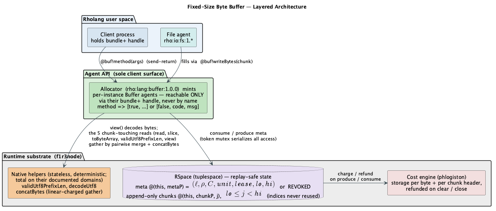
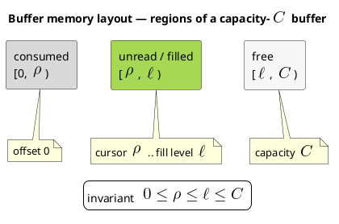
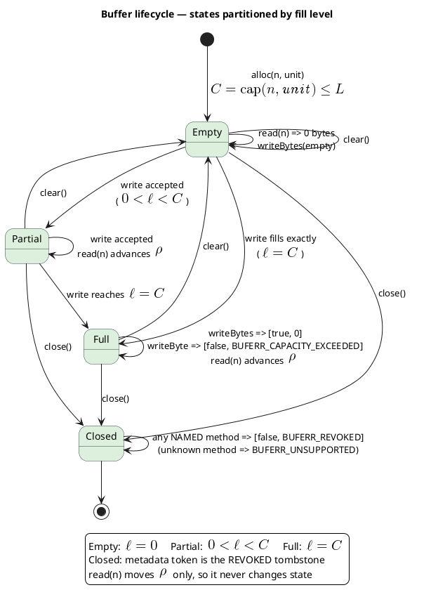
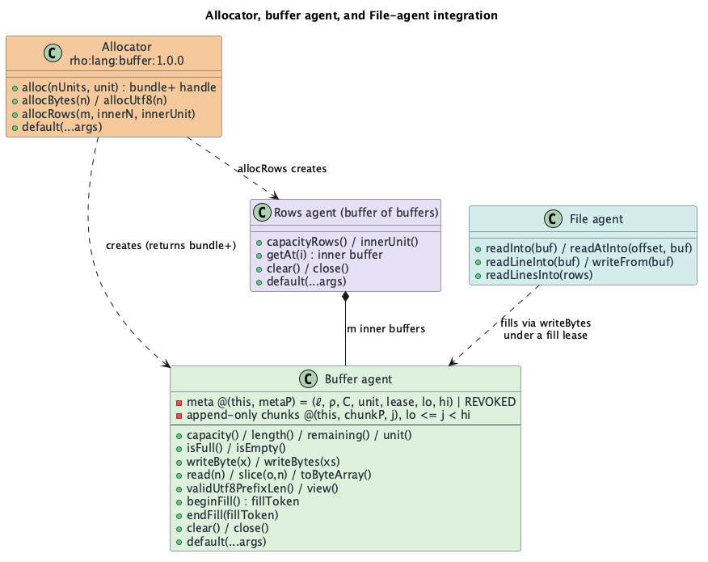
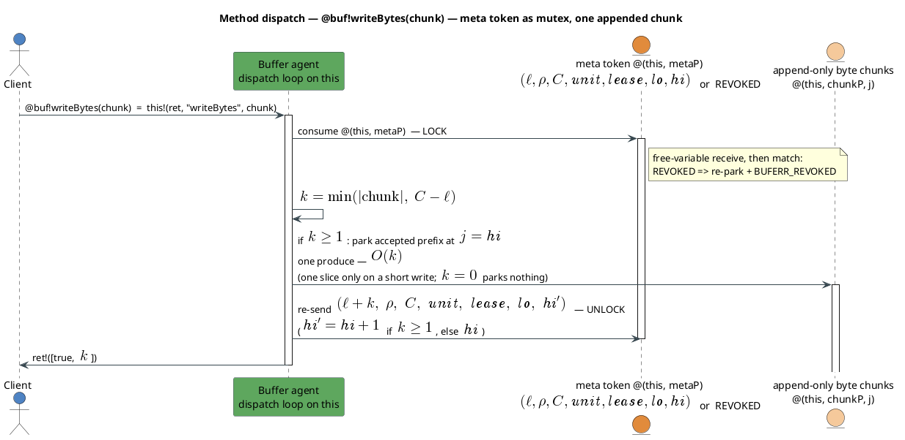
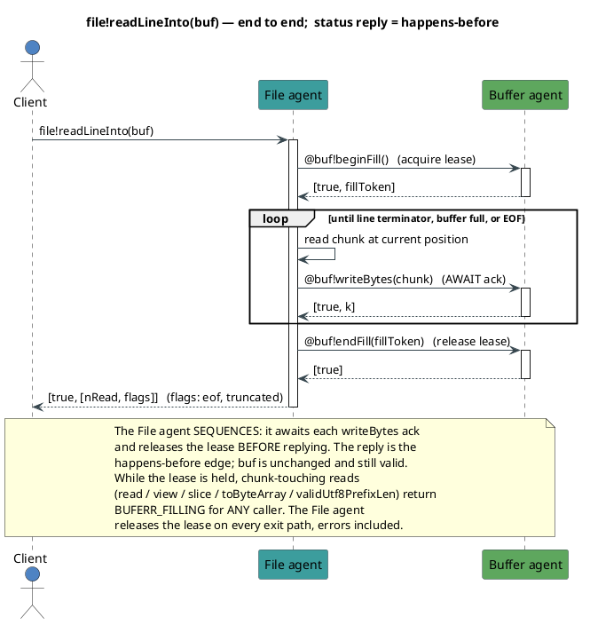
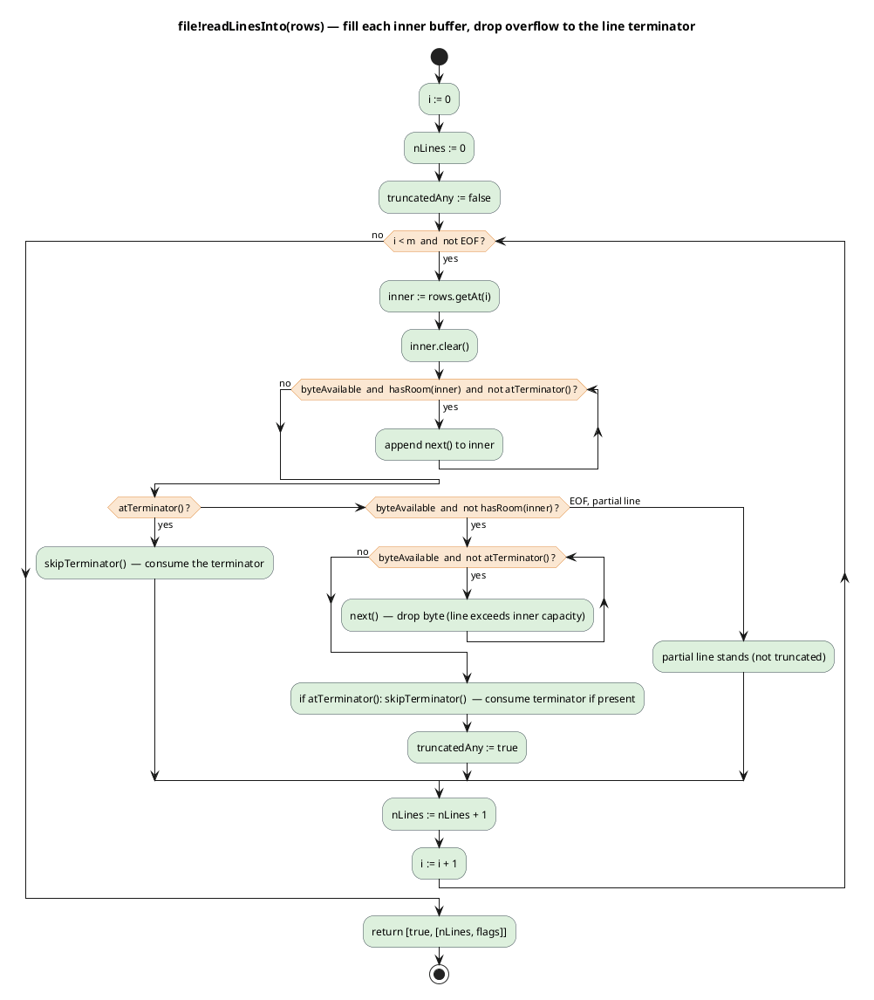

# File I/O

Mike Stay and Dylon Edwards
2026-07-24

# Introduction

A Rholang API for accessing files, directories, and standard I/O on the host, built around a `Stream` agent abstraction so callers can consume arbitrarily-large sources without holding whole payloads in memory, and a companion **fixed-size byte buffer** primitive so callers can also fill preallocated regions in place.

The buffer material in §Buffers, §File > Buffer-taking methods, §Cost accounting > Buffers, and the buffer-related codes in §Standard error codes was originally drafted by Dylon Edwards as a separate FIP and is folded in here — see §Companion FIPs.

# Companion FIPs

- **Versioned Registry**, **Agents**, **Private Methods**, **Numeric Types**, **Reifying RSpaces** — the substrate this FIP builds on.  All approved.
- **Powerbox** (in draft) — the genesis-installed authority-delegation contract.  This FIP references its role in several places (per-principal `Fs` handout, static-provisioning delegation, `"FSERR_REVOKED"` recovery) but does not spec its surface; specific powerbox behaviors are assumed rather than guaranteed.  When the powerbox FIP lands, some of the assumptions here (e.g., "each principal receives its own `Fs` instance") will formally rest on its guarantees.
- **Garbage Collection** (in draft) — the deploy-end backstop that reclaims an unreferenced buffer's dispatcher, tombstone, and any unclosed chunks.  §Buffers relies on it for the deploy-scoped-but-not-explicitly-closed case.

The **fixed-size byte buffer primitive** originally drafted as a separate FIP by Dylon Edwards is folded into this document as §Buffers — buffers and streams are complementary halves of the "read arbitrarily large sources in bounded memory" story, and the File-agent API surface is easier to reason about when both live in one spec.

# Design principles

1. **Streams first.**  Every method whose result size is not bounded by an argument the caller supplied at the call site returns a `Stream`.  Every method whose input size is unbounded takes a `Stream`.  Bounded operations (open, close, stat, seek, truncate, `writeString` of a String the caller already holds) keep their scalar shape.
2. **Ocap.**  Authority to touch the host filesystem comes only from statically-provisioned caps at genesis, delegated through the powerbox.  There is no ambient "just open any path."
3. **No unsafe defaults.**  Directories must be trees; symbolic and hard links are rejected at launch (see §Static provisioning).  Every path-taking method quarantines its argument (canonicalizes; rejects escape via `..` or symlink or root-self).  Quarantine is best-effort against runtime mutation of the tree by processes outside the runtime (a symlink appearing between check and use is a classic TOCTOU); implementations SHOULD use `O_NOFOLLOW`-equivalent syscalls at open time to close that window.
4. **Deterministic replay.**  Oracular mode: the lead node's reads are captured and replayed to followers.  Consensus mode: host-transient record fields are omitted so byte-exact record shapes are deterministic across nodes.
5. **Cost-accounted (deferred).**  Every stream operation is intended to charge phlogiston in proportion to work done.  The cost model itself is a follow-up FIP; this document leaves placeholder caps in each stream method as stopgap defense-in-depth.

# Use cases

The design targets cases 1–5a below; cases 4 (cross-deployment agent lifetime), 5b (validators check the proposer's disk claims), and 6 (multi-node filesystem sync) are deferred to follow-up FIPs.

1. Interpreter processes a `.rho` file with no user input, then exits.
2. Interpreter processes a `.rho` file with user input (stdin or GUI), then exits.
3. Long-lived REPL.
4. Long-lived server / RNode with a nonempty RSpace; clients maintain access across deployments.
5. Multi-node shard where the file system is an oracle.  5a: proposer's disk is authoritative; followers verify processing.  5b: validators verify oracle-claimed contents against their own view.
6. Multi-node shard where the file system is kept in sync.

# Argument conventions

Method inputs typed as `u64` (offsets, sizes, byte counts, worker counts, chunk sizes, etc.) accept `i64` values transparently — callers may pass unsuffixed numeric literals (e.g., `4096`, which is `i64` per the Numeric Types FIP §"Default: signed 64-bit integers") without an explicit cast.  The runtime converts positive `i64` to the corresponding `u64` before dispatch.  Negative `i64` values (and `i64` values that would overflow `u64`) cause the method to return `[false, "FSERR_BAD_ARG", msg]` where `msg` names the offending parameter; no side effect or syscall runs.  `u64` literals (e.g., `4096u64`) are also accepted and pass through unchanged.

Same principle applies to `u8` parameters (byte values, mode bits): `i64` in `[0, 255]` is accepted transparently; outside that range yields `FSERR_BAD_ARG`.

Reply values typed as `u64` or `u8` are emitted with their exact type (`4096u64`, `42u8`); Rholang pattern-matches against those replies should use the typed literal, a bound variable, or a wildcard.

# Streams

A `Stream` agent produces a sequence of values incrementally, on demand.  Every method in this FIP whose result could otherwise be unbounded returns a `Stream` or a specialization of one.  Every write-side method whose input could otherwise be unbounded takes a `Stream` and consumes it.

## The `Stream` agent

Streams are never constructed directly by user code — they are always returned by some other agent's method (`file!chars()`, `dir!entries()`, an adapter, a combinator).  A returned stream is a `bundle+{*this}` agent: callers can invoke methods on it and pass it to other processes, but cannot consume the underlying dispatch channel.

### End-of-stream and error state

- **End-of-stream:** every primitive-consumption method (`next`, `chunk`) signals end-of-stream by returning `[false, "EOS", msg]`.  `"EOS"` is a *condition*, not a *failure* — it's routed through the error-tuple shape so the `try`/`catch` sugar dispatches on it uniformly, but callers should treat it as a normal loop-termination signal rather than an exceptional error.  Using an error-shaped signal rather than a distinguished value (e.g., `[true, Nil]`) means values themselves are unconstrained — a stream may legitimately carry `Nil` as a value if its source produces `Nil`.  (File I/O streams do not, but the generality matters for streams over other sources.)
- **Exhausted:** once a stream has signaled EOS, subsequent primitive-consumption calls return the same `"EOS"` tuple.  `close` after EOS is optional (see below).
- **Error state:** any other `[false, code, msg]` reply (any code other than `"EOS"`) puts the stream in a failed state.  Subsequent method calls return the same error tuple until `close` is invoked.  `close` on a failed stream releases resources and succeeds.
- **Closed:** after `close`, every other method returns `[false, "FSERR_CLOSED", ...]`.

### Base methods

Every stream — regardless of specialization — supports the following.

#### `next` method

`next() -> [true, value] | [false, "EOS", msg] | [false, code, msg]`

Returns the next value.

Reply shapes:

- `[true, value]` — a value.  `value` may be any Rholang process, including `Nil`.
- `[false, "EOS", msg]` — end-of-stream.  Every subsequent `next` returns the same tuple; `close` afterwards is optional.
- `[false, code, msg]` — failed (any code other than `"EOS"`).

`next` blocks (from the caller's perspective, via the normal Rholang message-arrival semantics) if the stream is momentarily empty but not yet ended — e.g., a stream backed by an interactive stdin awaits the next keystroke.

The canonical "consume the whole stream" loop:

```
new loop in {
  contract loop() = {
    try @value <- stream!next() {
      // process value here
      loop!()
    }
    catch @[code, msg] {
      match code {
        "EOS" => { /* stream exhausted; loop terminates */ }
        _     => { /* handle real error; loop terminates */ }
      }
    }
  } |
  loop!()
}
```

For finite consumption without an explicit loop, use `fold` / `forEach` (below), which catch `"EOS"` internally.

#### `chunk` method

`chunk(n: u64) -> [true, container] | [false, "EOS", msg] | [false, code, msg]`

Returns up to `n` values in a single reply, packed into a type-appropriate container.  The container type depends on the stream's specialization:

- `CharStream.chunk(n)` returns a `String` of ≤ `n` code points.
- `ByteStream.chunk(n)` returns a `ByteArray` of ≤ `n` bytes.
- `EntryStream.chunk(n)` returns a `List` of ≤ `n` records.
- `LineStream.chunk(n)` — not supported.  Returns `[false, "FSERR_UNSUPPORTED", "chunk unsupported on LineStream (single-active-inner rule)"]`.  Chunking would require multiple concurrently-active inner streams sharing the source cursor.

`n` must be positive; zero returns `"FSERR_BAD_ARG"` (§Argument conventions covers negative and out-of-range inputs).  Implementations may cap `n` at a maximum and return `"FSERR_QUOTA_EXCEEDED"` above the cap; the guaranteed minimum cap is 1024.

End-of-stream is signaled by `[false, "EOS", msg]`, uniformly with `next`.  A successful chunk reply is always `[true, <non-empty container>]`; if the stream is exhausted, `chunk` returns `"EOS"` rather than an empty container.  A *short* chunk (fewer than `n` elements but not empty) means "no more values are immediately available and the source hasn't ended yet"; it does not signal EOS.

Consuming a `ByteStream` in 4 KiB chunks:

```
new loop in {
  contract loop() = {
    try @chunk <- byteStream!chunk(4096) {
      // chunk is a ByteArray whose length is at least 1 and at most 4096 -- forward it, hash it, etc.
      loop!()
    }
    catch @[code, msg] {
      match code {
        "EOS" => { /* stream exhausted */ }
        _     => { /* handle real error */ }
      }
    }
  } |
  loop!()
}
```

Because the container type varies with the stream's specialization, `chunk` consumers pick their specialization at compile time.  Code that consumes streams generically (unaware of specialization) uses `next`, not `chunk`.

#### `close` method

`close() -> [true] | [false, code, msg]`

Cancels the stream, releases the source cursor and any buffered state.  Idempotent.  After `close`, other methods return `[false, "FSERR_CLOSED", ...]`.

Callers who consume a stream fully to end-of-stream MAY skip `close` — an exhausted stream self-releases at its next scheduling opportunity.  Callers who abandon a stream partway through MUST `close` to release the source, or the source stays locked until the deploy ends.

```
try <- stream!close() { /* released */ }
catch @[code, msg] { /* handle */ }
```

#### `fold` method

`fold(init: Process, combine: Contract) -> [true, accumulator] | [false, code, msg]`

Consumes the entire stream, combining values via a caller-supplied contract; returns the final accumulator.  `combine` has the shape `(returnCh, @accumulator, @value) => returnCh!(newAccumulator)`.

Concrete example — count the bytes in a `ByteStream`:

```
new plus1 in {
  contract plus1(returnCh, @count, @_byte) = {
    returnCh!(count + 1)
  } |
  try @total <- byteStream!fold(0, plus1) {
    // total = number of bytes in the stream
  }
  catch @[code, msg] { /* stream error other than EOS */ }
}
```

Semantics:

- `combine` is invoked once per value, in order.
- Each invocation must complete before the next value is fetched (sequential fold).
- `fold` catches `"EOS"` from the underlying `next` internally: reaching end-of-stream is the normal termination path, not an error, and produces the success reply.
- Other stream errors (any `[false, code, msg]` where `code != "EOS"`) are propagated as `fold`'s error reply.
- If `combine` itself errors (produces `[false, ...]` on its return channel), `fold` propagates the error and stops.
- The stream is closed automatically when `fold` returns, whether by success (EOS), stream error, or combine error.
- Reply on success: `[true, finalAccumulator]`.
- Reply on error: `[false, code, msg]`.
- For `LineStream`, `value` in `combine` is a `CharStream` (an inner stream).  The combine contract must consume that inner stream (via `next`/`chunk`/`fold`/`toString(cap)`) before signalling the new accumulator, or the fold will hang.  For the common "materialize each line as a String and combine" case use `File.linesAsStrings(perLineCap)` (see §File > Read-side stream producers) which hides the inner stream.

#### `foldChunks` method

`foldChunks(init: Process, chunkSize: u64, combineChunk: Contract) -> [true, accumulator] | [false, code, msg]`

Chunk-oriented variant of `fold`; amortizes per-value COMM cost.  `combineChunk` has the shape `(returnCh, @accumulator, @chunk) => returnCh!(newAccumulator)` where `chunk` is a container of the stream's specialization type.

Concrete example — count the bytes via 64 KiB chunks, one message per chunk instead of one per byte:

```
new addLen in {
  contract addLen(returnCh, @count, @chunk) = {
    returnCh!(count + chunk.length())
  } |
  try @total <- byteStream!foldChunks(0, 65536, addLen) {
    // total = number of bytes in the stream
  }
  catch @[code, msg] { /* handle */ }
}
```

Semantics: `foldChunks` calls `chunk(chunkSize)` in a loop.  Each chunk (between 1 and `chunkSize` values inclusive, never empty per §chunk method) is passed to `combineChunk`.  On `"EOS"` from the underlying `chunk`, `foldChunks` returns `[true, finalAccumulator]` without invoking `combineChunk` again.  Same close-on-exit and other-error-propagation semantics as `fold`.  Not supported on `LineStream` (same reason `chunk` isn't).

#### `forEach` method

`forEach(handler: Contract) -> [true] | [false, code, msg]`

Side-effect variant of `fold` — no accumulator, no return value beyond `[true]` on success.  `handler` has the shape `(returnCh, @value) => ...; returnCh!()`; the empty send on `returnCh` is how the handler signals it is done with `value` and the stream may advance.  Use `;` (sequential composition) rather than `|` (parallel) so that the handler's own work completes before the completion signal is sent — method-call sugar (`x!m(args)`) already waits for the callee's reply, so `;` chains cleanly.

Concrete example — echo each entry's `name` to stdout:

```
new echo in {
  contract echo(returnCh, @entry) = {
    stdout!writeString(entry.get("name") ++ "\n"); returnCh!()
  } |
  try <- entryStream!forEach(echo) {
    // all entries echoed
  }
  catch @[code, msg] { /* handle */ }
}
```

Same sequentiality, EOS-catching, close-on-exit, and other-error-propagation semantics as `fold`.  For `LineStream`, `value` is a `CharStream` and `handle` must consume it before producing on `returnCh`.  The common case has a companion `File.forEachLine(handler, perLineCap)` that hands the handler a materialized `String` instead (see §File > Read-side stream producers).

#### `foldConcurrent` method

`foldConcurrent(init: Process, combine: Contract, workers: u64) -> [true, accumulator] | [false, code, msg]`

Parallel variant of `fold`.  Invokes `combine` up to `workers` times concurrently, letting the runtime overlap combine work across values.  `combine` has the same shape as `fold`'s: `(returnCh, @accumulator, @value) => returnCh!(newAccumulator)`.

Concrete example — sum every byte value in a stream via up to 8 parallel combines:

```
new plus in {
  contract plus(returnCh, @acc, @byte) = {
    returnCh!(acc + byte)
  } |
  try @total <- byteStream!foldConcurrent(0, plus, 8) {
    // total = sum of every byte value
  }
  catch @[code, msg] { /* handle */ }
}
```

Semantics:

- `combine` may be invoked up to `workers` times concurrently.  Values are dispatched to `combine` invocations in the order they arrive from the source, but the invocations complete in scheduling order.  The accumulator is updated as invocations complete.
- **`combine` must be commutative and associative** for the result to be well-defined independent of scheduling.  If it isn't, the result reflects the lead node's actual scheduling — reproducible under replay (the lead's scheduling is captured in the produce log and replayed to followers) but potentially varying across local dev runs.
- Effectively runs sequentially when `workers` is 1, or when the source produces values slower than `combine` can complete.
- `workers` must be positive; zero returns `"FSERR_BAD_ARG"` (§Argument conventions covers negative and out-of-range inputs).  Implementations may cap `workers` at a maximum and return `"FSERR_QUOTA_EXCEEDED"` above the cap.
- Same close-on-exit, EOS-catching, and other-error-propagation semantics as `fold`.
- Not supported on `LineStream` (would require multiple concurrently-active inner streams sharing the source cursor); returns `"FSERR_UNSUPPORTED"`.

#### `mapReduce` method

`mapReduce(mapFn: Contract, reduceFn: Contract, init: Process, workers: u64) -> [true, accumulator] | [false, code, msg]`

Two-phase parallel combinator: each element is transformed by `mapFn`, and the results are combined by `reduceFn`.  Both phases may run up to `workers` invocations concurrently.  `mapFn` has the shape `(returnCh, @value) => returnCh!(mappedValue)`; `reduceFn` has the shape `(returnCh, @accumulator, @mappedValue) => returnCh!(newAccumulator)`.

Concrete example — sum the squares of every byte, using 8-way parallel mapping and reduction:

```
new mapSquare, plus in {
  contract mapSquare(returnCh, @byte) = {
    returnCh!(byte * byte)
  } |
  contract plus(returnCh, @acc, @mapped) = {
    returnCh!(acc + mapped)
  } |
  try @sumOfSquares <- byteStream!mapReduce(mapSquare, plus, 0, 8) {
    // sumOfSquares = sum of (byte * byte) over every byte
  }
  catch @[code, msg] { /* handle */ }
}
```

Semantics:

- `mapFn(returnCh, value)` is invoked once per stream element, up to `workers` concurrently.  Produces a per-element mapped result on `returnCh`.
- `reduceFn(returnCh, acc, mappedResult)` combines the running accumulator with a map result.  Invocations proceed as map results arrive.
- **`reduceFn` must be commutative and associative** for the result to be well-defined independent of scheduling.  Same replay-determinism vs. dev-run-variability caveat as `foldConcurrent`.
- `workers` bounds concurrent invocations across BOTH `mapFn` and `reduceFn` combined; the runtime allocates the budget dynamically.
- If either `mapFn` or `reduceFn` errors (produces `[false, ...]` on its return channel), `mapReduce` propagates the error and stops.
- Same close-on-exit, EOS-catching, and other-error-propagation semantics as `fold`.
- `workers` must be positive; zero returns `"FSERR_BAD_ARG"` (§Argument conventions covers negative and out-of-range inputs).
- Not supported on `LineStream`; returns `"FSERR_UNSUPPORTED"`.

Use `foldConcurrent` when the per-element work is already inside `combine` and there's no separate map step.  Use `mapReduce` when you want the map and reduce phases to be independently parallelizable (typically because the map is expensive per element).

### Parallelism

Stream methods come in two flavors: **sequential** (`fold`, `foldChunks`, `forEach`) and **parallel** (`foldConcurrent`, `mapReduce`).  The sequential forms guarantee left-to-right combine ordering; the parallel forms require commutative-and-associative combine but let the runtime exploit multiple workers.

**Pipeline parallelism** is separate from either flavor and is implementation-transparent.  Stream implementations MAY prefetch the next value or chunk while the caller processes the current one — the stream just appears faster.  Callers cannot force pipeline parallelism on or off from the API; implementations MAY expose tuning knobs out of band.  The per-call caps on `chunk(n)` and materialization methods (`toString(cap)`, `toByteArray(cap)`, `toList(cap)`) bound how much buffered state implementations can accumulate.

**Ad-hoc fan-out** is available at the primitive level: a caller can spawn N worker processes and have each pull chunks in a loop.  The single-active-sequential-stream rule (§Concurrency and locking) makes the source serialize `chunk` delivery first-come-first-served, so workers don't step on each other; the caller handles their own accumulation.  This pattern is what `foldConcurrent` builds internally, but callers who need custom scheduling or backpressure can construct it directly:

```
new worker in {
  contract worker() = {
    try @chunk <- stream!chunk(4096) {
      // process chunk however this worker likes
      worker!()
    }
    catch @[code, msg] {
      match code {
        "EOS" => { /* this worker is done */ }
        _     => { /* handle */ }
      }
    }
  } |
  worker!() | worker!() | worker!() | worker!()   // four parallel workers
}
```

**Replay determinism.**  Under multi-node oracular mode, the lead's scheduling — which value went to which worker, in which order — is captured in the produce log along with each `chunk`/`next` reply, so followers replay the same interleaving.  Parallel combinators are therefore deterministic across nodes even when `combine` isn't strictly commutative; the caveat is *local* dev runs where scheduling may vary.

### Stream specializations

Streams are duck-typed at the Rholang level: a `CharStream` is any stream whose `next` returns single-code-point `String` values and whose `chunk` returns a `String`.  The specializations are documented contracts, not reified class hierarchies — the receiving agent pattern-matches on the shape it gets.

#### `CharStream`

Element: `String` of length 1 code point.
Chunk container: `String`.
Convenience: `charStream!toString(cap)` — materialize into a single `String` of ≤ `cap` code points; `"FSERR_QUOTA_EXCEEDED"` if longer.

#### `ByteStream`

Element: `u8`.
Chunk container: `ByteArray`.
Convenience: `byteStream!toByteArray(cap)` — materialize into a single `ByteArray` of ≤ `cap` bytes; `"FSERR_QUOTA_EXCEEDED"` if longer.

#### `EntryStream`

Element: directory-entry record (Map; shape defined in §The `Dir` agent > Listing).
Chunk container: `List` of records.
Convenience: `entryStream!toList(cap)` — materialize into a `List` of ≤ `cap` records.

#### `LineStream`

Element: `CharStream` (an inner stream over the characters of one line, terminator excluded).
Chunk container: not supported (see §chunk method).
Convenience: `File.linesAsStrings(perLineCap)` and `File.forEachLine(handler, perLineCap)` hide the inner-stream mechanics for the common "each line as a bounded String" case (see §File > Read-side stream producers).

**Single-active-inner rule.**  A `LineStream` and its currently-produced inner `CharStream` share the source's cursor.  Only one inner is active at a time.  Calling `next` on the outer while an inner is still open closes the inner first (advancing the source past the inner's remaining characters and its terminator), then produces the next inner.

**Skipping a line.**  Discard the returned inner and call `next` on the outer again; the outer will drain the inner as part of its next dispatch.

**Closing an inner.**  Advances the source past the inner's logical group boundary (past the current line's terminator) but does not affect the outer.

**Closing the outer.**  Closes any active inner first, then releases the source cursor.

**Drained inners fail closed.**  When the outer drains an inner (either because a caller invoked outer's `next` while the inner was live, or because the outer itself was closed), the inner is marked `"FSERR_CLOSED"` immediately.  A caller who retained a handle to a drained inner and later invokes `next`/`chunk`/`fold` on it sees `[false, "FSERR_CLOSED", ...]` rather than silently reading from the wrong cursor position.  This turns a "read the wrong data" bug into a caught error.

### Companion class on the write side

Methods that consume a stream to write it out live on their sink agent (see `File.writeChars(charStream)`, `Stdout.writeLines(lineStream)`).  They are not new stream types; the stream is the input.  Consumers:

- Read from the input stream until `"EOS"` or another error.  `"EOS"` is the normal termination signal; the write-side reply is `[true]`.  Any other error propagates as the write-side's `[false, code, msg]` reply.
- Write each element (or chunk) to the sink.
- Close the input stream on completion or on the first write error.
- Reply `[true]` on success, `[false, code, msg]` on failure — with the byte count written before the failure encoded into `msg` (see §File.writeChars).

### Cost of a stream

A stream is one agent instance.  Constructing it costs the same as any agent construction (§Cost accounting).  Consuming it charges per element / per chunk / per byte transferred, capped by the stopgap `cap` argument on each materialization method until the cost FIP calibrates constants.

# Buffers

Streams solve one memory-bound problem: consume an arbitrarily large source incrementally.  They do not solve a second problem — every `chunk(n)` call allocates a *fresh* container, so nothing lets a caller **preallocate a bounded region and have reads fill it in place**.  A "terabyte file" is safely readable through a stream; a "terabyte line" is not — even a forward-only `readLine()` is unbounded when a single line is enormous, and every allocating byte path (`read(n) -> ByteArray`) commits fresh memory the runtime cannot easily cap.

This section defines a **fixed-size byte buffer**: a mutable, fixed-capacity sequence of bytes that a Rholang program allocates once and reuses, exposed *only* through a channel-based **agent** API.  The buffer is the tool that lets the File-agent API read arbitrarily large files in *bounded* memory: a caller preallocates a buffer of a chosen capacity, and read calls fill it in place.  Because Rholang values are immutable and the only mutable state is messages parked on channels (the tuplespace), the buffer's bytes live in the tuplespace as an agent's private state — never as native heap outside it — so the design is **deterministic-replay- and consensus-safe** by construction, and unprincipled data races are impossible (the agent serializes every access that touches the bytes).

The design has one client-facing layer and three tiny runtime helpers.  Figure 1 shows the layering.



*Figure 1 — Layered architecture. Clients (and the File agent) reach the buffer **only** through the agent API.  The buffer's mutable bytes live in RSpace (the tuplespace) as the agent's private state; the sole native additions are three stateless, deterministic helpers — two for UTF-8 and one linear-charged concatenation.*

- **The buffer is an agent whose state lives in the tuplespace.**  There is no native mutable region.  The agent keeps a metadata token `@(*this, *metaP)!((ℓ, ρ, C, unit, lease, lo, hi))` and stores the bytes as **append-only chunks** on `@(*this, *chunkP, j)`, one chunk per accepted write, for $`j \in [\mathit{lo},\mathit{hi})`$; the concatenation of chunks $`\mathit{lo}`$ through $`\mathit{hi}-1`$, in index order, is exactly $`b[0{:}\ell)`$.  Because this state is ordinary tuplespace data, it is content-addressed, checkpointed, and reproduced exactly under deterministic replay.  Capacity is enforced by the agent's own arithmetic: a write that would exceed $`C`$ writes only what fits.
- **The agent API is the sole client surface.**  Clients never obtain raw bytes; they hold a `bundle+` handle to a buffer agent and interact by sending method messages.  Immutability is preserved (the handle is an ordinary immutable Rholang value); races become principled (every named method acquires a single metadata token first); authority is explicit (the `bundle+` handle is an object capability).
- **Three stateless native helpers.**  The interpreter already offers `"…".toUtf8Bytes()` (String → UTF-8 bytes) but no inverse.  The buffer's text view needs bytes → String, so we add `validUtf8PrefixLen` and `decodeUtf8`, plus a linear-charged `concatBytes` used to reassemble chunks (§Implementation notes for buffers) — three stateless, deterministic primitives, each total on its documented domain.  Being purely additive they reprice no existing operation.

A *native* mutable region was considered and rejected (see §Alternatives) because it would be invisible to deterministic replay.

## The fixed-size byte buffer

### State and lifecycle

A buffer is created empty at a fixed capacity, then filled, drained, cleared for reuse, and finally closed.  Figure 2 shows the logical byte layout; Figure 3 the lifecycle.



*Figure 2 — Logical layout of a capacity-$`C`$ buffer. Bytes $`[0,\rho)`$ have been consumed by `read`; $`[\rho,\ell)`$ are filled but unread; $`[\ell,C)`$ are free.*



*Figure 3 — Lifecycle, with each state's defining predicate. `clear()` returns any state to `Empty` (refunding the stored chunks) for reuse without a new allocation; `close()` moves the buffer to the terminal `Closed` state, in which every **named** method answers `"BUFERR_REVOKED"` (an unknown method still answers `"BUFERR_UNSUPPORTED"`).*

### Allocation and the two sizing units

A buffer is allocated by **capacity**, chosen in one of two units:

- **bytes** — $`C = n`$; or
- **UTF-8 characters** — $`C = 4n`$.

The factor of four is the maximum UTF-8 encoded length of a code point (RFC 3629).  Sizing by characters therefore guarantees room for $`n`$ code points *of any width*:

```math
C \;=\; \mathrm{cap}(n, \text{unit}) \;=\;
\begin{cases}
n, & \text{unit} = \texttt{"bytes"},\\[2pt]
4n, & \text{unit} = \texttt{"utf8"}.
\end{cases}
```

Capacity **and the sizing unit** are immutable for the buffer's lifetime — the unit is retained in the metadata token and exposed by `unit()` (§Instance methods) precisely so the File agent can apply the boundary rule of §File-buffer integration.  The mutable fields are $`\ell`$, $`\rho`$, the lease, and the chunk range $`\mathit{lo},\mathit{hi}`$ (whence $`\nu = \mathit{hi}-\mathit{lo}`$).  This is what makes the footprint statically known (§Cost accounting > Buffers) and the buffer safe to reuse across reads.

## The allocator (buffer factory)

Buffers are minted by an **allocator** — a stateful library agent published to the versioned registry as `rho:lang:buffer:1.0.0`, alongside the other blessed standard-library contracts (`rho:lang:nonNegativeNumber:1.0.0`, `rho:lang:stack:1.0.0`, …).  The allocator's non-`default` methods all *allocate* — `alloc`, `allocBytes`, `allocUtf8`, `allocRows` — so the name matches the surface.  Import follows the same pattern as `Fs` (§Acquiring agent references) — `new x(`URN`)` with a `notify` channel for deprecation warnings:

```
new getAlloc(`rho:lang:buffer:1.0.0`), notify in {
  for (allocator <- getAlloc!?(*notify)) {
    // allocator!alloc(...) etc.
    Nil
  }
}
```

Callers who want to pin a minor version use a pattern like `` `rho:lang:buffer:1.*` `` (the Versioned Registry FIP's wildcard form).  The unversioned name `rho:lang:buffer` is not published — the Versioned Registry migration retired the flat name.

| Method | Reply | Notes |
| --- | --- | --- |
| `alloc(nUnits: u64, unit: String)` | `[true, buf]` | $`\mathit{unit} \in \{\texttt{"bytes"},\texttt{"utf8"}\}`$; `buf` is a `bundle+` handle to a fresh, empty buffer |
| `allocBytes(n: u64)` | `[true, buf]` | sugar for `alloc(n, "bytes")` |
| `allocUtf8(n: u64)` | `[true, buf]` | sugar for `alloc(n, "utf8")` |
| `allocRows(m: u64, innerN: u64, innerUnit: String)` | `[true, rows]` | a **buffer of buffers** (a distinct outer type, §Fixed-size line reading): `m` inner byte buffers, each allocated by `alloc(innerN, innerUnit)` |
| `default(...@args)` | `[false, "BUFERR_UNSUPPORTED", msg]` | mandatory catch-all; the allocator is publicly reachable, so an unknown method must be answered rather than left to deadlock |

`alloc` may fail with `[false, "BUFERR_INVALID_ARGUMENT", msg]` (a non-integer `nUnits`), `[false, "BUFERR_INVALID_CAPACITY", msg]` ($`n \le 0`$ or $`C > L`$, where $`L`$ is the platform capacity limit), `[false, "BUFERR_INVALID_UNIT", msg]`, or `[false, "FSERR_QUOTA_EXCEEDED", msg]` when a quota agent declines the reservation (the File I/O quota hook, reused unchanged).  `allocRows` fails the same way, and additionally with `"BUFERR_INVALID_CAPACITY"` when $`m \le 0`$ or the aggregate $`m \cdot C_{\mathrm{inner}}`$ exceeds $`L`$; on any failure it allocates no inner buffers.

## The `Buffer` agent

Every instance method follows the FIP's calling and result conventions, and every **named** method first checks for revocation (§Concurrency > Metadata-token mutex) — on a `close()`d buffer every named method returns `[false, "BUFERR_REVOKED", msg]`.  An *unrecognized* method is answered by the `default` arm, which is the dispatcher's `match` fall-through and never acquires the metadata token, so it returns `"BUFERR_UNSUPPORTED"` regardless of buffer state.  Figure 4 summarizes the surface.



*Figure 4 — The allocator mints buffer agents (returning `bundle+` handles); the File agent fills them via `@buf!writeBytes` under a fill lease.*

### Metadata queries

Non-mutating; they hold the metadata token like every other method.

| Method | Reply |
| --- | --- |
| `capacity()` | `[true, C]` |
| `length()` | `[true, ℓ]` |
| `remaining()` | `[true, C - ℓ]` |
| `isEmpty()` / `isFull()` | `[true, ℓ == 0]` / `[true, ℓ == C]` |
| `unit()` | `[true, "bytes"]` or `[true, "utf8"]` — the sizing unit fixed at allocation; the File agent reads it to decide whether to fill on code-point boundaries (§File-buffer integration) |

### Writes

Mutating; hold the metadata token.

| Method | Reply | Semantics |
| --- | --- | --- |
| `writeByte(x: u8)` | `[true, 1]`, `[false, "BUFERR_CAPACITY_EXCEEDED", msg]`, or `[false, "BUFERR_INVALID_ARGUMENT", msg]` | append one byte if room; error when full |
| `writeBytes(xs: ByteArray)` | `[true, k]` or `[false, "BUFERR_INVALID_ARGUMENT", msg]` | rejects a non-`ByteArray` `xs`; otherwise appends $`k = \min(\lvert xs\rvert,\; C - \ell)`$ bytes as **one** new chunk; a **short write** ($`k < \lvert xs\rvert`$) signals the buffer filled.  A write with $`k = 0`$ parks **no** chunk and leaves $`\mathit{hi}`$ unchanged, so a full buffer cannot accumulate empty chunks |

### Reads

Chunk-touching; hold the metadata token, then gather chunks.

| Method | Reply | Semantics |
| --- | --- | --- |
| `read(n: u64)` | `[true, bytes]` | consume $`r = \max(0,\ \min(n,\ \ell-\rho))`$ bytes from $`\rho`$, advancing it; drains the buffer |
| `slice(offset: u64, n: u64)` | `[true, bytes]` | positional copy of $`[\text{offset}, \text{offset}+n)`$; no cursor move; `[false, "BUFERR_OUT_OF_RANGE", msg]` unless $`0 \le \text{offset} \le \text{offset}+n \le \ell`$ |
| `toByteArray()` | `[true, bytes]` | copy of the filled region $`[0,\ell)`$ |
| `validUtf8PrefixLen()` | `[true, j]` | largest `j ≤ ℓ` with bytes `[0,j)` valid UTF-8 (§Encoding) |
| `view()` | `[true, str]` | decode $`[0,\ell)`$ as UTF-8; `[false, "BUFERR_BAD_ENCODING", msg]` if that region is not wholly valid UTF-8 |

While a fill lease is held, every chunk-touching read returns `[false, "BUFERR_FILLING", msg]` (§Concurrency > Fill lease).  The agent cannot distinguish callers, so this applies to any caller, including the lease holder.

### Fill lease and lifecycle

| Method | Reply | Semantics |
| --- | --- | --- |
| `beginFill()` | `[true, fillToken]` or `[false, "BUFERR_FILLING", msg]` | acquire the exclusive fill lease; `fillToken` is a fresh unforgeable capability that `endFill` must present; fails if a lease is already held |
| `endFill(fillToken)` | `[true]` or `[false, "BUFERR_FILLING", msg]` | release the lease iff `fillToken` matches the active lease |
| `clear()` | `[true]` | $`\ell \leftarrow 0,\ \rho \leftarrow 0`$; consumes the stored chunks (refunding their storage) and advances $`\mathit{lo}`$ to $`\mathit{hi}`$ so indices are never reused.  Also releases any held lease, so an abandoned lease is recoverable |
| `close()` | `[true]` | consume the stored chunks (refunding their storage) and replace the metadata token with the revoked tombstone; every subsequent named method matches the tombstone and returns `[false, "BUFERR_REVOKED", msg]` |
| `default(...@args)` | `[false, "BUFERR_UNSUPPORTED", msg]` | mandatory catch-all; precedes token acquisition, so it answers even on a closed buffer |

`clear()` and `close()` are deliberately **not** lease-gated: they are the recovery path for a lease whose holder died or dropped its `fillToken` (§Concurrency > Fill lease).

## Method dispatch and the mutex

Figure 5 shows a single `writeBytes` call end to end, making the metadata-token mutex of §Concurrency concrete.  The accepted bytes are parked as **one** new chunk at index $`\mathit{hi}`$ and the range is extended (a $`k = 0`$ write parks nothing and leaves $`\mathit{hi}`$ alone), so the write is a single produce of $`k`$ bytes — $`O(k)`$, never $`O(C)`$, and with no splitting into cells.



*Figure 5 — `@buf!writeBytes(chunk)` desugars to a message on `this`; the dispatch loop **consumes** the metadata token (acquiring the lock), parks $`k = \min(\lvert \mathrm{chunk}\rvert,\ C-\ell)`$ bytes as one new chunk, **re-sends** the token (releasing the lock), and replies `[true, k]`. Any concurrent access blocks on the absent token.*

## File-buffer integration

The point of the buffer is that the **File agent fills it**.  The File agent grows a small family of buffer-taking methods (documented in §File > Buffer-taking methods).  Concretely:

| Method | Reply | Semantics |
| --- | --- | --- |
| `file!readInto(buf)` | `[true, [nRead, eof]]` | fill `buf` from the current position (up to `remaining()`), advancing the position by `nRead` |
| `file!readAtInto(offset, buf)` | `[true, [nRead, eof]]` | positional fill; does not move the position |
| `file!readLineInto(buf)` | `[true, [nRead, flags]]` | fill up to one line — through the line terminator or until the buffer fills; `flags` is a map `{"eof": Bool, "truncated": Bool}` |
| `file!readLinesInto(rows)` | `[true, [nLines, flags]]` | fill each inner buffer of a `rows` (buffer-of-buffers) with one line, per the algorithm of §Fixed-size line reading |
| `file!writeFrom(buf)` | `[true, nWritten]` | drain the filled region $`[0,\ell)`$ of `buf` to the file at the current position |

**Failure surface.**  Each of these returns `[false, code, msg]` with: the buffer-side codes `"BUFERR_FILLING"` (another fill is in progress on that buffer) and `"BUFERR_REVOKED"` (the buffer was closed); and File I/O's own codes, in particular `"FSERR_BUSY"`, `"FSERR_CLOSED"`, and `"FSERR_IO"`.  They inherit File I/O's concurrency partition unchanged: `readInto`, `readAtInto`, and `writeFrom` are byte-level methods — they take the same implicit range locks, accept the same `{"wait": true}` option, and yield `"FSERR_BUSY"` on conflict — while `readLineInto` and `readLinesInto` are line-based, so mixing a line-based call with an in-flight byte-level call on the same file yields `"FSERR_BUSY"` per §Concurrency.

**UTF-8 boundary rule.**  A File fill method reads the buffer's `unit()` to decide how to fill.  For a buffer whose unit is `"utf8"`, `readInto`/`readLineInto` fill **only up to a code-point boundary**: they never leave a partial multi-byte sequence at $`\ell`$, so `view()` on such a buffer succeeds provided the source bytes are valid UTF-8 and the buffer was filled only by these methods (§Encoding).  Concretely they fill to the largest code-point boundary that fits within `remaining()` $`= C-\ell`$ (so up to 3 bytes may remain free), and `nRead` is the number of bytes *appended* by this call; the held-back bytes of a straddling code point are read on the next fill.

**EOF semantics.**  `eof` is true iff no unread bytes remain in the file after the call.  Consequently an empty file yields one call returning `nRead = 0` with `eof` true.

**`readLineInto` line semantics.**  `readLineInto` writes the line's content and not its terminator, and consumes the terminator from the file.  Like `readInto` it is a cursor method: it advances the file's byte position past the content and past the terminator, so a subsequent call reads the next line.  `nRead` is therefore the number of *content* bytes written, and is **0 for a blank line** — for every terminator listed in §Fixed-size line reading, since none is ever written to the buffer; callers must use the `eof` flag, not `nRead`, to detect end of input.  `readLineInto` sets `truncated` when the buffer fills before a terminator arrives; the buffer is filled (respecting the boundary rule) and the terminator is *not* consumed, so a subsequent `readLineInto` into a cleared buffer continues the same line.  (The alternative "drop the overflow" policy is what the buffer-of-buffers line reader does.)

**Normative sequencing.**  `writeFrom` is a *drain*, not a fill: it does **not** take the lease, and behaves as an ordinary chunk-touching read of $`[0,\ell)`$ (so it is refused with `"BUFERR_FILLING"` while someone else holds the lease).  Each of the three fill methods, by contrast, **must** perform its work under the buffer's fill lease and **await each `writeBytes` acknowledgment** (via the send-return sugar `@buf!writeBytes(chunk)`, which desugars to `!?`) before proceeding, and reply to the client **only after** releasing the lease.  Concretely it runs `beginFill()` to obtain `fillToken`; then, in sequence (`;`), an awaited `@buf!writeBytes(chunk)` per chunk; then `endFill(fillToken)`; then the client reply — never placing a `writeBytes` in parallel (`|`) with the client reply.  It must release the lease on every exit path, including I/O errors: on failure it calls `endFill(fillToken)` before returning the error — and **replies even if that `endFill` itself fails**, which is reachable, since a co-holder may `clear()` or `close()` mid-lease.  A failed fill therefore never strands the lease.

Figure 6 makes the ordering explicit for `readLineInto`:



*Figure 6 — `file!readLineInto(buf)`: the File agent acquires the fill lease (receiving `fillToken`), fills via awaited `@buf!writeBytes`, releases the lease with `endFill(fillToken)`, then replies.  The status reply is the happens-before edge; the `buf` handle is unchanged and still valid; chunk-touching reads see `"BUFERR_FILLING"` until the lease is released.*

Because every chunk-touching read holds the metadata token and checks the lease field **atomically** under it (§Concurrency > Fill lease), a second holder of the same `bundle+` handle that issues `read()`/`view()` during a fill gets `"BUFERR_FILLING"` rather than observing a half-filled buffer.

**Disclosure — what the lease does not do.**  The lease gates chunk-touching *reads* and authenticates *release*; it does not constrain a co-holder of the `bundle+` handle, who may still write, `clear()`, or `close()` during a lease, or call `beginFill()` and never release it.  The last case would otherwise brick every read; it is recoverable because `clear()` and `close()` are deliberately not lease-gated and both drop the lease.  Write-content coherence — that the bytes form one coherent line — therefore relies on the *single-filler* discipline (the File agent is the sole writer for the duration of its lease), exactly as an ocap grants authority to whoever holds it.

## Efficiency for large files

Beyond safety, the buffer is the *efficient* way to read a large file, because it is **preallocated once and reused**.  Reading a file of $`F \ge 1`$ bytes with a single capacity-$`C`$ buffer via `readInto` on a `"bytes"`-unit buffer performs

```math
\left\lceil \frac{F}{C} \right\rceil \text{ fills}, \qquad
\text{peak tuplespace-resident bytes} = \Theta(C) \ \text{— independent of } F,
```

because `clear()` **refunds** the stored chunks between reads, so at most one buffer's worth is resident at a time.  Contrast the two whole-file paths and the allocating byte path:

| Approach | Peak resident bytes | Fresh values allocated |
| --- | --- | --- |
| stream `chars()` / `lines()` materialized via `toString(cap)` / `toList(cap)` | $`\Theta(F)`$ up to the cap | one big String or List |
| repeated stream `chunk(n)` | $`\Theta(n)`$ | one fresh container **per call** |
| reused fixed-size buffer | $`\Theta(C)`$ | none beyond the transient chunks, refunded on reuse |

The reuse pattern is: `clear()` the buffer, `file!readLineInto(buf)` (or `file!readInto(buf)`), process the filled region, repeat.  Preallocation here is not a premature optimization — it is the mechanism that bounds the resident footprint.

## Fixed-size line reading: a buffer of buffers

Greg Meredith's fixed-size line reader reads many lines at once into a **fixed-size buffer whose elements are themselves fixed-size buffers**.  It fills each inner buffer up to its capacity; if a line overflows, it **drops characters until the next terminator** and resumes into the next inner buffer.  This bounds *both* the number of lines and the length of each, so total resident memory is

```math
C_{\mathrm{total}} \;=\; m \cdot C_{\mathrm{inner}},
```

for $`m`$ inner buffers each of capacity $`C_{\mathrm{inner}}`$.

### The outer buffer (a distinct type)

`allocator!allocRows(m, innerN, innerUnit)` (where `allocator` is the allocator-agent name bound by `for (allocator <- getAlloc!?(*notify))`, per §The allocator) allocates the outer buffer and its $`m`$ inner byte buffers in one call.  The outer buffer is a **distinct type** — a fixed-size buffer whose elements are inner-buffer handles, not bytes — so it has its own small method surface:

| Method | Reply | Semantics |
| --- | --- | --- |
| `capacityRows()` | `[true, m]` | number of inner buffers |
| `innerUnit()` | `[true, unit]` | the sizing unit shared by every inner buffer, so the line reader can apply the boundary rule |
| `getAt(i: u64)` | `[true, inner]` | handle to inner buffer `i`; `[false, "BUFERR_OUT_OF_RANGE", msg]` unless $`0 \le i < m`$ |
| `clear()` | `[true]` | clears every inner buffer |
| `close()` | `[true]` | closes every inner buffer and revokes the outer handle (the same tombstone mechanism as the base buffer) |
| `default(...@args)` | `[false, "BUFERR_UNSUPPORTED", msg]` | mandatory catch-all |

`file!readLinesInto(rows)` fills the rows and returns `[true, [nLines, flags]]`, where `flags` reports `eof` and whether any line was `truncated`; it fails with the same codes as the other File fill methods.

### The fill algorithm

Figure 7 is the flowchart; here is the same algorithm in literate form.  We read one line per inner buffer, and we treat "line too long" by discarding the overflow so the buffer bound is never exceeded.  When the inner buffers were allocated with the `"utf8"` unit, "full" is interpreted per §Encoding (stop on the last code-point boundary that fits), so `view()` on a filled inner buffer succeeds whenever the source is valid UTF-8.

*For legibility the pseudocode and Figure 7 elide the per-inner-buffer lease bracketing; a conforming implementation wraps each inner fill in `beginFill()` … `endFill(fillToken)` exactly as the File-buffer integration requires, releasing on every exit path.*



*Figure 7 — `file!readLinesInto(rows)`: fill each inner buffer to a line terminator or its capacity; only when the inner buffer is **full before** a terminator, drop to the next terminator and mark it truncated; a final partial line at EOF stands, un-truncated.*

```
i ← 0 ; nLines ← 0 ; truncatedAny ← false
while i < m and not atEOF:
    inner ← rows.getAt(i)
    inner.clear()
    fill_one_inner_buffer_up_to_terminator_or_capacity(inner)
    if_inner_overflowed_drop_to_next_terminator(inner)
    nLines ← nLines + 1
    i ← i + 1
return [true, [nLines, {"eof": atEOF, "truncated": truncatedAny}]]
```

*Fill one inner buffer up to a terminator or capacity:*

```
while byteAvailable and hasRoom(inner) and not atTerminator():
    inner.writeByte(next())
```

`byteAvailable` is true while the file has an unread byte and `next()` consumes and returns it; `next()` is only evaluated when `byteAvailable` holds.  Terminator recognition needs up to three bytes of lookahead (LS and PS are three bytes each), so it is expressed by `atTerminator()` below rather than by a single-byte `peek`.

**What counts as a line terminator.**  The `Stream.LineStream` and `File.lines()` methods split on the regular expression `\R` (Unicode line break) per the streams section, so this section adopts **exactly** that set — otherwise `readLinesInto` would not be a faithful bounded-memory substitute for `lines()`.  Concretely, from The Unicode Standard §5.8 ("Newline Guidelines"), taken over its UTF-8 encoding:

| Terminator | Code point(s) | UTF-8 bytes |
| --- | --- | --- |
| CRLF | U+000D U+000A | `0D 0A` |
| LF — line feed | U+000A | `0A` |
| VT — vertical tab | U+000B | `0B` |
| FF — form feed | U+000C | `0C` |
| CR — carriage return | U+000D | `0D` |
| NEL — next line | U+0085 | `C2 85` |
| LS — line separator | U+2028 | `E2 80 A8` |
| PS — paragraph separator | U+2029 | `E2 80 A9` |

`atTerminator()` is true iff the unread bytes begin with one of these sequences, matched longest-first so that CRLF is one terminator and not two; `termLen()` $`\in \{1,2,3\}`$ is that sequence's length and `skipTerminator()` consumes exactly `termLen()` bytes.  A candidate that would run past the end of the file does not match, so a lone `C2` at EOF is content, not a terminator; and `atTerminator()` implies `byteAvailable`.  The multi-byte members are recognised by their UTF-8 encodings, which is what makes the reader agree with `lines()` on text; a caller holding arbitrary binary data should use `readInto`, which is terminator-agnostic.

`hasRoom(inner)` is the fill predicate: for a `"bytes"`-unit inner buffer it is just `not inner.isFull()`; for a `"utf8"`-unit one it additionally requires room for the *whole* next code point, so a fill never splits one (and may leave up to 3 bytes free).  "The next code point" is judged at its **lead** byte: once room has been reserved there, the continuation bytes of that same code point are always admitted, so the byte-at-a-time loop above can never strand a partially written code point.  It is deliberately not `isFull()` alone, which cannot express the boundary rule.  We stop for one of three reasons: a terminator arrived, the inner buffer ran out of room, or the file ended.  The next chunk distinguishes them.

*If the inner buffer overflowed, drop to the terminator:*

```
if atTerminator():
    skipTerminator()            # consume the terminator; the line fit
else if byteAvailable and not hasRoom(inner):
    while byteAvailable and not atTerminator():
        next()                  # discard the overflow — bounded memory preserved
    if atTerminator(): skipTerminator()   # consume the terminator if present
    truncatedAny ← true
# else: EOF with no trailing terminator — the partial line stands, un-truncated
```

The discipline that keeps memory bounded is here: once an inner buffer is full, further bytes of that line are read and dropped, never stored.  The peak resident memory for the whole call is $`m \cdot C_{\mathrm{inner}}`$, fixed before the first byte is read.

The byte-by-byte `next()` / `writeByte` above expresses the fill *logic*; for efficiency an implementation reads a block from the file, locates the terminator within it, and fills the inner buffer with a single bulk `writeBytes` of the bytes before it — one chunk per line rather than one per byte.

## Encoding (UTF-8)

Following the discussion decision to require UTF-8 for the moment and add other encodings later, the buffer stores raw bytes and decodes on demand.

- **`writeBytes` / `writeByte`** are encoding-agnostic: they move bytes.
- **`view()`** decodes $`[0,\ell)`$ as UTF-8 (RFC 3629) via the native primitives of §Implementation notes for buffers.  If that region is not wholly valid UTF-8 — whether it ends mid-sequence or contains an interior malformed byte — `view()` returns `[false, "BUFERR_BAD_ENCODING", msg]` rather than substituting replacement characters, so corruption is never silent.

Two mechanisms let a UTF-8-aware caller avoid that failure:

1. **Boundary-aware fill.**  For a buffer allocated with the `"utf8"` unit, `readInto`/`readLineInto` and the buffer-of-buffers reader stop on the last complete code-point boundary and hold back the bytes of a straddling code point for the next fill.  Consequently `view()` succeeds on a `"utf8"`-unit buffer that was filled **exclusively** by those methods **from a source that is itself valid UTF-8**.  The guarantee does not extend to `readAtInto` (a positional fill may begin mid-code-point), to a binary source, or to bytes a co-holder wrote directly with `writeBytes`/`writeByte`.
2. **Explicit prefix query.**  For a raw `"bytes"` buffer, `validUtf8PrefixLen()` returns the largest `j ≤ ℓ` with `[0,j)` valid UTF-8; a caller can `slice(0, j)` and carry the tail forward.

The byte→text boundary is exactly the `view()` step.  Adding another encoding later is a localized change: a decoding parameter on `view()` and an encoding field on the File agent, with no change to the byte-level surface.

## Formal semantics

We give a small-step operational semantics for the **sequential** behavior of the buffer as transitions over the logical configuration $`\langle b,\ \ell,\ \rho,\ C\rangle`$, with $`b`$ a byte sequence of length $`C`$, $`0^{C}`$ the all-zero sequence of length $`C`$, $`w`$ a byte-sequence argument, $`b[i{:}j]`$ the subsequence at indices $`[i,j)`$, $`b[i{:}j] := w`$ the overwrite of that subsequence by $`w`$, and $`\langle x\rangle`$ the one-element sequence holding the byte $`x`$.  Each rule yields the method's return value $`\mathsf{ret}`$.  We write $`\Rightarrow`$ for *allocation*, $`\overset{\mu}{\longrightarrow}`$ for a transition of an existing buffer under method $`\mu`$, and $`\bot`$ for "no configuration is produced."

Six things are deliberately outside this sequential system:

1. **The sizing unit.**  Carried in the metadata token beside the configuration.  §Allocation fixes it and it never changes.
2. **The fill lease**, and its interleaving-dependent `"BUFERR_FILLING"` returns.  Every chunk-touching **read** rule below states the outcome *given* that no lease is held.
3. **Quota admission**, whose `"FSERR_QUOTA_EXCEEDED"` outcome depends on an external quota agent.
4. **Unrecognized methods.**  Answered by the dispatcher's `default` arm without acquiring the metadata token.
5. **Ill-typed arguments.**  The library's type guards reject a numeric or `ByteArray` argument of the wrong type with `"BUFERR_INVALID_ARGUMENT"` before any rule below applies.  An argument of the right type but outside its domain — notably `writeByte(x)` with $`x \notin [0,255]`$ — is in scope, covered by (WriteByte-BadValue).
6. **The outer buffer-of-buffers type** (`allocRows`, `getAt`, etc.), which is a container of handles rather than of bytes.  Its inner buffers are governed by the rules below.

**Allocation.**  Capacity is $`C = \mathrm{cap}(n,\text{unit})`$ per §Allocation, and $`L`$ is the platform capacity limit.  Rules stated over the unit count $`n`$ using the per-unit bound:

```math
n_{\max}(\text{unit}) \;=\;
\begin{cases}
L, & \text{unit} = \texttt{"bytes"},\\[2pt]
\lfloor L/4 \rfloor, & \text{unit} = \texttt{"utf8"},
\end{cases}
```

which for integer $`n > 0`$ is equivalent to $`\mathrm{cap}(n,\text{unit}) \le L`$ but decidable **without performing the multiplication**.  This matters because Rholang's `Int` multiplication is *checked* and overflow raises an uncatchable interpreter error.  The four rules are mutually exclusive and exhaust the input space:

```math
\dfrac{\;\text{unit} = \texttt{"bytes"} \quad 0 < n \le n_{\max}(\text{unit}) \quad C = n\;}
      {\ \texttt{alloc}(n,\text{unit}) \;\Rightarrow\; \langle 0^{C},\ 0,\ 0,\ C\rangle,\ \ \mathsf{ret}=[\texttt{true},\,\texttt{buf}]\ }
\quad\text{(Alloc-Bytes)}
```

```math
\dfrac{\;\text{unit} = \texttt{"utf8"} \quad 0 < n \le n_{\max}(\text{unit}) \quad C = 4n\;}
      {\ \texttt{alloc}(n,\text{unit}) \;\Rightarrow\; \langle 0^{C},\ 0,\ 0,\ C\rangle,\ \ \mathsf{ret}=[\texttt{true},\,\texttt{buf}]\ }
\quad\text{(Alloc-Utf8)}
```

```math
\dfrac{\;\text{unit} \in \{\texttt{"bytes"},\texttt{"utf8"}\} \quad (\,n \le 0 \ \text{ or }\ n > n_{\max}(\text{unit})\,)\;}
      {\ \texttt{alloc}(n,\text{unit}) \;\Rightarrow\; \bot,\ \ \mathsf{ret}=[\texttt{false},\ \mathtt{"BUFERR\_INVALID\_CAPACITY"},\ \mathit{msg}]\ }
\quad\text{(Alloc-BadCap)}
```

```math
\dfrac{\;\text{unit} \notin \{\texttt{"bytes"},\texttt{"utf8"}\}\;}
      {\ \texttt{alloc}(n,\text{unit}) \;\Rightarrow\; \bot,\ \ \mathsf{ret}=[\texttt{false},\ \mathtt{"BUFERR\_INVALID\_UNIT"},\ \mathit{msg}]\ }
\quad\text{(Alloc-BadUnit)}
```

**`writeBytes` — always a (possibly short) success.**  With $`k = \min(\lvert w\rvert,\ C-\ell)`$:

```math
\dfrac{\;\ell \le C \quad k = \min(\lvert w\rvert,\ C-\ell)\;}
      {\ \langle b,\ \ell,\ \rho,\ C\rangle
        \;\overset{\texttt{writeBytes}(w)}{\longrightarrow}\;
        \langle b[\ell{:}\ell{+}k] := w[0{:}k],\ \ell{+}k,\ \rho,\ C\rangle,\ \ \mathsf{ret}=[\texttt{true},\,k]\ }
\quad\text{(Write)}
```

At $`\ell = C`$ this gives $`k = 0`$ — the short-write signal of a full buffer.

**`writeByte` — all-or-nothing.**  Three mutually exclusive rules; the value check precedes the capacity check.

```math
\dfrac{\;\ell < C \quad 0 \le x \le 255\;}
      {\ \langle b,\ \ell,\ \rho,\ C\rangle
        \;\overset{\texttt{writeByte}(x)}{\longrightarrow}\;
        \langle b[\ell{:}\ell{+}1] := \langle x\rangle,\ \ell{+}1,\ \rho,\ C\rangle,\ \ \mathsf{ret}=[\texttt{true},\,1]\ }
\quad\text{(WriteByte-Fits)}
```

```math
\dfrac{\;\ell = C \quad 0 \le x \le 255\;}
      {\ \langle b,\ \ell,\ \rho,\ C\rangle
        \;\overset{\texttt{writeByte}(x)}{\longrightarrow}\;
        \langle b,\ \ell,\ \rho,\ C\rangle,\ \ \mathsf{ret}=[\texttt{false},\ \mathtt{"BUFERR\_CAPACITY\_EXCEEDED"},\ \mathit{msg}]\ }
\quad\text{(WriteByte-Full)}
```

```math
\dfrac{\;x \notin [0,255]\;}
      {\ \langle b,\ \ell,\ \rho,\ C\rangle
        \;\overset{\texttt{writeByte}(x)}{\longrightarrow}\;
        \langle b,\ \ell,\ \rho,\ C\rangle,\ \ \mathsf{ret}=[\texttt{false},\ \mathtt{"BUFERR\_INVALID\_ARGUMENT"},\ \mathit{msg}]\ }
\quad\text{(WriteByte-BadValue)}
```

**Read** (drains from the cursor); $`r = \max(0,\ \min(n,\ \ell - \rho))`$:

```math
\dfrac{\;r = \max(0,\ \min(n,\ \ell - \rho))\;}
      {\ \langle b,\ \ell,\ \rho,\ C\rangle
        \;\overset{\texttt{read}(n)}{\longrightarrow}\;
        \langle b,\ \ell,\ \rho{+}r,\ C\rangle,\ \ \mathsf{ret}=[\texttt{true},\,b[\rho{:}\rho{+}r]]\ }
\quad\text{(Read)}
```

**Clear** (reuse) and **Close** (terminal revoked state $`\dagger`$):

```math
\ \langle b,\ \ell,\ \rho,\ C\rangle
  \;\overset{\texttt{clear}}{\longrightarrow}\;
  \langle b,\ 0,\ 0,\ C\rangle,\ \ \mathsf{ret}=[\texttt{true}]
\quad\text{(Clear)}
\qquad
\ \langle b,\ \ell,\ \rho,\ C\rangle
  \;\overset{\texttt{close}}{\longrightarrow}\;
  \dagger,\ \ \mathsf{ret}=[\texttt{true}]
\quad\text{(Close)}
```

```math
\dagger \;\overset{\mu}{\longrightarrow}\; \dagger,\ \ \mathsf{ret}=[\texttt{false},\ \mathtt{"BUFERR\_REVOKED"},\ \mathit{msg}]
\quad\text{for every named method}
\quad\text{(Revoked)}
```

The revoked state $`\dagger`$ is realized as the constant-size `"REVOKED"` tombstone left on the metadata channel by `close()`, which every named method matches before doing anything else — the channel is never left empty, so a post-`close` call is answered rather than blocked.

**Non-mutating methods.**  `capacity`, `length`, `remaining`, `isEmpty`, `isFull`, `unit`, `validUtf8PrefixLen`, `slice`, `toByteArray`, `view`, and `beginFill`/`endFill` leave the configuration unchanged and only compute a return value.

**Soundness of the invariant.**  Let $`I(\langle b,\ell,\rho,C\rangle) \equiv 0 \le \rho \le \ell \le C = \lvert b\rvert`$.  $`I`$ holds after allocation and every state-changing rule preserves it; no rule mutates $`C`$ or $`\lvert b\rvert`$.  By induction, every reachable non-terminal configuration satisfies $`I`$ — the safety property the storage layer relies on.

## Implementation notes for buffers

### Why the bytes must live in the tuplespace

Block validation replays every deploy and checks that the recomputed post-state hash matches the block's claim; that hash is derived solely from the RSpace history trie.  A native mutable `Vec<u8>` held in a system process would be **invisible** to the trie, the post-state hash, and `reset` — so a validator replaying the block could not reproduce the bytes a later `read()`/`view()` returns, diverging on the post-state and rejecting the block.  The bytes therefore **must** be tuplespace data.  This proposal keeps them there, exactly as the Agents `Stack` keeps its elements there (on channels keyed by the deterministic `GPrivate` `*this`, which replay identically), so replay-safety, checkpointing, and garbage collection are inherited.

### The Rholang buffer library

Written with the Agents sugar; its factory is published to the versioned registry as `rho:lang:buffer:1.0.0`:

- **State.**  A metadata token `@(*this, *metaP)` holding either `(ℓ, ρ, C, unit, lease, lo, hi)` or the `"REVOKED"` tombstone, and byte chunks `@(*this, *chunkP, j)!(segment)`, one per accepted write, for $`j \in [\mathit{lo},\mathit{hi})`$.  Indices are **monotonic**: a write parks at $`\mathit{hi}`$ and increments it; `clear()` advances $`\mathit{lo}`$ to $`\mathit{hi}`$, so an index is never reused.
- **Methods.**  Each method consumes the metadata token with a free-variable pattern, matches the tombstone first, does its work, re-sends the token, and replies.  Writes park one chunk in $`O(k)`$; chunk-touching reads read each chunk with a linear receive and re-send it, gathering by the pairwise merge of §Cost accounting > Buffers.  `clear`/`close` consume the chunks, awaiting every removal before re-parking the token (triggering the storage refund).  `writeByte` converts its `Int` to a one-byte `ByteArray` in Rholang.  Every method that takes a numeric argument guards it with `match x { Int => … _ => [false, "BUFERR_INVALID_ARGUMENT", msg] }` before any arithmetic.
- **Handle.**  The constructor returns `bundle+{*this}` — an ordinary `GPrivate` unforgeable name.  No new ground type is introduced.
- **Publication is a genesis change (consensus-critical).**  The standard-library `rho:lang:*:*` names are bound only by blessed genesis deploys signed with fixed system keys and wired through `StandardDeploys`.  Shipping the buffer requires: a `Buffer.rho` source, a blessed keypair, a `StandardDeploys` entry, the genesis-sequence wiring, and a Versioned Registry entry mapping `rho:lang:buffer:1.0.0` to the buffer's precomputed hash.  Wildcard imports such as `` `rho:lang:buffer:1.*` `` resolve to the highest compatible version installed at genesis; the `new x(`URN`)` form and its `notify` channel work as they do for `Fs` (§The allocator).
- **Lifecycle & GC.**  `close()` is the eager reclamation path: it consumes the chunk messages — refunding their storage immediately, within the deploy — and leaves the `"REVOKED"` tombstone so later calls are answered rather than blocked.  It does **not** remove the instance's persistent method dispatcher; that, the tombstone, and any unclosed buffer's chunks are reclaimed only by the Garbage Collection FIP at deploy end (without refund).  `close()` is therefore the only in-deploy, refunding reclamation; callers that churn many buffers should use it.

### The three native primitives

The interpreter already exposes `"…".toUtf8Bytes()` (String → UTF-8 bytes), but no inverse.  We add three pure methods, each returning a single ground value rather than an agent-level `[false, code, msg]` tuple, and — decisively — none of the three may raise anywhere in its domain, since a raised interpreter error aborts the deploy uncatchably.

| File | Change |
| --- | --- |
| `rholang/src/rust/interpreter/reduce.rs` | add `"validUtf8PrefixLen"`: `ByteArray -> u64` (the largest valid-UTF-8 prefix length) and `"decodeUtf8"`: `ByteArray -> String` — both **total**, so neither ever raises.  `decodeUtf8` substitutes U+FFFD for each maximal ill-formed subsequence per The Unicode Standard §3.9 ("Unicode Encoding Forms") — equivalently Rust's `String::from_utf8_lossy` |
| `rholang/src/rust/interpreter/reduce.rs` | add `"concatBytes"` on `List`: `List[ByteArray] -> ByteArray`, concatenating elements in list order — the buffer's chunk gather, charged linearly in the total byte length so the read path is honestly priced.  Domain and off-domain behaviour are pinned: the domain is every list all of whose elements are `ByteArray`, including the empty list (result: zero-length `ByteArray`); a non-`List` receiver, or a list holding a non-`ByteArray` element, raises `MethodNotDefined` |
| `rholang/src/rust/interpreter/accounting/costs.rs` | a cost for each, proportional to total byte length (mirroring `hex_to_bytes_cost`); charged via `charge` in `accounting/mod.rs` |
| `rholang/src/rust/interpreter/rho_type.rs` | reuse `RhoByteArray` / `RhoString` for the interop — no new type |

The buffer library uses `concatBytes` for every chunk gather — always through a balanced pairwise merge, so every argument list is a two-element literal and no accumulating fold is ever built — and composes the two UTF-8 helpers so that the U+FFFD substitution is never observed: `view()` computes `j = bytes.validUtf8PrefixLen()`; if `j == ℓ` it returns `[true, bytes.decodeUtf8()]`, else it synthesizes `[false, "BUFERR_BAD_ENCODING", msg]` in Rholang.  The library therefore owns the `"BUFERR_*"` string while the primitives stay pure, deterministic, replay-safe functions.

**These native additions are consensus-critical and need coordinated activation.**  The method table is consulted unconditionally, so a validator without these entries raises an uncatchable interpreter error and aborts a deploy that a newer validator completes.  All three are *additive*: they introduce new method names and never reprice an existing operation, so they cannot invalidate already-produced history.  They must nonetheless ship behind the same version gate as any other protocol change.

# File I/O

Three agent classes plus two stdio wrappers.  All are private to the `Fs` agent; user code reaches them through `Fs`.

## The `Fs` agent

Top-level entry point.  Obtained via the versioned registry at `rho:io:fs:1.*`.  Provisioned at genesis with the static file/dir bundle from CLI flags and config; the powerbox delegates the resulting caps to deploys.

```
new getFS(`rho:io:fs:1.*`), notify in {
  for (fs <- getFS!?(*notify)) {
    // use fs
  }
}
```

### Methods

| Method | Reply | Description |
|--------|-------|-------------|
| `openFile(name, options)` | `[true, file]` | Open a `File` at a statically-provisioned logical name. |
| `openDir(name, options)` | `[true, dir]` | Open a `Dir` at a statically-provisioned logical name. |
| `stdin()` | `[true, stdin]` | Return the process's stdin as a `Stdin` agent. |
| `stdout()` | `[true, stdout]` | Return the process's stdout as a `Stdout` agent. |
| `stderr()` | `[true, stderr]` | Return the process's stderr as a `Stdout` agent. |

- `openFile` / `openDir` fail with `"FSERR_UNSUPPORTED"` if the name isn't in the static bundle.
- Requested `options.mode` is capped at the statically-provisioned mode: `openFile("config/theme.json", {"mode": "w"})` on a `"r"`-provisioned entry returns `[false, "FSERR_UNSUPPORTED", "requested mode exceeds provisioned attenuation"]`.  A downgrade (asking for `"r"` when provisioned `"r+"`) succeeds.
- `options` is a Map; see §Options below.

### Options

For `openFile`:

- `mode`: file mode string (§File modes).  Default `"r"`.
- `create`: `Bool`; only meaningful with `"r+"` (creates the file if it doesn't exist while keeping read/write access).
- `exclusive`: `Bool`; shorthand for the `x` suffix.  Rejected if the mode already includes `x`.

For `openDir`:

- `mode`: directory mode string (`"r"` or `"rw"`).  Default `"r"`.
- `path`: `Bool`; `mkdir -p`-style ancestor creation.  Requires the parent dir agent to have been opened with `mode: "rw"`.

### Fresh-mint per open (POSIX semantics)

Every `openFile(name, options)` call on an `Fs` instance mints a **fresh** `File` agent backed by a **distinct** underlying fd; ditto `openDir`.  Two calls to `openFile` with the same `(name, options)` on the same `Fs` instance therefore return **two independent caps**: distinct cursors, distinct close lifecycles, and — critically — distinct kernel fds.  Closing one has no effect on the other.  This matches POSIX `open(2)` semantics: two `open()` calls on the same path yield two distinct file descriptors with independent cursors.

*Rationale.*  A memoization design (return the same cap on repeat `(name, options)` opens) was considered and rejected: it introduces cross-deploy state that outlives a single deploy's scope, requires deciding when the shared cursor gets reset, and makes `close()` semantics ambiguous (does closing one caller's handle invalidate the other's?).  Under fresh-mint, each cap has an unambiguous single-owner lifecycle.  Shared-state coordination — the use case memoization was intended to address — is instead the job of the range-lock protocol introduced later in this document (§Range locks) and refined in Phase 8.

*Cursor sharing between caps.*  Callers who explicitly want cursor sharing between two Rholang processes hold a **single** `File` cap and share it; the File agent's message dispatch serializes concurrent operations and produces well-defined `"FSERR_BUSY"` responses under contention (§Race-window notes).  Callers who want independent cursors mint independent caps via a second `openFile` call.  Both patterns are first-class.

**Caps do not cross `Fs` boundaries.**  Each principal receives its own `Fs` instance from the powerbox (a `bundle+` on the powerbox's per-grantee `new` scope); those instances do not share state.  If Alice and Bob each hold `Fs` instances that both include `"config/theme.json"` in their static bundle, Alice's `openFile("config/theme.json")` and Bob's `openFile("config/theme.json")` return distinct `File` agents backed by distinct fds; Alice's membrane around her `File` cannot be bypassed by Bob because Bob never sees Alice's `File`.  (This property held under both the rejected memoization design and the fresh-mint design; fresh-mint additionally makes the per-caller-open case symmetric.)

**Subordinates receive attenuated caps, not `Fs`.**  A principal handing a subordinate access to `"config/theme.json"` passes the subordinate a `File` (attenuated via `openFile(..., {"mode": "r"})` or wrapped in a membrane), not a new `Fs` covering `"config/theme.json"`.  Subordinates who receive an `Fs` at all receive it directly from the powerbox with its own per-principal static bundle; the powerbox's policy — not caller code — decides what that bundle contains.

### Usage

```
new getFS(`rho:io:fs:1.*`), notify in {
  for (fs <- getFS!?(*notify)) {

    // File example: open, read as characters, materialize
    try @file <- fs!openFile("config/theme.json", {"mode": "r"}) {
      try @chars <- file!chars() {
        try @text <- chars!toString(65536) {
          // `text` is a String of at most 65536 code points
        }
        catch @[code, msg] { /* handle */ }
      }
      catch @[code, msg] { /* handle */ }
    }
    catch @[code, msg] { /* handle open error */ } ;

    // Stdio example: read all of stdin as lines, echo each to stdout
    try @stdin <- fs!stdin() {
      try @stdout <- fs!stdout() {
        try @lineStream <- stdin!lines() {
          try <- stdout!writeLines(lineStream) {
            // stdout closed on end-of-input or first write error
          }
          catch @[code, msg] { /* handle */ }
        }
        catch @[code, msg] { /* handle */ }
      }
      catch @[code, msg] { /* handle */ }
    }
    catch @[code, msg] { /* handle */ }
  }
}
```

## The `File` agent

Wraps an open file descriptor.  Every File carries:

- A cursor (position for sequential reads/writes).
- A mode (attenuation on write-side methods).
- A source identity (used for stream cursor-coupling checks).

### Read-side stream producers

Sequential producers — all hold the cursor; only one may be active at a time on a given File (see §Concurrency and locking).

| Method | Returns | Description |
|--------|---------|-------------|
| `chars()` | `[true, CharStream]` | File contents as characters, from position 0.  UTF-8 decoded; decoding failure surfaces mid-stream as `"FSERR_IO"`. |
| `bytes()` | `[true, ByteStream]` | File contents as bytes, from position 0. |
| `lines()` | `[true, LineStream]` | File contents as a stream of per-line character streams, from position 0.  Splits on `\R` Unicode line-break class. |
| `linesAsStrings(perLineCap)` | `[true, Stream[String]]` | Same as `lines()` but each element is a materialized `String` (≤ `perLineCap` code points).  A line longer than `perLineCap` causes the stream to fail with `"FSERR_QUOTA_EXCEEDED"`. |
| `forEachLine(handler, perLineCap)` | `[true]` | Invokes `handler(returnCh, lineString)` once per line.  Convenience over `linesAsStrings(perLineCap)!forEach(handler)`.  Same shape as `Stream.forEach` (§forEach method). |
| `readLine()` | `[true, CharStream]` | Next line from the *current* cursor position, as a character stream.  Ends at the next `\R`.  If the file is at EOF, returns a pre-exhausted stream: the first `next`/`chunk` on that stream yields `[false, "EOS", ...]`.  Callers do not distinguish "file at EOF" from "empty line at EOF" at the outer call site — both surface as an immediately-exhausted stream — which unifies the loop shape with the `lines()` / `Stream.next` convention. |

Positional producers — do NOT hold the cursor; multiple may coexist subject to range-lock rules.

| Method | Returns | Description |
|--------|---------|-------------|
| `bytesAt(offset, length)` | `[true, ByteStream]` | Bytes starting at `offset` for `length` bytes.  `length` may be `Nil` to mean "to EOF". |

Sequential producers accept an optional trailing `{"wait": true}` options-map argument.  With `wait: true`, if another sequential stream is already active, the call blocks (from the caller's perspective) until it can acquire the cursor instead of returning `"FSERR_BUSY"`.  Same options-map convention as positional methods (§Concurrency and locking > Wait vs. fail).

### Write-side stream consumers

Sequential consumers — hold the cursor; only one may be active at a time on a given File.  On success: `[true]`.  On mid-stream failure: `[false, code, msg]` where `msg` names the number of bytes written before the failure ("wrote N bytes before failure: ...").  The stream is closed by the consumer on completion or on the first error.

| Method | Input | Description |
|--------|-------|-------------|
| `writeChars(charStream)` | `CharStream` | UTF-8-encode and write at cursor; advance. |
| `writeBytes(byteStream)` | `ByteStream` | Write bytes at cursor; advance. |
| `writeLine(charStream)` | `CharStream` | Write chars, then `"\n"`, at cursor. |
| `writeLines(lineStream)` | `LineStream` | For each inner CharStream, `writeLine`. |
| `writeString(s)` | `String` | Bounded convenience: write the whole String at cursor. |
| `writeByteArray(bytes)` | `ByteArray` | Bounded convenience: write the whole ByteArray at cursor. |

Positional consumers — do NOT hold the cursor.

| Method | Input | Description |
|--------|-------|-------------|
| `writeBytesAt(offset, maxLength, byteStream)` | `u64, u64, ByteStream` | Write up to `maxLength` bytes from `byteStream` starting at `offset`; does not move the cursor.  Consumes the stream until `maxLength` bytes are written or the stream is exhausted, whichever comes first, then closes the stream. |

**Why `maxLength` is required.**  The range-lock (§Concurrency and locking > Range locks) needs to know the write's extent when the lock is acquired, not when the stream drains, or a concurrent positional writer at a higher offset would conflict spuriously (pessimistic-to-EOF lock).  Callers that don't know how much they'll write use `bytesAt` to *read* while holding an explicit `lockRange` — or use `writeBytes` (sequential) at a `seek`ed cursor position.

**Bytes-only by design.**  There is no `writeCharsAt` / `writeLineAt` / `writeStringAt`.  Writing UTF-8 characters at a byte offset is dangerous — a mid-codepoint split corrupts the file — and picking a codepoint-safe offset requires the caller to know the file's existing encoding.  Callers that need positional character-level writes decode first, edit in a `Buffer` (see §Buffers), and write the buffer back.

The line separator on the write side is always `"\n"` (LF).  Cross-platform CRLF is out of scope for this FIP; callers that need CRLF write it explicitly (e.g., via `writeString`).

### Buffer-taking methods

For callers who want bounded, preallocated memory rather than streaming, the File agent grows a small family of buffer-taking methods.  Full semantics live in §Buffers > File-buffer integration; this table summarizes.

| Method | Reply | Kind | Description |
|--------|-------|------|-------------|
| `readInto(buf)` | `[true, [nRead, eof]]` | sequential | Fill `buf` from the current position (up to `buf!remaining()`); advance cursor by `nRead`. |
| `readAtInto(offset, buf)` | `[true, [nRead, eof]]` | positional | Positional fill starting at `offset`; does not move the cursor. |
| `readLineInto(buf)` | `[true, [nRead, flags]]` | sequential (line) | Fill up to one line — through the terminator or until `buf` fills.  `flags` is `{"eof": Bool, "truncated": Bool}`.  `nRead` is content-byte count (excludes the terminator); it is 0 for a blank line — use `flags.get("eof")` to detect end-of-input. |
| `readLinesInto(rows)` | `[true, [nLines, flags]]` | sequential (line) | Fill each inner buffer of `rows` (allocated via `allocator!allocRows(...)`) with one line, per §Buffers > Fixed-size line reading > The fill algorithm. |
| `writeFrom(buf)` | `[true, nWritten]` | sequential | Drain the filled region $`[0,\ell)`$ of `buf` to the file at the current position; advance cursor. |
| `writeFromAt(offset, buf)` | `[true, nWritten]` | positional | Positional drain; does not move the cursor. |

**Concurrency partition.**  `readInto`/`readAtInto`/`writeFrom`/`writeFromAt` are byte-level and take the same implicit range locks as `bytesAt`/`writeBytesAt`; `readLineInto`/`readLinesInto` are line-based and hold the whole-file cursor.  All five accept the optional `{"wait": true}` options-map argument.

**Range determination for cursor-relative methods** (`readInto`, `writeFrom`).  Unlike `readAtInto` / `writeFromAt` which take an explicit `offset` argument, the cursor-relative variants derive their lock range from a **cursor-position snapshot taken at method entry**.  Implementations MUST issue an `fs_tell` syscall to snapshot the fd's current cursor immediately before acquiring the range lock, and lock the range `[cursor, cursor + N)` where `N` is `buf.remaining()` for `readInto` or `buf.toByteArray().length()` for `writeFrom`.  The lock covers the exact bytes the subsequent `fs_read` / `fs_write` will touch.  TOCTOU between the `fs_tell` snapshot and the subsequent syscall is closed by the File agent's `stateP`-linear-receive dispatch loop — two Par branches sharing the cap serialize on `stateP`, so no other operation can advance the cursor between the snapshot and the read/write.  Callers who want the cursor position to be visible in the reply for post-hoc reconciliation should call `tell()` explicitly before the byte-level method — the lock's internal snapshot is not surfaced.  (Refinement recorded 2026-08-12 alongside slice 8a step 4d-1; earlier drafts of this section did not specify how cursor-relative methods determine their lock range.)

**UTF-8 boundary rule.**  For a buffer whose `unit()` is `"utf8"`, `readInto`/`readLineInto` never leave a partial multi-byte sequence at $`\ell`$ — see §Buffers > File-buffer integration.

**Fill lease.**  Every read-into method acquires the buffer's fill lease (`beginFill`), performs its `writeBytes` calls sequentially, releases with `endFill`, then replies.  `writeFrom` is a drain, not a fill, and does not take the lease.

### Cursor and size

| Method | Reply | Description |
|--------|-------|-------------|
| `seek(offset, whence)` | `[true, newPos]` | `whence ∈ {"set", "cur", "end"}`. |
| `tell()` | `[true, pos]` | Current position. |
| `size()` | `[true, nBytes]` | Current file size. |
| `truncate(n)` | `[true]` | Set size to `n`; if growing, fill with zeros. |

`seek` on a file with an active sequential stream returns `"FSERR_BUSY"`.  `truncate` requires a write-capable mode; returns `"FSERR_UNSUPPORTED"` otherwise.  `tell` and `size` are informational and always allowed regardless of active-stream state (they don't mutate the cursor and don't race with a stream that's advancing it — the reply reflects whatever position `size`/`tell` observed).

### Durability

| Method | Reply | Description |
|--------|-------|-------------|
| `flush()` | `[true]` | Force data + metadata to durable storage (`sync_all`).  A `sync_data`-only variant is deferred; see §Deferred. |

### Lifecycle

| Method | Reply | Description |
|--------|-------|-------------|
| `close()` | `[true]` | Release the fd; subsequent calls on the File return `"FSERR_CLOSED"`.  Force-closes any active stream first — including streams held by other Rholang processes via `bundle+`, which subsequently observe `"FSERR_CLOSED"` on `next`/`chunk`.  This provides an escape hatch from the "one active sequential stream per file" invariant if a stream-holder is unresponsive; the party who can call `File.close` is the party who holds the File cap, not necessarily the party holding the stream.  **Implicitly releases every range lock held via this File cap** (both implicit locks on active streams and explicit `lockRange` locks whose `lockToken` was issued by this cap); any subsequent `lockToken!release()` on those tokens returns `[false, "FSERR_CLOSED", ...]`.  Locks held on the same `(dev, inode)` via other File caps are not affected. |

### Permissions

Available only if the file was opened in a write-capable mode; `"FSERR_UNSUPPORTED"` otherwise.

| Method | Reply | Description |
|--------|-------|-------------|
| `chmod(mode)` | `[true]` | `mode` is the 9-character rwx string (see §Directory listing record). |
| `chown(owner, group)` | `[true]` | `owner` and `group` are `String` or `Nil`; `Nil` means "don't change".  A non-`Nil` value must be a nonempty String; `""` is rejected as `"FSERR_BAD_ARG"` (so a caller who accidentally passes an empty caller-supplied value gets a validation error instead of a silent no-op).  `"FSERR_UNSUPPORTED"` in consensus mode (NSS lookups are host-transient). |

## The `Dir` agent

Wraps a directory root.  Every Dir carries:

- A canonical root path (established at construction time).
- A mode: `"r"` (read-only) or `"rw"` (mutation-capable).

Path arguments to Dir methods are relative to the root; each call quarantines its path — canonicalizes, and rejects any path that escapes the root, resolves to the root itself, or traverses a symlink.

### Listing

| Method | Reply | Description |
|--------|-------|-------------|
| `entries()` | `[true, EntryStream]` | Stream of records for the immediate children of the root. |

Record shape:

```
{
  "name":  String,          // basename only; no "/"
  "kind":  "file" | "dir" | "other",
  "size":  u64,             // bytes for regular files; omitted otherwise
  "mode":  String,          // 9-character rwx string, e.g. "rwxr-xr-x"
  "mtime": i64,             // Unix epoch seconds; oracular-mode only (signed to allow pre-1970 timestamps)
  "ctime": i64,             // Unix epoch seconds; oracular-mode only
  "atime": i64,             // Unix epoch seconds; oracular-mode only
  "owner": String,          // username; oracular-mode only
  "group": String,          // group name; oracular-mode only
}
```

- The `mode` field is three rwx triples — owner, group, other — in the form `ls -l` prints after the file-type character; unset bits render as `-`.  Setuid/setgid/sticky bits and ACLs are not exposed.  Inode numbers are not exposed.
- Symlinks are excluded by the launch-time tree check (§Static provisioning); `kind` therefore never reports `"symlink"`.
- **Consensus mode** omits `mtime`, `ctime`, `atime`, `owner`, `group` from every record so followers and the lead emit byte-identical values.  Callers must pattern on the fields they actually use rather than assuming a fixed key set (Rholang Map matching supports this natively; `.get(key)` returns `Nil` for absent keys).
- Records are emitted in lexicographic order of `name` (UTF-8 byte order) so the outer stream is deterministic across nodes regardless of host directory-iteration order.

### Metadata

| Method | Reply | Description |
|--------|-------|-------------|
| `stat(rel)` | `[true, record]` | Single record for `rel` (same shape as above). |
| `exists(rel)` | `[true, Bool]` | `true` if `rel` exists under the root. |

### Composition

| Method | Reply | Description |
|--------|-------|-------------|
| `openFile(rel, options)` | `[true, file]` | Open a child file.  Options same shape as `Fs.openFile`.  **Attenuation:** the requested file mode is capped at the parent Dir's mode — a `"r"` Dir may only produce `"r"` files. |
| `openDir(rel, options)` | `[true, dir]` | Open a child directory.  Same attenuation rule.  `path: true` requires this Dir to be `"rw"`. |

### Mutation

Available only on a `"rw"` Dir; `"FSERR_UNSUPPORTED"` on `"r"`.

| Method | Reply | Description |
|--------|-------|-------------|
| `removeFile(rel)` | `[true]` | Unlink a regular file.  On a directory: `"FSERR_PERM"` (callers use `removeDir`). |
| `removeDir(rel, options)` | `[true]` | Delete a directory.  `options.recursive: true` (default `false`) uses `remove_dir_all`; `false` requires the directory to be empty and returns `"FSERR_IO"` otherwise. |
| `rename(from, to)` | `[true]` | Atomic POSIX rename.  Both paths quarantined.  `"FSERR_CROSS_DEVICE"` if cross-filesystem. |
| `copyFile(from, to)` | `[true, nBytes]` | Copy bytes; independent inode; fine across filesystems. |
| `chmod(rel, mode)` | `[true]` | 9-character rwx string. |
| `chown(rel, owner, group)` | `[true]` | Same `String`-or-`Nil` convention as `File.chown` — `Nil` means "don't change"; `""` is rejected as `"FSERR_BAD_ARG"`.  `"FSERR_UNSUPPORTED"` in consensus mode. |

## The `Stdin` agent

Backs process stdin.  Constructor: `Fs.stdin()`.

| Method | Returns | Description |
|--------|---------|-------------|
| `chars()` | `[true, CharStream]` | Stdin as a character stream. |
| `bytes()` | `[true, ByteStream]` | Stdin as a byte stream. |
| `lines()` | `[true, LineStream]` | Stdin as a stream of per-line character streams. |
| `readLine()` | `[true, CharStream]` | Next line as a character stream, same pre-exhausted-on-EOF shape as `File.readLine`. |
| `close()` | `[true]` | Release this `Stdin` cap.  Subsequent calls on this agent return `"FSERR_CLOSED"`; any active stream is force-closed (same rule as `File.close`).  Does NOT close the underlying process fd — a distinct `Stdin` cap obtained from `Fs.stdin()` later can still read.  The powerbox owns the process fd and is the only party that can close it. |

Positional methods (`seek`, `tell`, `size`, `bytesAt`) return `"FSERR_UNSUPPORTED"` on `Stdin`.

**Per-use-case availability.**

- Case 1 (batch `.rho`, no input): `fs!stdin()` succeeds, but every stream returned yields `"EOS"` on the first `next` (including the `CharStream` returned by `readLine`).
- Cases 2 & 3 (interactive): wired to the terminal.
- Cases 4–6 (server / RNode): defaults to a `/dev/null`-equivalent; the powerbox can override at genesis (e.g., to wire stdin to a gRPC stream for a network-hosted REPL).

**Oracular replay.**  On a multi-node shard the lead node's stdin reads are captured and replayed to followers as non-deterministic events, the same machinery used for `rho:io:grpcTell`.

## The `Stdout` agent

Backs process stdout and stderr; `Fs.stdout()` and `Fs.stderr()` both return a `Stdout` wired to the respective handle.

| Method | Input | Description |
|--------|-------|-------------|
Reply column shows success shape; all methods return `[false, code, msg]` on failure per the standard error contract.

| Method | Input | Reply | Description |
|--------|-------|-------|-------------|
| `writeChars(charStream)` | `CharStream` | `[true]` | UTF-8-encode and write. |
| `writeBytes(byteStream)` | `ByteStream` | `[true]` | Write bytes. |
| `writeLine(charStream)` | `CharStream` | `[true]` | Chars + `"\n"`. |
| `writeLines(lineStream)` | `LineStream` | `[true]` | Per inner: chars + `"\n"`. |
| `writeString(s)` | `String` | `[true]` | Bounded convenience.  The caller supplies the entire String; implementations charge phlogiston in proportion to length (see §Cost accounting).  No spec-mandated size cap — the cost model bounds it. |
| `writeByteArray(bytes)` | `ByteArray` | `[true]` | Bounded convenience.  Same size-vs-cost note as `writeString`. |
| `flush()` | — | `[true]` | Force durable write (on stdio, flushes to the terminal / pipe buffer). |
| `close()` | — | `[true]` | Release this `Stdout` cap.  Same "cap-level, not fd-level" semantics as `Stdin.close`. |

Read-side methods (`chars`, `bytes`, `lines`, `readLine`) return `"FSERR_UNSUPPORTED"` on `Stdout`.

**Cases 4–6 default:** `/dev/null`-equivalent; overridable by the powerbox.

## Legacy `rho:io:stdout` / `rho:io:stderr`

The pre-existing flat URNs remain available for one-shot debug printing.  They behave like `fs!stdout()` followed by `stdout!writeString(s)` but do not return an error tuple.  Not recommended for new code.  Deprecated as of `rho:io:fs:1.0.0`; targeted for removal at `rho:io:fs:2.*`.  There is no runtime deprecation notification — legacy flat URNs predate the Versioned Registry's caller-provided `notify` channel pattern (they have no argument slot for one), so no in-Rholang delivery surface exists; deprecation is documented in this FIP only.

# Concurrency and locking

## Sequential vs. positional

**Sequential streams** are the ones without an explicit `offset` argument (`chars`, `bytes`, `lines`, `readLine`, `writeChars`, `writeBytes`, `writeLine`, `writeLines`, `writeString`, `writeByteArray`).  Each holds the File's cursor.  A File hosts at most one sequential stream at a time; attempting a second returns `"FSERR_BUSY"`.

**Positional streams** are the offset-taking variants (`bytesAt`, `writeBytesAt`, plus the future buffer-taking positional methods).  They do NOT hold the cursor — they carry their own offset.  Multiple positional streams can coexist on one File subject to range-lock rules below.

## Range locks

Every positional stream implicitly acquires a range lock over its byte range for the stream's lifetime:

- `bytesAt(offset, length)` — read lock over `[offset, offset+length)`.  Length is caller-supplied, so the lock's extent is known at construction.  **Unbounded reads** (`length = Nil` for read-to-EOF) acquire a **pessimistic to-EOF lock** — the caller has not committed to an upper bound, so implementations lock a range wide enough to cover any real file (concretely, `2^62` bytes = 4 EiB, chosen with headroom against `i64::MAX` overflow in the LockRegistry's saturating-add overlap check).  Any concurrent writer at any offset ≥ our start conflicts, matching the "read an entire mutable file" semantic.  Callers who want narrower conflict scope should pass an explicit `length`.
- `writeBytesAt(offset, maxLength, byteStream)` — write lock over `[offset, offset+maxLength)`.  The caller commits to a maximum write extent at construction so concurrent positional writers at higher offsets don't conflict spuriously.  The actual write may be shorter (if `byteStream` exhausts before `maxLength`) but the lock is over the full declared range.

Multiple readers of overlapping ranges coexist.  **Different-holder** readers vs. writers of overlapping ranges conflict, returning `"FSERR_BUSY"` on the second attempt.  A sequential stream implicitly acquires a lock over the whole file for its lifetime, so a sequential stream conflicts with any positional stream and vice versa — this exclusion applies even to the sequential stream's own File cap (per §Sequential vs. positional's "one active sequential stream per File" invariant).

**Same-holder overlapping range acquires never conflict**, regardless of mode.  Holder identity is per-cap: each fresh-mint `File.openFile` cap has a distinct holder (its own `stateP` `GPrivate`), so two caps on the same physical file are always different-holder and coordinate normally.  Same-holder skip is scoped to positional-vs-positional; the sequential-vs-positional exclusion above is not relaxed for same-holder.  This rule is what makes §Explicit locks' compositional promise work: a caller holding an explicit `lockRange` on their own cap can continue to do positional I/O through that cap without self-conflict.  (Refinement recorded 2026-08-12 alongside the slice 8a `LockRegistry` MVP; earlier drafts of this section did not distinguish holder identity, and a literal reading would have made explicit `lockRange` unusable through its own cap.)

## Explicit locks

For cross-call composition, callers can hold a lock explicitly.

| Method | Reply | Description |
|--------|-------|-------------|
| `lockRange(offset, length, mode)` | `[true, lockToken]` | `mode ∈ {"r", "w"}`.  `mode` is subject to the File's own mode attenuation — requesting `"w"` on a File opened `"r"` returns `"FSERR_UNSUPPORTED"`.  Held until `release`.  Composes with implicit locks acquired by concurrent positional calls: same-holder overlapping acquires never conflict (see §Range locks), so a caller holding an explicit `lockRange` may continue to invoke positional methods (`bytesAt`, `writeBytesAt`, `readInto`, `readAtInto`, `writeFrom`, `writeFromAt`) on the same cap; the positional call's implicit auto-acquire coexists with the explicit lock rather than being refused as `"FSERR_BUSY"`.  Cross-cap acquires (different holder) on the same physical file still coordinate under the normal read-vs-write rules — the same-holder skip does not weaken cross-cap coordination. |
| `lockToken!release()` | `[true]` | Drop the lock. |

`lockToken` is `bundle+{*this}` on the lock agent; sending on it triggers dispatch.  Because `bundle+` only exposes send capability, anyone with the token can invoke `release`.  Callers who want to hand out "hold this lock but don't release it" delegate through a Rholang forwarder that filters method names (§Ocap patterns > Attenuation via forwarder) — the forwarder pattern, not bundling, is what prevents unwanted `release`.

**Dropped tokens auto-release at deploy-end.**  A caller who obtains a `lockToken` and neither `release`s it nor lets deploy-end teardown fire holds the lock until the deploy ends.  Implementations MUST auto-release at deploy-end (revised 2026-08-11 — MAY promoted to MUST for cross-validator determinism: a MAY leak would diverge the lock table across validators that make different MAY choices, breaking consensus).  Callers who nonetheless want deterministic release before deploy-end — to hand the lock off, to shorten the held window, or to observe the released state within the same deploy — use a scoped pattern:

```
try @token <- file!lockRange(0, 1024, "w") {
  // hold a write lock over the first 1024 bytes; do positional I/O against
  // that range without racing other writers, then release.
  try <- token!release() {
    // released; other writers over [0, 1024) may now proceed.
  }
  catch @[code, msg] { /* handle release error */ }
}
catch @[code, msg] { /* handle lockRange error (typically "FSERR_BUSY") */ }
```

## Wait vs. fail

Both positional and sequential producers accept an optional trailing `{"wait": true}` options-map argument.  On lock conflict (positional) or on active-sequential-stream conflict (sequential), `wait: true` blocks until acquisition instead of returning `"FSERR_BUSY"`.  Default: fail.

Explicit `lockRange` also accepts the `wait: true` option.

## Cross-File locks

There are none.  A File's lock scope is that File only.  Callers who need cross-file atomicity build their own protocol.

## Race-window notes

The "one active sequential stream per File" and "range-lock" invariants are enforced by the File agent's dispatch — every stream-constructing call is a message to the File agent, and the agent's dispatch loop serializes them.  Two concurrent Rholang processes sharing a File cap therefore observe well-defined `"FSERR_BUSY"` responses on a *sequential* stream conflict rather than a race between two "acquired" streams.  (Same-cap positional-vs-positional calls on the same cap are serialized by the agent's `stateP`-linear-receive dispatch and coexist under the same-holder rule of §Range locks; no `"FSERR_BUSY"` is returned for that case.)

Two Rholang processes holding *distinct* File caps (from two separate `openFile` calls per §Fresh-mint per open) are backed by distinct kernel fds with independent cursors, so their **cursor** state is disjoint by construction — each File agent's sequential-stream cursor is against its own fd, and there is no shared cursor to race against.  Their **range-lock** state, by contrast, is coordinated cross-cap via the physical-file-keyed lock table (`(dev, inode)`) — this is the whole point of §Range locks and closes the "cross-cap writer overlaps another cap's reader" race that fresh-mint would otherwise open.  Different File caps have different holder identities, so their acquires coordinate under the normal read-vs-write rules (§Range locks); same-holder skip does not apply cross-cap.  (Language corrected 2026-08-12 alongside slice 8a: earlier draft claimed "range-lock states are disjoint by construction," which contradicted the X-1 cross-cap coordination requirement — see plan §Phase 8 design direction §X-1 refinement.)

## Cross-mode invariants: consensus vs. oracular

The concurrency and integrity invariants above assume a well-defined set of mutators for the filesystem state the File / Dir caps address.  That set differs between the two provisioning modes:

- **Consensus mode** (§Consensus vs. oracular mode): the node is the sole mutator of consensus-static paths.  Path resolution is stable within a deploy; a `Dir.stat(rel)` followed by `Dir.openFile(rel)` on the same cap resolves to the same physical file.  Range locks are a hard invariant across every cap on this node addressing the same `(dev, inode)`.  `removeFile` / `removeDir` refuse (`FSERR_BUSY`) if any lock is held on the target file, closing the unlink-while-locked race.  Root-identity checks (H-5 pattern: boot-captured `(dev, inode)` per operator-provisioned root, compared on every syscall) fail-close on drift, since drift under consensus indicates an attack.
- **Oracular mode** (§Consensus vs. oracular mode): the host filesystem mutates without the node's knowledge, and observing that external state is the *point* of oracular use cases.  A file agent's underlying physical file may be renamed, unlinked, or replaced by an unrelated file at any moment; a directory's entries may change between `entries()` pulls; a symlink may appear inside a previously-symlink-free tree post-boot.  Consequently:
  - **All security checks run per-syscall.**  Path quarantine, non-regular-file rejection, symlink-appearing-post-boot detection, and mode gating happen at every native handler entry.  Caching identity or path resolution at cap-open time is unsound under oracular; no such cache exists.
  - **Path-based Dir methods (`stat`, `chmod`, `remove*`, `rename`, `copyFile`, `openFile`, `openDir` by rel) are TOCTOU-racy by design.**  Between-call stability is not guaranteed; two consecutive calls on the same cap may resolve to different physical files.  Callers who need snapshot semantics for a directory listing must materialize it in one call via `EntryStream.toList(cap)`.
  - **Fd-based File methods (`chars`, `bytes`, `bytesAt`, `writeBytes`, `writeBytesAt`, `readInto`, `writeFrom`, `seek`, `tell`, `size`, `truncate`, `flush`) are stable across host mutation.**  The kernel fd holds the inode reference, so Alice's `File.chars()` continues to stream the physical file her fd was opened against even if the path was renamed or unlinked under her.  Read/write errors on a since-deleted-and-truncated inode surface as `FSERR_IO`.
  - **Range locks are a best-effort in-process coordination hint** between this node's own callers.  They correctly serialize Alice-and-Bob-inside-this-node contention on the same physical file; they do not and cannot prevent external processes from writing to that inode in parallel.  `removeFile` / `removeDir` under oracular do NOT gate on lock state (matches host semantics — you can `rm` a file even while another process has it open).
  - **Root-identity checks are advisory or skipped.**  Since operators may legitimately rotate roots in-place under oracular, the H-5 fail-close-on-drift check is disabled for oracular roots; drift is logged, not fatal.

Callers who want consensus-mode's hard invariants must obtain a consensus cap; callers who accept oracular semantics get the best-effort behavior above.  A single node may host caps of both modes concurrently — mode-differentiated behavior lives in the native handler dispatch layer, not in the coordination tables themselves.

## Cross-process concurrency

Range locks (§Range locks and §Explicit locks) and the sequential-vs-positional invariant (§Sequential vs. positional) are enforced inside the F1r3fly node — they coordinate this node's own Rholang callers over the same physical file.  They do **not** use OS-level advisory locking (`fcntl(F_OFD_SETLK)`, `flock(2)`, or Windows `LockFileEx`), and they do not prevent external processes on the same host from opening, reading, writing, or unlinking a file the node holds.

The reasoning divides by provisioning mode:

- **Consensus mode** assumes the node is the sole mutator of any consensus-static path.  An external process (a text editor, a backup daemon, another F1r3fly instance sharing a data directory) editing a consensus-static file would silently diverge the node's committed state from the on-disk contents, producing a consensus fault the WAL / snapshot machinery cannot detect or repair.  Operators MUST provision consensus-static paths on filesystems and directory trees that no other process writes to.  This assumption is load-bearing for the whole consensus filesystem story; violating it is an operator error, not a runtime concern the node tries to defend against.
- **Oracular mode** explicitly accepts external mutation as its point (§Consensus vs. oracular mode).  Range locks under oracular are in-process coordination hints (§Cross-mode invariants), and callers who need cross-process exclusion must build it above the F1r3fly API — for example, by combining oracular access with a host-level lock file that both the node and cooperating external processes respect.

A future FIP could add optional OS-level lock integration (opt-in per cap; propagate `F_OFD_SETLK` errors back to Rholang callers).  This FIP does not.

## Metadata-token mutex

Buffers use a different concurrency primitive from files.  The buffer agent keeps its metadata in a **single message** on an instance-scoped channel, `@(*this, *metaP)`, whose payload is either the live 7-tuple `(ℓ, ρ, C, unit, lease, lo, hi)` or, after `close()`, the sentinel string `"REVOKED"`.  Its bytes live as append-only chunk messages on `@(*this, *chunkP, j)` for $`j \in [\mathit{lo},\mathit{hi})`$.  Chunk indices are **monotonic**: a write parks at index $`\mathit{hi}`$ and increments it, and `clear()` advances $`\mathit{lo}`$ to $`\mathit{hi}`$ rather than resetting to zero, so an index is never reused.  That alone rules out a stale removal from an earlier epoch colliding with a freshly written chunk.

Every method binds the payload with a free variable and dispatches with `match` — never with a shape-specific pattern, which would block instead of answering whenever the payload were the tombstone:

```
for (@meta <- @(*this, *metaP)) {
  match meta {
    "REVOKED" => { @(*this, *metaP)!("REVOKED") | return!([false, "BUFERR_REVOKED", "buffer is closed"]) }
    (ell, rho, cap, unit, lease, lo, hi) => { /* critical section */ @(*this, *metaP)!((ell', rho', cap, unit, lease', lo', hi')) }
    _ => { @(*this, *metaP)!(meta) | return!([false, "BUFERR_REVOKED", "buffer state unrecognized"]) }
  }
}
```

The third arm is unreachable by construction but is present deliberately: a `match` with no matching arm in Rholang silently does nothing, so a payload of any third shape would consume the token and never re-park it, **bricking the buffer permanently**.  The catch-all makes the mutex robust by construction rather than by invariant.

The linear receive `<-` removes the only metadata token; any concurrent access waits until it is re-sent.  This is a mutex whose critical section is precisely the span between consume and re-send — the same single-token ownership the Agents FIP's `Stack` uses.  Every method — mutating, chunk-touching reads, *and* pure-metadata queries — acquires the token this way and re-parks it, so the mutex is uniform and every named method reaches the revocation check.  (The `default` arm is the dispatcher's fall-through: it answers `"BUFERR_UNSUPPORTED"` without taking the token, so it neither blocks nor needs the check.)

Three consequences matter:

- **Chunk access is by linear receive and explicit re-send, not peek.**  To read chunk $`j`$ the agent does `for (@seg <- @(*this,*chunkP,j)) { @(*this,*chunkP,j)!(seg) | … }` — the pattern `NonNegativeNumber.rho` uses for its value store.  A transient absence can only *delay* another reader, never expose it to a missing or half-restored chunk, because every other consumer of chunk $`j`$ must acquire the metadata token first.
- **Reads never race a reset.**  Chunk access happens **inside** the metadata critical section, so a read can never observe a chunk that a concurrent `clear`/`close` is removing.  `clear()` and `close()` **must await every chunk removal before re-parking the metadata token**, on every exit path.
- **The channel is never left empty.**  `close()` re-parks the `"REVOKED"` tombstone rather than consuming the token outright, so a post-`close` call is *answered* with `"BUFERR_REVOKED"` instead of blocking forever.

## Fill lease

A multi-write fill (§Buffers > File-buffer integration) must be atomic with respect to reads, so the buffer carries a **fill lease** in the `lease` field of the metadata token.  `beginFill()`, holding the token, checks `lease == none`; if free it mints a fresh unforgeable `fillToken`, sets `lease := fillToken`, and returns `[true, fillToken]` (otherwise `[false, "BUFERR_FILLING", msg]`).  `endFill(fillToken)`, holding the token, sets `lease := none` **iff** the presented token matches the active lease (else `[false, "BUFERR_FILLING", msg]`) — so a co-holder cannot release another filler's lease.  A chunk-touching read, holding the token, checks `lease == none` and returns `[false, "BUFERR_FILLING", msg]` if a lease is held.  Because the lease check and the read both happen under the same token, there is no check-then-act window: a read either precedes `beginFill` (and completes before the fill starts) or follows it (and sees the lease).

**Abandonment.**  A lease whose holder dies or loses its `fillToken` would otherwise brick every read forever, so `clear()` and `close()` are not lease-gated and both clear the lease.  They are the recovery path; the File-buffer integration additionally requires a File fill method to release the lease on every exit path, including error paths.

## Buffer invariants

Under the metadata-token serialization, the standing invariant $`0 \le \rho \le \ell \le C`$ holds after every named method:

- `writeBytes` sets $`\ell' = \ell + k`$ with $`k \le C - \ell`$, and `writeByte` sets $`\ell' = \ell + 1`$ only when $`\ell < C`$, so in both cases $`\ell' \le C`$;
- `read` sets $`\rho' = \rho + r`$ with $`r \le \ell - \rho`$, so $`\rho' \le \ell`$;
- `clear` sets $`\ell' = \rho' = 0`$.

Capacity $`C`$ is never mutated, so $`\lvert b\rvert = C`$ is trivially preserved.  The formal proof is in §Buffers > Formal semantics.

## Buffer object-capability safety

A buffer is reachable only via its `bundle+` handle, which is write-only and unforgeable: a process that was never given the handle can neither read nor mutate the buffer, and even a holder cannot observe the agent's internal channels.  A holder may forward the handle, wrap it in a membrane, or hand out a read-only forwarder — all with the same machinery File I/O already uses for file handles (§Ocap patterns).

# Statically provisioning files and directories

Files and directories the deployment may reach are chosen at node launch, before the powerbox is populated.  Two equivalent surfaces: a config-file block and repeatable CLI flags.

## File modes

| Mode | Effect |
|------|--------|
| `"r"` | Open an existing file for reading.  Fails if the file does not exist. |
| `"w"` | Open a file for writing.  Creates if needed; truncates existing. |
| `"a"` | Open a file for appending.  Creates if needed; writes go to the end. |
| `"r+"` | Open an existing file for both reading and writing.  Fails if the file does not exist. |
| `"w+"` | Open for reading and writing.  Creates if needed; truncates existing. |
| `"a+"` | Open for reading and appending.  Creates if needed; writes go to the end. |
| `"wx"` | Create a new file for writing; fail if it already exists. |
| `"w+x"` | Create a new file for reading and writing; fail if it already exists. |

Default: `"r"`.

## Directory modes

| Mode | Effect |
|------|--------|
| `"r"` | Read-only Dir: `entries`, `stat`, `exists`, `openFile("r")` only, `openDir("r")` only. |
| `"rw"` | Read/write Dir: adds `removeFile`, `removeDir`, `rename`, `copyFile`, `chmod`, `chown`, `openFile` with any file mode, `openDir` with `path: true`. |

Static Dir entries default to `"rw"` for CLI-flag form and `"r"` for config-block form (default-permissive-vs-default-restrictive matches the two surfaces' typical use cases).

## Config block

```
storage {
  oracle-static-files = {
    "reports/q3/summary.csv":   { "path": "/srv/data/2026/q3-summary.csv", "mode": "r+" },
    "reports/archive/":         "/srv/data/reports-archive",
    "config/theme.json":        { "path": "/etc/myapp/theme.json",         "mode": "r"  }
  }
  consensus-static-files = { ... }
}
```

Keys are **logical paths** — a namespace the deployment uses, independent of where the files physically live on the host.  A key can be a single segment (`"theme.json"`) or a multi-segment path with `/` separators (`"reports/q3/summary.csv"`).  A key ending in `/` (or one that maps to a directory value on the right-hand side) provisions a `Dir` cap rather than a `File` cap.  Rholang refers to an entry by its logical path — `fs!openFile("reports/q3/summary.csv")`, `fs!openDir("reports/archive/")` — never by the absolute host path.  The powerbox is free to hand different principals different logical namespaces backing the same host paths, or the same logical namespace backing different hosts.

**Load-time validation** (fails to launch on any violation):

- Every configured path must be absolute.  Relative paths are rejected (they would resolve differently depending on the process's working directory — a hazard for a capability grant).
- Every path must be **lexically canonical** — no `.` or `..` components.  A path that is not lexically canonical would let two different spellings of the same on-disk entity appear in different buckets and defeat cross-bucket disjointness (below).  Trailing `/` and `//` normalize under `Path` equality and are accepted.
- Every path must be UTF-8.
- **Kind matches the declared bucket.**  A path declared under a `*-static-file*` bucket must resolve to a regular file, and a path declared under a `*-static-dir*` bucket must resolve to a directory.  A kind mismatch (declared file that is actually a directory, or vice versa) is rejected.  Non-regular / non-directory entities (devices, sockets, FIFOs) are also rejected — the File / Dir surface is defined only over the former.
- The provisioned tree must contain no symbolic links (`is_symlink()`) and no hard links (`nlink() > 1`) on regular files.  An O(tree) walk at boot validates.  Rationale: after launch the quarantine layer still catches in-tree symlinks pointing outward, but nothing at runtime catches hard links to files outside the tree.
- `"wx"` / `"w+x"` are rejected in config (they require the file to not exist, contradicting the config's existence check).
- **Bucket disjointness.**  A path (or any ancestor of a path) that appears in an `oracle-static-*` bucket may not also appear in a `consensus-static-*` bucket, and vice versa.  A single filesystem entity cannot be both consensus-replicated and oracle-local.  Same-bucket prefix overlap is permitted (a config may declare a directory and a file inside it in the same bucket).

## CLI flags

```
--oracle-static-file '"reports/q3/summary.csv"={"path":"/srv/data/2026/q3-summary.csv","mode":"r+"}'
--oracle-static-file '"config/theme.json"={"path":"/etc/myapp/theme.json","mode":"r"}'
--oracle-static-dir  '"reports/archive/"="/srv/data/reports-archive"'
```

Repeatable.  Same validation as config.

## Consensus vs. oracular

`consensus-static-*` variants exist and provision with the same rules.  Consensus-mode streams are subject to the (deferred) consensus FIP's replay rules; nothing in this document permits a `consensus-static-*` file to differ across nodes at read time.

# Join-protocol manifest

A joining validator catching up from genesis (or after a long downtime) must locate the consensus-mode filesystem snapshots each peer has on disk without listing directories or probing every possible content hash.  Every node writes an append-only text index alongside its snapshot files describing what's there.  The format is a stable network wire surface — bumping it is a coordinated hard fork.

## Filename and layout

- **Filename**: `manifest.jsonl` inside the node's snapshot directory (co-located with `<root_hex>.wal` snapshot files).
- **Format**: JSONL (one JSON object per line, `\n`-separated, no trailing newline required on the final line).
- **Line semantics**: append-only.  A node emits one line per cadence-hit block, both for data snapshots and for the empty-block sentinel.  Lines are written under `O_APPEND` so concurrent-writer appends are line-atomic (POSIX guarantee for writes ≤ PIPE_BUF; manifest lines are well under this limit).

## Line schema (version 1)

```json
{"v":1,"block_number":42,"root":"abc...def","entries":7,"ts_ms":1722400000000,"sig":"3045..."}
```

Fields, in fixed order:

| Field | Type | Meaning |
|---|---|---|
| `v` | integer | Manifest format version.  Currently `1`.  Consumers MUST reject unknown values. |
| `block_number` | integer (i64) | The finalized-block height this snapshot corresponds to. |
| `root` | 64-char lowercase hex string, or `null` | Blake2b256 of the snapshot's canonical WAL encoding, or `null` for the empty-block sentinel (block reached the cadence boundary with zero WAL mutations). |
| `entries` | non-negative integer (u64) | Number of `WalEntry` records the snapshot encodes.  Zero for the sentinel; strictly positive for data. |
| `ts_ms` | integer (i64) | Wall-clock write timestamp, ms since UNIX epoch.  Best-effort; a validator whose clock is skewed still produces a valid manifest, but cross-peer timestamp comparisons are noisy. |
| `sig` | variable-length lowercase hex string, or field-absent | Optional secp256k1 signature over `sign_bytes()` (see below).  Signed with the validator's identity key.  Consuming validators verify with the writer's public key before trusting `root`. |

## Signature-covered content (`sign_bytes`)

The signature covers a Blake2b256 hash of the following canonical concatenation:

```
MANIFEST_FORMAT_VERSION            (1 byte)
block_number                       (8 bytes, i64 big-endian)
root_present                       (1 byte: 1 if root is present, 0 if null)
root                               (32 bytes, present only when root_present == 1)
entries                            (8 bytes, u64 big-endian)
ts_ms                              (8 bytes, i64 big-endian)
```

This canonicalization is a hard-fork surface.  Any change to field widths, endianness, or the version byte breaks cross-node signature verification and requires bumping `MANIFEST_FORMAT_VERSION`.

## Stability guarantees

The manifest schema is a **stable wire surface** on the same footing as the WAL snapshot bytes.  Specifically:

1. **Field addition** — a future version MAY add fields at the end of the JSON object.  Consumers of that version include the new field in `sign_bytes()`; consumers of older versions reject the line's `v` as unknown (protecting against silent mis-decoding).  Every field addition is a network hard fork.
2. **Field removal or rename** — same as addition: coordinated version bump.
3. **Value-shape change** — e.g., changing `root` from hex to base64, or changing `ts_ms` to microseconds — requires a version bump.
4. **Reordering** — the field order in `to_line()` is fixed at `v, block_number, root, entries, ts_ms, [sig]`.  Consumers MAY tolerate arbitrary order (a JSON parser doesn't care), but writers MUST emit this order so a byte-level comparison of two nodes' manifests is meaningful for the same block.
5. **Absence of `v`** — a line without an explicit `v` field is treated as untrusted and rejected.  This forecloses a silent "decode a v2 line as v1" hazard.

Any coordinated upgrade of the manifest format is called out in the hard-fork surface catalog in `snapshot.rs` (item #10) and pinned by the tests `manifest_line_format_is_pinned_at_v1`, `manifest_sign_bytes_layout_is_pinned`, `from_line_rejects_unknown_manifest_version`, and `from_line_rejects_missing_manifest_version`.

## Independent of snapshot format

The manifest wire format evolves on its own version cadence, distinct from the WAL snapshot bytes (`SNAPSHOT_FORMAT_VERSION` in `snapshot.rs`, hard-fork catalog items 1–9).  Bumping the WAL encoding does NOT invalidate existing manifest signatures; bumping the manifest schema does NOT invalidate existing WAL snapshots.  Consumers verifying both surfaces must be prepared to handle each version-check independently.

## Discovery contract

- **Best-effort reporting.**  Different validators MAY have different subsets of snapshots on disk (retention policy differs, one operator wiped local storage).  The manifest is per-node reporting, not consensus state.
- **Cross-node integrity by content addressing.**  Snapshot roots are Blake2b256 of canonical bytes; the same block on two nodes produces byte-identical roots when both nodes have a snapshot for it.  A joining validator confirming a peer's claim fetches the snapshot bytes by hash and verifies the Blake2b256 matches.
- **Signature adds attestation.**  The optional `sig` field lets a joining validator confirm that the manifest line was authored by a specific validator identity (not injected by a local attacker with write access to the peer's snapshot directory).  Joining validators SHOULD require signed lines in production; unsigned lines are accepted only under an explicit "trust local disk" operator override.
- **Missing / corrupt manifest.**  A peer whose manifest is absent or malformed SHOULD serve no discovery.  Its snapshots remain fetchable by hash if the joiner learns the hash from a different peer.
- **Concurrent writers.**  Line-atomic appends preserve well-formedness under concurrent-writer races (POSIX `O_APPEND` guarantee).  Under such races two entries may interleave at line boundaries; both remain well-formed and are parsed independently.

## Deliberately deferred

- **Network transport.**  The actual peer-level RPC (`GET /snapshots/<root_hex>`, `GET /manifest`) is a follow-up slice.  This spec covers only the on-disk format; the fetch protocol will be a separate FIP surface.
- **Automatic reconstruction from directory scan.**  If a peer's manifest is missing but snapshot files remain, no attempt is made to reconstruct the manifest from a directory walk.  A regenerated manifest would lose signatures anyway; better to surface the loss explicitly.

# Errors

Every method returns either `[true, ...]` on success or `[false, code, msg]` on failure.  Callers use `try/catch`:

```
try @result <- file!chars() {
  // use result (a CharStream)
}
catch @[code, msg] {
  // handle error
}
```

Note: methods that construct a stream (e.g., `file!chars()`) return `[true, stream]` on the outer call and never `"EOS"` there; `"EOS"` only appears as a *stream-consumption* code from the returned stream's `next` / `chunk`.  Stream-consuming callers therefore split on `code == "EOS"` inside the catch arm as shown in §Streams > next method.

## Error syntax

`try/catch` desugars to the standard tuple-shape dispatch documented in the Agents FIP.  There is no `finally` clause because Rholang branch bodies can be asynchronous — a body that ends with a `for`-receive doesn't complete when the textual `{ ... }` ends, so a keyword-based `finally` would silently race the branch it's supposed to follow.  Callers who need "always run" cleanup use an explicit `done`-channel pattern.

## Standard error codes

| Code | Meaning |
|------|---------|
| `"EOS"` | End of stream.  A *condition*, not a failure — routed through the error-tuple shape for uniform `try`/`catch` dispatch but treated by callers as a normal loop-termination signal.  Returned by `Stream.next` and `Stream.chunk` when the stream is exhausted; caught internally by `Stream.fold`, `Stream.foldChunks`, and `Stream.forEach` (which convert it to their success reply).  See §Streams > End-of-stream and error state. |
| `"FSERR_UNSUPPORTED"` | Method disallowed by attenuation or by the class (e.g., `writeChars` on `Stdin`, mutation on a `"r"` Dir, `chown` in consensus mode). |
| `"FSERR_NOT_FOUND"` | The named path does not exist. |
| `"FSERR_EXISTS"` | The named path exists and the requested mode (`"wx"`/`"w+x"`) forbade overwrite. |
| `"FSERR_PERM"` | The host OS denied permission. |
| `"FSERR_IO"` | An underlying I/O failure, including a text-decoding failure on a file's *contents* (e.g., invalid UTF-8 encountered by `chars` / `lines` / `readLine`).  Content-encoding failures are `"FSERR_IO"`, not `"FSERR_BAD_ARG"`, because the caller's argument was fine — the file wasn't a text file. |
| `"FSERR_BUSY"` | A sequential stream is already active on this source, or a range-lock conflict prevented the operation. |
| `"FSERR_REVOKED"` | A membrane around this capability has been revoked. |
| `"FSERR_QUOTA_EXCEEDED"` | A stream-materialization cap was exceeded (`toString(cap)`, `toByteArray(cap)`, `toList(cap)`), a `chunk(n)` request exceeded the implementation cap, or the powerbox declined to grant the requested resource. |
| `"FSERR_CLOSED"` | Operation attempted on a closed handle or exhausted-and-closed stream. |
| `"FSERR_QUARANTINE"` | The relative path canonicalizes outside the Dir's root, resolves to the root itself, or traverses a symlink. |
| `"FSERR_CROSS_DEVICE"` | A `rename` would have to cross filesystems and cannot be atomic. |
| `"FSERR_BAD_ARG"` | A mode string, offset, owner/group name, chunk size, or other argument was malformed or unknown. |
| `"BUFERR_CAPACITY_EXCEEDED"` | `writeByte` on a full buffer. |
| `"BUFERR_INVALID_CAPACITY"` | `alloc`/`allocRows` with a non-positive or over-limit capacity ($`C > L`$). |
| `"BUFERR_INVALID_UNIT"` | `alloc`/`allocRows` with `unit` $`\notin \{\texttt{"bytes"},\texttt{"utf8"}\}`$. |
| `"BUFERR_OUT_OF_RANGE"` | `slice` outside $`[0,\ell]`$, or `getAt` outside $`[0,m)`$. |
| `"BUFERR_BAD_ENCODING"` | `view` on bytes that are not valid UTF-8. |
| `"BUFERR_FILLING"` | A chunk-touching read while a lease is held; `beginFill` on an already-leased buffer; `endFill` with a non-matching token; or a `readInto`/`readLineInto`/`readLinesInto` on a buffer whose lease is held by someone else. |
| `"BUFERR_REVOKED"` | Any **named** method on a `close()`d buffer (an unknown method still answers `"BUFERR_UNSUPPORTED"`).  Also the answer from the defensive fall-through arm of §Buffers > Method dispatch, should the metadata token ever hold an unrecognized payload — a state unreachable by construction, reported as revoked because the buffer is then permanently unusable. |
| `"BUFERR_INVALID_ARGUMENT"` | An argument of the wrong type (e.g. a non-`Int` where an integer is required), or outside its domain (e.g. `writeByte(x)` with $`x \notin [0,255]`$). |
| `"BUFERR_UNSUPPORTED"` | An unknown method on a buffer (the `default` arm), in any buffer state. |

The `"FSERR_*"` codes come from the File / Dir / Stream surface; the `"BUFERR_*"` codes come from the buffer surface (§Buffers); `"FSERR_QUOTA_EXCEEDED"` is shared between the two — buffer allocation goes through the same quota hook as File-agent construction.

# Cost accounting

## Streams

Deferred to a follow-up FIP.  Placeholder shape:

- Every method call charges phlogiston for one syscall's-worth of work at entry.
- Stream `next` / `chunk` charge per element or per byte in the container.
- Stream `fold` / `foldChunks` / `forEach` / `foldConcurrent` / `mapReduce` charge as the sum of the underlying per-element / per-chunk costs plus one callback invocation each.
- Materialization caps (`toString(cap)`, `toByteArray(cap)`, `toList(cap)`) are defense-in-depth until the cost model is calibrated; they preserve memory safety in the interim.

Implementations wire cost accounting through `CostManager::charge()` (or the equivalent) at handler entry so the mechanism is in place when constants land.

## Buffers

Because the bytes live in the tuplespace, the buffer reuses the platform's existing storage-cost machinery rather than inventing a new charge.  All four cost components below (allocation, writes, reads, reuse) are disclosed, including the two that are *not* proportional to the bytes stored.

- **Allocation** charges the metadata token **and** the agent instance's persistent method dispatcher.  The Agents desugaring installs one persistent receive per instance, charged `storage_cost_consume` over the continuation body — a constant in $`C`$, but a real per-instance constant, and **not** refunded (a persistent consume earns no refund, and `close()` does not remove the dispatcher; only deploy-end garbage collection does).  No byte memory is committed until bytes are written.
- **Writes** charge storage for the bytes parked plus one chunk-channel header: a `writeBytes(xs)` of $`k`$ accepted bytes parks **one** chunk, paying `storage_cost_produce`.  Because the incoming `ByteArray` is stored as it arrives, there is no splitting into cells — at most one `slice` trims the accepted prefix on a short write, charged $`O(k)`$ — so a write is $`O(k)`$ and a bulk fill loop is linear in the bytes processed.  `writeByte` parks a one-byte chunk per call, so byte-at-a-time filling accumulates one chunk (and one header) per byte; **bulk `writeBytes` is the efficient fill path**, and the File agent always fills in bulk.
- **Reads pay for reassembly.**  Gathering $`\nu`$ chunks costs on two counts.  First, each chunk is read by a linear receive and immediately re-sent; the *storage* halves cancel, but **every send additionally pays an unrefunded substitution charge proportional to its payload** (`eval_send` routes each datum through `substitute_and_charge`, which charges `encoded_len()`, and the engine's only negative charges are the two *storage* refunds).  A read therefore costs the caller a genuine $`\Theta(\ell)`$ in phlo — not merely validator work — plus an $`O(\nu)`$ residue of constant-size event charges.  Second, the chunks must be concatenated; the buffer uses the linear-charged `concatBytes` primitive (§Buffers > Implementation notes > Native primitives), not `++`, and gathers with a **balanced pairwise merge** rather than a linear fold (which would be quadratic under Rholang's substitution charge — $`\Theta(\ell\nu)`$ where the merge is $`\Theta(\ell\log\nu)`$).

  For $`\nu \ge 1`$ the read path costs $`\Theta\!\left(\ell\,(1 + \lceil\log_{2}\nu\rceil) + \nu\right)`$ — which is $`\Theta(\ell + \nu)`$ at the recommended $`\nu = 1`$ (the File-agent bulk-fill path) and $`\Theta(\ell\log\nu + \nu)`$ for $`\nu \ge 2`$.  Note this is the cost of *each* read: `read(n)` advances $`\rho`$ but removes no chunk, so draining a buffer in $`\nu`$ successive calls re-gathers each time.  Two mitigations apply, and we recommend both: (i) keep $`\nu`$ small by filling in bulk (the File-agent path parks one chunk per fill, giving $`\nu = 1`$), and (ii) gather with the pairwise merge and `concatBytes`, never with an accumulating fold or a chain of `++`.
- **Reuse is refunded.**  `clear()` and `close()` consume the $`\nu = \mathit{hi}-\mathit{lo}`$ parked chunks and the engine **refunds** their byte storage (`refund_for_removing_produces`); each removal is a COMM whose small event cost is not refunded, so reuse costs $`O(\nu)`$ event phlo on top.  `close()` additionally leaves the constant-size tombstone, and neither `clear()` nor `close()` reclaims the per-instance dispatcher.
- **Bounded footprint.**  The agent refuses to park beyond $`C`$ bytes (its `writeBytes` arithmetic short-writes at $`\ell = C`$), so a buffer's resident byte footprint is hard-bounded by $`C`$, plus $`\nu`$ chunk-channel headers and the one-time dispatcher.  For the intended bulk-fill pattern $`\nu`$ is small and the footprint is $`\Theta(C)`$.  This is what makes "read a terabyte file" safe on a node with a gigabyte of memory — **without** any native heap outside the replay-safe tuplespace.
- **Admission control.**  Allocation consults the same quota agent as File I/O; a refusal is reported as `[false, "FSERR_QUOTA_EXCEEDED", msg]`.

This gives the file-I/O side a concrete, statically sized, **refundable** unit of memory to charge, implemented with existing storage accounting plus one *additive* primitive — `concatBytes` — and no repricing of any existing operation.  Buffer-taking File methods (`readInto`, `readAtInto`, `readLineInto`, `readLinesInto`, `writeFrom`, `writeFromAt`) transfer bytes to/from a caller-owned buffer and charge per byte transferred; no allocation cost is charged at the File-method level because the buffer is caller-owned.

# Ocap patterns

## Attenuation via mode

The primary attenuation mechanism.  A caller who holds a `"rw"` Dir cap can hand a subordinate a `"r"` cap by calling `openDir(subpath, {"mode": "r"})` and passing the result.  The subordinate's authority is bounded by the `"r"` mode and cannot be re-escalated (all attenuation is monotone: a child is never more privileged than its parent).

## Attenuation via forwarder

For per-method restriction beyond mode strings, wrap the target in a forwarder that filters on method name:

```
new readOnlyFile in {
  contract readOnlyFile(returnCh, @method, ...@args) = {
    match method {
      "chars" \/ "bytes" \/ "lines" \/ "readLine" \/ "bytesAt" \/
      "seek"  \/ "tell"  \/ "size"  \/ "flush"    \/ "close" => {
        underlyingFile!(returnCh, method, ...args)
      }
      _ => {
        returnCh!([false, "FSERR_UNSUPPORTED", "method not on read-only wrapper"])
      }
    }
  } // hand `readOnlyFile` to a subordinate; keep `underlyingFile` private
}
```

## Membranes and revocation

Wrap an agent in a forwarder that consults a "revoked" flag.  Handing out `bundle+{*membraneFile}` gives the subordinate the *method surface* but not the *revocation switch*:

```
new revoke, revoked, membraneFile in {
  revoked!(false) |
  contract revoke() = {
    for (@_ <- revoked) { revoked!(true) }
  } |
  contract membraneFile(returnCh, @method, ...@args) = {
    for (@r <<- revoked) {
      if (r) {
        returnCh!([false, "FSERR_REVOKED", "capability revoked"])
      } else {
        underlyingFile!(returnCh, method, ...args)
      }
    }
  } // hand `bundle+{*membraneFile}` to a subordinate; keep `revoke` private
}
```

## Recovery after revocation

A subordinate observing `"FSERR_REVOKED"` asks the powerbox for a fresh capability, which the powerbox may grant or refuse based on its policy (deployerId match, time window, etc.).  See the (in-draft) Powerbox FIP.

# Consensus vs. oracular mode

- **Oracular** (FIP §Use case 5a): the lead node's disk is the source of truth.  Streams read from the lead's disk; followers replay from the captured tuple log.  All record fields present.
- **Consensus** (FIP §Use case 5b, §Use case 6): deferred.  Followers would need to verify the lead's stream contents against their own disk state (5b), or actively sync (6).  This FIP only structures the API to make the future consensus FIP possible: the record shape is stable-under-omission (host-transient fields are dropped rather than zeroed); `chown` is `"FSERR_UNSUPPORTED"` in consensus mode; per-call replay records are byte-exact for oracular streams so consensus-mode implementations can add hash-based verification on top.

# `filePicker` / `dirPicker` methods of `sys:ui`

Available on interactive use cases (2 and 3) only, behind an `--enable-ui-picker` feature flag.  `sys:ui!filePicker()` blocks the caller until the user picks a file via a native dialog (macOS: Cocoa `NSOpenPanel` via `osascript`; Linux: `zenity`, falling back to `kdialog`, falling back to a terminal prompt).  Returns `[true, file]`.  In non-interactive use cases or with the flag off, returns `"FSERR_UNSUPPORTED"`.  Same shape for `dirPicker`.

# Deferred to follow-up FIPs

- **Powerbox FIP**: the authority-delegation contract this FIP repeatedly assumes.  Cross-referenced in §Companion FIPs.
- **`ByteStream.toBuffer(buffer, cap)` and `Buffer.stream()` — stream/buffer bridges**: the streams and buffers sections each specify their own surface, but the *bridging* operations that turn one into the other are not yet spec'd.  `ByteStream.toBuffer` would materialize a bounded stream prefix into a caller-supplied buffer without going through a full-file materialization; `Buffer.stream` would expose a buffer's contents as a `ByteStream`.  Straightforward once we agree on ownership semantics (does the stream close the buffer? does the buffer close the stream?), but currently deferred.
- **Code-point-indexed buffer access**: §Buffers deliberately offers only whole-region `view()` and the `validUtf8PrefixLen()` query.  A `charAt(i)`/`chars()` surface on the buffer itself would need a code-point-aware primitive (Rholang's `String` `length`/`slice` are byte-indexed).  Character iteration currently belongs with the stream API's `CharStream`.
- **Encodings beyond UTF-8**: adding UTF-16/Latin-1/etc. means a decoding parameter on `view()` (and matching `decode<enc>`/`validPrefixLen<enc>` primitives) plus an encoding field on the File agent; changing a File agent's encoding must reset reader/writer positions.
- **`readLineInto` truncation policy**: §Buffers > File-buffer integration has `readLineInto` *hold* the overflow (fill to capacity, leave the terminator) while the buffer-of-buffers reader *drops* it.  A per-call option to select hold-vs-drop may be worth adding once usage patterns are clearer.
- **`byte_array_append_cost` linearization** (independent of this proposal): `byte_array_append_cost` is logarithmic today although `++` copies both operands.  This FIP sidesteps the mispricing by gathering with the linear-charged `concatBytes` rather than `++`, so it does not depend on the fix; but correcting the price of `++` itself remains worthwhile, and — because repricing an existing operation is retroactive across already-produced history — would need its own version-gated rollout.
- **Cost FIP**: calibrated phlogiston constants for every method / per-byte / per-element operation defined here.  Subsumes the interim materialization caps (§Cost accounting).
- **Consensus FIP**: 5b (validators check the proposer's disk claims) and 6 (multi-node filesystem sync).  This FIP structures the API so a consensus implementation can be layered on (stable-omission record shape, byte-exact per-call oracular replay records).
- **Cross-deployment agent lifetime**: FIP §Use case 4.  Current design keeps agent state per-`RhoRuntimeImpl`; long-lived caps across deploy boundaries need a per-node table with its own eviction policy.
- **Recursive `Dir.entriesTree(options)`**: lazy tree walk as an `EntryStream` extended with a `path` field (the child's path relative to the walk root).  Emission order: depth-first, pre-order — parent before children, siblings in lexicographic order.  Alternative orders (breadth-first, post-order) provided by `options.order`.  Useful for backup / indexing / recursive-search workflows.  Deferred because the interaction between per-directory sorted emission and cross-directory recursion needs cost-accounting-informed default choices.
- **`File.syncData()` variant of `flush()`**: `sync_data` (data only, skip metadata) for log-append workloads where the fsync latency of `sync_all` is prohibitive.  Deferred because the semantic difference is host-specific (POSIX `fdatasync` vs. `fsync`) and the safety implications need documentation.
- **`Stream.map(f)` / `Stream.filter(f)` / `Stream.take(n)` / `Stream.drop(n)` combinators**: lazy transformations returning new streams.  Useful but require careful async-callback semantics (the transformer runs per element via a Rholang contract; back-pressure and error propagation across the chain need spec work).  Deferred to a future stream-combinators FIP.
