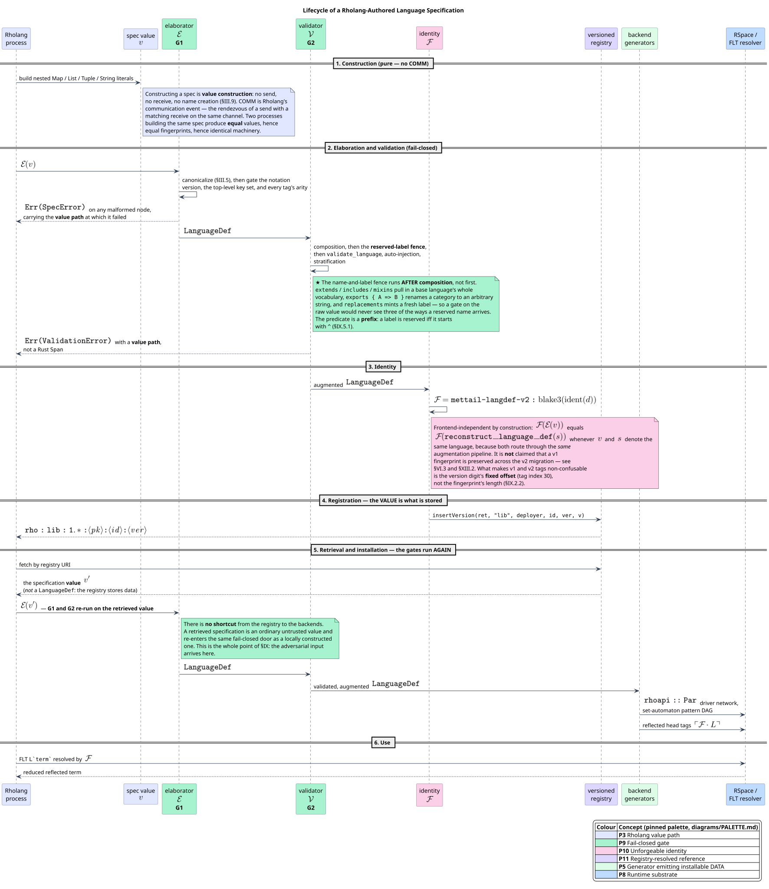
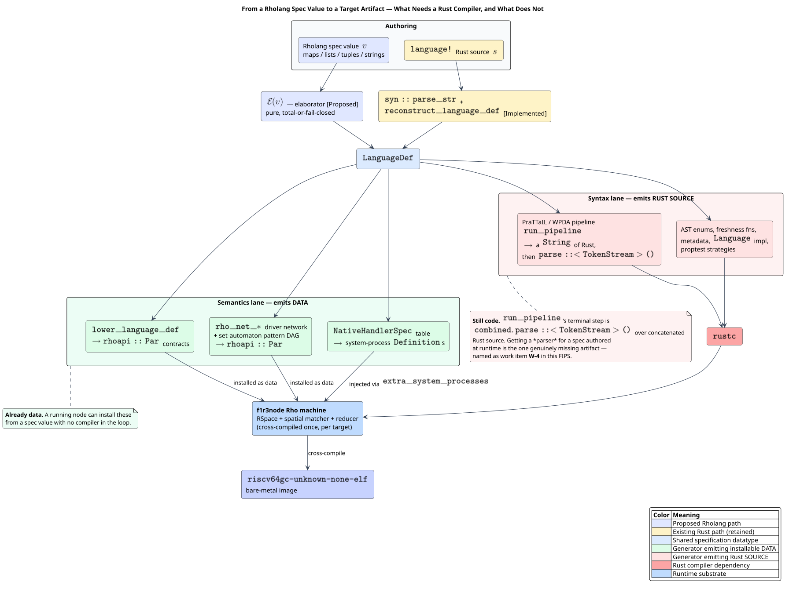
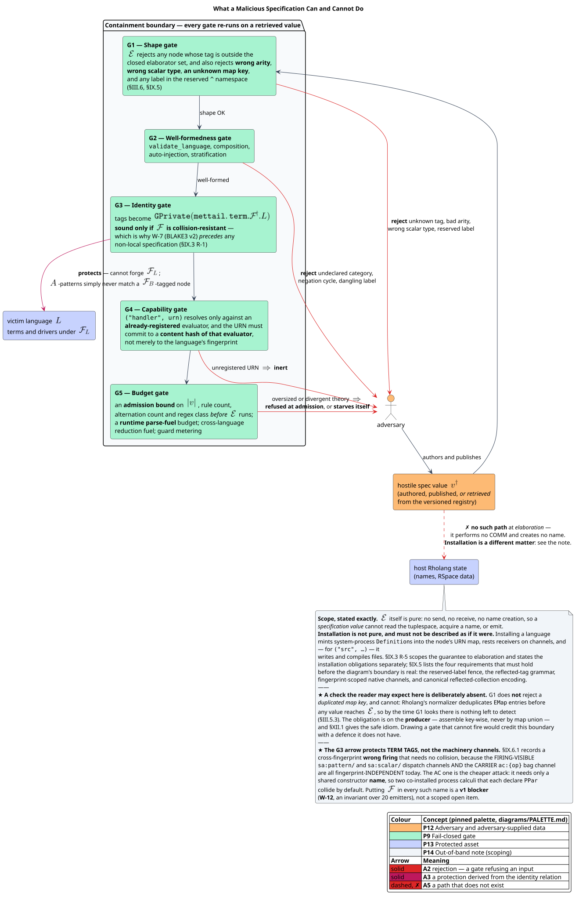

# MeTTaIL Language Specifications in Rholang

Dylon Edwards
2026-07-25
Status: Under Review

## Abstract

A MeTTaIL language is specified today by invoking a Rust procedural macro,
`language!`. This proposal specifies an **in-Rholang specification language**
for the same content, so that a language definition stops being Rust source
consumed by `rustc` and becomes an artifact a Rholang node can accept, carry,
version, and install.

The objective, in L. G. Meredith's and Michael Stay's framing of it:

> The Rholang interpreter needs to be able to accept **units of code to
> interpret**, namely collections of modules. In a module, language specs get
> defined, and **Foreign Language Terms can use those specs**. Whether that is
> implemented using Rust macros or not is an **implementation issue**. We need
> to move away from a required dependency on Rust.
> — Michael Stay, design discussion, 2026-07

Three properties follow, and they are the point of the change.

1. **A specification becomes data.** It can be built by a contract, sent on a
   channel, stored in the tuplespace, versioned in the registry, transformed by
   Rholang code, and matched with Rholang patterns. None of that is possible
   for a macro invocation.
2. **Rholang can specify the languages it embeds.** Rholang is itself a MeTTaIL
   language (`languages/src/rholang.rs`, at the time of writing still named
   `rhocalc.rs`; the language identifier is `RhoCalc`, and the rename is
   confirmed and queued). A Rholang program can therefore define a guest
   language and immediately reach it through the Foreign Language Term (FLT)
   surface.
3. **The Rust compiler leaves the specification-authoring critical path.** This
   is a necessary — though, as §VIII establishes honestly, not sufficient —
   precondition for a non-Rust target such as a bare-metal RISC-V (Reduced
   Instruction Set Computer, fifth generation) Rho machine.

The proposal rests on one premise, which §I **verifies rather than assumes**:
that `LanguageDef` is already the sole input to every backend generator. It
also builds on, rather than beside, two existing bodies of work: Michael Stay's
extender/presentation design, and its partial implementation on the
`mettail-rust` `modules` branch (Serhii and George), which this FIPS reads,
credits, and refines in §III.1.

The problem of native `![{ … }]` blocks — the one place a specification embeds
Rust — is resolved by the **`semantics` clause** of that design, and §V reports
that resolution rather than re-deriving it.

The acknowledged design inspiration for making specifications ordinary values
is Clojure's **code-is-data** tradition [Hickey 2020], itself descended from
McCarthy's S-expression [McCarthy 1960]. The notation proposed here is designed
to be idiomatic **Rholang**, not a transliteration of any other format.

**Novelty.** There is no prior specification of how an OSLF (Operational
Semantics in Logical Form) language presentation should be represented in
Rholang — not in the omnibus GSLT specification and not elsewhere. This FIPS is
the first.

## Status and Evidence

| Badge | Meaning |
| --- | --- |
| [Implemented] | Confirmed in `mettail-rust` on `main`, with file and symbol cited. |
| [Branch] | Implemented on the `mettail-rust` `modules` branch, not yet on `main`. |
| [Approved] | Defined by another approved FIPS and reused here. |
| [Proposed] | New behavior introduced by this FIPS. |

The layers carry different badges, and the distinction matters.

- The **specification seam** — `LanguageDef` as the sole backend input, and
  `reconstruct_language_def` as a runtime path from a stored string to a
  fingerprint-identical `LanguageDef` — is **[Implemented]**. §I.
- The **extender surface** — `module` / `extender` / `language` / `space`,
  `ExtenderExpr` with `semantics`, `context`, union, and the six content
  suffixes, plus assembly into a Neutral Theory Intermediate Representation
  (NTIR) and projection back to `language!` — is **[Branch]**
  (`mettail-spec/`). §III.1.
- The **capability seam** for native evaluation — a fingerprint-keyed Uniform
  Resource Name (URN) naming a registered evaluator, injected as a
  system-process `Definition` — is **[Implemented]**
  (`rholang-codegen/src/native_handler.rs`). §V.4.
- The **canonical value form**, its elaborator, its identity discipline, and
  the round-trip and parity obligations are **[Proposed]**. §III.3–III.8.
- The **serializable parse-table artifact** needed to obtain a *parser* for a
  runtime-authored language without invoking `rustc` is **[Proposed]** and is
  named as work item **W-4**. §VIII.

## Scope

**In scope.** The language-specification language itself: how `types`,
`literals`, `terms`, `equations`, `relations`, and `rewrites` — and the
extender algebra that combines them — are expressed without Rust, together
with identity, validation, FLT integration, security, and the backend
consequences.

**Explicitly out of scope for version 1.** The module system —
`module`, `import`, `export`, and `space` — is deliberately excluded. It is a
separate feature branch. §X states precisely how this design avoids foreclosing
it, and why the extender algebra is nonetheless *in* scope: an extender is a
function on presentations, and presentations are the thing being specified.

## Motivation

### Why a macro is the wrong sole frontend

`language!` is a good frontend, and nothing here proposes removing it. It gives
compile-time diagnostics with source spans, composes with Rust's module system,
and lets a specification embed Rust where Rust is genuinely the right answer.

But a macro invocation is *source text consumed by a compiler*, which forecloses
all three objectives above.

- **It is not a value.** A running node cannot construct, receive, or store one.
- **It requires `rustc` at authoring time.** Every new language is a rebuild of
  the node binary; a network cannot install a domain-specific language by deploy.
- **It is Rust-shaped by construction.** Identifiers are `syn::Ident`, carriers
  are `syn::Type`, evaluation blocks are `syn::Expr` — even where nothing
  Rust-specific is meant.

### Why Rholang's existing data structures

Rholang already has the literal forms a structured specification needs: maps
with arbitrary keys, lists, tuples, sets, strings, integers, and `Nil`. Reusing
them buys three things at once.

- **No second parser.** A specification value parses with the Rholang parser
  that already exists. A bespoke grammar for the *content* of a specification
  would be a second thing to write, test, version, and keep synchronized with
  the model it encodes.
- **Programmatic manipulation.** Rholang's `match` works on maps, lists, and
  tuples, so a contract can take a specification, add a rewrite rule, and hand
  back a new specification without a serialization round trip.
- **Composition with everything else.** Sends, receives, joins, guards,
  lookahead, and the registry already work on values.

This is the **code-is-data** discipline: when the artifacts a system must
manipulate are expressed in the system's own data notation, the manipulation
tooling is the language itself. §III applies that principle *in Rholang*,
judged by what reads naturally in Rholang.

## Terminology

Every symbol and abbreviation used later is defined here.

| Term | Definition |
| --- | --- |
| **`language!`** | The MeTTaIL procedural macro turning Rust tokens into a `LanguageDef` (`macros/src/lib.rs`). |
| **`LanguageDef`** | The parsed, composed, augmented specification record (`ast/src/language/model.rs`); the sole input to every backend generator. |
| **Presentation** | A language specification's content — types, literals, terms, equations, relations, rewrites — before it is named. The mathematical object $`(\Sigma, E, R)`$. |
| **Extender** | A function from presentations to a presentation. Declared `extender N(args) { ExtenderExpr }`. |
| **NTIR** | Neutral Theory Intermediate Representation — a named, hashed presentation (`mettail-spec/src/ntir.rs`, [Branch]). |
| **Spec value** | A Rholang value denoting a presentation or a whole specification, in the notation of §III.4. Written $`v`$. |
| **Elaborator** $`\mathcal{E}`$ | The partial function $`\mathcal{E} : \mathrm{RhoValue} \rightharpoonup \texttt{LanguageDef}`$. Fail-closed. |
| **Validator** $`\mathcal{V}`$ | `validate_language` plus composition, auto-injection, and stratification analysis. |
| **Fingerprint** $`\mathcal{F}`$ | `language_definition_fingerprint` — the versioned stable identity of an augmented `LanguageDef` (`ast/src/identity.rs`). |
| **Reflected tag** $`\ulcorner \mathcal{F} \cdot L \urcorner`$ | The unforgeable `GPrivate` naming constructor $`L`$ of the language with fingerprint $`\mathcal{F}`$; equals `GPrivate("mettail.term." + F + "." + L)`. |
| **PraTTaIL** | MeTTaIL's parser generator (Pratt parsing plus recursive descent over a weighted push-down automaton). |
| **WPDA** | Weighted Push-Down Automaton — the parser backend PraTTaIL emits. |
| **Dovetail** | MeTTaIL's substrate-neutral rewrite engine (e-graph, set automaton, weighted tree automata). |
| **FLT** | Foreign Language Term — a tagged, delimiter-bounded guest-language term embedded in a host process. |
| **GSLT** | Generalised Structured Language Theory — the triple $`(\Sigma, E, R)`$ a `language!` block presents. |
| **OSLF** | Operational Semantics in Logical Form — the framework that generates a language's logic from its rewrite theory. |
| **URN** | Uniform Resource Name — here, the `mtl:native:{fingerprint}:{label}` band naming a registered native evaluator. |
| **Island** | A tagged, delimiter-bounded foreign region inside a specification, e.g. ``` Rholang```…``` ``` ([Branch], `mettail-spec/src/island/`). |
| **Native block** | A `![ … ]` or `![{ … }]` region carrying an expression in the active `semantics` language. |
| **Fold / step** | The two evaluation modes for a native block: `fold` (constant folding only) and `step` (congruence-driven single steps). |
| **Carrier** | The native type backing a declared category, e.g. `i64` for `![i64] as Int`. |
| **Pure-declarative subset** | The subset of `language!` using no native block, no `literals{}` eval body, no `relations{}` rule body, and no theory type path. |

## Part I — The Decoupling Verdict

The whole proposal rests on one premise: that the backend generators are
already decoupled from the macro frontend and require only the specification.
This section verifies it and reports the qualification the verification turned
up.


PlantUML source: [diagrams/01-two-frontends.puml](diagrams/01-two-frontends.puml).

### I.1 What `language!` does, step by step

[Implemented] `macros/src/lib.rs` performs exactly this sequence, and nothing
else:

1. capture the verbatim body text into `definition_source_str`;
2. `parse_macro_input!(input as LanguageDef)` — Rust tokens to `LanguageDef`;
3. `registry::register_language` — store raw tokens for later composition;
4. `apply_extends`, `apply_includes`, `apply_mixins` — composition;
5. `validate_language` — well-formedness;
6. `emit_auto_injection_rules` — append synthetic cast and congruence rules;
7. `logic::stratification::analyze` — reject negation cycles;
8. call the generators.

Steps 3–7 live in `mettail-ast`, not the macro crate, and all operate on
`&mut LanguageDef`. Step 2 is the only step that consumes Rust tokens.
Everything after it is frontend-agnostic by construction.

### I.2 Every generator takes `&LanguageDef` and nothing else

[Implemented] The generator calls in `macros/src/lib.rs`, with their inputs:

| Generator | Call | Extra input beyond `&LanguageDef` |
| --- | --- | --- |
| AST types + WFST analysis | `generate_all(&language_def)` | none |
| Freshness functions | `generate_freshness_functions(&language_def)` | none |
| Metadata | `generate_metadata(&language_def, &definition_source_str)` | **the verbatim source string** |
| `Language` impl | `generate_language_impl(&language_def)` | none |
| WPDA parser engine | `generate_wpda_engine_module(&language_def)` | none |
| Test file | `write_test_file(&language_def, &pipeline_analysis)` | analysis derived from `&language_def` |
| Simulator binary | `write_simulation_binary_if_enabled(&language_def)` | none |
| Blockly | `generate_blockly_definitions(&language_def)` | none |
| Proptest strategies | `generate_public_strategies(&language_def)` | none |

The rho-native and Dovetail backends are reached the same way and are cleaner
still, because they are reachable **at runtime**:

- `lower_language_def(&LanguageDef) -> RhoLowering` (`rholang-codegen/src/lower.rs`);
- `plan_rho_default_backend(&LanguageDef, requirements)` (`rholang-codegen/src/backend.rs`);
- `derive_guard_qualities(&LanguageDef)` (`rholang-codegen/src/guard_quality.rs`).

PraTTaIL is decoupled one step further. It never sees `LanguageDef`:
`macros/src/gen/syntax/parser/prattail_bridge.rs::language_def_to_spec` projects
it into `mettail_prattail::LanguageSpec`, whose documentation states the
contract outright — *"All `syn` types are resolved to plain strings so the
pipeline crate has zero dependency on `syn`."* The same file records that
`RuleSpec`'s `rust_code` field *"is intentionally not copied — it is never used
by the recursive descent handler generator."*

### I.3 The seam is already exercised without the macro — twice

[Implemented] The strongest evidence is not the call graph but the fact that the
seam is *already used from non-macro callers*. `ast/src/auto_inject.rs` exposes

```rust
pub fn reconstruct_language_def(raw_source: &str) -> syn::Result<LanguageDef>
```

which parses a stored source string, replays composition and auto-injection,
and yields a `LanguageDef` that fingerprints identically to the macro-time one.
`repl/src/rho_backends.rs::planned_rho_backend_for` and
`repl/src/bin/flt_demo.rs::lambda_backend` both do exactly this:

```text
LanguageMetadata::definition_source()   -- a &'static str
  |> reconstruct_language_def           -- LanguageDef
  |> lower_language_def                 -- rhoapi::Par program
  |> plan_rho_default_backend           -- PlannedRhoBackend, installed on a real RSpace
```

[Branch] The second exercise is `mettail-spec`, which assembles a presentation
from `.rho` extender declarations and reaches the same seam through
`Ntir::to_language_def()` →
`mettail_ast::fragments::language_def_from_parts(name, types, literals, terms, equations, rewrites, logic)`.
No proc-macro is in either path.

This FIPS replaces the *first* arrow — source-string in, `LanguageDef` out —
with an implementation that takes a Rholang value instead. Everything
downstream is untouched.

### I.4 Where Rust actually leaks in — an exhaustive account

The decoupling is clean as a *dataflow* seam. It is not clean as a *datatype*:
`LanguageDef` is spelled in `syn` types. An exhaustive sweep of the
specification model — `ast/src/{language/model,grammar,types,pattern,fragment,compose}.rs` —
for fields typed `Option<syn::Type>`, `syn::Expr`, or `proc_macro2::TokenStream`
returns **exactly six hits, of which five are specification fields**:

| # | Field | Type | What it holds | Is it *code*? |
| --- | --- | --- | --- | --- |
| $`\bigstar_1`$ | `LangType::native_type` | `Option<syn::Type>` | the carrier of `![i64] as Int` | No — a type **name** |
| $`\bigstar_2`$ | `GrammarRule::rust_code` | `Option<RustCodeBlock>` (`syn::Expr`) | the `![a + b]` fold body | **Yes** |
| $`\bigstar_3`$ | `TokenDef::rust_code` | `Option<TokenStream>` | the `literals{}` `eval:` block | **Yes** |
| $`\bigstar_4`$ | `LogicBlock::content` | `TokenStream` | verbatim Datalog rules with host bodies | **Yes** |
| $`\bigstar_5`$ | `TheoryRegistration::theory_type` | `syn::Type` | e.g. `PresburgerAlgebra` | No — a type **name** |
| — | `VariableBinding::expression` | `TokenStream` | codegen **output**, in `AscentClauses` | Not a spec field |

Everything else is `Ident` (a name), `String`, a numeric, a `bool`, or a closed
enum. That shortness is what makes this proposal tractable.


PlantUML source: [diagrams/02-langdef-anatomy.puml](diagrams/02-langdef-anatomy.puml).

Two further Rust-shaped couplings are real even though they are not spec fields.

- **`ValidationError` carries `proc_macro2::Span`.** All nineteen variants in
  `ast/src/validation/error.rs` do, and `ValidationError::span()` is how the
  macro produces a source-located diagnostic. §III.6 specifies the replacement.
- **`LanguageDef::name` is a `syn::Ident`.** A specification's name must
  therefore be a legal Rust identifier — a validation rule, not a silent
  truncation.

### I.5 The load-bearing surprise: the Rholang backend never reads the native body

[Implemented] The rho-native lowering does **not** consult `rust_code` for its
semantics. `rholang-codegen/src/lower.rs::lower_rule` reads the rule's *syntax
pattern*, extracts the operator terminal, and maps it through

```rust
fn rho_binop(terminal: &str, lhs: RhoScalarType, rhs: RhoScalarType, result: RhoScalarType)
    -> Option<RhoBinaryOp>
```

with arms such as `("+", Int, Int) => RhoBinaryOp::Add` and
`("and", Bool, Bool) => RhoBinaryOp::And`. The Rust expression `![a + b]` is
never inspected.

Across the whole of `rholang-codegen`, `rust_code` appears in exactly three
places, and in all three it is a **boolean flag**, never an expression:

| Site | Use |
| --- | --- |
| `rho_net.rs:971` `term_requires_native_system_process` | `term.rust_code.is_some()` — route to a native system process |
| `backend.rs:825` `classify_rejected_rule` | `rule.rust_code.is_some()` — classify the rejection reason |
| `rho_net_subst_trs.rs:1131` `object_congruence_constructors` | `term.rust_code.is_some()` — skip scalar constructors in the substitution traversal |

On the path this FIPS most cares about — the Rholang backend, and therefore the
bare-metal one — the native block is already surplus for operator rules and a
mere presence flag for the rest.

### I.6 Verdict

**The decoupling is complete as a dataflow seam and partial as a datatype.**

- Every backend generator's sole semantic input is `LanguageDef`. **Verified.**
- The seam is already exercised from two non-macro callers —
  `reconstruct_language_def` on `main` and `Ntir::to_language_def` on the
  `modules` branch. **Verified.**
- PraTTaIL is decoupled twice over, through a `syn`-free projection. **Verified.**
- The rho-native backend never reads a native block's contents. **Verified.**
- `LanguageDef` nonetheless carries Rust in exactly five specification fields,
  three of which are executable code. **This is the qualification**, and §V is
  its resolution.
- Diagnostics are `Span`-based and the name must be a Rust identifier. **Two
  named work items**, W-2 and W-3.

So this FIPS proposes a second producer over an existing clean seam. It does
not need to restructure the backends. It needs to answer one question honestly —
what a Rholang-authored specification puts where a Rust expression used to be —
and to add one artifact: a parse table that is data rather than source.

## Part II — A Tag Names a Handler

One structural observation shapes every choice that follows.

### II.1 The observation

MeTTaIL already has a construct in which **a tag names a handler that
interprets the following element**: the Foreign Language Term. In
`` lam`App(f, K)` ``, the tag `lam` selects a registered guest grammar and
reflector, and that handler interprets the delimiter-bounded body. The FLT FIPS
makes the resolution fingerprint-keyed: a guest constructor $`L`$ of a language
with fingerprint $`\mathcal{F}`$ reflects under the head tag

```math
\ulcorner \mathcal{F} \cdot L \urcorner \;=\; \texttt{GPrivate}\bigl(\texttt{"mettail.term."} \Vert\, \mathcal{F} \,\Vert\, \texttt{"."} \,\Vert\, L\bigr),
```

where $`\Vert`$ is string concatenation. This is `reflect_tag` in
`rholang-codegen/src/rho_net_lower.rs`, and `REFLECTED_TERM_ABI_PREFIX` is the
single constant that both the emitter and the runtime decoder key on.

[Branch] The same discipline has **already been applied one level down**, inside
the specification surface, by the `modules` branch's *islands*:

```text
export extender ProcExt() {
  Rholang```
    let x = 1;
    for y <- ch { !y }
  ```
  semantics Rust
}
```

Here `Rholang` is a tag naming a registered island plugin
(`mettail-spec/src/island/plugins/{rust,rholang_proc}.rs`, dispatched through
`island::registry`) that interprets the triple-backtick body. That is the FLT
mechanism, at specification-authoring time, already built.

The value notation of §III.4 uses the same discipline a third time: a
specification node is a tuple whose first component is a tag string, and the tag
selects an elaborator arm that interprets the remaining components. All three
share the resolution rule

```math
\tau \cdot e \;\longmapsto\; H(\tau)(e),
```

read "the tag $`\tau`$ applied to the element $`e`$ resolves to the handler
$`H(\tau)`$ applied to $`e`$."


PlantUML source: [diagrams/03-tag-names-a-handler.puml](diagrams/03-tag-names-a-handler.puml).

### II.2 What the correspondence buys, and where it stops

It buys two things that are not decorative.

- **One resolution story, one registry.** A specification *installs* the very
  tags that FLTs later resolve. The registration path (§VI) and the FLT
  resolver path (§VII) are the same path; there is no translation layer between
  how a language is named when defined and how it is named when used.
- **Unforgeable, not conventional, namespacing.** Naming schemes that rely on
  convention can be squatted; a `GPrivate` derived from the fingerprint cannot.
  The consequence, established in the FLT FIPS, is that a mismatch is always a
  *non*-firing and never a *wrong* firing.

It stops in one place, and the difference is worth stating rather than papering
over: **an FLT tag and an island tag interpret raw source text; a value tag
interprets an already-parsed value.** The first two are reader-level constructs
and inherit the modal-lexer delimiter obligations catalogued in the FLT FIPS —
fence run lengths, heredoc words, escape tracking. The value notation inherits
none of them, because Rholang's parser has produced the value before any tag is
examined. The shared content is the resolution discipline, not the syntax.

### II.3 Consequence for extensibility

The practical payoff is that **adding a MeTTaIL feature adds a tag, not a
keyword**. Where `language!` has grown blocks and modifiers — `literals`,
`tokens`, `guards`, `sync`, `tree_invariants`, `connectives`, `theories`,
`channels` — the value notation grows one admissible tag in one elaborator arm,
with no change to the Rholang grammar and no change to how a specification is
transported, stored, or matched.

## Part III — The In-Rholang Specification Language

### III.1 Prior art, credited and read

Two bodies of work precede this FIPS and are its foundation.

**Michael Stay's extender design.** A language specification is a
**presentation**, and an **extender** is a *function from presentations to a
presentation* — not a functor, pending a morphism-level story for GSLT
composition. An extender body is a left-associative chain of block modifiers
over a base presentation. The mockup:

```text
export extender MyExtender(arg1, arg2) {
  { arg1 \/ arg2 }          // a base presentation, modified by what follows
    semantics M1.Go         // optional; defaults to Rust
    types { … } terms { … } literals { … }
    equations { … } relations { … }
    rewrites { … }
}
export language fooLang = MyExtender(Module1.bar, M2.Nested.SomeExtender(…))
```

with `\/` extender union, and — for parity purposes — **`relations` as the new
name for `logic`**.

**The `mettail-rust` `modules` branch** (Serhii and George) implements a
substantial part of it as `mettail-spec`, the "MeTTaIL Unified Specification
(MUS) compiler for `.rho` module files." What it actually built, established by
reading the branch rather than by inference:

| Component | File | What it does |
| --- | --- | --- |
| Surface AST | `src/surface.rs` | `SurfaceFile`, `Module`, `ExtenderDecl`, `LanguageDecl`, `SpaceDecl`, `ExtenderExpr`, `LanguageExpr`, `IslandToken`, `ContextTemplate` |
| Parser | `src/parser.rs` | hand-written; `import` / `module` / `export` / `extender` / `language` / `space`; precedence-climbing `ExtenderExpr` |
| Suffix kinds | `src/surface.rs` | `Types`, `Terms`, `Literals`, `Equations`, **`Relations`**, `Rewrites`, `Exports`, `Replacements` |
| Fragment parsing | `mettail-ast/src/fragments.rs` | `parse_{types,terms,literals,equations,rewrites,logic,relations}_fragment` — wraps a brace body in its keyword and calls the **existing** `mettail-ast` parser |
| Resolution | `src/resolve.rs` | import graph, cycles forbidden |
| Assembly | `src/assemble.rs` | extender application, right-biased union merge, strict conflict policy on overlapping term labels |
| NTIR | `src/ntir.rs` | named, hashed presentation; `to_language_def()` reaches the seam |
| Islands | `src/island/` | tag-dispatched foreign regions with a plugin registry |
| Semantics | `src/ntir.rs`, `src/semantics.rs` | `SemanticsTarget { Rust, Unknown }`; Rust projection refuses anything but `Rust` |
| Projection | `src/project/rust.rs` | emits a `language!` body and writes `.rs`; `languages/build.rs` generates `MyCalc` from `specs/mycalc/*.rho` |
| Parity | `src/parity.rs`, `tests/parity_test.rs` | diffs a projected language against a monolithic `language!` snapshot |

Two observations about that branch matter for this FIPS.

1. **The seam verification of §I holds there too.** `Ntir` stores
   `Vec<LangType>`, `Vec<GrammarRule>`, `Vec<Equation>`, `Vec<RewriteRule>`,
   `Option<LogicBlock>` — the *same* `mettail-ast` types — and reaches
   `LanguageDef` directly. Nothing was re-modelled.
2. **The block bodies are still Rust token streams.** `ExtenderExpr::Suffix`
   carries `tokens: TokenStream` *and* `raw: String`, and the fragment parsers
   are `syn`-based. So the branch removes the *macro invocation* from the
   authoring surface but does not remove the `syn` dependency from the
   specification *content*, and today's terminal step is still emitting
   `language!` source for `rustc` to expand. That is a correct and deliberate
   bootstrap, and it is exactly the remaining gap this FIPS closes.

### III.2 Three layers, and what this FIPS adds

Separating the surface from the content resolves what would otherwise look like
a conflict between "a bespoke `.rho` grammar" and "a specification is a Rholang
value." They are different layers.

| Layer | What it is | Status | Owner |
| --- | --- | --- | --- |
| **L0 — authoring surface** | `extender` / `language` declarations; `ExtenderExpr` with `semantics`, `context`, union, call, and the six content suffixes | [Branch], refined in §III.3 | Stay; `modules` branch |
| **L1 — presentation content** | what goes *inside* `types { … }`, `terms { … }`, and the rest | **[Proposed]**: a canonical Rholang **value**, alongside the existing DDL-text encoding | this FIPS, §III.4 |
| **L2 — the seam** | `LanguageDef`, and every backend below it | [Implemented], unchanged | `mettail-ast` |

The content of a presentation therefore has **two admissible encodings**, and
both elaborate to the same L2 object:

```math
\underbrace{\mathrm{parse\_ddl}}_{\texttt{TokenStream} \to \mathrm{Presentation}} \qquad\text{and}\qquad \underbrace{\mathcal{E}_{\mathrm{pres}}}_{\mathrm{RhoValue} \to \mathrm{Presentation}}
```

with the **encoding-parity obligation** that they agree, for every shipped
language, through the encoder $`\mathsf{enc}`$ of §III.4:

```math
\mathcal{E}_{\mathrm{pres}}\bigl(\mathsf{enc}(\mathrm{parse\_ddl}(t))\bigr) \;=\; \mathrm{parse\_ddl}(t).
```

This is not a new kind of test: it is `mettail-spec/src/parity.rs` extended with
one more encoding.

**Why keep both.** The DDL-text encoding is the bootstrap: it is already
written, it reuses the macro's own parsers, and it makes the parity argument
trivial. The value encoding is the destination: it is what can be sent on a
channel, stored in the registry, matched by a contract, and elaborated without
`syn`. Michael Stay's answer to whether the frontend should be a macro
preprocessor or new Rholang syntax was *"Both"* — and this is the disciplined
reading of that answer: both encodings, one presentation, one identity.


PlantUML source: [diagrams/08-three-layers.puml](diagrams/08-three-layers.puml).

### III.3 L0 — the extender surface

This FIPS adopts the surface below. It is Stay's grammar as implemented on the
`modules` branch, with the module spine elided per §Scope and two refinements
marked ★.

```ebnf
(* Declarations. The module spine — File, Module, Import, export — is
   OUT OF SCOPE for version 1 and is shown only where an extender must nest. *)

ExtenderDecl    ::= "extender" Ident "(" [ExtenderArg {"," ExtenderArg}] ")"
                    "{" ExtenderExpr "}" ;
ExtenderArg     ::= Ident ;

LanguageDecl    ::= "language" Ident "=" LanguageExpr ;

LanguageExpr    ::= PathElement {"." PathElement}
                    [ "(" LanguageExpr {"," LanguageExpr} ")" ] ;
PathElement     ::= Ident ;

(* Extender bodies: a base presentation, then a left-associative chain of
   modifiers. *)

ExtenderExpr    ::= ExtenderExpr "\/" ExtenderExpr        (* union *)
                  | "{" ExtenderExpr "}"
                  | ExtenderExpr "types"        Content
                  | ExtenderExpr "literals"     Content
                  | ExtenderExpr "terms"        Content
                  | ExtenderExpr "equations"    Content
                  | ExtenderExpr "relations"    Content    (* was: logic *)
                  | ExtenderExpr "rewrites"     Content
                  | ExtenderExpr "exports"      Content    (* category renaming *)
                  | ExtenderExpr "replacements" Content    (* conflict resolution *)
                  | ExtenderExpr "semantics" LanguageExpr
                  | "context" "{" String "}"
                  | "empty"
                  | Ident [ "(" ExtenderExpr {"," ExtenderExpr} ")" ] ;

(* ★ Refinement 1: a block body has two admissible encodings. *)
Content         ::= "{" DdlText "}"        (* bootstrap: today's DDL text *)
                  | "=" RhoValue ;         (* proposed: a canonical value, III.4 *)

(* ★ Refinement 2: the FLT/island tag form is stated once and shared. *)
Island          ::= Ident "`" Body "`" | Ident "```" Body "```" ;
```

The reading of each construct:

- **`empty`** is the empty presentation, the unit of union.
- **union `\/`** merges two presentations. The branch implements it
  right-biased with a **strict conflict policy**: overlapping term labels are an
  error unless resolved by a `replacements { … }` block
  (`assemble.rs::ensure_no_unresolved_term_conflicts`). This FIPS keeps that
  policy — silent shadowing of a constructor would silently change a
  fingerprint.
- **`semantics LanguageExpr`** names the language in which this extender's
  native `![ … ]` blocks are written. §V.
- **`context { String }`** is a host preamble for generated code, with a single
  `INSERT_HERE` marker where the assembled body is spliced
  (`semantics.rs::insert_at_marker`; more than one marker is an error). It is a
  **backend artifact**, not part of the presentation, and §III.7 excludes it
  from the fingerprint accordingly.
- **`exports { A => B }`** renames categories on the way out of an extender.
- **A bare `Ident`** is a base or a call — extender application, with the actual
  argument presentation substituted into the body at assembly time.

**Refinement 1** is the whole of this FIPS's change to L0: `Content` gains a
second form. `types { … }` keeps working; `types = <value>` is the Rust-free
alternative. Everything else in the surface is unchanged.

### III.4 L1 — the canonical value form

#### III.4.1 Which Rholang shape carries which meaning

The notation uses five Rholang literal forms, each for exactly one job, so that
a reader can tell what kind of thing a node is from its brackets.

| Rholang form | Role | Why this form |
| --- | --- | --- |
| Map `{"k": v, …}` | **Record** — a declaration with named, optional, extensible fields | Named keys survive schema growth; an absent key is the natural encoding of `Option<…>` |
| List `[a, b, c]` | **Ordered sequence** — where order is semantically load-bearing | Every sequence in `LanguageDef` is a `Vec`, and declaration order fixes binding power |
| Tuple `(tag, x, …)` | **Tagged node** — a variant of a sum type | Fixed arity, `match`-friendly, visually distinct from a sequence |
| String `"…"` | **Name or terminal** — label, category, parameter, grammar terminal, regex | All `Ident` or `String` in the model |
| Integer / Boolean / `Nil` | **Scalar** — binding power, priority, flag, explicit absence | Direct correspondence |

Two choices deserve their reasons stated.

**Sets are deliberately not used.** Nothing in a presentation is a mathematical
set: `types`, `terms`, `equations`, `rewrites`, `token_defs`, `mode_defs`, and
every syntax pattern are `Vec`s whose order is consulted. Declaration order
fixes infix binding power, the prefix binding-power fallback
(`max_infix_bp + 2`), lexer maximal-munch tie-breaking, and — as
`languages/src/rhocalc.rs` documents at length in its "Divergence I" note — the
carrier a numeral binds to. Encoding an ordered sequence as a set would destroy
information the fingerprint must preserve. `options` is the sole genuinely
unordered member, and it is a map already.

**Tuples distinguish tagged nodes from sequences.** In a presentation the two
nest constantly: a syntax pattern is a *sequence* of *tagged* items. Writing
both as lists makes `[[…], […]]` illegible; `[( … ), ( … )]` is immediate.

> **Dependency, stated plainly.** Official Rholang has tuples
> (`tuple ::= "(" proc ",)" | "(" proc {"," proc} ")"` in the tree-sitter
> grammar), but MeTTaIL's own Rholang specification does **not** — the
> convergence backlog records "RhoCalc has no tuple category at all" as item
> **B4**, blocked on the `(a, b)` versus grouping-`(a)` ambiguity. Adding
> tuples to `languages/src/rholang.rs` is a **v1 prerequisite**, tracked as
> work item **W-1**, and is justified on its own merits: official Rholang has
> tuples and MeTTaIL should converge with it regardless of this FIPS. If W-1
> slips, a list-only encoding profile is a mechanical fallback (§XII), at the
> cost of legibility only.

#### III.4.2 The grammar of the value form

Below, $`\mathrm{Str}`$ ranges over Rholang strings and $`\mathrm{Int}`$ over
integers. A trailing `?` marks an optional map key. Every tag is a lower-case
string; user-supplied names are written as given.

**A whole specification.**

```text
Spec ::= { "mettail"  : "language/1"       -- notation version, required
         , "name"     : Str                -- a legal Rust identifier
         , "options"? : { Str : Scalar, … }
         , "semantics"?: Str | ("path", [Str, …])   -- §V; default "Rust"
         , "types"?   : [ TypeDecl, … ]
         , "literals"?: [ LiteralDecl, … ]
         , "tokens"?  : [ TokenDecl, … ]
         , "modes"?   : [ ModeDecl, … ]
         , "sync"?    : [ SyncDecl, … ]
         , "tree_invariants"? : [ TreeInvariant, … ]
         , "guards"?  : GuardConfig
         , "terms"?   : [ TermRule, … ]
         , "equations"?: [ Equation, … ]
         , "rewrites"?: [ Rewrite, … ]
         , "relations"?: [ RelationDecl, … ]
         , "extends"? : [ Str, … ]  , "includes"? : [ Str, … ]
         , "mixins"?  : [ Str, … ]
         , "exports"? : [ (Str, Str), … ]  -- category renaming, A => B
         , "replacements"? : [ Replacement, … ]  -- union conflict resolution
         , "context"? : Str                -- host preamble; backend-only,
                                           --   excluded from the fingerprint
         , "doc"?     : Str                -- excluded from the fingerprint
         }
```

A **presentation fragment** — the value form of one `Content` block — is the
same map restricted to the block's own key, so `types = [ … ]` and
`types { … }` carry identical information.

The `"mettail"` key is mandatory. It is what lets the elaborator reject a value
that is merely map-shaped, and what lets a future `"language/2"` coexist.

**Types and carriers.**

```text
TypeDecl   ::= Str                                   -- a structural category
             | { "name"      : Str
               , "carrier"?  : Carrier
               , "collection"? : CollectionDecl
               , "refine"?   : { "var": Str, "base": Str, "pred": Pred } }

Carrier    ::= "i8"|"i16"|"i32"|"i64"|"i128"|"isize"
             | "u8"|"u16"|"u32"|"u64"|"u128"|"usize"
             | "f32"|"f64"|"bool"|"str"|"String"
             | "BigInt"|"BigRat"|"Fixed"
             | ("vec", Str) | ("bag", Str) | ("set", Str)
             | ("map", Str, Str) | ("pathmap", Str, Str)
             | ("extern", Str)                        -- a registered opaque carrier

CollectionDecl ::= { "kind" : "list"|"bag"|"map"|"set"|"pathmap"
                   , "open"? : Str , "close"? : Str
                   , "sep"?  : Str , "key_val_sep"? : Str }
```

The `Carrier` alphabet is not invented here: it is exactly `NativeKind`
(`ast/src/language/model.rs`), the implementation's own typed classification of
a category's native type, with `from_syn_type` as the single string-to-enum
gateway. Encoding the carrier as a *closed alphabet* rather than a Rust type
path is what removes $`\bigstar_1`$.

**Term rules.**

```text
TermRule ::= { "label"    : Str
             , "category" : Str
             , "context"? : [ Param, … ]        -- judgement form
             , "syntax"?  : [ SyntaxItem, … ]
             , "items"?   : [ BnfItem, … ]      -- BNF form; exclusive with the above
             , "eval"?    : NativeEval          -- §V
             , "mode"?    : "fold" | "step"
             , "assoc"?   : "left" | "right"
             , "prefix_bp"? : Int
             , "tier"?    : { "tier": "t1"|"t2"|"t3"|"t4"
                            , "bound"?: Int, "force"?: Bool }
             , "doc"?     : Str }

Param      ::= ("param",   Str, TypeExpr)          -- n : Name
             | ("binder",  Str, Str, TypeExpr)     -- ^x.p : [A -> B]
             | ("binders", Str, Str, TypeExpr)     -- ^[xs].p : [A* -> B]
             | ("guard",   Str)                    -- ?g : Guard
             | ("optional", [ Param, … ])          -- #opt( … )

TypeExpr   ::= Str                                 -- a base category
             | ("arrow", TypeExpr, TypeExpr)       -- [A -> B]
             | ("multi", TypeExpr)                 -- A*
             | ("vec", TypeExpr) | ("bag", TypeExpr) | ("set", TypeExpr)
             | ("map", TypeExpr, TypeExpr)

SyntaxItem ::= Str                                 -- a parameter reference
             | ("lit", Str)                        -- a quoted terminal
             | ("sep", Str, Str)                   -- xs.*sep("|")
             | ("zip", Str, Str)                   -- *zip(a, b)
             | ("map", SyntaxItem, [Str,…], [SyntaxItem,…])
             | ("opt", [ SyntaxItem, … ])          -- #opt( … )
             | ("tok", Str, Str | Nil)             -- a declared token kind
             | ("flt", Str, Str, Str)              -- *flt(bind, open, close)

BnfItem    ::= ("lit", Str) | ("nt", Str) | ("bind", Str)
             | ("coll", Str, Str, Str, Str | Nil, Str | Nil)
```

A bare `Str` in `SyntaxItem` position is a parameter reference, mirroring
`language!`, where a bare identifier in a syntax pattern is a parameter and a
quoted string is a terminal. The notation preserves that reading and inverts
the quoting: what is quoted in `language!` is *tagged* here.

**Patterns, equations, rewrites.** This is where the notation is most faithful,
because `language!`'s pattern syntax is already an S-expression —
`(App (Lam fun) arg)` — so the translation is the identity modulo commas.

```text
Pattern ::= Str                                    -- a metavariable
          | (Str, Pattern, …)                      -- a constructor application
          | ("eval", Pattern, Pattern)             -- (eval f a); the reserved head
          | ("eval", Pattern, Str, Pattern)        -- legacy 3-argument form
          | ("^",  Str, Pattern)                   -- ^x.body
          | ("^*", [ Str, … ], Pattern)            -- ^[xs].body
          | ("coll", [ Pattern, … ], Str | Nil)    -- {P, Q, ...rest}
          | ("coll_typed", Str, [ Pattern, … ], Str | Nil)
          | ("pmap", Pattern, [ Str, … ], Pattern) -- xs.*map(|x| body)
          | ("pzip", Pattern, Pattern)             -- *zip(a, b)

Equation ::= { "name": Str, "premises"?: [Premise,…]
             , "context"?: [("typed", Str, TypeExpr), …]
             , "left": Pattern, "right": Pattern }
Rewrite  ::= (as Equation)

Premise  ::= ("fresh", Str, Str)              -- x # P
           | ("fresh_rest", Str, Str)         -- x # ...rest
           | ("~>", Str, Str)                 -- S ~> T (rewrites only)
           | ("rel", Str, [ Str, … ])         -- env_var(x, v)
           | ("forall", Str, Str, Premise)    -- xs.*map(|x| premise)
           | ("guard", Pred)                  -- a behavioral predicate, §VII.3
```

The reserved constructor head is exactly `eval` — verified against
`ast/src/language/parse.rs::parse_pattern`, whose only special-cased head is
`eval`, with `subst` and `multisubst` reached through its two- and
three-argument forms. Validation rejects a user constructor labelled `eval`,
the same restriction `language!` already imposes.

**The remaining blocks.**

```text
LiteralDecl ::= { "category": Str, "pattern": Str, "eval": NativeEval }
TokenDecl   ::= { "name": Str, "pattern": Str, "category"?: Str
                , "eval"?: NativeEval, "priority"?: Int
                , "push"?: Str, "pop"?: Bool, "stream"?: Str }
ModeDecl    ::= { "name": Str, "raw"?: Bool, "tokens": [TokenDecl, …] }
SyncDecl    ::= ("align", Str, Str, Str) | ("track", Str, Str)
RelationDecl ::= { "relation": Str, "params": [Str, …], "doc"?: Str
                 , "rules"?: [ Rule, … ] }        -- §V.5
GuardConfig ::= { "predicates"?  : [ BuiltinPredicate, … ]
                , "connectives"? : [ {"role": Str, "keywords": [Str,…]}, … ]
                , "theories"?    : [ {"name": Str, "theory": Str
                                     , "for"?: [Str,…]}, … ]
                , "channels"?    : { "channel"?: [Str,…]
                                   , "join"?: [ {"label": Str
                                                , "params": [(Str,Str),…]}, … ] } }
```

`"theory"` names a **registered theory implementation**, not a Rust type path —
the second place ($`\bigstar_5`$) where a closed registry replaces a `syn::Type`.

### III.5 Canonicalization

Two values may denote the same presentation while differing in map key order or
in whether an optional key is present-with-default. A value is **canonical**
when:

1. every map's keys are sorted by Unicode code point;
2. no key is present with a value equal to the model default;
3. every base type expression is a bare `Str`, never a redundant tag;
4. `"doc"` and `"context"` appear only where the model records them.

`canonicalize` is total on admissible values, idempotent, and preserves
elaboration:

```math
\mathcal{E}(\mathrm{canon}(v)) = \mathcal{E}(v), \qquad \mathrm{canon}(\mathrm{canon}(v)) = \mathrm{canon}(v).
```

This mirrors, one layer earlier, what `write_language` in `ast/src/identity.rs`
already does when it sorts `options` before hashing.

### III.6 Elaboration

The elaborator is presented in literate form: a root fragment names the phases,
each phase is defined and explained beneath it. Throughout, $`v`$ is the
candidate value and $`\pi`$ is a **value path** — a list of map keys, list
indices, and tuple positions locating a node inside $`v`$, e.g.
`["terms", 3, "context", 0, 2]`.

```text
⟨Elaborate a Rholang specification value⟩ ≡
  ⟨Gate the notation version⟩
  ⟨Decode the declaration blocks in model order⟩
  ⟨Replay the macro's post-parse pipeline⟩
  ⟨Compute the identity⟩
  return (LanguageDef, fingerprint)
```

The first fragment is the fail-closed door. It refuses anything not explicitly
in this notation, which is what stops an arbitrary Rholang map from being
mistaken for a language.

```text
⟨Gate the notation version⟩ ≡
  require v is a Map                        else Err(NotASpec,        π = [])
  require v["mettail"] = "language/1"       else Err(UnknownNotation, π = ["mettail"])
  require v["name"] matches [A-Za-z_][A-Za-z0-9_]*
                                            else Err(BadName,         π = ["name"])
  require every key of v ∈ KnownTopLevelKeys
                                            else Err(UnknownKey k,    π = [k])
```

The second fragment walks the blocks in the order `LanguageDef`'s own parser
walks them, so cross-block checks the parser performs at parse time — that
every `literals{}` category was declared in `types{}`, that no token is
duplicated by `(name, pattern)` across `literals{}` and `tokens{}` — happen
here at the same point and produce the same diagnostics.

```text
⟨Decode the declaration blocks in model order⟩ ≡
  options    ← decode_options(v["options"])            -- closed key set, §IV.2
  extends, includes, mixins ← decode_name_lists(v)
  types, refinements        ← decode_types(v["types"])
  literals   ← decode_literals(v["literals"], types)   -- map each to its Token family
  tokens, modes, sync, tree ← decode_tokens(v)
  guards     ← decode_guards(v["guards"])
  terms      ← decode_terms(v["terms"], guards.connectives)
  equations  ← decode_equations(v["equations"])
  rewrites   ← decode_rewrites(v["rewrites"])
  relations  ← decode_relations(v["relations"])
  reclassify_token_kinds(terms, declared_kinds(tokens, modes))
```

Every `decode_*` is a total function into `Result<_, SpecError>`, and every
failure carries the value path at which it occurred. There is no partial
success: a specification elaborates completely or not at all.

The third fragment is verbatim the macro's own post-parse pipeline, reached
through the *same* `mettail-ast` entry points, so a Rholang-authored
specification and a Rust-authored one converge on byte-identical augmented
definitions.

```text
⟨Replay the macro's post-parse pipeline⟩ ≡
  apply_extends(def) ; apply_includes(def) ; apply_mixins(def)
  validate_language(def)                        -- ast/src/validation
  aug ← emit_auto_injection_rules(def)
  def.terms += aug.terms ; def.rewrites += aug.rewrites
  stratification::analyze(def)                  -- reject negation cycles
```

This is exactly `reconstruct_language_def`'s body with `syn::parse_str`
replaced by the decode phase — the concrete sense in which this FIPS adds a
producer rather than a pipeline.

```text
⟨Compute the identity⟩ ≡
  return language_definition_fingerprint(def)   -- ast/src/identity.rs, unchanged
```

### III.7 Validation, diagnostics, and a metacircular check

A plain map can be malformed in ways a macro invocation cannot, so *where* the
fail-closed check lives is a real question. It lives in exactly two places.

- **Shape validation** is $`\mathcal{E}`$ itself: unknown tag, wrong arity,
  wrong scalar type, unknown map key. These reject things that are not
  specifications.
- **Language validation** is the existing $`\mathcal{V}`$: undeclared category,
  dangling constructor reference, freshness variable not in the equation,
  negation cycle, tier mismatch. These reject things that are specifications
  but not well-formed ones.

Nothing new is invented for the second; that is the point of routing through
the macro's own pipeline.

**Diagnostics (work item W-2).** `ValidationError`'s `Span` is meaningless for a
value-authored specification. Generalize the error over a location:

```text
Location ::= RustSpan(proc_macro2::Span) | ValuePath([Str | Int, …])
```

so the macro frontend keeps span-located compile errors and the value frontend
reports `terms[3].context[0]: expected a TypeExpr, found Int`. This is purely
additive; no validation logic changes.

**A metacircular check (work item W-6).** The notation's admissible tags, their
arities, and their argument sorts are precisely a signature $`\Sigma`$. One may
therefore write a MeTTaIL language `LangSpec` whose categories are `Spec`,
`TermRule`, `Pattern`, `TypeExpr`, and whose constructors are the tags of
§III.4. Then validating a candidate value is *parsing it in `LangSpec`*, using
the same WPDA machinery every other language uses — and the fixpoint obligation
is testable: **`LangSpec`'s own specification, written in the notation, must
validate against `LangSpec`.** This would catch a tag added to the elaborator
but not to the schema, and vice versa. It is a conformance test, not a v1
blocker: the hand-written elaborator is normative and `LangSpec` cross-checks it.

### III.8 Identity, round-tripping, and the two-hash problem

Code-is-data is only useful if reading, transforming, and writing back is
lossless. State the invariants.

Let $`\mathcal{R}`$ be the reader (Rholang source to value — the existing
parser) and $`\mathcal{W}`$ the writer (value to Rholang source — the existing
`Display`). For every canonical admissible value $`v`$:

**RT1 — syntactic round trip.**

```math
\mathcal{R}\bigl(\mathcal{W}(v)\bigr) = v
```

**RT2 — identity stability.**

```math
\mathcal{F}\bigl(\mathcal{E}(v)\bigr) = \mathcal{F}\bigl(\mathcal{E}(\mathcal{R}(\mathcal{W}(v)))\bigr)
```

and for any Rholang-definable transformation $`t`$ from canonical admissible
values to canonical admissible values:

**RT3 — transformation closure.**

```math
\mathcal{E}(t(v)) \text{ is defined} \iff t(v) \text{ is admissible}
```

RT1 and RT2 are property-test obligations over the shipped corpus: every
language in `languages/src/` inside the pure-declarative subset is encoded,
written, re-read, re-elaborated, and its fingerprint compared against the
macro-produced one. RT3 states that the elaborator has no hidden dependency on
*how* a value was produced — which §III.9 makes precise.

**The two-hash problem, and its resolution.** There are currently two identities
in play.

| Identity | Where | Over what | Algorithm |
| --- | --- | --- | --- |
| $`\mathcal{F}`$ = `language_definition_fingerprint` | `ast/src/identity.rs` [Implemented] | the augmented `LanguageDef` | FNV-1a 64, `mettail-langdef-v1:` prefix |
| `Ntir::hash` = `content_hash` | `mettail-spec/src/ntir.rs` [Branch] | a serde view of the `Presentation` | BLAKE3 |

These are not interchangeable, and only one may key the FLT ABI.
**$`\mathcal{F}`$ is normative** and is what the reflected tag
$`\ulcorner \mathcal{F} \cdot L \urcorner`$ is derived from — it is already
load-bearing for the installed driver network, the `^subst`/`^shift` traversal,
and the native-handler URN band. `Ntir::hash` is a **build-cache key**: useful
for incremental assembly, not an ABI. This FIPS specifies that the NTIR carries
$`\mathcal{F}`$ alongside its content hash, computed by calling
`language_definition_fingerprint` on `to_language_def()`, and that any
FLT-facing surface uses $`\mathcal{F}`$ only. That is work item **W-5**.

**Injectivity.** $`\mathcal{F}`$ is a 64-bit FNV-1a digest of a canonical
identity string, so it is injective only up to collision. That is adequate for
its current purpose — rejecting a backend plan derived from a *different*
definition — because both sides are locally derived. It becomes weaker once
specifications arrive over a network, since an adversary can search for a
colliding pair offline in roughly $`2^{32}`$ work by the birthday bound. §IX
records this and recommends a versioned migration to a wide cryptographic
digest (`mettail-langdef-v2:` over BLAKE3) as work item **W-7**; the `v1`
prefix in the existing format is precisely the affordance that makes such a
migration possible without breaking installed languages.

### III.9 Purity and evaluation order

**Constructing a specification must be pure value construction, not a
computation with communication side effects.** This is normative and easy to
satisfy: Rholang's collection literals are expressions, not processes with
rendezvous.

Three consequences follow, all load-bearing.

- **Determinism.** Two processes that build the same specification produce
  equal values, hence equal fingerprints, hence identical machinery. If
  construction could perform a receive, the value would depend on tuplespace
  state and the fingerprint would stop being a function of the program text.
- **Replayability.** The rho-native backend installs native evaluators as
  `DeterministicCall` system processes on reserved `body_ref` bands
  (`0xF000`–`0xF0FF` for held folds, `0xF100`–`0xF1FF` for native handlers),
  explicitly *not* in `non_deterministic_ops()`. A specification whose
  construction consumed data would break that classification.
- **Elaboration is pure too.** $`\mathcal{E}`$ performs no send, no receive,
  and creates no name. It reads a value and returns a `LanguageDef` or an
  error. This is what makes §IX short.

The one nuance: a specification value may be *received* — that is the point —
but the received value is already constructed. The purity requirement is on
construction and elaboration, not on transport.

## Part IV — The Parity Table

Feature parity with `language!` is a hard requirement, so this section is an
exhaustive inventory. Every feature the macro accepts appears with its
`language!` spelling and its Rholang spelling — in both the L0 extender surface
and the L1 value form, where they differ. The inventory derives from
`ast/src/language/parse.rs`, `ast/src/language/model.rs`, `ast/src/grammar.rs`,
and `ast/src/pattern.rs`, cross-checked against the omnibus normative-syntax
digest and against `mettail-spec` on the `modules` branch.

A feature with no Rholang spelling is marked **GAP** and reappears in §IV.12.

### IV.1 Top level and composition

| Feature | `language!` | L0 surface | L1 value | Status |
| --- | --- | --- | --- | --- |
| Language name | `name: Lambda,` | `language Lambda = …` | `"name": "Lambda"` | ✅ |
| Notation version | *(implicit)* | *(implicit)* | `"mettail": "language/1"` | ✅ new, required |
| Full inheritance | `extends: [B1, B2]` | `B1 \/ B2` union, or extender call | `"extends": ["B1","B2"]` | ✅ |
| Grammar-only import | `includes: [Calc]` | extender call | `"includes": ["Calc"]` | ✅ |
| Fragment mixin | `mixins: [ArithOps]` | extender call | `"mixins": ["ArithOps"]` | ✅ |
| Empty presentation | *(no equivalent)* | `empty` | `{}` with only `"mettail"`/`"name"` | ✅ |
| Presentation union | *(no equivalent)* | `A \/ B` | list concatenation under the merge policy | ✅ |
| Extender abstraction | *(no equivalent)* | `extender N(Base) { … }` | *(L0 only)* | ✅ |
| Extender application | *(no equivalent)* | `N(Arg)` | *(L0 only)* | ✅ |
| Category renaming | *(no equivalent)* | `exports { Elem => Proc }` | `"exports": [("Elem","Proc")]` | ✅ |
| Conflict resolution | *(no equivalent)* | `replacements { … }` | `"replacements": [ … ]` | ✅ |
| Host preamble | *(ambient Rust file)* | `context { … INSERT_HERE … }` | `"context": Str` | ✅ backend-only |
| Doc comments | `/// text` | `/// text` | `"doc": "text"` | ✅ |

Extender union is **right-biased with a strict conflict policy**: overlapping
term labels are an error unless a `replacements` block resolves them
(`assemble.rs::ensure_no_unresolved_term_conflicts`). This FIPS keeps that
policy, because silent shadowing of a constructor would silently change a
fingerprint and therefore silently change a reflected tag.

### IV.2 `options { … }` — the complete accepted key set

`parse_options` accepts exactly ten keys and hard-errors on any other. All ten
transfer directly; a keyword-valued option becomes a string.

| Key | Accepted values | Value form |
| --- | --- | --- |
| `beam_width` | float, or `none` / `disabled` / `auto` | `"beam_width": 1.5` or `"beam_width": "auto"` |
| `log_semiring_model_path` | string | `"log_semiring_model_path": "model.json"` |
| `dispatch` | `static` / `weighted` / `auto` | `"dispatch": "auto"` |
| `emit_tests` | boolean | `"emit_tests": false` |
| `emit_blockly` | boolean | `"emit_blockly": false` |
| `emit_simulator` | boolean | `"emit_simulator": false` |
| `parse_only` | boolean | `"parse_only": true` |
| `case_insensitive` | boolean | `"case_insensitive": true` |
| `unicode_normalization` | `NFC` / `NFD` / `NFKC` / `NFKD` / `none` | `"unicode_normalization": "NFC"` |
| `reserved_keywords` | `auto` / `none` | `"reserved_keywords": "auto"` |

> `emit_tests`, `emit_blockly`, and `emit_simulator` gate emitters that write
> Rust or JSON **to disk at macro-expansion time**. For a specification
> installed at runtime there is no expansion time and no output directory, so
> §XI records these three as **no-ops on the runtime path** — accepted and
> fingerprinted, but gating an emitter that is not reachable.

### IV.3 `types { … }`

| Feature | `language!` | Value form | Status |
| --- | --- | --- | --- |
| Structural category | `Proc` | `"Proc"` | ✅ |
| Native carrier | `![i64] as Int` | `{"name":"Int","carrier":"i64"}` | ✅ |
| Arbitrary-precision carrier | `![mettail_runtime::CanonicalBigInt] as BigInt` | `{"name":"BigInt","carrier":"BigInt"}` | ✅ |
| Collection carrier, defaults | `![Vec<Proc>] as List` | `{"name":"List","carrier":("vec","Proc"),"collection":{"kind":"list"}}` | ✅ |
| Collection carrier, delimiters | `![Vec<Proc>] as List { open_parts: ["["], close_parts: ["]"], sep: "," }` | `…,"collection":{"kind":"list","open":"[","close":"]","sep":","}` | ✅ |
| Map key/value separator | `key_val_sep: ":"` | `"key_val_sep": ":"` | ✅ |
| Refinement type | `PosInt = { x: Int \| x > 0 }` | `{"name":"PosInt","refine":{"var":"x","base":"Int","pred":Pred}}` | ✅ |
| Opaque foreign carrier | `![std::sync::Arc<…::ReadZipperLit>] as ReadZipper` | `{"name":"ReadZipper","carrier":("extern","mtl:carrier:readzipper")}` | ⚠ §V.4 |

### IV.4 `literals { … }`

| Feature | `language!` | Value form | Status |
| --- | --- | --- | --- |
| Regex pattern | `pattern: r"[0-9]+i32";` | `"pattern": "[0-9]+i32"` | ✅ |
| Evaluation body | `eval: ![{ parse_int_lit(text, Some(Suffix::I32)) }]` | `"eval": ("carrier","int",{"suffix":"i32"})` | ✅ §V.3 |
| Token-family mapping | implicit via `NativeKind::standard_token_variant` | identical, computed by the elaborator | ✅ |
| Cross-block duplicate detection | by `(name, pattern)` | identical check | ✅ |

> **Footnote for implementers.** f1r3node issue #75 records that unsuffixed
> float literals do not parse and that every float parses and prints as `f64`.
> Any literal-carrier work touching `f32`/`f64` should be sequenced against
> that fix, since the carrier alphabet above distinguishes the two while the
> host currently does not.

### IV.5 `tokens { … }`, modal lexing, streams, sync, tree invariants

| Feature | `language!` | Value form | Status |
| --- | --- | --- | --- |
| Token definition | `Hex = /0x[0-9a-f]+/;` | `{"name":"Hex","pattern":"0x[0-9a-f]+"}` | ✅ |
| Target category | `Hex = /…/ : Int;` | `…,"category":"Int"` | ✅ |
| Payload constructor | `Hex = /…/ ![ … ];` | `…,"eval": NativeEval` | ✅ §V |
| Explicit priority | `priority(7)` | `"priority": 7` | ✅ |
| Mode push | `push(string_body)` | `"push": "string_body"` | ✅ |
| Mode pop | `pop` | `"pop": true` | ✅ |
| Alternate stream | `-> COMMENTS` | `"stream": "COMMENTS"` | ✅ |
| Named mode | `mode string_body { … }` | `{"name":"string_body","tokens":[ … ]}` | ✅ |
| Raw (whitespace-significant) mode | `raw mode guest { … }` | `…,"raw": true` | ✅ |
| Stream alignment | `align(a, b) on /…/;` | `("align","a","b","…")` | ✅ |
| Stream tracking | `track(aux, primary);` | `("track","aux","primary")` | ✅ |
| Tree invariants | `tree_invariants { … }` | `"tree_invariants": [ … ]` | ✅ |

### IV.6 `guards { … }`

| Feature | `language!` | Value form | Status |
| --- | --- | --- | --- |
| Built-in predicate | `Halts . p:Proc \|- "halts" "(" p ")" ;` | `{"name":"Halts","params":[…],"forms":[[…],…]}` | ✅ |
| Predicate alternatives | `\|- form1 \| form2` | `"forms": [[…],[…]]` | ✅ |
| Annotations | `@[selectivity(0.1), cost(4)]` | `"annotations": {"selectivity":0.1,"cost":4}` | ✅ |
| Parameter quantifier | `forall` / `exists` markers | `("param", name, ty, quantifier)` | ✅ |
| Connectives | `connectives { and = ["&","and"]; … }` | `[{"role":"and","keywords":["&","and"]}, …]` | ✅ |
| Theory registration | `theories { arith = PresburgerAlgebra for [Int]; }` | `[{"name":"arith","theory":"presburger","for":["Int"]}]` | ⚠ §V.4 |
| Channel category | `channels { channel Name; }` | `"channels": {"channel": ["Name"]}` | ✅ |
| Join pattern | `join PGuardedInput(ch: Name);` | `"join": [{"label":"PGuardedInput","params":[("ch","Name")]}]` | ✅ |

### IV.7 `terms { … }`

Both normative rule forms are supported, because both appear in the corpus.

| Feature | `language!` | Value form | Status |
| --- | --- | --- | --- |
| **Judgement form** | `App . fun:Term, arg:Term \|- "(" fun "," arg ")" : Term;` | `{"label":"App","category":"Term","context":[…],"syntax":[…]}` | ✅ |
| **BNF form** | `JNull . Value ::= "null" ;` | `{"label":"JNull","category":"Value","items":[("lit","null")]}` | ✅ |
| BNF binder | `PNew . Proc ::= "new" <Name> Proc ;` | `"items":[("lit","new"),("bind","Name"),("nt","Proc")]` | ✅ |
| BNF collection | `PPar . Proc ::= HashBag(Proc) sep "\|" delim "{" "}" ;` | `"items":[("coll","bag","Proc","\|","{","}")]` | ✅ |
| Plain parameter | `n:Name` | `("param","n","Name")` | ✅ |
| Single binder | `^x.p:[Name -> Proc]` | `("binder","x","p",("arrow","Name","Proc"))` | ✅ |
| Multi-binder | `^[xs].p:[Name* -> Proc]` | `("binders","xs","p",("arrow",("multi","Name"),"Proc"))` | ✅ |
| Guard slot | `?guard:Guard` | `("guard","guard")` | ✅ |
| Optional group | `#opt( … )` | `("optional",[Param,…])` / `("opt",[SyntaxItem,…])` | ✅ |
| Collection parameter | `ps:HashBag(Proc)` | `("param","ps",("bag","Proc"))` | ✅ |
| Vec / Set / Map parameters | `Vec(T)` / `HashSet(T)` / `HashMap(K,V)` | `("vec","T")` / `("set","T")` / `("map","K","V")` | ✅ |
| Terminal | `"lam "` | `("lit","lam ")` | ✅ |
| Parameter reference | bare `fun` | `"fun"` | ✅ |
| Separated collection render | `ps.*sep("\|")` | `("sep","ps","\|")` | ✅ |
| Zip | `*zip(ns, xs)` | `("zip","ns","xs")` | ✅ |
| Map over a collection | `#zip(ns,xs).#map(\|n,x\| x "<-" n).#sep(",")` | `("sep",("map",("zip","ns","xs"),["n","x"],["x",("lit","<-"),"n"]),",")` | ✅ |
| Declared token kind | `v@Tok` or bare `Tok` | `("tok","Tok","v")` / `("tok","Tok",Nil)` | ✅ |
| FLT guest-body capture | `*flt(bind, open, close)` | `("flt","open","close","bind")` | ✅ |
| Native evaluation body | `![a + b]` | `"eval": NativeEval` | ⚠ §V |
| Evaluation mode | `fold` / `step` | `"mode": "fold"` / `"step"` | ✅ |
| Right associativity | `right` | `"assoc": "right"` | ✅ |
| Explicit prefix binding power | `prefix(9)` | `"prefix_bp": 9` | ✅ |
| Tier override | `#[tier(t3, bound = 8, force)]` | `"tier": {"tier":"t3","bound":8,"force":true}` | ✅ |
| Declaration-order precedence | positional in the block | positional in the `"terms"` **list** | ✅ |

Declaration order survives because `"terms"` is a List. This is the concrete
reason §III.4.1 rules sets out.

### IV.8 `equations { … }`

| Feature | `language!` | Value form | Status |
| --- | --- | --- | --- |
| Named equation | `Assoc . \|- (Mul (Mul X Y) Z) = (Mul X (Mul Y Z)) ;` | `{"name":"Assoc","left":("Mul",("Mul","X","Y"),"Z"),"right":("Mul","X",("Mul","Y","Z"))}` | ✅ |
| Type context | `P:Proc \|- …` | `"context": [("typed","P","Proc")]` | ✅ |
| Freshness premise | `\| x # P \|- …` | `"premises": [("fresh","x","P")]` | ✅ |
| Freshness over a remainder | `\| x # ...rest \|- …` | `"premises": [("fresh_rest","x","rest")]` | ✅ |
| Relation-query premise | `\| env_var(x, v) \|- …` | `"premises": [("rel","env_var",["x","v"])]` | ✅ |
| Universal premise | `xs.*map(\|x\| premise)` | `("forall","xs","x",Premise)` | ✅ |
| Behavioral-guard premise | `guard(pred)` | `("guard",Pred)` | ✅ |
| Collection pattern | `{P, Q, ...rest}` | `("coll",["P","Q"],"rest")` | ✅ |
| Metavariable | `X` | `"X"` | ✅ |
| Nullary constructor | `(PZero)` | `("PZero",)` | ✅ |
| Binder pattern | `^x.P` | `("^","x","P")` | ✅ |
| Multi-binder pattern | `^[xs].P` | `("^*",["xs"],"P")` | ✅ |

### IV.9 `rewrites { … }`

| Feature | `language!` | Value form | Status |
| --- | --- | --- | --- |
| Base rewrite | `Beta . \|- (App (Lam fun) arg) ~> (eval fun arg);` | `{"name":"Beta","left":("App",("Lam","fun"),"arg"),"right":("eval","fun","arg")}` | ✅ |
| Congruence (premised) rewrite | `AppCongL . \| M0 ~> M1 \|- (App M0 N) ~> (App M1 N);` | `"premises":[("~>","M0","M1")]` plus `left`/`right` | ✅ |
| Substitution | `(subst ^x.p (NQuote q))` | `("eval",("^","x","p"),("NQuote","q"))` | ✅ |
| Legacy three-argument substitution | `(eval term var repl)` | `("eval",Pattern,"var",Pattern)` | ✅ |
| Multi-substitution | `(multisubst scope r0 r1)` | `("eval",("^*",[…],body),replacements)` | ✅ |
| Remainder in a rewrite | `(PPar {…, ...rest})` | `("PPar",("coll",[…],"rest"))` | ✅ |
| Typed literal in a pattern | `(Q 0u32)` | `("Q",("lit_u32",0))` | ✅ |

### IV.10 `relations { … }` — formerly `logic { … }`

The rename is adopted: **`relations` is the new name for `logic`**, matching
Stay's mockup and `SuffixKind::Relations` on the `modules` branch. `logic` is
retained as a deprecated alias on the macro frontend so existing languages keep
compiling.

| Feature | `language!` | Value form | Status |
| --- | --- | --- | --- |
| Relation declaration | `relation halts(Proc);` | `{"relation":"halts","params":["Proc"]}` | ✅ |
| Relation doc comment | `/// text` | `"doc": "text"` | ✅ |
| **Datalog rule with a host body** | `fold_proc(s.clone(), res) <-- proc(s), if let … , let res = { … };` | `"rules": [ … ]` under a non-Rust `semantics` | ⚠ **GAP in v1**, §V.5 |

The split is precise and decides two shipped languages. `LogicBlock` carries
*both* `relations: Vec<RelationDecl>` (parsed, declarative) *and*
`content: TokenStream` (verbatim). A block containing only `relation`
declarations — exactly what `GuardedRho` and `GuardOptSmoke` contain — is fully
recoverable from the declarative half and has a value spelling. A block
containing Datalog rules with host bodies — what `RhoCalc` contains — does not,
in v1.

### IV.11 Fragments and composites

| Feature | `language!` | Rholang | Status |
| --- | --- | --- | --- |
| `language_fragment! { name, types, terms }` | a types-plus-terms-only definition | an `extender` with only `types`/`terms` suffixes | ✅ — the extender *subsumes* this |
| `compose_languages! { name, languages: [ … ] }` | delegating composite | — | **GAP** |

### IV.12 The gaps, named explicitly

Three features have **no** Rholang spelling in version 1.

**G-1. Datalog rules with host bodies (`relations { … }`).** A rule body is
arbitrary host code over the generated AST enums
(`if let Proc::POutput2Plus(…)`, `let res = { … }`). It is a Datalog clause
with host guards and host let-bindings, so neither the operator algebra of
§V.2 nor the arity-$`k`$ handler signature of §V.4 fits it. *What is lost:* a
Rholang-authored language cannot carry custom saturation rules in v1. In the
shipped corpus this affects `RhoCalc` alone. Relation *declarations* are
unaffected. §V.5 sketches the path once `semantics` targets a spec'd language.

**G-2. `compose_languages!`.** The composite generator emits a delegating
`Term` wrapper enum, a per-sub-language environment struct, and an aggregated
metadata implementation. It is a *code* generator over several `LanguageDef`s,
not a specification feature of one, and its output has no runtime-installable
form today. *What is lost:* multi-language composites must still be declared in
Rust. Extender union and application cover the common case.

**G-3. Introducing new opaque carriers or theory implementations.**
`("extern", urn)` and `"theory": name` *name* a registered implementation; they
do not define one. *What is lost:* a Rholang-authored language may use
`ReadZipperLit` or `PresburgerAlgebra` if the node already registers them, but
cannot introduce a new one. This is a deliberate boundary: introducing a new
carrier means introducing new machine code, which is what a capability registry
is for.

## Part V — Native Blocks and the `semantics` Clause

The one place a specification embeds Rust is the native block: `![ a + b ]` on a
term rule, `eval: ![{ … }]` in `literals`, a payload constructor in `tokens`,
and a Datalog rule body in `relations`. A Rholang-authored specification cannot
embed Rust. This section reports how that is resolved.

### V.1 The sanctioned design

The resolution is not chosen here; it is Michael Stay's, and it is a *bootstrap*
rather than a restriction:

> The point of the **semantics** portion of the extender blocks is to say
> **"these things should behave like those things"**, since we need to be able
> to **bootstrap using the semantics of Rust data types until we have a
> description of the semantics in the spec language itself**.
> — Michael Stay, design discussion, 2026-07

Concretely, from the mockup:

```text
semantics M1.Go   // a spec for the language to use in ![] blocks;
                  // currently optional, defaults to Rust
```

So a native block is **not** "Rust embedded in a specification." It is an
expression **in the language named by the enclosing `semantics` clause**, and
`Rust` is merely the bootstrap default because Rust is the only semantics that
exists today. The migration path is: name the semantics explicitly, then
replace the named semantics with a MeTTaIL specification once one exists.

[Branch] The clause is already parsed and already restricts the backend:
`ExtenderExpr::Semantics { inner, target: LanguageExpr }`,
`SemanticsTarget { Rust, Unknown }`, and
`semantics.rs::assemble_rust_theory_body` refuses to project anything but
`Rust`:

```rust
if ntir.semantics != SemanticsTarget::Rust {
    return Err(SpecError::Assemble { message: format!(
        "Rust projection requires semantics Rust, got {:?}", ntir.semantics) });
}
```

That is a correct fail-closed stub: an unrecognized semantics target produces
an error, never a silent Rust reading.

This FIPS's contribution is to make the clause *precise* — what a
`NativeEval` may be, what each form costs, and which forms need no semantics
target at all — and to measure how far each form actually reaches.


PlantUML source: [diagrams/05-native-block-tiers.puml](diagrams/05-native-block-tiers.puml).

### V.2 What the corpus actually contains

Design here should be driven by measurement, not intuition. Across
`languages/src/*.rs` there are **31 `language!` blocks** and **250 `fold`/`step`
native bodies**. Classifying every body by shape:

| Shape | Count | Examples |
| --- | --- | --- |
| Binary operator over the declared parameters | 60 | `a + b`, `a * b`, `a == b`, `a && b`, `a <= b` |
| Unary operator | 7 | `(-a)`, `!a` |
| Method call on a parameter | 20 | `a.bitand_aligned(b)`, `s.len() as i32`, `a.sqrt()`, `a.to_string()` |
| Braced block | 125 | `{ if c != 0 { t } else { e } }`, `{ mettail_runtime::numeric_int_bin_i32(a, w) }` |
| Other expression | 38 | `a & !b`, `[a, b].concat()`, `CanonicalBigInt::from(a.get() - b.get())` |

And the `literals { … }` `eval:` bodies — **13 across the whole corpus** (8 in
Calculator, 5 in RhoCalc) — are almost uniformly a call to one of a *fixed set*
of framework parsers: `mettail_prattail::parse_int_lit`, `parse_rational_lit`,
`parse_fixed_lit`, with a suffix argument. Only Calculator's `BigInt` arm does
conditional work, and that work is a *domain restriction* on the accepted
literal spellings, not an arbitrary computation.

Two conclusions follow.

- **The literal-carrier case is entirely declarative.** 13 of 13 bodies are a
  named parser plus a parameter. No expression language is needed.
- **The fold case is bimodal.** A large declarative core (67 pure operator
  applications) sits alongside a long tail that genuinely calls into the host
  (the braced blocks are dominated by `mettail_runtime::numeric_*_bin` dispatch
  helpers and by `match` over generated AST enums).

### V.3 The `NativeEval` forms

`NativeEval` is a tagged node with four admissible forms, ordered by how much
they need from the host.

```text
NativeEval ::= ("op",      Str)                       -- V.3.1 declarative operator
             | ("carrier", Str, {Str : Scalar})       -- V.3.2 declarative literal carrier
             | ("handler", Str)                       -- V.3.3 named capability, by URN
             | ("src",     Str, Str)                  -- V.3.4 source text in the
                                                      --       named semantics language
```

#### V.3.1 `("op", name)` — the declarative operator algebra

**This form needs no `semantics` target at all**, and §I.5 is why: the
rho-native lowering already derives an operator rule's meaning from the
*terminal in its syntax pattern*, through `rho_binop`/`rho_unop`, and never
reads the Rust body. `("op", "add")` simply *states* what the lowering already
infers, so that the same rule can be lowered without a Rust expression to fall
back on.

The operator alphabet is the closed set the lowering already recognizes,
extended to cover the comparison and logical families the corpus uses:

```text
add sub mul div mod neg
eq  ne  lt  gt  le  ge
and or  xor not
concat len
```

Each is a **total, effect-free function of its declared operands**, and each is
already `SafeArith`-gated on the Rust path — the `safeify` pass in
`macros/src/gen/native/rust_code_rewrite.rs` rewrites `+`, `-`, `*`, `/`, `%`,
and unary `-` into `Option`-returning `SafeArith` calls threaded through `?`,
so an overflow or division by zero *declines* rather than panicking. The
declarative form inherits that discipline by construction rather than by
rewriting.

**Reach: 67 of 250 fold bodies**, plus every operator rule in every language
that currently lowers to a Rholang scalar contract.

#### V.3.2 `("carrier", kind, params)` — declarative literal carriers

For `literals { … }`, the eval body names a framework parser and its
parameters:

```text
("carrier", "int",   {"suffix": "i32"})     -- parse_int_lit(text, Some(I32))
("carrier", "int",   {})                    -- parse_int_lit(text, None)
("carrier", "rat",   {})                    -- parse_rational_lit(text)
("carrier", "fixed", {})                    -- parse_fixed_lit(text)
("carrier", "float", {})   ("carrier","bool",{})   ("carrier","str",{})
("carrier", "int",   {"require_suffix": "n", "allow_overflow_of": "i32"})
```

The last form expresses Calculator's `BigInt` domain restriction — accept the
declared `…n` spelling, plus unsuffixed numerals too large for the narrower
carrier — declaratively rather than as a conditional expression. That single
generalization is what takes this form from "most of" to **13 of 13**
`literals{}` bodies in the corpus.

#### V.3.3 `("handler", urn)` — a named capability

[Implemented] For everything the first two forms do not reach, the specification
**names** an evaluator rather than defining one. The registry already exists and
this FIPS does not invent it:

| Element | Where | What it is |
| --- | --- | --- |
| `NativeHandlerEvaluator` | `rholang-codegen/src/native_handler.rs` | `Arc<dyn Fn(&[GroundTerm]) -> Option<GroundTerm> + Send + Sync>` |
| `native_handler_urn(fp, label)` | same | `mtl:native:{fingerprint}:{fired_rule_label}` |
| `NativeHandlerSpec` | same | urn, label, arity $`k`$, fingerprint, rule index, dispatch channel, evaluator |
| Reserved channel | same | `GPrivate{id: [0xF1, rule_index]}` |
| Reserved `body_ref` band | same | `0xF100 + rule_index`, a `DeterministicCall` |
| Injection seam | `rholang-runtime/src/native_contract.rs` | `extra_system_processes`, the same seam the held-fold trampoline uses |

The evaluator's signature is exactly the shape a declarative specification
needs: **a pure function from $`k`$ reflected ground terms to an optional
reflected ground term.** It is not "arbitrary Rust in the specification"; it is
a named, arity-checked, fingerprint-scoped capability that the *node* provides
and the *specification* references. This is the same handler discipline the
approved Agents FIPS uses for method dispatch: the caller names a method, the
agent provides it, and an unknown name reaches the `default` arm rather than
deadlocking.

**Fail-closed by construction.** An unregistered URN makes the rule **inert,
not unsafe**: the evaluator yields `None`, and `None` means *the fold declines*
— the redex is left unreduced, exactly as it is for a non-value operand or a
`SafeArith` overflow. A malicious specification cannot conjure behavior by
naming a handler; it can only fail to reduce.

#### V.3.4 `("src", semantics, text)` — the bootstrap escape

The final form carries source text tagged with the semantics language it is
written in:

```text
("src", "Rust", "mettail_runtime::numeric_int_bin_i32(a, w)")
```

This is the honest encoding of what a native block *is today*, and it is what
makes migration mechanical: an existing `![ … ]` body becomes
`("src", "Rust", "…")` with no loss and no reinterpretation. It is also the
form that carries the least: a specification using `("src", "Rust", …)`

- still requires a Rust toolchain **at installation time**, so it cannot be
  installed by deploy on a node that has no compiler;
- still requires the `context { … }` preamble for its `use` declarations;
- is **rejected outright** when the target semantics is not `Rust`, per the
  branch's existing fail-closed check.

A specification whose every `NativeEval` avoids `("src", …)` is
**installation-pure**: elaborable and installable with no compiler in the loop.
That property, not the absence of the form, is the goal.

### V.4 Carriers and theories are the same capability pattern

`("extern", urn)` for an opaque carrier and `"theory": name` for a constraint
theory are the same discipline as `("handler", urn)`: the specification
references a registered implementation by name, and an unregistered name is a
fail-closed elaboration error rather than a silent fallback. Together with
§V.3.3 these three references are the complete list of places where a
Rholang-authored specification depends on host-provided machine code, and each
is a *name*, never a body.

### V.5 What `semantics <spec>` will mean

The destination — Stay's "until we have a description of the semantics in the
spec language itself" — is that `semantics` names a MeTTaIL specification, and
a native block is a term of *that* language. Then:

- `("src", "M1.Go", "…")` parses with `M1.Go`'s own generated parser, and
  evaluates under `M1.Go`'s own rewrite theory;
- a `relations` rule body becomes a term of the semantics language rather than
  host code, which is what would close gap **G-1**;
- and `("op", …)` becomes a *derived* special case rather than a primitive: the
  operator algebra is simply the fragment of the semantics language whose
  reduction the rho-native lowering can discharge as a single scalar contract.

Three obligations must be discharged before that is sound, and none is
discharged by this FIPS.

1. **Purity.** A native block must be a *function* of its operands. A semantics
   language whose terms can communicate would make the evaluator
   non-deterministic and break the `DeterministicCall` classification the
   replay contract depends on.
2. **Termination.** The evaluator must be fuel-bounded. Termination is **not**
   modular for direct sums of rewrite systems [Toyama 1987b], so a per-language
   budget does not suffice once the semantics language and the object language
   interleave; a single cross-language budget is required. Confluence, by
   contrast, **is** modular for disjoint direct sums [Toyama 1987a], which is
   what makes a cross-language normal-form set well defined once termination is
   separately bounded.
3. **Bootstrapping order.** The semantics language must itself be specifiable
   without a semantics language, i.e. its own native blocks must lie in the
   declarative forms of §V.3.1–V.3.2. Otherwise the definition is circular.

### V.6 Where the predicate substrate already helps

MeTTaIL's semantic-predicate substrate — extended Boolean algebras, symbolic
finite transducers, and tree automata — is declarative, decidable on its
fragments, and already integrated with the guard machinery. Where a native
block is being used to express a *condition* rather than a *computation* —
Calculator's `Tern` rule `{ if c != 0 { t } else { e } }` is the clearest
example — the condition belongs in a guard, not in an evaluation body. This is
not a v1 requirement; it is a note that part of the long tail measured in §V.2
is a modelling artifact rather than an irreducible need for host code.

### V.7 Coverage, measured

The question "what fraction of the shipped languages does the pure-declarative
subset cover?" has a precise answer. Classifying all 31 `language!` blocks in
`languages/src/` by whether they use any native fold/step body, any `literals`
eval, any theory path, or any `relations` rule body:

| Category | Count | Languages |
| --- | --- | --- |
| **Already pure-declarative** | 23 / 31 (74%) | AcBagDemo, AcDemo, AmbDemo, Ambient, AmbNewDemo, AppSubst, BiCongDemo, Class2HashMapSmoke, Class2Multi, Class2OptSmoke, Class2Smoke, Class3Multi, Class3Opt, CommDemo, CtxDemo, FortranModel, InOutDemo, **Lambda**, LambdaDemo, NlAcDemo, RefinementSmoke, ReservedModel, SwapDemo |
| **Pure-declarative once `relation` declarations are separated from rule bodies** | +2 → 25 / 31 (81%) | GuardedRho, GuardOptSmoke — both contain *only* `relation` declarations |
| **Reachable with `("op", …)` alone** | +3 → 28 / 31 (90%) | NativeDemo, NativeFoldDemo, OptSmoke — one fold body each, all pure operators |
| **Needs `("handler", …)` or `("src", …)`** | 3 / 31 (10%) | LedTest (7 bodies), Calculator (127 + 8), RhoCalc (108 + 5) |

So **90% of the shipped corpus is installation-pure under the declarative forms
alone**, and the remaining 10% is exactly the three languages that do
significant native arithmetic. Notably, **Lambda — the worked example of §XI,
byte-identical to the omnibus paper's listing — is in the first group**, as are
every binder, ambient-calculus, associative-commutative, and composition demo.

The honest reading: the *demonstrative* corpus is already reachable, and the
*industrial* corpus (Calculator and RhoCalc) is not. That is the right place
for the boundary to sit in v1, and §V.5 is how it moves.

## Part VI — Naming, Versioning, and Identity



PlantUML source: [diagrams/04-spec-lifecycle.puml](diagrams/04-spec-lifecycle.puml).

### VI.1 Three names, kept distinct

A language acquires three names, and confusing them is the main hazard.

| Name | Form | Scope | Purpose |
| --- | --- | --- | --- |
| **Declared name** | `Lambda` — a Rust-identifier-shaped string | the declaring module | human reference; becomes `LanguageDef::name` |
| **Registry name** | `rho:lib:1.*:<pk>:<project>:<version>` | the network | retrieval, versioning, deprecation |
| **Fingerprint** $`\mathcal{F}`$ | `mettail-langdef-v1:<16 hex digits>` | global, content-derived | ABI identity; the seed of every reflected tag |

Only $`\mathcal{F}`$ is semantic. The declared name is a label, and two
unrelated languages may share one. The registry name is an address. **Any
surface that resolves a language by declared name alone is unsafe**, for
exactly the reason §IX.2 gives.

### VI.2 Registration through the approved Versioned Registry

[Approved] The approved Versioned Registry FIPS gives the namespace structures

```text
rho:lib:<lib version>:<public key>:<project id>:<project version>
rho:serve:<serve version>:<public key>:<project id>:<project version>
```

and the calls `insertVersion(ret, namespace, deployerId, projectId, version, code)`,
`deprecateVersion(…)`, and `approveVersion(…)`, with asterisk-suffixed version
prefixes (`2.6.*`, `2.*`, `*`) meaning "the latest with this prefix."

A language specification is registered in the **`lib`** namespace, and the fit
is exact rather than convenient. `lib` is defined as *stateless* code —
"a process registered in this namespace is only permitted to create temporary
names" — and §III.9 has already required specification construction and
elaboration to be pure. A specification value creates no names at all, so it
satisfies the `lib` constraint trivially, and the guarantee the registry offers
`lib` clients ("it can't leak any name you give it") holds for specifications by
construction.

Retrieval is ordinary:

```text
new getLambda(`rho:lib:1.*:0x…:lambda:1.0.*`), notify, ret in {
  for (spec <- getLambda!?(*notify)) {
    // `spec` is the specification VALUE — matchable, transformable, installable
    install!(*spec, *ret)
  }
}
```

Three consequences worth stating.

- **Semantic versioning acquires a checkable meaning.** A patch or minor bump
  must not change $`\mathcal{F}`$ in a way that invalidates installed terms;
  a major bump may. This gives the registry's "the system should enforce API
  stability for minor and patch upgrades" a concrete predicate for languages:
  *the constructor set and arities of the new version must extend, not alter,
  the old*.
- **Deprecation flows to language users.** The registry's notification channel
  delivers a deprecation warning to every importer of a language, which is a
  capability a Rust macro cannot have.
- **Composition becomes network-scoped.** `extends` / `includes` / `mixins`
  resolve against `ast/src/registry.rs` — a thread-local map, scoped to one
  compilation unit. Value-authored composition resolves against the versioned
  registry. That is the substantive difference between the two frontends.

### VI.3 Fingerprint derivation is unchanged

$`\mathcal{F}`$ is computed by `language_definition_fingerprint` on the
*augmented* `LanguageDef` — after composition and auto-injection — exactly as
the macro computes it. Two properties follow, and both are required for the FLT
ABI.

**Frontend-independence.** For a value $`v`$ and a macro body $`s`$ denoting
the same language,

```math
\mathcal{F}\bigl(\mathcal{E}(v)\bigr) \;=\; \mathcal{F}\bigl(\texttt{reconstruct\_language\_def}(s)\bigr).
```

This is not automatic; it is bought by routing both through the same
augmentation pipeline, and it is the single most important test obligation in
this FIPS.

**Token-spacing insensitivity is inherited, and mostly becomes moot.**
`identity.rs::push_tokens` exists because the macro fingerprints `Span`-backed
real compiler tokens while runtime reconstruction re-parses them as synthetic
tokens, and the two render with different inter-token spacing. Its module
documentation is explicit that a `from_str` round trip is *not* a
context-independent fixed point. A value-authored specification has no embedded
token streams at all except under `("src", …)`, so for installation-pure
specifications the canonicalization `push_tokens` performs is unnecessary — and
where `("src", …)` is used, it applies unchanged.

## Part VII — Foreign Language Term Integration

### VII.1 The registration path

A program uses a Rholang-specified language through the FLT surface with no new
resolver. The path, end to end:

```text
1.  A Rholang process constructs (or receives) the specification value v.
2.  E(v) yields a LanguageDef; V validates it; F(E(v)) is its fingerprint.
3.  lower_language_def + plan_rho_default_backend produce the rhoapi::Par
    driver network and the set-automaton pattern DAG, both keyed by F.
4.  Every constructor L of the language acquires the reflected head tag
        ⌜F · L⌝ = GPrivate("mettail.term." ‖ F ‖ "." ‖ L)
5.  The FLT resolver binds the surface tag (the identifier before the
    delimiter) to F.  A tagged FLT `L`…`` then parses with that language's
    grammar and reflects under ⌜F · ·⌝.
```

Step 5 is the only new binding, and it is a *name-to-fingerprint* map — the
same map the FLT FIPS's "guest-parser registry lift" future-work item already
calls for. This FIPS supplies its population path: a language is registered,
therefore its tag is resolvable.

### VII.2 The surface, as already used

The FLT spellings in Stay's mockup match the shipped FLT work exactly, and this
FIPS adopts them without change:

~~~~text
fooLang`5`                              -- inline, single backtick

fooLang```                              -- triple backtick, multi-line
  some-foo-${myVar:Int}-term
```

foo!( fooLang`some-foo-term` )[*]       -- lookahead over an FLT send
| for (@Set(t, ..._) <- foo) { … }      -- consume the result set
~~~~

Note the shape of the receive: lookahead delivers a *set* of results, consumed
with a set pattern and a remainder. That is the approved Lookahead FIPS's
semantics — "gather the leaves of those paths" — not a single-value return.

### VII.3 Behavioral types, the satisfaction predicate, and the modality

Two convergences are worth recording, because they mean this FIPS should adopt
existing spellings rather than invent competing ones.

**The satisfaction predicate `|=`.** Stay's proposal is
`where x |= <behavioral type>` — an explicit-subject guard. An explicit-subject
guard form `t |= φ` is *already planned* in the semantic-predicate integration
work. This FIPS therefore uses `|=` as **the** guard spelling and defines the
value-form premise `("guard", Pred)` to carry a `Pred` whose subject is
explicit. No competing spelling is introduced.

**Greg's modality is richer than `⟨K⟩φ`.** The omnibus digest presents the
modal layer as $`\langle K \rangle \varphi`$, with $`K`$ a rewrite-rule label.
L. G. Meredith's fuller shape is

```math
\langle K \rangle_{\vec{r}}^{\vec{\imath}}\, X
```

where:

- $`K`$ is a **one-hole process context**, not merely a rule label;
- $`\vec{r}`$ (the *relies*) are dependent variables appearing **only in the
  hole**;
- $`\vec{\imath}`$ (the *indices*) are variables **shared** between the context
  and the hole — for instance a channel that must be both sent on in the
  context and received on in the hole.

There is no specification for the types beyond this shape. This FIPS therefore
does **not** fix a value encoding for the modality; it records the target shape,
and reserves the tag `("modal", K, relies, indices, Pred)` for it, so that the
notation does not have to be revised when the type theory lands. Recording the
reservation is the responsible action: the alternative — encoding today's
`⟨K⟩φ` as if it were the whole story — would bake a narrower form into the
identity of every language that used it.

### VII.4 The No-Injection invariant carries over unchanged

The FLT FIPS's central security property is structural substitution: a value
crossing into a guest body is parsed and typechecked as an AST value before it
fills a hole, and is never spliced as source text. Formally, for a template
$`T`$, a hole position $`\pi`$, and an environment $`\rho`$:

```math
\forall\, q.\ \bigl(q \not\succeq \pi \;\wedge\; q \notin M(\pi)\bigr) \;\Longrightarrow\; \mathrm{elab}_\rho(T)\big|_{q} = T\big|_{q},
```

where $`T|_q`$ is the reflected subterm at position $`q`$, $`q \succeq \pi`$
means "$`q`$ is at or below $`\pi`$", and $`M(\pi)`$ is the set of index-1
hereditary-ground marker slots of $`\pi`$'s marked-object ancestors.

Nothing in this FIPS touches that boundary. A Rholang-authored language's
constructors reflect under $`\ulcorner \mathcal{F} \cdot L \urcorner`$ like any
other, so the security kernel — an *identity* compare between unforgeable
`GPrivate` tokens — is the same compare. §IX.2 covers the one new question this
raises: what happens when two *specifications* collide.

## Part VIII — Backends and the Bare-Metal Story

### VIII.1 The pipeline, stated exactly

```text
Rholang specification value v
  |> E                        -- elaborate            (Proposed)
  |> V                        -- validate + augment   (Implemented)
  = LanguageDef d
  |> lower_language_def(d)                 -> rhoapi::Par scalar contracts
  |> rho_net_* ruleset build               -> rhoapi::Par driver network
                                              + set-automaton pattern DAG
  |> native handler specs                  -> system-process Definitions
  |> PraTTaIL run_pipeline(spec_of(d))     -> a String of Rust source
  |> generate_all / metadata / …           -> more Rust source
```



PlantUML source: [diagrams/06-backend-pipeline.puml](diagrams/06-backend-pipeline.puml).

The pipeline splits cleanly into two lanes, and the split is the whole story.

**The semantics lane already emits data.** `lower_language_def` returns an
`RhoLowering` whose `program` is a normalized `rhoapi::Par`; the crate's own
documentation says so — *"`lower_language_def` emits normalized Rholang AST
(`rhoapi::Par`) for the supported native scalar subset … and keeps
Rholang-looking text only as a reader/debug annotation."* The `rho_net_*`
driver family and the interned set-automaton pattern DAG are likewise `Par`
values. A running node can install all of it from a specification value with no
compiler in the loop.

**The syntax lane still emits source.** PraTTaIL's terminal step is

```rust
let ts = combined.parse::<TokenStream>()
    .expect("PraTTaIL pipeline: generated code failed to parse as TokenStream");
```

over concatenated Rust source text (`prattail/src/pipeline/state.rs::run_pipeline_with_analysis`).
Getting a *parser* for a language authored at runtime therefore still requires
`rustc`.

### VIII.2 What removing the proc-macro actually buys

Be precise, because it is easy to overclaim here.

**It does not** make the generators non-Rust programs. `lower_language_def`,
the `rho_net_*` builders, Dovetail, and PraTTaIL are Rust, and this FIPS does
not change that.

**It does** remove `rustc` from the *specification-authoring* path. Today,
adding a language means editing `languages/src/*.rs` and rebuilding the node
binary; the specification is Rust source and the compiler is a hard dependency
of *writing one down*. After this change a specification is a value that can be
authored, transmitted, stored, and validated by a node that has no toolchain.

That distinction is what enables a non-Rust target, in the following sense: the
question "can this node run a language it was not compiled with?" becomes
answerable, because the language's **semantics** arrive as data. Before, the
answer was structurally no.

### VIII.3 What would still need to exist on a bare-metal RISC-V target

Four things, stated as an honest inventory.

1. **A Rho machine.** RSpace, the spatial matcher, and the reducer must exist on
   the target. That is f1r3node's scope, not MeTTaIL's. MeTTaIL's contribution
   is that a language's semantics reach it as `rhoapi::Par` values plus a
   system-process table, not as compiled code.
2. **The elaborator** $`\mathcal{E}`$ **and validator** $`\mathcal{V}`$. Both
   are pure, allocation-bounded functions over values. They can be
   cross-compiled to `riscv64gc-unknown-none-elf` with the rest of the runtime,
   or run off-target with only the elaborated `LanguageDef` shipped. Note that
   $`\mathcal{V}`$ today depends on `syn` for its *types*, not its logic — the
   `LanguageDef` datatype question of §I.4, which W-3 addresses.
3. **A parser.** This is the genuine gap. Two options, and the FIPS recommends
   the second:
   - *(a)* Generate the parser off-target and cross-compile it. Workable, but
     it reinstates the compiler dependency for every new language, defeating
     the purpose.
   - *(b)* ★ **Make the WPDA tables a serializable data artifact** interpreted
     by a fixed walker on the target. The walker is already a fixed program
     (`prattail/src/wpda_walker.rs::WpdaWalker`); what is generated per language
     is the *table*. Serializing it is a change of representation, not of
     algorithm, and `prattail` already depends on `serde` and `postcard`. This
     is work item **W-4**, and it is the single largest piece of work this FIPS
     names.
4. **The native handlers a specification references.** An
   installation-pure specification references none, which is exactly why §V.7
   measures that subset. A specification using `("handler", urn)` requires the
   target to have registered that URN; a specification using `("src", "Rust", …)`
   requires a Rust toolchain and is therefore **not** installable on a
   bare-metal target at all.

### VIII.4 The honest summary

> **The semantics half of a language is already data. The syntax half is not.**
> Removing the Rust proc-macro from the specification path is necessary for a
> bare-metal target and is achieved by this FIPS. It is not sufficient: a
> serializable parse-table artifact (**W-4**) is the remaining structural work,
> and until it lands, a runtime-authored language can be *reduced* on a
> compiler-free node but not *parsed* on one.

That is a genuinely useful intermediate state, not a null result: a node can
receive already-parsed reflected terms over the FLT ABI and reduce them under a
language it was never compiled with.

## Part IX — Security

A specification is now runtime data supplied by whoever deploys it. The
question "what can a malicious specification do?" therefore becomes a real
one, where for a Rust macro it was vacuous.



PlantUML source: [diagrams/07-security-boundary.puml](diagrams/07-security-boundary.puml).

### IX.1 The five gates

| Gate | What it rejects | Where |
| --- | --- | --- |
| **G1 Shape** | unknown tag, wrong arity, wrong scalar type, unknown map key, missing `"mettail"` | $`\mathcal{E}`$, §III.6 |
| **G2 Well-formedness** | undeclared category, dangling constructor reference, freshness variable not in the equation, negation cycle, tier mismatch | $`\mathcal{V}`$ — `validate_language`, stratification |
| **G3 Identity** | any attempt to make one language's constructors match another's | $`\mathcal{F}`$-keyed `GPrivate` tags |
| **G4 Capability** | `("handler", urn)`, `("extern", urn)`, `"theory": name` naming something unregistered | the existing registries, §V.3.3–V.4 |
| **G5 Budget** | non-terminating theories, divergent guards, unbounded saturation | cross-language fuel; guard metering; `MAX_ITERS` / `MAX_NODES` |

### IX.2 The strongest guarantee, and its precise scope

The load-bearing property is **tag-identity dispatch**. A constructor pattern of
language $`A`$ is lowered as a tag-scoped pattern that matches a node only when
the node's head tag is $`\ulcorner \mathcal{F}_A \cdot C \urcorner`$. Because
that tag is an unforgeable `GPrivate` derived from the fingerprint,

```math
\mathrm{head\text{-}tag}\bigl([\![\,t\,]\!]\bigr) = \ulcorner \mathcal{F}_B \cdot C \urcorner \;\wedge\; \mathcal{F}_A \neq \mathcal{F}_B \;\Longrightarrow\; \neg\,\mathrm{match}_A\bigl(p,\, [\![\,t\,]\!]\bigr)
```

for every $`A`$-pattern $`p`$, where $`[\![\,t\,]\!]`$ is the reflection of a
guest term $`t`$. A hostile specification that declares a constructor named
`Beta` gets a *different* `Beta` from Lambda's, because the fingerprints
differ. It cannot capture Lambda's terms, cannot fire Lambda's rewrites, and
cannot forge Lambda's reflected tags. **A mismatch is a non-firing, never a
wrong firing.**

The scope of that guarantee is exactly "distinct fingerprints." Which is why
§IX.3's first residual risk matters.

### IX.3 Residual risks, stated plainly

**R-1. Fingerprint collision.** $`\mathcal{F}`$ is a 64-bit FNV-1a digest. FNV
is not collision-resistant, and even an ideal 64-bit digest yields a collision
in roughly $`2^{32}`$ trials by the birthday bound. For its original purpose —
rejecting a locally derived backend plan built from a locally derived
definition — this is adequate. Once specifications arrive over a network, an
adversary can search offline for a specification whose fingerprint equals a
target language's, and G3 collapses for that pair. **Mitigation (W-7):** a
versioned migration to a wide cryptographic digest, `mettail-langdef-v2:` over
BLAKE3. The existing `v1` prefix is precisely the affordance that makes this
possible without invalidating installed languages, and `Ntir::content_hash`
already uses BLAKE3, so the primitive is present in the workspace.

**R-2. Resource exhaustion at elaboration and installation.** A specification is
attacker-sized data, and installation is superlinear in it: the WPDA
construction, the set-automaton interning, and the FIRST/FOLLOW and
binding-power analyses all grow faster than the rule count. **Mitigations:**
bound $`|v|`$ before $`\mathcal{E}`$ runs; meter installation as a deploy like
any other; and treat the existing saturation bounds (`MAX_ITERS = 64`,
`MAX_NODES = 1_000_000` in `repl/src/rho_backends.rs`) as *runtime* bounds that
do not substitute for an *installation* bound. Note that a hostile
specification is primarily a denial-of-service vector **against its own
installer**.

**R-3. Namespace confusion at the surface.** Two languages may declare the same
constructor label, and two specifications may declare the same *language* name.
Only $`\mathcal{F}`$ separates them. Therefore: the FLT tag-to-fingerprint map
of §VII.1 must be populated per-installation with an explicit fingerprint, and
any convenience surface that resolves `L` by bare name is unsafe. The registry
name of §VI.1 is the right handle for a human; the fingerprint is the right
handle for the machine.

**R-4. A hostile theory that does not terminate.** A specification may present
a non-confluent, non-terminating rewrite system. This does not corrupt anything
— it starves. The relevant discipline is the FLT FIPS's: a single
**cross-language** fuel budget, because termination is not modular for direct
sums [Toyama 1987b]; a reject-safe, fuel-bounded behavioral guard; and linear
filling of effect-bearing categories.

**R-5. What a specification categorically cannot do.** Elaboration performs no
send, no receive, and creates no name (§III.9). There is therefore **no path**
from a specification value to host Rholang state: a specification cannot read
the tuplespace, cannot acquire a name it was not given, and cannot emit. The
worst outcome of installing a hostile specification is that the installer wastes
resources and gets a language that does not reduce.

### IX.4 Relationship to No-Injection

No-Injection is about *values entering a guest term*; this section is about
*specifications entering a node*. They compose without interaction: No-Injection
holds for every installed language regardless of how it was authored, because
it is a property of the reflected-`Par` graft, and the graft is the same
operation for a macro-authored and a value-authored language. The one place they
meet is G3: both ultimately rest on the unforgeability of
$`\ulcorner \mathcal{F} \cdot L \urcorner`$, which is why R-1 is the risk to
take seriously.

## Part X — Modules: Out of Scope, Not Foreclosed

Module syntax and support — `module`, `import`, `export`, `space` — are
explicitly **not** part of version 1 and will follow on a separate feature
branch. Three properties of this design keep that path open.

**The extender algebra is module-independent.** An extender is a function on
presentations. Nothing in §III.3 refers to a module, an import, or a
namespace: `ExtenderExpr` is closed under union, application, and the content
suffixes alone. The `modules` branch already nests these declarations inside
`module { … }`, and doing so requires no change to the extender grammar — only
a spine above it.

**Names are resolved by an injected environment, not by a fixed scope.** The
elaborator takes composition targets (`extends` / `includes` / `mixins`) and
extender applications as *names to be resolved by the caller*. On the macro
frontend the resolver is `ast/src/registry.rs`; for value-authored
specifications it is the versioned registry (§VI.2). A module system supplies a
third resolver — a module-scoped environment — and the elaborator is unchanged.
This is the single design decision that keeps modules layerable.

**Nothing in the value form encodes a scope.** A specification value carries
names as strings; it does not carry a resolved reference, a module path, or a
namespace. Adding `PathElement` chains (`M2.Nested.SomeExtender`) is therefore
additive: they appear in `LanguageExpr` at L0 and, if ever needed at L1, as a
`("path", [Str, …])` tag — which §III.4.2 already reserves for the `semantics`
target.

What is *deliberately deferred*: import graphs and cycle detection
(`resolve.rs`), evaluation order across modules, `space` declarations, and the
interaction between module visibility and registry visibility.

## Part XI — Worked Example: Lambda, Side by Side

Lambda is the smallest complete language in the corpus, it is byte-identical to
the omnibus paper's listing, and — per §V.7 — it lies in the pure-declarative
subset, so it needs no `semantics` clause and no native block at all.

### XI.1 As written today, in `languages/src/lambda.rs`

```rust
language! {
    name: Lambda,

    types {
        Term
    },

    terms {
        Lam . ^x.body:[Term -> Term] |- "lam " x "." body : Term;

        App . fun:Term, arg:Term |- "(" fun "," arg ")" : Term;
    },

    equations {
    },

    rewrites {
        Beta . |- (App (Lam fun) arg) ~> (eval fun arg);
        AppCongL . | M0 ~> M1 |- (App M0 N) ~> (App M1 N);
        AppCongR . | N0 ~> N1 |- (App M N0) ~> (App M N1);
        LamCong . | S ~> T |- (Lam ^x.S) ~> (Lam ^x.T);
    },
}
```

### XI.2 As a Rholang specification value

```rholang
{
  "mettail"   : "language/1",
  "name"      : "Lambda",

  "types"     : ["Term"],

  "terms"     : [
    { "label"   : "Lam",
      "category": "Term",
      "context" : [ ("binder", "x", "body", ("arrow", "Term", "Term")) ],
      "syntax"  : [ ("lit", "lam "), "x", ("lit", "."), "body" ] },

    { "label"   : "App",
      "category": "Term",
      "context" : [ ("param", "fun", "Term"), ("param", "arg", "Term") ],
      "syntax"  : [ ("lit", "("), "fun", ("lit", ","), "arg", ("lit", ")") ] }
  ],

  "equations" : [],

  "rewrites"  : [
    { "name" : "Beta",
      "left" : ("App", ("Lam", "fun"), "arg"),
      "right": ("eval", "fun", "arg") },

    { "name"    : "AppCongL",
      "premises": [ ("~>", "M0", "M1") ],
      "left"    : ("App", "M0", "N"),
      "right"   : ("App", "M1", "N") },

    { "name"    : "AppCongR",
      "premises": [ ("~>", "N0", "N1") ],
      "left"    : ("App", "M", "N0"),
      "right"   : ("App", "M", "N1") },

    { "name"    : "LamCong",
      "premises": [ ("~>", "S", "T") ],
      "left"    : ("Lam", ("^", "x", "S")),
      "right"   : ("Lam", ("^", "x", "T")) }
  ]
}
```

### XI.3 As an extender declaration (L0 surface, value content)

```text
extender LambdaExt() {
  empty
    types = ["Term"]
    terms = [
      { "label": "Lam", "category": "Term",
        "context": [ ("binder","x","body",("arrow","Term","Term")) ],
        "syntax" : [ ("lit","lam "), "x", ("lit","."), "body" ] },
      { "label": "App", "category": "Term",
        "context": [ ("param","fun","Term"), ("param","arg","Term") ],
        "syntax" : [ ("lit","("), "fun", ("lit",","), "arg", ("lit",")") ] }
    ]
    rewrites = [
      { "name": "Beta",
        "left": ("App",("Lam","fun"),"arg"), "right": ("eval","fun","arg") },
      { "name": "AppCongL", "premises": [("~>","M0","M1")],
        "left": ("App","M0","N"), "right": ("App","M1","N") },
      { "name": "AppCongR", "premises": [("~>","N0","N1")],
        "left": ("App","M","N0"), "right": ("App","M","N1") },
      { "name": "LamCong", "premises": [("~>","S","T")],
        "left": ("Lam",("^","x","S")), "right": ("Lam",("^","x","T")) }
    ]
}

language Lambda = LambdaExt()
```

### XI.4 A line-by-line reading of the correspondence

| `language!` | Value form | Note |
| --- | --- | --- |
| `types { Term }` | `"types": ["Term"]` | A bare string is a structural category with no carrier. |
| `Lam . ^x.body:[Term -> Term] \|- …` | `("binder","x","body",("arrow","Term","Term"))` | The binder names, then the type. `^x.body` names two things — the bound variable and the body parameter — so the tuple carries both. |
| `"lam " x "." body` | `[("lit","lam "), "x", ("lit","."), "body"]` | Quoting is inverted: a *terminal* is tagged, a *parameter* is a bare string. |
| `App . fun:Term, arg:Term` | `[("param","fun","Term"), ("param","arg","Term")]` | Order is the argument order and is preserved by the list. |
| `equations { }` | `"equations": []` | An empty block and an absent key are equivalent; canonicalization prefers absent. |
| `(App (Lam fun) arg)` | `("App", ("Lam","fun"), "arg")` | The S-expression is preserved exactly; only the commas are new. |
| `(eval fun arg)` | `("eval","fun","arg")` | `eval` is the one reserved head, in both forms. |
| `\| M0 ~> M1 \|-` | `"premises": [("~>","M0","M1")]` | The turnstile becomes a key; the rewrite premise becomes a tagged node. |
| `(Lam ^x.S)` | `("Lam", ("^","x","S"))` | The binder pattern `^x.` is `("^", binder, body)`. |

### XI.5 Using it

Once installed, the language is reached exactly as any other guest language:

```rholang
new lambdaSpec, install, out, ret in {
  lambdaSpec!( { "mettail": "language/1", "name": "Lambda", /* … as above … */ } ) |
  for (@spec <- lambdaSpec) {
    install!(spec, *ret) |
    for (@fingerprint <- ret) {
      // The language is now installed and its tag is resolvable.
      out!( Lambda`((lam x.x), (lam y.y))` )[*] |
      for (@Set(result, ..._) <- out) {
        // `result` is the beta-normal form, reduced by the driver network
        // keyed by `fingerprint`.
        Nil
      }
    }
  }
}
```

The specification is a value on a channel; installing it returns its
fingerprint; the FLT tag then resolves against that fingerprint. That
round trip — *specify, send, install, use* — is the whole point of the proposal,
and it is not expressible with a Rust macro.

## Part XII — Migration and Work Items

### XII.1 Both frontends coexist; `language!` is not removed

This is normative. The macro remains the frontend for:

- languages that need `("src", "Rust", …)` bodies — Calculator, RhoCalc,
  LedTest today;
- languages that need `relations` rules with host bodies — RhoCalc today;
- `compose_languages!` composites;
- anything that introduces a new carrier or theory implementation.

Michael Stay's answer to "macro preprocessor, or new Rholang syntax?" was
*"Both."* Under §III.2's layering that is not a compromise: the DDL-text
encoding and the value encoding are two encodings of one presentation, with one
identity, and the parity obligation binds them.

### XII.2 Migration is mechanical and verifiable

For each shipped language, in order of the §V.7 grouping:

1. **Encode.** Run $`\mathsf{enc}`$ over the macro-parsed `LanguageDef` to get a
   canonical value. This is generated, not hand-written.
2. **Verify.** Assert
   $`\mathcal{F}(\mathcal{E}(\mathsf{enc}(d))) = \mathcal{F}(d)`$ — the same
   equality the existing `mettail-spec/tests/parity_test.rs` asserts for the
   DDL-text encoding, with one more encoding added.
3. **Round-trip.** Assert RT1 and RT2 of §III.8.
4. **Install.** For installation-pure languages, install from the value and
   compare the resulting `PlannedRhoBackend` against the macro-derived one.

Step 2 is the gate. A language migrates when its fingerprint is unchanged;
otherwise the encoder is wrong, and that is exactly the failure the test is
designed to catch.

### XII.3 Named work items

| # | Item | Depends on | Why |
| --- | --- | --- | --- |
| **W-1** | Add a tuple category to `languages/src/rholang.rs` (convergence backlog **B4**) | — | The value form uses tuples for tagged nodes. Justified independently: official Rholang has tuples. |
| **W-2** | Generalize `ValidationError` over `Location ::= RustSpan \| ValuePath` | — | 19 variants carry `proc_macro2::Span`; a value-authored specification has none. Purely additive. |
| **W-3** | Replace $`\bigstar_1`$ and $`\bigstar_5`$ with closed alphabets in `LanguageDef` (`NativeKind` for carriers, a registered name for theories) | — | Removes two `syn::Type` fields from the specification datatype; both are already classified by closed enums downstream. |
| **W-4** | ★ Serializable WPDA parse tables interpreted by the existing `WpdaWalker` | — | The single structural blocker for a compiler-free parser. `prattail` already depends on `serde` + `postcard`. |
| **W-5** | Carry $`\mathcal{F}`$ on the NTIR alongside `content_hash`; make every FLT-facing surface use $`\mathcal{F}`$ only | `modules` branch | Two hashes exist; only one may key the ABI. |
| **W-6** | The `LangSpec` metacircular schema and its fixpoint test | W-1 | Catches drift between the elaborator and the notation. |
| **W-7** | `mettail-langdef-v2:` fingerprint over BLAKE3 | — | 64-bit FNV is not collision-resistant once specifications cross a network (§IX.3 R-1). |
| **W-8** | Rename `logic` → `relations`, with `logic` retained as a deprecated alias | — | Matches Stay's mockup and `SuffixKind::Relations`. |
| **W-9** | Land `mettail-spec` from the `modules` branch onto `main`, rebased onto the current `ast/` crate layout | — | The L0 surface, resolution, assembly, NTIR, and parity harness already exist there. |

### XII.4 Sequencing

```text
W-9 (land mettail-spec)  ──┐
W-1 (tuples)             ──┼──▶  L1 value encoder + elaborator  ──▶  parity + round-trip tests
W-2 (diagnostics)        ──┘                                          │
W-3 (closed alphabets)   ─────────────────────────────────────────────┤
W-8 (relations rename)   ─────────────────────────────────────────────┘
                                                                      │
                                        W-5 (one fingerprint) ────────┤
                                        W-6 (metacircular)   ─────────┤
                                        W-7 (v2 fingerprint) ─────────┤
                                                                      ▼
                                          installation-pure languages installable at runtime
                                                                      │
                                        W-4 (serializable tables) ────▶  parsing on a
                                                                          compiler-free target
```

### XII.5 The fallback if W-1 slips

If tuples do not land in `languages/src/rholang.rs` in time, a **list-only
encoding profile** is a mechanical substitution: a tagged node
`(tag, x₁, …, xₙ)` becomes `[tag, x₁, …, xₙ]`, with the discriminant rule "a
list in a variant position whose head is a string is a tagged node." The
elaborator is schema-driven, so the position always determines which reading
applies and there is no ambiguity to resolve. The cost is purely legibility:
`[["lit","lam "], "x"]` is harder to read than `[("lit","lam "), "x"]`. The
profile is recorded here so the fallback does not require a redesign.

## Part XIII — What Version 1 Does Not Cover

Stated explicitly, so that nothing below is mistaken for an oversight.

1. **Modules.** `module`, `import`, `export`, `space`, import-graph resolution,
   cycle detection, and cross-module evaluation order. §X.
2. **Datalog rules with host bodies** in `relations`. Relation *declarations*
   are covered; rule bodies are gap **G-1**. Affects `RhoCalc`.
3. **`compose_languages!`** composites. Gap **G-2**.
4. **Introducing** new opaque carriers or theory implementations. Referencing
   registered ones is covered. Gap **G-3**.
5. **`semantics <spec>` with a non-Rust target.** The clause is parsed and
   fails closed; a MeTTaIL-specified semantics language is §V.5's destination,
   not v1.
6. **A dedicated concrete surface syntax for presentation content.** §III.1
   chose the value form as normative and deferred sugar; the L0 extender
   surface is adopted as-is.
7. **Parsing on a compiler-free target.** W-4. A runtime-authored language can
   be *reduced* without a compiler once its semantics are installed; it cannot
   yet be *parsed* without one.
8. **A value encoding for the full modality** $`\langle K \rangle_{\vec{r}}^{\vec{\imath}} X`$.
   The tag is reserved; the type theory is not specified. §VII.3.
9. **`emit_tests` / `emit_blockly` / `emit_simulator`** on the runtime path.
   Accepted and fingerprinted; the emitters they gate write files at
   macro-expansion time and are unreachable at runtime. §IV.2.
10. **Cross-language reduction of composites.** Two co-installed languages
    reducing a mixed term requires the FLT FIPS's R2 per-child fingerprint
    dispatch and foreign-inert `^subst`/`^shift` traversal, neither of which
    this FIPS provides.

## Part XIV — Open Questions

**Q-1. Should the value form or the DDL-text form be canonical for storage?**
This FIPS makes the *value* normative for identity and interchange while
allowing both as encodings. An alternative is to make DDL text canonical and
treat the value as a derived view. The argument for the value is that it is
what a contract can match on; the argument against is that DDL text is what a
human diffs. **A user decision.**

**Q-2. Should `("src", "Rust", …)` be permitted in a registry-published
specification at all?** Permitting it means a published language may be
uninstallable on a compiler-free node — a capability cliff that is invisible
from the specification's name. Forbidding it means Calculator and RhoCalc
cannot be published until §V.5 lands. A middle option is a published
**installation-purity flag** derived from the specification, so a client can
tell before fetching. **A user decision.**

**Q-3. How should `space` interact with a language's identity?** `space s: L`
declares a tuplespace typed by a language. Whether the space's identity
includes $`\mathcal{F}_L`$ — and therefore whether upgrading `L` invalidates
existing spaces — is a Reifying-RSpaces question this FIPS does not settle.

**Q-4. Does semantic versioning of a language have a checkable definition?**
§VI.2 proposes "the constructor set and arities must extend, not alter" for
minor and patch bumps. That is a sufficient condition for existing terms to
remain well-formed, but not for their *reductions* to be preserved — adding a
rewrite rule can change a normal form. A stronger, checkable criterion is
wanted.

**Q-5. Should the elaborator accept a specification whose `"mettail"` version
is newer than it understands?** Rejecting is fail-closed and consistent with
G1. Accepting-and-ignoring would break the invariant that a fingerprint
determines the installed machinery. This FIPS rejects; the question is whether
a *read-only* mode (inspect but do not install) should be permitted.

**Q-6. Where should the tag-to-fingerprint map for FLT resolution live?** §VII.1
requires one but does not site it. Candidates: per-deploy, per-space, or in the
registry. The choice interacts with R-3.

## Implementation Evidence

Non-normative. The implementation facts this proposal is constrained by.

| Claim | Evidence |
| --- | --- |
| `language!`'s full pipeline and its eight generator calls | `mettail-rust/macros/src/lib.rs` |
| `LanguageDef` is the sole backend input | `mettail-rust/ast/src/language/model.rs` |
| Exactly five specification fields carry Rust | `ast/src/language/model.rs` (`native_type`, `TokenDef::rust_code`, `LogicBlock::content`, `TheoryRegistration::theory_type`), `ast/src/types.rs` (`RustCodeBlock::code`) |
| Runtime reconstruction from a source string | `ast/src/auto_inject.rs::reconstruct_language_def` |
| Runtime backend planning without the macro | `repl/src/rho_backends.rs::planned_rho_backend_for`, `repl/src/bin/flt_demo.rs::lambda_backend` |
| PraTTaIL is `syn`-free by projection | `macros/src/gen/syntax/parser/prattail_bridge.rs::language_def_to_spec`, `prattail/src/lib.rs::LanguageSpec` |
| PraTTaIL emits Rust source text | `prattail/src/pipeline/state.rs::run_pipeline_with_analysis` |
| The Rholang backend derives operators from terminals, not from `![…]` | `rholang-codegen/src/lower.rs::{lower_rule, rho_binop, rho_unop}` |
| `rust_code` is used only as a presence flag in `rholang-codegen` | `rho_net.rs:971`, `backend.rs:825`, `rho_net_subst_trs.rs:1131` |
| `lower_language_def` emits normalized `rhoapi::Par` | `rholang-codegen/src/lib.rs` module documentation; `lower.rs::lower_language_def` |
| The native-handler capability registry | `rholang-codegen/src/native_handler.rs`; `rholang-runtime/src/native_contract.rs` |
| Reserved system-process bands | `native_handler.rs`: `MTL_FOLD_CHANNEL_TAG = 0xF0`, `MTL_NATIVE_CHANNEL_TAG = 0xF1`, `MTL_FOLD_BODY_REF_BASE = 0xF000`, `MTL_NATIVE_BODY_REF_BASE = 0xF100` |
| Reflected tag derivation | `rholang-codegen/src/rho_net_lower.rs::{reflect_tag, reflected_tag_string}`; `REFLECTED_TERM_ABI_PREFIX` |
| Fingerprint derivation and token canonicalization | `ast/src/identity.rs::{language_definition_fingerprint, push_tokens}` |
| Safe-arithmetic rewriting of native bodies | `macros/src/gen/native/rust_code_rewrite.rs::safeify` |
| The `.rho` extender surface, assembly, NTIR, islands, parity | `mettail-rust` branch `modules`: `mettail-spec/src/{surface,parser,resolve,assemble,ntir,semantics,island,parity,project}.rs` |
| Fragment parsers shared with the macro | branch `modules`: `mettail-ast/src/fragments.rs` |
| `SuffixKind::Relations` (the `logic` rename) | branch `modules`: `mettail-spec/src/surface.rs` |
| Strict union conflict policy | branch `modules`: `mettail-spec/src/assemble.rs::ensure_no_unresolved_term_conflicts` |
| Module-system design and EBNF | branch `modules`: `docs/design/exploring/module-system-design-v1.md` |
| Official Rholang has tuples; MeTTaIL's RhoCalc does not | `rholang-rs-cost-accounting-transpiler/rholang-tree-sitter/grammar.js` (`tuple`, `collection`); convergence backlog item **B4** |
| Corpus measurements (31 language blocks, 250 fold bodies, 13 literal evals) | `mettail-rust/languages/src/*.rs`, classified by shape |

## References

- Approved Agents FIPS — the handler/capability dispatch model:
  [`../../approved/2025-08-20-Agents/Agents.md`](../../approved/2025-08-20-Agents/Agents.md)
- Approved Versioned Registry FIPS — `rho:lib` / `rho:serve` namespaces,
  `insertVersion`, semantic-version prefixes:
  [`../../approved/2025-09-16-Versioned-Registry/Versioned Registry.md`](../../approved/2025-09-16-Versioned-Registry/Versioned%20Registry.md)
- Approved Reifying RSpaces FIPS — storage strategies and collection semantics
  that a `space` declaration would select:
  [`../../approved/2025-09-26-Reifying-RSpaces/Reifying RSpaces.md`](../../approved/2025-09-26-Reifying-RSpaces/Reifying%20RSpaces.md)
- Approved Numeric Types FIPS — the literal carriers and suffix discipline the
  `Carrier` alphabet mirrors:
  [`../../approved/2025-11-13-Numeric-Types/Numeric Types.md`](../../approved/2025-11-13-Numeric-Types/Numeric%20Types.md)
- Approved Lookahead FIPS — `x!(P)[n]` and `x!(P)[*]`, and the result-set
  semantics used in §VII.2 and §XI.5:
  [`../../approved/2026-01-08-Lookahead/2026-01-08-Lookahead.md`](../../approved/2026-01-08-Lookahead/2026-01-08-Lookahead.md)
- Approved Functions FIPS:
  [`../../approved/2026-01-27-Functions/2026-01-27-Functions.md`](../../approved/2026-01-27-Functions/2026-01-27-Functions.md)
- Approved Private Methods FIPS — the `private` dispatcher layered over the
  agent model, the pattern §V.3.3 follows for capability scoping:
  [`../../approved/2026-01-28-Private-Methods/2026-01-28-Private-Methods.md`](../../approved/2026-01-28-Private-Methods/2026-01-28-Private-Methods.md)
- File I/O FIPS — the Stream-agent shape a future specification-loading API
  should match:
  [`../2026-02-06-File-IO/2026-02-06-File-IO.md`](../2026-02-06-File-IO/2026-02-06-File-IO.md)
- Foreign Language Terms FIPS — tagged terms, typed `${x}` holes, the reflected
  tagged-`Par` ABI, and the No-Injection invariant:
  `../2026-06-26-Foreign-Language-Terms/2026-06-26-Foreign-Language-Terms.md`
- Virtual Host Bridges for FLTs FIPS — the bridge type algebra for
  externally hosted guest semantics:
  `../2026-06-26-Virtual-Host-Bridges-for-FLTs/2026-06-26-Virtual-Host-Bridges-for-FLTs.md`
- McCarthy, John. "Recursive Functions of Symbolic Expressions and Their
  Computation by Machine, Part I." *Communications of the ACM* 3(4), 1960,
  pp. 184–195. DOI:
  [`10.1145/367177.367199`](https://doi.org/10.1145/367177.367199). The origin
  of the S-expression, and of representing programs in the language's own data
  notation.
- Hickey, Rich. "A History of Clojure." *Proceedings of the ACM on Programming
  Languages* 4 (HOPL), 2020, Article 71, pp. 1–46. DOI:
  [`10.1145/3386321`](https://doi.org/10.1145/3386321). The code-is-data
  discipline and the argument for a data notation over a bespoke grammar.
- Toyama, Yoshihito. "On the Church-Rosser Property for the Direct Sum of Term
  Rewriting Systems." *Journal of the ACM* 34(1), 1987, pp. 128–143. DOI:
  [`10.1145/7531.7534`](https://doi.org/10.1145/7531.7534). Confluence **is**
  modular for disjoint direct sums. [Toyama 1987a]
- Toyama, Yoshihito. "Counterexamples to Termination for the Direct Sum of Term
  Rewriting Systems." *Information Processing Letters* 25(3), 1987, pp. 141–143.
  DOI: [`10.1016/0020-0190(87)90122-0`](https://doi.org/10.1016/0020-0190(87)90122-0).
  Termination is **not** modular — the reason §V.5 and §IX.3 require a single
  cross-language fuel budget. [Toyama 1987b]
- Meredith, L. G., and Matthias Radestock. "A Reflective Higher-order Calculus."
  *Electronic Notes in Theoretical Computer Science* 141(5), 2005, pp. 49–67.
  DOI: [`10.1016/j.entcs.2005.05.016`](https://doi.org/10.1016/j.entcs.2005.05.016).
  The reflection on which the tagged-`Par` ABI rests.
- Williams, Christian, and Michael Stay. "Native Type Theory." *EPTCS* 372, 2022,
  pp. 116–132. DOI: [`10.4204/EPTCS.372.9`](https://doi.org/10.4204/EPTCS.372.9).
  The type-theoretic setting for the behavioral types of §VII.3.
- Michael Stay, design discussion on in-Rholang language specifications,
  2026-07 — the `semantics` clause, the extender mockup, the `relations`
  rename, and the "both frontends" decision.
- L. G. Meredith, modality shape
  $`\langle K \rangle_{\vec{r}}^{\vec{\imath}} X`$ — one-hole process contexts
  with relies and indices. §VII.3.
- `mettail-rust` branch `modules` (Serhii, George) —
  [`main...modules`](https://github.com/F1R3FLY-io/mettail-rust/compare/main...modules).
  The `mettail-spec` MUS compiler this FIPS builds on.
