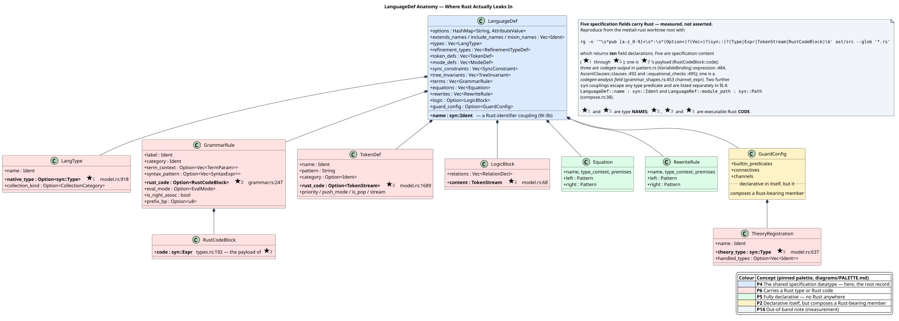
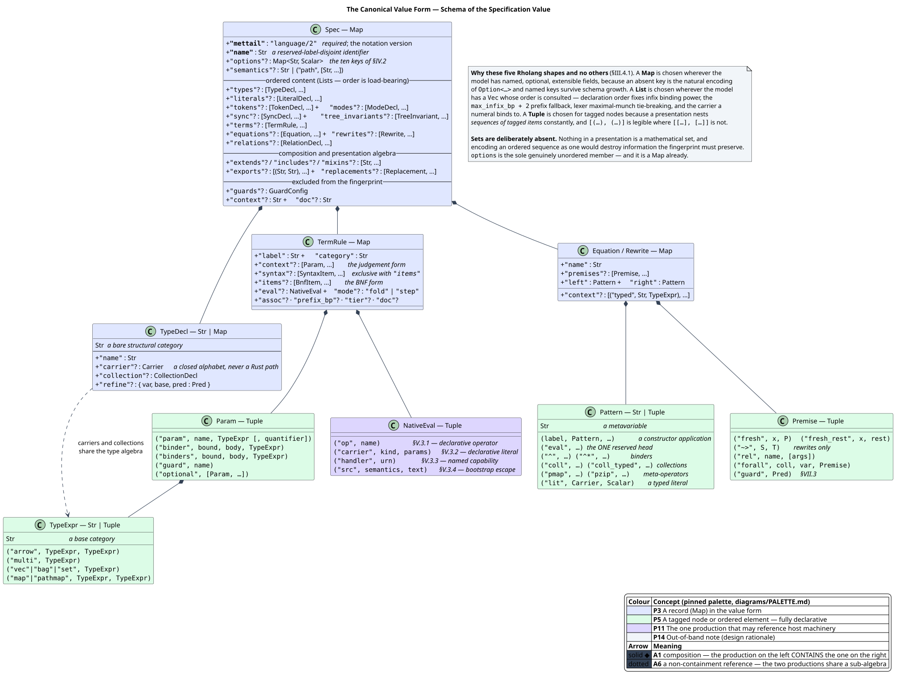
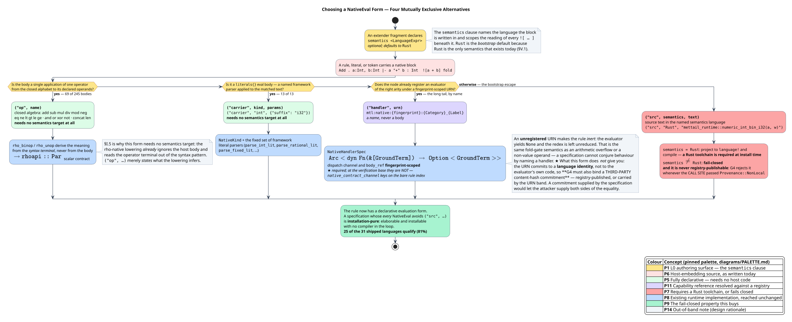

# MeTTaIL Language Specifications in Rholang

Dylon Edwards ([dylon.devo@gmail.com](mailto:dylon.devo@gmail.com))  
2026-07-25  
Status: Under Review

> **How to read this document.** It is a **FIPS** — a F1R3FLY Improvement Proposal
> Specification, the normative change-proposal format of this repository. Every
> acronym, symbol, and key term it uses is defined in the [Terminology](#terminology)
> table below, which is deliberately placed before Part I; the Abstract, Scope, and
> Motivation sections that precede it use six terms — **MeTTaIL**, **Rholang**,
> **FLT**, **OSLF**, **GSLT**, and **Rho machine** — whose one-line glosses are given
> inline at first use and in full in that table. Normative statements use *must*, *must
> not*, and *may*; everything marked "non-normative" is context.
>
> **The measurements are checkable, and the instruments are not in here.** Every
> count, census and structural claim below has a runnable check in
> [`verification/`](verification/), a sibling of this file; each one records what
> it measured, at which revision, and — the part worth reading — the specific
> mutation that makes it fail. The apparatus is kept beside the specification
> rather than inside it, because a reviewer needs the claim and an implementer
> needs neither the claim's scaffolding nor a fence scanner.
> [`verification/README.md`](verification/README.md) is the index.

## Abstract

**MeTTaIL** — the codename of Rholang 1.4, and the name of the language-definition
framework this proposal concerns — specifies a language today by invoking a Rust
procedural macro, `language!`. This proposal specifies an **in-Rholang
specification language** for the same content, so that a language definition stops
being Rust source consumed by `rustc` and becomes an artifact a **Rholang** node —
a node running the reflective higher-order concurrent calculus of
[Meredith & Radestock 2005] — can accept, carry, version, and install.

The objective, in L. G. Meredith's and Michael Stay's framing of it:

> The Rholang interpreter needs to be able to accept **units of code to
> interpret**, namely collections of modules. In a module, language specs get
> defined, and **Foreign Language Terms can use those specs**. Whether that is
> implemented using Rust macros or not is an **implementation issue**. We need
> to move away from a required dependency on Rust.
> — Michael Stay, design discussion, 2026-07

Three properties follow, and they are the point of the change.

1. **A specification becomes data.** It can be built by a contract, sent on a
   channel, stored in the tuplespace, versioned in the registry, transformed by
   Rholang code, and matched with Rholang patterns. None of that is possible
   for a macro invocation.
2. **Rholang can specify the languages it embeds.** Rholang is itself a MeTTaIL
   language, defined in `languages/src/rhocalc.rs` under the language identifier
   `RhoCalc`. Renaming that file and identifier to `rholang.rs` / `Rholang` is
   work item **W-1b**. A Rholang program can therefore define a guest language
   and immediately reach it through the **Foreign Language Term (FLT)** surface —
   a tagged, delimiter-bounded guest-language term embedded in a host process.
3. **The Rust compiler leaves the specification-authoring critical path.** This
   is a necessary — though, as §VIII establishes honestly, not sufficient —
   precondition for a non-Rust target such as a bare-metal RISC-V (Reduced
   Instruction Set Computing, fifth generation) **Rho machine** — an
   implementation of the Rholang runtime: RSpace, the spatial matcher, and the
   reducer.

The proposal rests on one premise, which §I **verifies rather than assumes**:
that `LanguageDef` is already the sole input to every backend generator. It
also builds on, rather than beside, two existing bodies of work: Michael Stay's
extender/presentation design, and its partial implementation on the
`mettail-rust` `modules` branch (Serhii and George), which this FIPS reads,
credits, and refines in §III.1.

The problem of native `![{ … }]` blocks — the one place a specification embeds
Rust — is resolved by the **`semantics` clause** of that design, and §V reports
that resolution rather than re-deriving it.

The acknowledged design inspiration for making specifications ordinary values
is Clojure's **code-is-data** tradition [Hickey 2020], itself descended from
McCarthy's S-expression [McCarthy 1960]. The notation proposed here is designed
to be idiomatic **Rholang**, not a transliteration of any other format.

## Status and Evidence

| Badge | Meaning |
| --- | --- |
| [Implemented] | Confirmed by reading the **verification base** defined below, with file and symbol cited. |
| [Branch] | Implemented on the `mettail-rust` `modules` branch; **not** in the verification base. Landing it is work item W-9. |
| [Approved] | Defined by another approved FIPS and reused here. |
| [Proposed] | New behavior introduced by this FIPS. |

> **★ The verification base, stated exactly.** Every `[Implemented]` claim, every
> line number, and every count in this document was measured against
> **`mettail-rust` branch `feature/rho-native-set-automata` at commit
> `a72b57e0`** (2026-07-25), which is the development tree the work items land
> on. It is **not** `main`. Naming `main` would be wrong rather than
> conservative: `main` is `a95726aa` (2026-05-20), **1,399 commits behind**, and
> most of the paths cited here do not exist on it — `rholang-codegen/`,
> `ast/src/validation/`, `ast/src/identity.rs`, `repl/src/rho_backends.rs`,
> `repl/src/bin/`, and `prattail/src/pipeline/` are all absent, while
> `languages/build.rs` exists on `main` and not at the verification base. (The
> `repl/` **directory** does exist on `main`; the two files this document cites
> inside it do not, which is why they are named individually rather than by
> their parent.) A reviewer re-running any command in §I.4, §V.2, or the
> Implementation Evidence table must check out that commit first; against `main`
> the commands return nothing and the reader would reasonably conclude the FIPS
> had invented its evidence.

> **★ Measure a revision with `git show`, never a checkout with `grep`.** Every
> count in this document was taken from `git show <rev>:<path>`, and a reviewer
> re-running any of them must do the same. The development branch is worked on
> continuously and its checkout is routinely dirty, so a plain `grep` over
> `mettail-rust/` reads **uncommitted edits** and can report a constant value, a
> function's arity, or a variant count that exists in nobody's history. That is
> not a hypothetical failure mode — it is how the §IX.5.1 row below was once
> recorded as landed while the rename existed only as working-tree edits.
>
> The base is a **pin**, not a claim that the tree has stopped moving. "Branch
> head" names a different revision each time it is written and is never a citable
> fact; a *checked revision* is. One change since the pin touches this document,
> and it is tabulated rather than folded silently into the badges:
>
> | Constant | `a72b57e0` (pin) | `39e523cb` (+8) | Consequence |
> | --- | --- | --- | --- |
> | `PEANO_ZERO_REFLECT_LABEL` | `"Z"` | **`"^Z"`** | §IX.5.1's rename requirement is **[Implemented]** |
> | `PEANO_SUCC_REFLECT_LABEL` | `"S"` | **`"^S"`** | — as above; the reserved namespace is now closed under its own prefix rule |
> | `reserved_labels_outside_the_namespace()` | `[…; 2]` | **`[…; 0]`** | the list of known violators is empty |
> | `reserved_subst_trs_labels()` | `[…; 19]` | `[…; 19]` | **unchanged** — see §IX.5.1 on why this set is a switch and not a census |
>
> `39e523cb` is *"#36 S3 — the Peano tags join the `^` namespace; the C2 set is a
> switch, not a census"*. A further commit has landed since, which is the rule
> working rather than a reason to re-pin: every other `[Implemented]` badge, line
> number and count in this document is measured at `a72b57e0`, and the one
> divergence is the four rows above. Re-check with
> [`verification/08-revision-matrix.sh`](verification/08-revision-matrix.sh).

The layers carry different badges, and the distinction matters.

- The **specification seam** — `LanguageDef` as the sole backend input, and
  `reconstruct_language_def` as a runtime path from a stored string to a
  fingerprint-identical `LanguageDef` — is **[Implemented]**. §I.
- The **extender surface** — `module` / `extender` / `language` / `space`,
  `ExtenderExpr` with `semantics`, `context`, union, and the **eight** content
  suffixes (`types`, `literals`, `terms`, `equations`, `relations`, `rewrites`,
  `exports`, `replacements` — `SuffixKind` on the branch), plus assembly into a
  Neutral Theory Intermediate Representation (NTIR) and projection back to
  `language!` — is **[Branch]** (`mettail-spec/`). §III.1.
- The **capability seam** for native evaluation — a fingerprint-keyed Uniform
  Resource Name (URN) naming a registered evaluator, injected as a
  system-process `Definition` — is **[Implemented]**
  (`rholang-codegen/src/native_handler.rs`). §V.4.
- The **canonical value form**, its elaborator, its identity discipline, and
  the round-trip and parity obligations are **[Proposed]**. §III.3–III.8.
- The **serializable parse-table artifact** needed to obtain a *parser* for a
  runtime-authored language without invoking `rustc` is **[Proposed]** and is
  named as work item **W-4**. §VIII.

## Scope

**In scope.** The language-specification language itself: how `types`,
`literals`, `terms`, `equations`, `relations`, and `rewrites` — and the
extender algebra that combines them — are expressed without Rust, together
with identity, validation, FLT integration, security, and the backend
consequences.

**Specified but not implemented in version 1.** The module system —
`module`, `import`, `export`, and `space` — gets its **syntax specified
normatively** in §X and its **implementation deferred** to a separate feature
branch (work item **W-13**, deliberately absent from §XIII.4's v1 sequencing
graph). The distinction is the point: §X.1 establishes that these constructs
belong to the **Rust macro DDL** — `import` reads a compilation unit from the
filesystem, and a deployed Rholang process has none — so the in-Rho form gets
the composition algebra and reaches other specifications through §VI.2's
registry instead. Specifying the spine is what makes that boundary explicit
rather than accidental. The extender algebra is *in* v1 scope for the reason it
always was: an extender is a function on presentations, and presentations are
the thing being specified.

## Motivation

### Why a macro is the wrong sole frontend

`language!` is a good frontend, and nothing here proposes removing it. It gives
compile-time diagnostics with source spans, composes with Rust's module system,
and lets a specification embed Rust where Rust is genuinely the right answer.

But a macro invocation is *source text consumed by a compiler*, which forecloses
all three objectives above.

- **It is not a value.** A running node cannot construct, receive, or store one.
- **It requires `rustc` at authoring time.** Every new language is a rebuild of
  the node binary; a network cannot install a domain-specific language by deploy.
- **It is Rust-shaped by construction.** Identifiers are `syn::Ident`, carriers
  are `syn::Type`, evaluation blocks are `syn::Expr` — even where nothing
  Rust-specific is meant.

### Why Rholang's existing data structures

Rholang already has the literal forms a structured specification needs: maps
with arbitrary keys, lists, tuples, sets, strings, integers, and `Nil`. Reusing
them buys three things at once.

- **No second parser.** A specification value parses with the Rholang parser
  that already exists. A bespoke grammar for the *content* of a specification
  would be a second thing to write, test, version, and keep synchronized with
  the model it encodes.
- **Programmatic manipulation.** Rholang's `match` works on maps, lists, and
  tuples, so a contract can take a specification, add a rewrite rule, and hand
  back a new specification without a serialization round trip.
- **Composition with everything else.** Sends, receives, joins, guards,
  lookahead, and the registry already work on values.

This is the **code-is-data** discipline: when the artifacts a system must
manipulate are expressed in the system's own data notation, the manipulation
tooling is the language itself. §III applies that principle *in Rholang*,
judged by what reads naturally in Rholang.

## Terminology

Every acronym, mathematical symbol, and key term this document uses is defined
here, grouped by the layer it belongs to. Where a term is used earlier — in the
Abstract, Scope, or Motivation — it carries an inline gloss at that first use and
its full definition is here.

The claim is stated at a generality that can be **checked rather than trusted**,
because "everything is defined" is exactly the kind of assertion that decays
silently as a document grows. Its scope and its check are both explicit.

- **Scope.** Every acronym; every non-ASCII mathematical symbol; every term this
  proposal coins or gives a non-obvious reading. **Not** in scope, and not
  claimed: ordinary English; identifiers quoted from the codebase, which are
  defined by the code they name and cited to it; the venue abbreviations inside
  reference-list entries (*ACM*, *EPTCS*, *HOPL*), which are part of the citation
  string rather than this document's vocabulary; and three abbreviations assumed
  universal — *ASCII*, *RFC* (used only as a document number, "RFC 3986"), and
  the Part numerals.
- **Check.** [`verification/02-acronym-coverage.sh`](verification/02-acronym-coverage.sh)
  is the maintenance instrument. It detects an acronym by a rule that needs no word
  list and so runs anywhere: **an acronym is an all-caps prose token that never
  occurs lower-cased anywhere in the prose.** All-caps *emphasis* — this
  document uses it — always does occur lower-cased elsewhere, and an acronym
  essentially never does, which separates the two exactly. It reports **42**
  acronyms and none undefined.

> **★ Two properties of that instrument are load-bearing, and a naive version
> has neither.** They are recorded because a check that passes for the wrong
> reason is worse than the overreaching sentence it replaces: a sentence invites
> checking, a passing check invites trust.
>
> 1. **Its fence remover is nesting-aware and indent-tolerant.** The obvious
>    one-liner — `awk '/^```/{f=!f; next} !f'` — is a *parity toggle*, and this
>    document contains a four-backtick block whose **content** includes a bare
>    three-backtick line (§VII.2's FLT fence example, which must quote a fence to
>    show one). A toggle flips on that content line, inverts permanently, and
>    from there silently drops every remaining line of prose while feeding code
>    in as prose. It also never matches this document's four **indented** fences.
> 2. **Its oracle is definition, not mention.** Comparing against *every*
>    all-caps token in the Terminology section lets a term pass by being
>    *mentioned* inside somebody else's row — `AST` passed that way by appearing
>    in the `rhoapi::Par` gloss while being expanded nowhere. The oracle is the
>    set of **row keys**, plus one short allow-list whose every entry carries its
>    reason, so what is waived is visible rather than implicit.

Two of the entries below carry more than a gloss because the symbol is
**overloaded in the literate algorithms the fingerprint depends on**, where an
imprecise reading changes the specified behaviour rather than merely the prose:
$`\uplus`$ and $`\setminus`$.

### The proposal's own vocabulary

| Term | Definition |
| --- | --- |
| **FIPS** | F1R3FLY Improvement Proposal Specification — the normative change-proposal format of this repository. A FIPS moves through `under-review/` and then `approved/`. |
| **MeTTaIL** | The codename of **Rholang 1.4** and the name of its language-definition framework. Named for SingularityNET's *MeTTa*, an experimental artificial-intelligence language whose requirements drive the new features. |
| **Rholang** | The reflective, higher-order concurrent process calculus f1r3fly nodes execute [Meredith & Radestock 2005]. |
| **DDL** | Data Definition Language — used here for the **text** form of a presentation block, i.e. what is written between the braces of `types { … }`. It is a *surface syntax*, not a second data model; see §III.2. |
| **BNF** | Backus–Naur Form — the classical production notation `Label . Category ::= Item Item ;`. `language!`'s original term syntax is a BNF variant, and the value form keeps it under the `"items"` key (§IV.7). |
| **EBNF** | Extended BNF — BNF plus the repetition, option, and grouping metasyntax `{ … }`, `[ … ]`, `( … )`. §III.3's L0 surface grammar is written in EBNF. |
| **MUS** | MeTTaIL Unified Specification — the name the `modules` branch gives its `.rho` module-file compiler, `mettail-spec`. |
| **Presentation** | A language specification's content — types, literals, terms, equations, relations, rewrites — before it is named. The mathematical object $`(\Sigma, E, R)`$: a signature, a set of equations, and a set of rewrite rules. |
| **Extender** | A function from presentations to a presentation. Declared `extender N(args) { ExtenderExpr }`. Not (yet) a functor: a morphism-level story for GSLT composition does not exist. |
| **Spec value** | A Rholang value denoting a presentation or a whole specification, in the notation of §III.4. Written $`v`$. |
| **Native block** | A `![ … ]` or `![{ … }]` region carrying an expression in the active `semantics` language. §V. |
| **Fold / step** | The two evaluation modes for a native block: `fold` (constant folding only) and `step` (congruence-driven single steps). A native block with neither keyword is a *mode-less* block — see the census in §V.2. |
| **Carrier** | The native type backing a declared category, e.g. `i64` for `![i64] as Int`. |
| **Island** | A tagged, delimiter-bounded foreign region inside a specification, e.g. `` Rholang```…``` `` ([Branch], `mettail-spec/src/island/`). |
| **Installation-pure** | Said of a specification whose every `NativeEval` avoids `("src", …)`: it is elaborable and installable with no compiler in the loop. §V.3.4. |
| **Pure-declarative subset** | The subset of `language!` using no native block at all, no `literals{}` eval body, no `relations{}` rule body, and no theory type path. §V.7. |
| **Provenance** | A property of the **call site** that invokes `install!`, *not* of the specification value. `Provenance::Local` may be passed only by a locally privileged entry point — an operator console, a build step, a test harness — running with the node operator's own authority. Every path reachable from a **deploy** passes `Provenance::NonLocal` unconditionally. §III.6.4 makes it a parameter of `⟨install⟩`; §V.3.4, §IX.3 R-1, and `⟨G4⟩` are the three clauses that turn on it. |

### Symbols and mathematical notation

| Symbol | Definition |
| --- | --- |
| $`(\Sigma, E, R)`$ | A presentation: signature, equations, rewrite rules. |
| $`v`$ | A candidate specification value. |
| $`\pi`$ | A **value path** — a list of map keys, list indices, and tuple positions locating a node inside $`v`$, e.g. `["terms", 3, "context", 0]`. |
| **Elaborator** $`\mathcal{E}`$ | The partial function $`\mathcal{E} : \mathrm{Value} \rightharpoonup \texttt{LanguageDef}`$. Fail-closed, and — under §III.2 — the **sole** decoder. |
| **Encoder** $`\mathsf{enc}`$ | The function $`\mathsf{enc} : \texttt{LanguageDef} \rightharpoonup \mathrm{Value}`$ specified in §III.6.3, a right inverse of $`\mathcal{E}`$ on its stated domain — which is not all of `LanguageDef`; §III.6.3 gives the domain and requires an error outside it. |
| **Validator** $`\mathcal{V}`$ | `validate_language` plus composition, auto-injection, and stratification analysis. |
| **Fingerprint** $`\mathcal{F}`$ | `language_definition_fingerprint` — the versioned stable identity of an augmented `LanguageDef` (`ast/src/identity.rs`). |
| **Reflected tag** $`\ulcorner \mathcal{F} \cdot L \urcorner`$ | The unforgeable `GPrivate` naming constructor $`L`$ of the language with fingerprint $`\mathcal{F}`$; equals `GPrivate("mettail.term." + F + "." + L)`. §IX.5.2 makes that string's grammar normative. |
| $`\Vert`$ | String concatenation. |
| $`[\![\,t\,]\!]`$ | The reflection of a guest term $`t`$ into a `rhoapi::Par`. |
| $`\bigstar_1 \ldots \bigstar_5`$ | The five specification fields of `LanguageDef` that carry a Rust type or Rust code. Enumerated in §I.4. |
| $`\backslash/`$ (written `\/`) | Extender **union** — merges two presentations, right-biased, under a strict conflict policy. §III.3. |
| $`\uplus`$ (written `⊎`) | **Disjoint union.** It carries two readings in this document and they agree on the only property either one is used for — that nothing is merged, coalesced, or reordered. On *types* it is the **sum**: `Value ⊎ {absent}` is the type of a value-or-the-distinguished-absence marker, the two summands never confused (§III.5). On *ordered sequences* it is **order-preserving concatenation**: `d.types ⊎ d.refinement_types` is the `Vec` whose elements are those of `d.types` in their declared order followed by those of `d.refinement_types` in theirs, with no de-duplication (§III.6.3). The two are disjoint by construction — the categories and the refinement types are drawn from disjoint model fields — which is what licenses the same symbol. |
| $`\setminus`$ (written `∖`) | **Sequence difference, order-preserving.** `xs ∖ ys` is the subsequence of `xs` obtained by deleting every element that occurs in `ys`, leaving the *relative order of the survivors exactly as it was in* `xs`. It is written as a difference and not as a filter because the removed set is characterised extensionally (`auto_injected(d)` — the rules the augmentation pass appended), not by a predicate on elements. Order preservation is load-bearing: §III.6.3's right-inverse property $`\mathcal{E} \circ \mathsf{enc} = \mathrm{id}`$ holds only if re-running the augmentation pass over `xs ∖ ys` reproduces `xs` positionally, which it does because augmentation appends. |
| $`\models`$ (written `\|=`) | The **satisfaction predicate** of a behavioral-type guard: `t \|= φ` reads "the term `t` satisfies the behavioral type `φ`". §VII.3. |
| $`\langle K \rangle \varphi`$ | The modal operator of the OSLF logic: "some rewrite matching $`K`$ leads to a state satisfying $`\varphi`$". §VII.3 records Meredith's richer indexed form. |

### The implementation surface this FIPS builds on

| Term | Definition |
| --- | --- |
| **`language!`** | The MeTTaIL procedural macro turning Rust tokens into a `LanguageDef` (`macros/src/lib.rs`). |
| **`LanguageDef`** | The parsed, composed, augmented specification record (`ast/src/language/model.rs`); the sole input to every backend generator. |
| **NTIR** | Neutral Theory Intermediate Representation — a named, hashed presentation (`mettail-spec/src/ntir.rs`, [Branch]). |
| **PraTTaIL** | MeTTaIL's parser generator: Pratt parsing (precedence climbing over prefix/infix binding powers) plus recursive descent, compiled to a weighted push-down automaton. |
| **WPDA** | Weighted Push-Down Automaton — a push-down automaton whose transitions carry semiring weights, used here as the parser backend PraTTaIL emits. Weights drive ambiguity resolution. |
| **WFST** | Weighted Finite-State Transducer — the finite-state device, weighted over a semiring, used in MeTTaIL's lexical and disambiguation analyses. |
| **GLR** | Generalised **LR** parsing, where LR abbreviates *left-to-right scan, rightmost derivation*: the family of shift-reduce algorithms, generalised to pursue every live parse in parallel rather than committing to one. Used here only to name the *cost model*: two rules accepting the same surface fork the parse, and forks multiply (§IX.3 R-2). |
| **JSON** | JavaScript Object Notation. It appears in this document only as one of the file formats `emit_blockly` / `emit_simulator` write **at macro-expansion time** (§IV.2); no part of this proposal uses it as a specification encoding. |
| **Dovetail** | MeTTaIL's substrate-neutral rewrite engine (e-graph, set automaton, weighted tree automata). |
| **TRS** | Term-Rewriting System — a set of oriented rewrite rules over terms. The **substitution TRS** is the reserved in-Rho rule family (`^subst`, `^shift`, …) that performs capture-avoiding substitution on reflected de Bruijn terms. |
| **LHS** | Left-Hand Side — the pattern half of a rewrite rule $`l \to r`$, the part a matcher matches against. §IX.6.1's first attack construction turns on two languages sharing an LHS pattern's *text*, because the σ-receiver's channel is derived by hashing that text. |
| **DAG** | Directed Acyclic Graph. Two structures in this document are DAGs: the interned **set-automaton pattern DAG** the rho-native backend emits, and §XIII.4's work-item dependency graph. |
| **API** | Application Programming Interface — the *source-level* contract a caller compiles against, as distinct from the **ABI** below, which is the byte-level contract an artifact is read under. §VI.2's semantic-versioning discussion turns on the difference. |
| **CI** | Continuous Integration — the automated test run over the repository. "Fails CI rather than shipping" means the obligation in question is a test, not a convention. |
| **UTF-8** | The variable-width Unicode encoding. Used here only to fix a **total order on strings**: §III.5's canonical key order is the lexicographic order on UTF-8 code-point sequences, which is stable across implementations in a way "alphabetical" is not. |
| **NFC / NFD / NFKC / NFKD** | The four Unicode normalization forms of Unicode Standard Annex (UAX) #15 [UAX15] — respectively canonical composition, canonical decomposition, compatibility composition, and compatibility decomposition. They appear here only as the accepted values of the `unicode_normalization` option (§IV.2); this FIPS assigns them no new meaning. |
| **DOI** | Digital Object Identifier — the persistent identifier each entry in the reference list carries where one exists. |
| **ABI** | Application Binary Interface — here, the byte-level contract a *consumer outside the emitter* depends on: the reflected-tag string grammar, the reserved `body_ref` bands, and the fingerprint that keys both. "An ABI break" means an artifact emitted by one version stops being readable by another, which is why §VI.3 versions the fingerprint prefix rather than silently changing the encoding. |
| **REPL** | Read–Eval–Print Loop — MeTTaIL's interactive driver binary (`repl/`). §IX.3 R-2's point is that its `MAX_ITERS` / `MAX_NODES` are constants *of that binary*, so nothing enforces them on a library caller. |
| **FLT** | **Foreign Language Term** — a tagged, delimiter-bounded guest-language term embedded in a host process, e.g. `` lam`App(f, K)` ``. |
| **GSLT** | **Generalised Structured Language Theory** — the triple $`(\Sigma, E, R)`$ a `language!` block presents. |
| **OSLF** | **Operational Semantics in Logical Form** — the framework that generates a language's logic from its rewrite theory. |
| **URI** | **Uniform Resource Identifier** — the general RFC 3986 identifier syntax. Rholang's `new x(\`rho:io:stdout\`)` binds a name from a **system-channel URI**; that is the sense every "URI" in this document carries. |
| **URN** | **Uniform Resource Name** — the *location-independent* subspecies of URI. Here, the `mtl:native:{fingerprint}:{label}` band naming a registered native evaluator. A URN names *what* without saying *where*, which is why a handler URN is resolvable only against a registry. |
| **Spread automaton** | The in-Rho set automaton that locates redexes by broadcasting a match frontier across a reflected term. |

### Rholang and f1r3node runtime vocabulary

| Term | Definition |
| --- | --- |
| **Rho machine** | An implementation of the Rholang runtime — RSpace, the spatial matcher, and the reducer — considered independently of the host it runs on. "A bare-metal RISC-V Rho machine" is that same runtime cross-compiled to a target with no operating system and no Rust toolchain. §VIII.3 inventories what one needs. |
| **COMM** | Rholang's **communication event**: the rendezvous of a send `x!(P)` with a matching receive `for (y <- x) { Q }` on the same channel. It is the *only* way a Rholang process observes or changes tuplespace state, which is why §III.9's requirement that specification construction and elaboration perform **no COMM** is what makes §IX short. |
| **RSpace** | The f1r3node **tuplespace**: the content-addressed store of sends and receives against which COMM events are matched. A "space" in `space s: L` is an RSpace. |
| **AST** | Abstract Syntax Tree — a term's structure with its surface punctuation discarded. Three distinct ASTs appear in this document and conflating them is the reading error to avoid: the **macro** AST (`syn`'s, over Rust tokens), the **generated** AST (the Rust enums a backend emits for a guest language's terms), and the **Rholang** AST (`rhoapi::Par`, below). |
| **`rhoapi::Par`** | The protobuf-defined normalized Rholang AST — a *parallel composition* of sends, receives, news, expressions, and unforgeables. It is the data type a Rholang program **is**, once normalized, and therefore the type in which an installed language's semantics are shipped. |
| **`GPrivate`** | An **unforgeable name**: a `rhoapi` name whose identity is a byte string that cannot be constructed by a Rholang program that was not given it. Reflected tags are `GPrivate`s, which is what makes them unsquattable. |
| **`GString`** | An ordinary *string-valued* Rholang name. Unlike a `GPrivate`, any process that can write the string can address the channel — which is why §IX.6 owes an argument for the machinery channels that are `GString`s today. |
| **AC** | **Associative–Commutative** — said of an operator whose arguments form a *multiset* rather than a sequence, so that `f(a,b) = f(b,a)` and `f(f(a,b),c) = f(a,f(b,c))`. A MeTTaIL collection constructor declared over a `HashBag` is AC. Matching an AC operand is multiset matching, which the rho-native backend performs by publishing the bag as an unordered **process soup** — one send per element on a shared carrier channel — and letting the spatial matcher assign elements to pattern slots in any order inside one atomic `consume`. §IX.6.1 is about the naming of that carrier. |
| **`Definition`** | An f1r3node **system process**: a host-provided contract bound to a reserved channel and `body_ref`, invoked by the reducer as if it were ordinary Rholang. Native handlers are injected as `Definition`s. |
| **`DeterministicCall`** | The `Definition` classification asserting that a system process is a pure function of its arguments, so that block replay reproduces it bit-identically. |
| **Versioned Registry** | The approved `rho:lib:` / `rho:serve:` namespace and its `insertVersion` / `deprecateVersion` / `approveVersion` calls. §VI.2. |
| **FNV-1a** | Fowler–Noll–Vo hash, variant 1a — a fast, **non-cryptographic** multiplicative hash. `ast/src/identity.rs` uses the 64-bit variant today; §IX.3 R-1 explains why that is not adequate once specifications cross a network, and W-7 replaces it. |
| **BLAKE3** | A cryptographic hash function with a 256-bit default output, used by `Ntir::content_hash` today and adopted by W-7 for the v2 fingerprint. Written **BLAKE3-256** where the output width is the point of the sentence. |

## Part I — The Decoupling Verdict

The whole proposal rests on one premise: that the backend generators are
already decoupled from the macro frontend and require only the specification.
This section verifies it and reports the qualification the verification turned
up.


PlantUML source: [diagrams/01-two-frontends.puml](diagrams/01-two-frontends.puml).

### I.1 What `language!` does, step by step

[Implemented] `macros/src/lib.rs` performs exactly this sequence, and nothing
else:

1. capture the verbatim body text into `definition_source_str`;
2. `parse_macro_input!(input as LanguageDef)` — Rust tokens to `LanguageDef`;
3. `registry::register_language` — store raw tokens for later composition;
4. `apply_extends`, `apply_includes`, `apply_mixins` — composition;
5. `validate_language` — well-formedness;
6. `emit_auto_injection_rules` — append synthetic cast and congruence rules;
7. `logic::stratification::analyze` — reject negation cycles;
8. call the generators.

Steps 3–7 live in `mettail-ast`, not the macro crate, and all operate on
`&mut LanguageDef`. Step 2 is the only step that consumes Rust tokens.
Everything after it is frontend-agnostic by construction.

### I.2 Every generator takes `&LanguageDef` and nothing else

[Implemented] The generator calls in `macros/src/lib.rs`, with their inputs:

| Generator | Call | Extra input beyond `&LanguageDef` |
| --- | --- | --- |
| AST types + WFST analysis | `generate_all(&language_def)` | none |
| Freshness functions | `generate_freshness_functions(&language_def)` | none |
| Metadata | `generate_metadata(&language_def, &definition_source_str)` | **the verbatim source string** |
| `Language` impl | `generate_language_impl(&language_def)` | none |
| WPDA parser engine | `generate_wpda_engine_module(&language_def)` | none |
| Test file | `write_test_file(&language_def, &pipeline_analysis)` | analysis derived from `&language_def` |
| Simulator binary | `write_simulation_binary_if_enabled(&language_def)` | none |
| Blockly | `generate_blockly_definitions(&language_def)` | none |
| Proptest strategies | `generate_public_strategies(&language_def)` | none |

The rho-native and Dovetail backends are reached the same way and are cleaner
still, because they are reachable **at runtime**:

- `lower_language_def(&LanguageDef) -> RhoLowering` (`rholang-codegen/src/lower.rs`);
- `plan_rho_default_backend(&LanguageDef, requirements)` (`rholang-codegen/src/backend.rs`);
- `derive_guard_qualities(&LanguageDef)` (`rholang-codegen/src/guard_quality.rs`).

PraTTaIL is decoupled one step further **as a dataflow**, though not as a
datatype, and the distinction must be stated precisely because it is easy to
overclaim.

`macros/src/gen/syntax/parser/prattail_bridge.rs::language_def_to_spec` projects
`LanguageDef` into `mettail_prattail::LanguageSpec`. For the *guard* sub-record
that projection is total in the intended sense, and the crate says so:

> All `syn` types are resolved to plain strings so the pipeline crate has zero
> dependency on `syn`.
> — `prattail/src/lib.rs:830-834`, documenting `GuardConfigSpec`

For **rule** bodies it is not. `prattail_bridge.rs:568-571` populates
`RuleSpec::rust_code : Option<TokenStream>` from the rule's `syn::Expr`:

```rust
has_rust_code: rule.rust_code.is_some(),
rust_code: rule.rust_code.as_ref().map(|rc| {
    let expr = &rc.code;
    quote::quote! { #expr }
}),
```

and `:309` / `:356` copy `td.rust_code` into `constructor_code`. So
`LanguageSpec` **does** carry `proc_macro2::TokenStream`, and
`prattail/Cargo.toml:95-97` depends on `proc-macro2`, `quote`, and `syn` as
ordinary (non-dev) dependencies. What *is* true — and it is the load-bearing
claim — is that the field is **carried and never read**:

> Single pass over `spec.rules` builds all collections needed by both the lexer
> and parser pipelines. The `rust_code: Option<TokenStream>` field on `RuleSpec`
> is intentionally not copied — it is never used by the recursive descent
> handler generator.
> — `prattail/src/pipeline/state.rs:245-250`, documenting `extract_from_spec`

**The dataflow claim survives; the datatype claim does not.** PraTTaIL's
*pipeline* never consumes a Rust expression, so a specification that carries no
Rust expression loses nothing on that path. Removing `proc_macro2` from
`LanguageSpec`'s *type* is a separate, additional piece of work, and it is
folded into W-3a rather than assumed away.

### I.3 The seam is already exercised without the macro — twice

[Implemented] The strongest evidence is not the call graph but the fact that the
seam is *already used from non-macro callers*. `ast/src/auto_inject.rs` exposes

```rust
pub fn reconstruct_language_def(raw_source: &str) -> syn::Result<LanguageDef>
```

which parses a stored source string, replays composition and auto-injection,
and yields a `LanguageDef` that fingerprints identically to the macro-time one.
`repl/src/rho_backends.rs::planned_rho_backend_for` and
`repl/src/bin/flt_demo.rs::lambda_backend` both do exactly this:

```text
LanguageMetadata::definition_source()   -- a &'static str
  |> reconstruct_language_def           -- LanguageDef
  |> lower_language_def                 -- rhoapi::Par program
  |> plan_rho_default_backend           -- PlannedRhoBackend, installed on a real RSpace
```

[Branch] The second exercise is `mettail-spec`, which assembles a presentation
from `.rho` extender declarations and reaches the same seam through
`Ntir::to_language_def()` →
`mettail_ast::fragments::language_def_from_parts(name, types, literals, terms, equations, rewrites, logic)`.
No proc-macro is in either path.

This FIPS replaces the *first* arrow — source-string in, `LanguageDef` out —
with an implementation that takes a Rholang value instead. Everything
downstream is untouched.

### I.4 Where Rust actually leaks in — a reproducible account

The decoupling is clean as a *dataflow* seam. It is not clean as a *datatype*:
`LanguageDef` is spelled in `syn` types. How many, and where, is a question that
must be **measured**, not estimated — and the measurement must be stated in a
form a reviewer can re-run.

**Method.** The predicate is "a `pub` struct **field** whose declared type
mentions `syn`, `proc_macro2`, or one of the aliases those crates are imported
under in `ast/` (`Type`, `Expr`, `TokenStream`, `RustCodeBlock`)." Aliasing is
why a literal search for `Option<syn::Type>` is not sufficient: `ast/src` does
`use super::*` and spells the carrier field `Option<Type>`. The sweep that
applies that predicate is
[`verification/09-star-fields-and-variants.sh`](verification/09-star-fields-and-variants.sh);
it returns **ten** field declarations, which fall into three groups.

**Group 1 — the five specification fields.** These are the ones this FIPS must
answer for.

| # | Field | Site | Type | What it holds | Is it *code*? |
| --- | --- | --- | --- | --- | --- |
| $`\bigstar_1`$ | `LangType::native_type` | `language/model.rs:918` | `Option<Type>` (i.e. `syn::Type`) | the carrier of `![i64] as Int` | No — a type **name** |
| $`\bigstar_2`$ | `GrammarRule::rust_code` | `grammar.rs:247` | `Option<RustCodeBlock>` | the `![a + b]` fold body | **Yes** |
| $`\bigstar_3`$ | `TokenDef::rust_code` | `language/model.rs:1689` | `Option<TokenStream>` | the `literals{}` `eval:` block | **Yes** |
| $`\bigstar_4`$ | `LogicBlock::content` | `language/model.rs:68` | `TokenStream` | verbatim Datalog rules with host bodies | **Yes** |
| $`\bigstar_5`$ | `TheoryRegistration::theory_type` | `language/model.rs:637` | `syn::Type` | e.g. `PresburgerAlgebra` | No — a type **name** |

**Group 2 — one payload field.** `RustCodeBlock::code : syn::Expr`
(`types.rs:192`) is not an independent coupling; it is what $`\bigstar_2`$
*contains*. Removing $`\bigstar_2`$ removes it.

**Group 3 — four fields that are not specification content at all.** Three are
codegen **output** — `VariableBinding::expression` (`pattern.rs:484`),
`AscentClauses::clauses` (`pattern.rs:492`), `AscentClauses::equational_checks`
(`pattern.rs:495`) — and one is a codegen **analysis** field,
`FoldAliasSendShape::channel_expr : syn::Expr` (`grammar_shapes.rs:453`; the
struct is declared at `:438`, one of the four in that file alongside
`UnaryPrefixShape`, `SimpleProjectionShape` and `FoldAliasShape`), which lifts a
channel argument verbatim out of a rule body so the macro side can splice it
back. None is written by a specification author, and none needs a value
spelling.

Two further `syn` couplings **escape any type predicate** and must therefore be
named explicitly rather than swept for:

- **`LanguageDef::name : syn::Ident`** (`language/model.rs:28`). A
  specification's name must be a legal Rust identifier. The
  `[A-Za-z_][A-Za-z0-9_]*` gate of §III.6 is **necessary but not sufficient**:
  `proc_macro2::Ident::new` accepts Rust *keywords* such as `match`, `crate`,
  `self`, and `Self`, which construct without panicking but cannot be used as
  generated type or module names. The gate must therefore also exclude the Rust
  keyword set. This is work item **W-3b**.
- **`LanguageRef::module_path : syn::Path`** (`compose.rs:38`), which holds the
  `calculator` prefix of `calculator::Calculator` in a `compose_languages!`
  composite. It is out of scope because composites are gap **G-2**.

Everything else in the model is `Ident` (a name), `String`, a numeric, a `bool`,
or a closed enum. That shortness is what makes this proposal tractable.



PlantUML source: [diagrams/02-langdef-anatomy.puml](diagrams/02-langdef-anatomy.puml).

One further Rust-shaped coupling is real even though it is not a specification
field at all.

- **`ValidationError` carries `proc_macro2::Span`.** All **seventeen** variants in
  `ast/src/validation/error.rs` do, and `ValidationError::span()` is how the
  macro produces a source-located diagnostic. §III.7 specifies the replacement,
  as work item **W-2**. Reproduce the count with

  reproduced by the variant-head sweep in [`verification/09-star-fields-and-variants.sh`](verification/09-star-fields-and-variants.sh),

  which enumerates the variant heads. Note that grepping `span: Span` instead
  over-counts, because some occurrences are `Span::call_site()` constructions
  inside `impl` blocks rather than variant fields; the variant-head sweep is the
  correct one.

  > **★ The seventeenth variant is this FIPS's own §IX.5.1 requirement,
  > landed.** `ReservedReflectLabel { label, kind, span }`
  > (`error.rs:123-130`) and its checker
  > `validate_reserved_reflect_names` (`validation/validator.rs:57-145`) exist
  > because of the reserved-label defect §IX.5.1 states, and `validate_language`
  > runs the check as its first statement (`validator.rs:147-150`). It is
  > recorded here rather than only in §IX.5.1 because it is the one place where
  > a requirement of this proposal is already **[Implemented]** at the
  > verification base, and because §IX.5.1 is written around the predicate that
  > landed — a **prefix rule**, `label.starts_with('^')`, and deliberately not an
  > enumeration of labels.

### I.5 The load-bearing surprise: the Rholang backend never reads the native body

[Implemented] The rho-native lowering does **not** consult `rust_code` for its
semantics. `rholang-codegen/src/lower.rs::lower_rule` reads the rule's *syntax
pattern*, extracts the operator terminal, and maps it through

```rust
fn rho_binop(terminal: &str, lhs: RhoScalarType, rhs: RhoScalarType, result: RhoScalarType)
    -> Option<RhoBinaryOp>
```

with arms such as `("+", Int, Int) => RhoBinaryOp::Add` and
`("and", Bool, Bool) => RhoBinaryOp::And`. The Rust expression `![a + b]` is
never inspected.

Across the whole of `rholang-codegen`, `rust_code` appears in exactly three
places, and in all three it is a **boolean flag**, never an expression:

| Site | Use |
| --- | --- |
| `rho_net.rs:971` `term_requires_native_system_process` | `term.rust_code.is_some()` — route to a native system process |
| `backend.rs:825` `classify_rejected_rule` | `rule.rust_code.is_some()` — classify the rejection reason |
| `rho_net_subst_trs.rs:1131` `object_congruence_constructors` | `term.rust_code.is_some()` — skip scalar constructors in the substitution traversal |

On the path this FIPS most cares about — the Rholang backend, and therefore the
bare-metal one — the native block is already surplus for operator rules and a
mere presence flag for the rest.

### I.6 Verdict

**The decoupling is complete as a dataflow seam and partial as a datatype.**

- Every backend generator's sole semantic input is `LanguageDef`. **Verified.**
- The seam is already exercised from two non-macro callers —
  `reconstruct_language_def` in the verification base and
  `Ntir::to_language_def` on the
  `modules` branch. **Verified**, with one qualification recorded in §III.1:
  `reconstruct_language_def` is `syn::parse_str::<LanguageDef>(raw_source)`, so
  it is evidence for *pipeline replay from a non-macro caller*, not for a
  `syn`-free producer. `Ntir::to_language_def` is the closer analogue, and it
  covers roughly half the model's fields (§III.1, observation 3).
- PraTTaIL's *pipeline* never consumes a Rust expression. **Verified** — see
  §I.2 for the precise scope: the dataflow is decoupled, the datatype is not,
  because `LanguageSpec::rust_code` is a `TokenStream` that is carried and never
  read.
- The rho-native backend never reads a native block's contents. **Verified.**
- `LanguageDef` nonetheless carries Rust in exactly five specification fields,
  three of which are executable code. **This is the qualification**, and §V is
  its resolution.
- Diagnostics are `Span`-based and the name must be a Rust identifier. **Two
  named work items**, W-2 and W-3b.

So this FIPS proposes a second producer over an existing clean seam. It does
not need to restructure the backends. It needs to answer one question honestly —
what a Rholang-authored specification puts where a Rust expression used to be —
and to add one artifact: a parse table that is data rather than source.

## Part II — A Tag Names a Handler

One structural observation shapes every choice that follows.

### II.1 The observation

MeTTaIL already has a construct in which **a tag names a handler that
interprets the following element**: the Foreign Language Term. In
`` lam`App(f, K)` ``, the tag `lam` selects a registered guest grammar and
reflector, and that handler interprets the delimiter-bounded body. The FLT FIPS
makes the resolution fingerprint-keyed: a guest constructor $`L`$ of a language
with fingerprint $`\mathcal{F}`$ reflects under the head tag

```math
\ulcorner \mathcal{F} \cdot L \urcorner \;=\; \texttt{GPrivate}\bigl(\texttt{"mettail.term."} \Vert\, \mathcal{F} \,\Vert\, \texttt{"."} \,\Vert\, L\bigr),
```

where $`\Vert`$ is string concatenation. This is `reflect_tag` in
`rholang-codegen/src/rho_net_lower.rs`, and `REFLECTED_TERM_ABI_PREFIX` is the
single constant that both the emitter and the runtime decoder key on.

[Branch] The same discipline has **already been applied one level down**, inside
the specification surface, by the `modules` branch's *islands*:

````text
export extender ProcExt() {
  Rholang```
    new ch in {
      ch!(1) |
      for (@x <- ch) { ch!(x + 1) }
    }
  ```
  semantics Rust
}
````

The island body is **valid Rholang**, and it has to be: an island tag names a
plugin that *parses* the body in the named guest language, so a body that does
not parse is not an illustration of the mechanism but a counterexample to it.
The three constructs above are the three the tree-sitter grammar defines —
`new … in { … }`, a send `ch!(…)` (`grammar.js`'s `send`), and a receive
`for ( … ) { … }` (`grammar.js`'s `input`, whose receipts are parenthesized).

Here `Rholang` is a tag naming a registered island plugin
(`mettail-spec/src/island/plugins/{rust,rholang_proc}.rs`, dispatched through
`island::registry`) that interprets the triple-backtick body. That is the FLT
mechanism, at specification-authoring time, already built.

The value notation of §III.4 uses the same discipline a third time: a
specification node is a tuple whose first component is a tag string, and the tag
selects an elaborator arm that interprets the remaining components. All three
share the resolution rule

```math
\tau \cdot e \;\longmapsto\; H(\tau)(e),
```

read "the tag $`\tau`$ applied to the element $`e`$ resolves to the handler
$`H(\tau)`$ applied to $`e`$."


PlantUML source: [diagrams/03-tag-names-a-handler.puml](diagrams/03-tag-names-a-handler.puml).

### II.2 What the correspondence buys, and where it stops

It buys two things that are not decorative.

- **One resolution story, one registry.** A specification *installs* the very
  tags that FLTs later resolve. The registration path (§VI) and the FLT
  resolver path (§VII) are the same path; there is no translation layer between
  how a language is named when defined and how it is named when used.
- **Unforgeable, not conventional, namespacing.** Naming schemes that rely on
  convention can be squatted; a `GPrivate` derived from the fingerprint cannot.
  The consequence, established in the FLT FIPS, is that a mismatch is always a
  *non*-firing and never a *wrong* firing.

It stops in one place, and the difference is worth stating rather than papering
over: **an FLT tag and an island tag interpret raw source text; a value tag
interprets an already-parsed value.** The first two are reader-level constructs
and inherit the modal-lexer delimiter obligations catalogued in the FLT FIPS —
fence run lengths, heredoc words, escape tracking. The value notation inherits
none of them, because Rholang's parser has produced the value before any tag is
examined. The shared content is the resolution discipline, not the syntax.

### II.3 Consequence for extensibility

The practical payoff is that **adding a MeTTaIL feature adds a tag, not a
keyword**. Where `language!` has grown blocks and modifiers — `literals`,
`tokens`, `guards`, `sync`, `tree_invariants`, `connectives`, `theories`,
`channels` — the value notation grows one admissible tag in one elaborator arm,
with no change to the Rholang grammar and no change to how a specification is
transported, stored, or matched.

## Part III — The In-Rholang Specification Language

### III.1 Prior art, credited and read

Two bodies of work precede this FIPS and are its foundation.

**Michael Stay's extender design.** A language specification is a
**presentation**, and an **extender** is a *function from presentations to a
presentation*. It is deliberately **not** called a functor: GSLT composition has
no morphism-level story, so functoriality is neither claimed nor relied on
anywhere in this FIPS. An extender body is a left-associative chain of block
modifiers over a base presentation. The mockup:

```text
export extender MyExtender(arg1, arg2) {
  { arg1 \/ arg2 }          // a base presentation, modified by what follows
    semantics M1.Go         // optional; defaults to Rust
    types { … } terms { … } literals { … }
    equations { … } relations { … }
    rewrites { … }
}
export language fooLang = MyExtender(Module1.bar, M2.Nested.SomeExtender(…))
```

with `\/` extender union, and — for parity purposes — **`relations` as the new
name for `logic`**.

**The `mettail-rust` `modules` branch** (Serhii and George) implements a
substantial part of it as `mettail-spec`, the "MeTTaIL Unified Specification
(MUS) compiler for `.rho` module files." What it actually built, established by
reading the branch rather than by inference:

| Component | File | What it does |
| --- | --- | --- |
| Surface AST | `src/surface.rs` | `SurfaceFile`, `Module`, `ExtenderDecl`, `LanguageDecl`, `SpaceDecl`, `ExtenderExpr`, `LanguageExpr`, `IslandToken`, `ContextTemplate` |
| Parser | `src/parser.rs` | hand-written; `import` / `module` / `export` / `extender` / `language` / `space`; precedence-climbing `ExtenderExpr` |
| Suffix kinds | `src/surface.rs` | `Types`, `Terms`, `Literals`, `Equations`, **`Relations`**, `Rewrites`, `Exports`, `Replacements` |
| Fragment parsing | `mettail-ast/src/fragments.rs` | `parse_{types,terms,literals,equations,rewrites,logic,relations}_fragment` — wraps a brace body in its keyword and calls the **existing** `mettail-ast` parser |
| Resolution | `src/resolve.rs` | import graph, cycles forbidden |
| Assembly | `src/assemble.rs` | extender application, right-biased union merge, strict conflict policy on overlapping term labels |
| NTIR | `src/ntir.rs` | named, hashed presentation; `to_language_def()` reaches the seam |
| Islands | `src/island/` | tag-dispatched foreign regions with a plugin registry |
| Semantics | `src/ntir.rs`, `src/semantics.rs` | `SemanticsTarget { Rust, Unknown }`; Rust projection refuses anything but `Rust` |
| Projection | `src/project/rust.rs` | emits a `language!` body and writes `.rs`; `languages/build.rs` generates `MyCalc` from `specs/mycalc/*.rho` |
| Parity | `src/parity.rs`, `tests/parity_test.rs` | diffs a projected language against a monolithic `language!` snapshot |

Four observations about that branch matter for this FIPS, and the last two are
qualifications on how far it can be cited as evidence.

1. **The seam verification of §I holds there too.** `Ntir` stores
   `Vec<LangType>`, `Vec<GrammarRule>`, `Vec<Equation>`, `Vec<RewriteRule>`,
   `Option<LogicBlock>` — the *same* `mettail-ast` types — and reaches
   `LanguageDef` directly. Nothing was re-modelled.
2. **The block bodies are still Rust token streams.** `ExtenderExpr::Suffix`
   carries `tokens: TokenStream` *and* `raw: String`, and the fragment parsers
   are `syn`-based. So the branch removes the *macro invocation* from the
   authoring surface but does not remove the `syn` dependency from the
   specification *content*, and today's terminal step is still emitting
   `language!` source for `rustc` to expand. That is a correct and deliberate
   bootstrap, and it is exactly the remaining gap this FIPS closes.
3. **The branch's model is roughly half of today's.** The `modules`-branch
   `LanguageDef` has 8 fields; the verification base's has 16.
   `Ntir::to_language_def` passes
   seven components and hard-defaults `options` to empty. `mettail-spec` has
   never seen `extends` / `includes` / `mixins`, `refinement_types`,
   `token_defs`, `mode_defs`, `sync_constraints`, `tree_invariants`, or
   `guard_config`. So §I.6's "verified" holds **over the fields the branch
   models**, and the six block kinds it has never modelled are the ones §III.3's
   scoped open item is about — five of which remain as §IV.12's gap **G-4**,
   `options` being closed by §III.3's Refinement 3.
4. **Its parity harness cannot discharge this FIPS's parity obligation.**
   `mettail-spec/src/parity.rs` compares a seven-field `LanguageSnapshot`
   (`name`, `type_names`, `term_labels`, `equation_names`, `rewrite_names`,
   `has_literals`, `logic_relation_count`) that is **names only** and **sorts
   them**, destroying the declaration order §III.4.1 argues is load-bearing; it
   inspects no syntax pattern, carrier, premise, left/right pattern, option,
   guard, token, mode, sync constraint, or tree invariant; and
   `tests/parity_test.rs` asserts snapshot equality plus a hardcoded BLAKE3
   `Ntir::hash`, never calling `language_definition_fingerprint`. Two
   presentations with inverted precedence and entirely different syntax patterns
   produce byte-identical snapshots. §III.2 explains why this FIPS does not
   extend that harness — but the reason is **not** that the obligation went
   away, and saying so would be the more comfortable claim rather than the true
   one. Under the one-decoder decision the obligation is **rehoused and
   re-signed**: it is no longer "two decoders must agree about a `LanguageDef`",
   which is the obligation this harness was built for and cannot discharge; it
   is **RT4** (§III.2), "desugaring a block body to a value and elaborating it
   must yield what the fragment parser yields from the same text" — a parity
   obligation in the ordinary sense, over the arrow this FIPS adds rather than
   between two decoders. The branch harness is superseded rather than vindicated.

### III.2 Three layers, and what this FIPS adds

Separating the surface from the content resolves what would otherwise look like
a conflict between "a bespoke `.rho` grammar" and "a specification is a Rholang
value." They are different layers.

| Layer | What it is | Status | Owner |
| --- | --- | --- | --- |
| **L0 — authoring surface** | `extender` / `language` declarations; `ExtenderExpr` with `semantics`, `context`, union, call, and the eight content suffixes | [Branch], refined in §III.3 | Stay; `modules` branch |
| **L1 — presentation content** | the content of a presentation: what goes *inside* `types { … }`, `terms { … }`, and the rest — **and, additionally, the six block kinds that have no L0 `Content` wrapper at all** | **[Proposed]**: a canonical Rholang **value**; DDL text becomes surface syntax over it | this FIPS, §III.4 |
| **L2 — the seam** | `LanguageDef`, and every backend below it | [Implemented], unchanged | `mettail-ast` |

> **L1 is a superset of "what goes inside an L0 block", not a synonym for it.**
> Six block kinds — `options`, `tokens`, `modes`, `sync`, `tree_invariants`,
> `guards` — have **no L0 `Content` suffix to go inside** (§III.3's scoped open
> item; five of them remain as gap **G-4**, and `options` is closed by that
> section's Refinement 3, which gives it a `LanguageDecl` clause rather than a
> suffix). Their spelling is an L1 key of the whole-specification `Spec` map.
> Reading the L1 row as "the inside of an L0 block" would make those six
> unspellable in either layer, which is not what the design says. The correct
> reading is: L1 is the content language; L0 is one — currently incomplete — way
> of *assembling* content out of named, composable fragments.

#### One decoder from a value, and what that does and does not settle

A presentation has **two admissible *surfaces*** and **exactly one decoder from
a value**. This is normative, and the qualification in it is load-bearing.

```math
\mathrm{parse\_ddl} : \texttt{TokenStream} \rightharpoonup \mathrm{Value}, \qquad \mathcal{E} : \mathrm{Value} \rightharpoonup \texttt{LanguageDef}.
```

`parse_ddl` is a **desugarer**: it reads today's DDL text — the content of a
`types { … }` block and its siblings — and produces a *specification value*.
$`\mathcal{E}`$ is the **sole** function from a value to a `LanguageDef`: there
is no second elaborator, no second validator, and no second fingerprint
computation **on the value path**.

> **★ What this does not claim, stated before the benefit rather than after
> it.** `language!` still exists (§XIII.1 makes its retention normative), and its
> step 2 is `parse_macro_input!(input as LanguageDef)` — Rust tokens straight
> into `LanguageDef`, not through a value. `parse_ddl` **desugars the extender
> `Content` block**; it is a third function beside the two that exist, not a
> replacement for the macro's whole-definition parser. So figure 1 draws two
> arrows into `LanguageDef` because there **are** two, and the one-decoder
> property is scoped to the arrow this FIPS adds.
>
> That scoping is forced, not chosen. Routing `language!` through the value form
> would mean every construct the macro accepts must have a value spelling **in
> v1**, and §IV.12 names three that do not:
>
> | Gap | What has no v1 value spelling | Which shipped language stops compiling |
> | --- | --- | --- |
> | **G-1** | a `relations` rule with a host body | `RhoCalc` |
> | **G-3** | *introducing* an opaque carrier — `RhoCalc` declares `![Arc<…ReadZipperLit>] as ReadZipper` rather than naming a registered one | `RhoCalc` |
> | **G-2** | `compose_languages!` | `CalcLambda` |
>
> Note which languages are **not** in that table, because the boundary is
> narrower than "everything with Rust in it": `Calculator` and `LedTest` carry
> 127 and 7 native bodies respectively and would route through the value form
> perfectly well, as `("src", "Rust", …)` — a form that is admissible at
> macro-expansion time, which is by definition local (§III.6.4). What blocks
> `RhoCalc` and `CalcLambda` is not embedded Rust; it is two constructs the value
> form has no production for at all.
>
> Two shipped languages stopping compilation contradicts normative §XIII.1. The
> honest arrangement is therefore two decoders with **one of them frozen**: the
> macro path is not extended, and every new capability lands on the value path.

**The residual drift risk, on the open-risk list rather than declared closed.**
Because two arrows into `LanguageDef` survive, the five-step drift scenario
below **applies verbatim to the macro path**: `parse.rs` gains field $`N+1`$,
$`\mathcal{E}`$ does not, and the two frontends fingerprint differently with no
diagnostic. It is bounded — not eliminated — by three things, and they are
requirements, not observations:

1. the macro parser is **frozen** as of the v2 notation: a new block kind is
   added to §III.4.2 and to $`\mathcal{E}`$ first, and to `parse.rs` only if the
   macro must also accept it;
2. the frontend-independence obligation of §VI.3 —
   $`\mathcal{F}(\mathcal{E}(v)) = \mathcal{F}(\texttt{reconstruct\_language\_def}(s))`$
   — is a **corpus test over every shipped language**, so a field added on one
   side and not the other fails CI rather than shipping;
3. the metacircular check of §III.7 (**W-6**) catches a tag added to
   $`\mathcal{E}`$ but not to the schema, in the other direction.

This is weaker than "closed by construction", and saying so is the point: a
design that says a risk is impossible, when its own lead figure draws the
mechanism by which it happens, has converted a managed risk into an unmanaged
one.

**Why the value path has one decoder and not two.** The obvious alternative —
keep `parse_ddl` producing a `Presentation` directly, and add
$`\mathcal{E}_{\mathrm{pres}}`$ beside it — institutionalizes exactly the
failure this repository has been burned by before, and which the standing
*no dual runtime paths* discipline forbids. Concretely, two decoders targeting
one identity fail like this. Suppose
`parse_ddl` gains field $`N+1`$ — and it demonstrably does grow: `#[tier(...)]`,
`*flt(...)`, `pathmap`, `#opt`, guards, connectives, channels, theories, modal
lexing, `sync`, and tree invariants all arrived after the first version — and
$`\mathcal{E}_{\mathrm{pres}}`$ does not. Then

1. the value still **elaborates**, because a shape gate rejects *unknown* keys,
   never *missing* ones;
2. it still **validates**, because the missing field is optional in the model;
3. it **fingerprints differently**, because the augmented `LanguageDef` differs;
4. the installed language's constructors therefore get a different `GPrivate`
   band; and
5. **every FLT written against that language silently never fires.**

No stage emits a diagnostic. Worse, the strongest security property in this FIPS
— §IX.2's "a mismatch is a non-firing, never a wrong firing" — is precisely what
*guarantees the silence*. A fail-closed identity discipline turns an encoder
drift into an undiagnosable dead language.

Under the one-decoder rule that class of bug cannot be written down **between
DDL text and a value**. Within the value path, encoding parity stops being a
test obligation and becomes a **type**: `parse_ddl` cannot disagree with
$`\mathcal{E}`$ about a `LanguageDef`, because `parse_ddl` never produces one.

##### `parse_ddl`'s obligation, with the correct sign

The obligation is emphatically **not** that `parse_ddl` be *total*. Totality
would be the wrong requirement, and stating it would license the wrong
behaviour: a total function must produce *something* for every token stream,
which permits it to drop a field it does not understand and forbids the loud
alternative. `parse_ddl` gets the same discipline §III.6.3 gives
$`\mathsf{enc}`$ — **a stated domain, and an error outside it**:

- **Domain.** $`\mathrm{dom}(\mathrm{parse\_ddl})`$ is exactly the token
  sequences the corresponding `mettail-ast` fragment parser accepts —
  `parse_types_fragment`, `parse_terms_fragment`, `parse_literals_fragment`,
  `parse_equations_fragment`, `parse_rewrites_fragment`,
  `parse_relations_fragment` — restricted to those whose content lies in
  §III.4.2's grammar.
- **Outside it, `parse_ddl` errors.** A `types { … }` body naming a construct
  with no value spelling — a `theory` path, a host-bodied `relations` rule, an
  `![{ … }]` under a non-`Rust` semantics — is a hard `Err`, reported at the
  offending token, and **never** an approximation, a dropped field, or a
  best-effort partial value.

The property that actually has to hold is an **equality of two paths**, and it
is a parity obligation in the ordinary sense:

```math
\mathcal{E} \circ \mathrm{parse\_ddl} \;=\; \left[\!\left[\; \texttt{DDL text} \longrightarrow \texttt{LanguageDef} \;\right]\!\right] \quad \text{on } \mathrm{dom}(\mathrm{parse\_ddl}),
```

read: desugaring a block body to a value and elaborating it yields the same
`LanguageDef` today's fragment parser yields from the same text.

**Its check is a new corpus test, not §III.8's round trip.** This must be said
plainly, because §III.8's loop is
$`\mathsf{enc} \to \mathcal{W} \to \mathcal{R} \to \mathcal{E} \to \mathcal{F}`$
and **`parse_ddl` does not appear in it** — that loop starts from a
`LanguageDef`, so it cannot witness a property of a function that starts from
text. Naming it as the check would be naming an instrument that cannot take the
measurement. The obligation's check is:

> **RT4 — DDL parity.** For every `language!` body in `languages/src/*.rs`, and
> for each of its block bodies $`b`$: assert
> $`\mathcal{E}(\mathrm{parse\_ddl}(b))`$ agrees with the corresponding
> sub-record of `syn::parse_str::<LanguageDef>` applied to the whole body. Where
> $`b \notin \mathrm{dom}(\mathrm{parse\_ddl})`$, assert that `parse_ddl`
> **errors** — a block that silently produced a smaller value would pass a
> weaker test and is exactly what this one exists to catch.

RT4 joins RT1–RT3 in §III.8 and is part of the L1 encoder/decoder work item.

One risk a two-decoder *value* design would carry — silent drift between two
arrows out of one text form — is therefore closed on the value path. The risk of
drift between the **macro** parser and $`\mathcal{E}`$ is *not* closed; it is
bounded by the three requirements above and remains on the open-risk list.

**Cost.** One refactor of `ast/src/language/parse.rs`'s output type on the
fragment path, plus RT4. That is the whole of it, and it is folded into the L1
encoder/decoder work item.

**What Stay's "Both" actually settles.** Michael Stay's answer to whether the
frontend should be a macro preprocessor or new Rholang syntax was *"Both."*
Under this layering that is not a compromise and not a fork: both **surfaces**
remain — a Rust-embedded DDL for people who are already editing Rust, and a
Rholang value for everything a running node must do — over **one decoder from a
value**, one presentation, and one identity. The qualifier is the one this
section spent its length establishing and must not be dropped in the summary:
`language!` still parses Rust tokens straight into a `LanguageDef`, so two
arrows terminate on `LanguageDef` and one of them is frozen. What a human diffs
can be a *generated view* rendered from the value; what the machine trusts is
the value.

#### Surfaces are plural by design; the decoder is not

This FIPS proposes a **value** form and expects it to be read as *the* authoring
notation. That expectation should not be built into the design, and under the
layering above it is not. The property is worth stating explicitly rather than
leaving it to be rediscovered, because the question "should a language
specification have its own bespoke syntax?" is a live one and the answer this
design gives is *"it may, and that costs nothing structurally."*

**The two roles, which are not a menu.**

| Role | What plays it | Status |
| --- | --- | --- |
| **1. Programmatic substrate** | the canonical Rholang **value** (§III.4) | **not optional** |
| **2. Human authoring surface** | today, the L0 extender surface or the value written directly; **reserved**: a bespoke specification syntax | **open** |

Role 1 is not a preference. The Motivation's central use — *"a contract can take
a specification, add a rewrite rule, and hand back a new specification"* — is a
statement about **values**: map and list surgery is a few lines of Rholang
`match`, whereas emitting well-formed text in a bespoke grammar from inside a
contract, and re-parsing it on receipt, is a compiler embedded in a contract.
Every property Parts VI, IX and XIII establish attaches to the value: the
registry stores it, $`\mathcal{E}`$ decodes it, $`\mathcal{F}`$ fingerprints it,
the gates run over it, and the security argument quantifies over it. **Role 1 is
where the design's weight rests, and it does not move.**

Role 2 is genuinely open, and can stay open without blocking v1.

**Why adding a surface is cheap — a design property, not an accident.** §III.2's
retreat to *one decoder from a value* already introduced a second arrow
terminating on `Value`: `parse_ddl` desugars a non-value surface into the value
form, and `parse_ddl` is not $`\mathcal{E}`$. A bespoke specification syntax is
**the same shape**: a third arrow
$`\mathrm{parse}_S : \mathrm{Text} \rightharpoonup \mathrm{Value}`$
that inherits $`\mathcal{E}`$, the five gates, the fingerprint, the registry,
and every property downstream of the value — because it never produces a
`LanguageDef`.

> **★ The discriminator, stated so this cannot be mistaken for re-opening the
> dual-path question.** Count the arrows terminating on **`LanguageDef`**, not
> the arrows terminating on **`Value`**.
>
> - **Many surfaces → one value → one decoder** is **sugar**. A surface can be
>   *wrong* — and its parity obligation catches that — but it cannot be
>   *divergent*, because there is nothing for it to diverge *about*: it does not
>   own an elaborator, a validator, or a fingerprint.
> - **Many decoders → one `LanguageDef`** is a **fork**, and is what the
>   standing *no dual runtime paths* discipline forbids. §III.2's five-step
>   drift scenario is a proof about that second shape, not about surfaces.
>
> Two arrows terminate on `LanguageDef` today, and §XIII.1 freezes one of them.
> A bespoke surface adds **zero**.

**The adoption contract.** A surface $`S`$ is admissible when its author
supplies three things — and nothing else is required of them:

1. $`\mathrm{parse}_S : \mathrm{Text} \rightharpoonup \mathrm{Value}`$, with a
   **stated domain and a hard error outside it**, exactly the discipline
   §III.2 gives `parse_ddl` and §III.6.3 gives $`\mathsf{enc}`$;
2. a parity obligation of RT4's shape,
   $`\mathcal{E} \circ \mathrm{parse}_S = [\![\,S \rightarrow \texttt{LanguageDef}\,]\!]`$
   on $`\mathrm{dom}(\mathrm{parse}_S)`$, discharged by a corpus test;
3. if — and only if — that surface is ever **accepted over a network**, the
   install-path fences of §IX.

**★ The price, stated honestly, because point 3 is not a formality.** §IX's
whole model leans on one sentence: *a specification is an already-parsed
Rholang value*. A bespoke surface accepted on the install path **puts a parser
back on it**, and this repository has measured what that costs when the grammar
is the input rather than a constant: §IX.3 R-2 records 14 ms → 256 ms → 2.2 s →
15.4 s → 109 s for $`k = 0 \ldots 4`$ **extra `&`-segments of input**
(`formal/rocq/prattail_wpda_runtime/theories/ForRowPersistentRuleRedundancy.v:23-33`).
The independent variable is the input's size, not the rule count — the rules are
fixed and it is the *ambiguity they induce per segment* that compounds.
Under this FIPS the grammar is the **attacker's**. Accepting a text surface on
that path therefore requires all three of:

- `⟨G5a⟩` to run **before parsing**, which is not where it runs today — it runs
  before *decoding*, and a text surface interposes a phase between them;
- a **backtrack-free** parser for $`S`$, on the same argument §III.6.4's
  `UnboundedRegex` clause already makes for token patterns;
- **runtime parse fuel**, because a static admission bound cannot bound the work
  a grammar induces on an input it also supplies.

**★ And the mitigation, which is why the question can stay open.** None of that
arises if the bespoke surface is **authoring-only**: author in whatever notation
reads best, desugar **locally**, and publish the **value**. The parser then
never faces an adversary, `⟨G5a⟩` keeps its current position, and the choice of
surface becomes local tooling rather than a consensus decision. This FIPS
**recommends** that arrangement and does not require it — *author in the
surface, publish the value* — and it is the same discipline §V.3.4 already
applies to `("src", …)`: a form may be perfectly reasonable locally and
inadmissible over a network, and the two need not be the same form.

The choice of Role 2 is therefore recorded as an open decision for Mike and
Greg (**Q-7**, §XV) rather than settled here. Making either choice cheap is this
FIPS's job; making it is not.


PlantUML source: [diagrams/08-three-layers.puml](diagrams/08-three-layers.puml).
Palette and toolchain: [diagrams/PALETTE.md](diagrams/PALETTE.md).

### III.3 L0 — the extender surface

This FIPS adopts the surface below. It is Stay's grammar as implemented on the
`modules` branch, with the module spine elided per §Scope and two refinements
marked ★.

```ebnf
(* ══ LEXICAL LEVEL ══════════════════════════════════════════════════════
   Stated normatively, because a grammar shown only at the phrase level
   cannot be implemented from.  Terminals below are UTF-8 code points. *)

Whitespace      ::= U+0009 | U+000A | U+000D | U+0020 ;
LineComment     ::= "//" { any code point except U+000A } ;
BlockComment    ::= "/*" { BlockComment | any code point } "*/" ;  (* NESTING *)
DocComment      ::= "///" { any code point except U+000A } ;

(* Whitespace and LineComment/BlockComment are discarded between tokens.
   A DocComment is NOT discarded: it attaches to the declaration that
   follows it and becomes that declaration's "doc" key (III.4.2), which
   III.7 excludes from the fingerprint. *)

Ident           ::= IdentStart { IdentContinue } ;
IdentStart      ::= "A".."Z" | "a".."z" | "_" ;
IdentContinue   ::= IdentStart | "0".."9" ;
(* Ident must additionally be DISJOINT from the reserved sets of IX.5.1;
   an elaborator that admits a reserved label is unsound, not merely lax. *)

Int             ::= ["-"] Digit { Digit } ;
Digit           ::= "0".."9" ;
Float           ::= ["-"] Digit {Digit} "." Digit {Digit} ;
Bool            ::= "true" | "false" ;

String          ::= '"' { StringChar } '"' ;
StringChar      ::= any code point except '"', "\" and U+000A
                  | Escape ;
Escape          ::= "\" ( '"' | "\" | "n" | "r" | "t" | "0"
                        | "u" "{" HexDigit {HexDigit} "}" ) ;
HexDigit        ::= Digit | "a".."f" | "A".."F" ;

(* A REGEX literal, used by tokens{} and literals{} patterns. *)
Regex           ::= "/" { any code point except "/" and U+000A | "\" any } "/" ;
(* IX.3 R-2 constrains which regular expressions are ADMISSIBLE, not which
   are lexable: no backtracking construct may appear. *)

(* ══ FENCE RUN LENGTHS — the island / FLT delimiter rule ════════════════
   A fence is a run of n >= 1 backticks.  The closing fence must have the
   SAME length n as the opening fence.  A body may contain shorter AND
   longer runs verbatim, with no escaping, which is what lets an island
   quote source that itself contains backticks.

   ★ TIE-BREAK, stated because the rule is otherwise not decidable.  A
   naive reading — "the body contains no run of exactly n backticks" — is
   ambiguous when a LONGER run abuts the closing fence: with n = 3 and a
   body whose final character is followed by a run of FIVE backticks, one
   may read two body backticks then a 3-fence, or one body backtick then
   a 3-fence with a stray left over, and so on.  The scan is therefore
   defined operationally and LEFT-TO-RIGHT, which makes it deterministic:

     scan forward from the opening fence; at each maximal run of k
     backticks:
       - if k <  n : the run is BODY, verbatim;
       - if k =  n : the run is the CLOSING fence; the body ends before it;
       - if k >  n : the run is BODY, verbatim, ENTIRE — a longer run is
                     never split to manufacture a closing fence.

   So a 3-fenced body whose text runs into a five-backtick run is
   UNTERMINATED, and that is a lexical error rather than a silent early
   close.  To end a body with backticks, open with a longer fence. *)

Fence(n)        ::= n * "`" ;
Body(n)         ::= { MaximalRun(k) with k /= n | any non-backtick code point } ;
MaximalRun(k)   ::= k * "`" , not preceded and not followed by "`" ;

(* ══ DECLARATIONS ═══════════════════════════════════════════════════════
   The module spine — File, Module, Import, Space — is specified in X.2 and
   is NOT IMPLEMENTED in version 1 (work item W-13).  It is macro-side: X.1
   establishes that `import` reads a compilation unit from the filesystem,
   which a deployed Rholang process does not have, so the in-Rho form gets
   the composition algebra below and reaches other specifications through
   VI.2's registry instead.

   The `export` MODIFIER is given a production here because the branch's
   parser accepts it and II.1's worked example uses it.  Its MEANING is
   X.2's: it makes a module member visible to an importer.  In v1 — where
   there are no modules to import from — the modifier is accepted and has
   no effect on the presentation or its identity.  ★ Do not confuse it with
   the `exports` SUFFIX below, which renames categories and is unrelated;
   X.1 tabulates the two. *)

Export          ::= "export" ;

ExtenderDecl    ::= {DocComment} [Export] "extender" Ident
                    "(" [ExtenderArg {"," ExtenderArg}] ")"
                    "{" ExtenderExpr "}" ;
ExtenderArg     ::= Ident ;

(* ★ Refinement 3: an OPTIONAL options clause.  Options are language-GLOBAL,
   not a presentation fragment, so this is a clause on LanguageDecl and NOT a
   ninth SuffixKind — see the G-4 carve-out below. *)
LanguageDecl    ::= {DocComment} [Export] "language" Ident "=" LanguageExpr
                    [ "options" "=" RhoValue ] ;

LanguageExpr    ::= PathElement {"." PathElement}
                    [ "(" [ LanguageExpr {"," LanguageExpr} ] ")" ] ;
PathElement     ::= Ident ;

(* ══ EXTENDER BODIES ════════════════════════════════════════════════════
   A base presentation, then a LEFT-ASSOCIATIVE chain of modifiers.
   Precedence, loosest to tightest:  \/  <  suffix application. *)

ExtenderExpr    ::= ExtenderExpr "\/" ExtenderExpr        (* union *)
                  | "{" ExtenderExpr "}"
                  | ExtenderExpr "types"        Content
                  | ExtenderExpr "literals"     Content
                  | ExtenderExpr "terms"        Content
                  | ExtenderExpr "equations"    Content
                  | ExtenderExpr "relations"    Content    (* was: logic *)
                  | ExtenderExpr "rewrites"     Content
                  | ExtenderExpr "exports"      Content    (* category renaming *)
                  | ExtenderExpr "replacements" Content    (* conflict resolution *)
                  | ExtenderExpr "semantics" LanguageExpr
                  | "context" "{" String "}"
                  | "empty"
                  | Ident [ "(" [ ExtenderExpr {"," ExtenderExpr} ] ")" ] ;

(* ★ Refinement 1: a block body has two admissible SURFACES.  Both denote
   the same value; III.2 makes parse_ddl a desugarer into RhoValue. *)
Content         ::= "{" DdlText "}"        (* surface sugar: today's DDL text *)
                  | "=" RhoValue ;         (* the canonical value, III.4      *)

DdlText         ::= the token sequence accepted by the corresponding
                    mettail-ast fragment parser
                    (parse_types_fragment, parse_terms_fragment,
                     parse_literals_fragment, parse_equations_fragment,
                     parse_rewrites_fragment, parse_relations_fragment),
                    balanced with respect to (), [] and {} ;

RhoValue        ::= the Rholang literal grammar for maps, lists, tuples,
                    strings, integers, floats, booleans and Nil, as given
                    by the official Rholang tree-sitter grammar's
                    `collection` production, restricted by III.4.2 ;

(* ★ Refinement 2: the FLT/island tag form is stated once and shared, now
   WITH the fence-run-length rule that II.2 promises. *)
Island          ::= Ident Fence(n) Body(n) Fence(n) ;   (* n >= 1 *)
```

**★ Empty argument lists are derivable.** Both `LanguageExpr` and the call form
of `ExtenderExpr` wrap their argument list in `[ … ]`, so `LambdaExt()` — a call
with zero arguments — is a sentence of this grammar. That is deliberate: an
extender abstracting over nothing is how §XI.3 writes a self-contained language,
so requiring at least one argument would make the worked example underivable.

The reading of each construct:

- **`empty`** is the empty presentation, the unit of union.
- **union `\/`** merges two presentations. The branch implements it
  right-biased with a **strict conflict policy**: overlapping term labels are an
  error unless resolved by a `replacements { … }` block
  (`assemble.rs::ensure_no_unresolved_term_conflicts`). This FIPS keeps that
  policy — silent shadowing of a constructor would silently change a
  fingerprint.
- **`semantics LanguageExpr`** names the language in which this extender's
  native `![ … ]` blocks are written. §V.
- **`context { String }`** is a host preamble for generated code, with a single
  `INSERT_HERE` marker where the assembled body is spliced
  (`semantics.rs::insert_at_marker`; more than one marker is an error). It is a
  **backend artifact**, not part of the presentation, and §III.7 excludes it
  from the fingerprint accordingly.
- **`exports { A => B }`** renames categories on the way out of an extender.
- **`replacements { … }`** resolves a union conflict by naming which side wins
  for a given term label. Its value form is the `Replacement` production of
  §III.4.2.
- **A bare `Ident`** is a base or a call — extender application, with the actual
  argument presentation substituted into the body at assembly time.

**Refinement 1** is the substance of this FIPS's change to L0: `Content` gains a
second form. `types { … }` keeps working; `types = <value>` is the Rust-free
alternative. **Refinement 3** adds one optional clause, for the reason given
below. Everything else in the surface is unchanged.

**★ Scoped open item — five block kinds have no L0 suffix, and one is closed
here.** This must be stated plainly rather than papered over, because it bounds
what the L0 surface can express. The `ExtenderExpr` grammar admits exactly
**eight** content suffixes (`types`, `literals`, `terms`, `equations`,
`relations`, `rewrites`, `exports`, `replacements`), matching `SuffixKind` on
the `modules` branch. The L1 `Spec` map of §III.4.2 has **twenty-two** keys —
two mandatory header keys, ten ordered content blocks, one unordered content
block (`guards`), four composition keys, two presentation-algebra keys, and
three backend/metadata keys. That arithmetic does not by itself locate the gap,
so the gap is **enumerated** instead:

| Block kind | L0 status | Which shipped languages need it |
| --- | --- | --- |
| `options` | ★ **closed here** — Refinement 3's `LanguageDecl` clause | **18 of 31** flat specs carry one |
| `tokens { … }` | value form only | RhoCalc (`raw mode`, `flt_body_brace`) |
| `modes { … }` | value form only | RhoCalc |
| `sync { … }` | value form only | none shipped |
| `tree_invariants { … }` | value form only | none shipped |
| `guards { … }` | value form only | GuardedRho (`guards { channels { … } }`) — and only GuardedRho |

**★ Why `options` is closed now and the other five are deferred.** The two
decisions have different costs and different consequences, and collapsing them
would be a false economy in one direction and needless scope in the other.

`options` is closed because it is the one whose absence bites **broadly** and
whose fix is **smallest**. It is carried by 18 of the 31 flat shipped specs —
more than half — so deferring it makes the extender surface unusable for most
of the corpus rather than for two languages. And it is not really a `Content`
suffix at all: options are **language-global** (`beam_width`,
`unicode_normalization`, `emit_tests` are properties of a whole language, not of
a presentation fragment), so composing them as a chainable suffix would raise a
merge question the model does not ask. One optional clause on `LanguageDecl`
adds **no** `SuffixKind` variant, no chain-algebra interaction, and no new merge
policy: `parse_options`' closed ten-key set (§IV.2) is the value's schema, and
`decode_options` is its decoder, both already specified.

The other five are deferred with **G-4** because each is either unexercised or
already blocked. `sync` and `tree_invariants` have **zero** shipped users.
`tokens` and `modes` have exactly one — `RhoCalc` — which cannot be written as
an extender in v1 for two *independent* reasons anyway (gap **G-1**, its
host-bodied `relations` rules; and the zipper carrier of gap **G-3**), so
closing G-4 for them buys nothing until those close. `guards` has exactly one
user, `GuardedRho`, a leaf smoke-test with no composition requirement.

**Consequence, stated exactly.** `RhoCalc` — which declares a
`tokens { … raw mode … }` block — and `GuardedRho` — which declares
`guards { channels { … } }` — **cannot be written as extenders** in v1. They can
be written as whole-specification values, which is the form this FIPS makes
normative, so this does not block the proposal; but any claim that the extender
algebra is a *complete* alternative authoring surface would be false, and is not
made. Note also that `ast/src/merge.rs` **does** define composition over all six
of these block kinds, so the macro's composition algebra is defined precisely
where L0 is silent — the gap is in the surface, not in the model.

Closing the remainder means adding five suffixes to `ExtenderExpr` and five
`SuffixKind` variants, which is additive and breaks nothing; it is deferred to
the module feature branch that owns the L0 surface, and recorded as gap **G-4**
in §IV.12.

### III.4 L1 — the canonical value form

#### III.4.1 Which Rholang shape carries which meaning

The notation uses five Rholang literal forms, each for exactly one job, so that
a reader can tell what kind of thing a node is from its brackets.

| Rholang form | Role | Why this form |
| --- | --- | --- |
| Map `{"k": v, …}` | **Record** — a declaration with named, optional, extensible fields | Named keys survive schema growth; an absent key is the natural encoding of `Option<…>` |
| List `[a, b, c]` | **Ordered sequence** — where order is semantically load-bearing | Every sequence in `LanguageDef` is a `Vec`, and declaration order fixes binding power |
| Tuple `(tag, x, …)` | **Tagged node** — a variant of a sum type | Fixed arity, `match`-friendly, visually distinct from a sequence |
| String `"…"` | **Name or terminal** — label, category, parameter, grammar terminal, regex | All `Ident` or `String` in the model |
| Integer / Boolean / `Nil` | **Scalar** — binding power, priority, flag, explicit absence | Direct correspondence |

Two choices deserve their reasons stated.

**Sets are deliberately not used.** Nothing in a presentation is a mathematical
set: `types`, `terms`, `equations`, `rewrites`, `token_defs`, `mode_defs`, and
every syntax pattern are `Vec`s whose order is consulted. Declaration order
fixes infix binding power, the prefix binding-power fallback
(`max_infix_bp + 2`), lexer maximal-munch tie-breaking, and — as
`languages/src/rhocalc.rs` documents at length in its "Divergence I" note — the
carrier a numeral binds to. Encoding an ordered sequence as a set would destroy
information the fingerprint must preserve. `options` is the sole genuinely
unordered member, and it is a map already.

**Tuples distinguish tagged nodes from sequences.** In a presentation the two
nest constantly: a syntax pattern is a *sequence* of *tagged* items. Writing
both as lists makes `[[…], […]]` illegible; `[( … ), ( … )]` is immediate.

> **Dependency, stated plainly and verifiably.** Official Rholang has tuples:
> the tree-sitter grammar carries a `tuple` production reached from
> `collection` (`rholang-tree-sitter/grammar.js:453,464`). **MeTTaIL's own
> Rholang specification does not.** That is directly checkable rather than
> taken on authority — `rg -c -i tuple languages/src/rhocalc.rs` returns **zero
> matches**, so `RhoCalc` declares no tuple category, no tuple constructor, and
> no tuple pattern. The obstacle is the `(a, b)` versus grouping-`(a)`
> ambiguity, which a WPDA disambiguation must resolve rather than a heuristic.
>
> Adding tuples to `languages/src/rhocalc.rs` is a **v1 prerequisite**, tracked
> as work item **W-1**, and it is justified on its own merits: official Rholang
> has tuples and MeTTaIL should converge with it regardless of this FIPS. If
> W-1 slips, a list-only encoding profile is a mechanical fallback (§XIII.5),
> at the cost of legibility only.

#### III.4.2 The grammar of the value form



PlantUML source: [diagrams/09-value-form-schema.puml](diagrams/09-value-form-schema.puml).
Palette and toolchain: [diagrams/PALETTE.md](diagrams/PALETTE.md).

Below, $`\mathrm{Str}`$ ranges over Rholang strings and $`\mathrm{Int}`$ over
integers. A trailing `?` marks an optional map key. Every tag is a lower-case
string; user-supplied names are written as given.

**The grammar has no dangling symbol, and exactly one forward reference.** Every
nonterminal named on a right-hand side is given a production — all but one of
them in this section, and the exception is named rather than glossed over:
**`NativeEval`** is used at three sites here (`TermRule`'s `"eval"` key,
`LiteralDecl`, `TokenDecl`) and produced in **§V.3**, because its four forms are
the subject of that Part and splitting them from their tier argument would make
both harder to read. Each of the three uses carries an inline `-- §V` pointer.
The closure is checkable by
[`verification/03-grammar-closure.sh`](verification/03-grammar-closure.sh), which
prints `NativeEval` and nothing else. One detail of that
instrument is worth knowing even without running it: several productions are
written with the nonterminal on one line and `::=` on the next, so a sweep that
does not join those lines falsely reports `BehavioralPred`, `RefinementPred` and
`TreeConstraint` — all three of which **are** produced here.

> **What "an elaborator can be written from this grammar alone" does and does not
> mean.** The grammar fixes every *shape*: which Rholang form each production
> takes, which keys a record admits, which arm each `(tag, arity)` selects. It
> does **not** fix behaviour that the grammar has no vocabulary for, and three
> such obligations are stated elsewhere and are load-bearing:
>
> - the **decode order** of §III.6, which is semantically significant because
>   `guards { connectives { … } }` installs a thread-local that changes how guard
>   premises lex;
> - the four **sugar lowerings** of §III.4.3, which have no model variant behind
>   them;
> - the **position** of the name-and-label gate — after composition, per §III.6.
>
> An implementer needs §III.4.2 *and* §III.6. Claiming otherwise would invite
> exactly the omission this FIPS is otherwise careful about: a schema is a
> description of shapes, not a specification of a program.

**A whole specification.**

```text
Spec ::= { "mettail"  : "language/2"       -- notation version, required
         , "name"     : Str                -- an identifier, gated by III.6
         , "options"? : { Str : Scalar, … }
         , "semantics"?: Str | ("path", [Str, …])   -- §V; default "Rust"
         , "types"?   : [ TypeDecl, … ]
         , "literals"?: [ LiteralDecl, … ]
         , "tokens"?  : [ TokenDecl, … ]
         , "modes"?   : [ ModeDecl, … ]
         , "sync"?    : [ SyncDecl, … ]
         , "tree_invariants"? : [ TreeInvariant, … ]
         , "guards"?  : GuardConfig
         , "terms"?   : [ TermRule, … ]
         , "equations"?: [ Equation, … ]
         , "rewrites"?: [ Rewrite, … ]
         , "relations"?: [ RelationDecl, … ]
         , "extends"? : [ Str, … ]  , "includes"? : [ Str, … ]
         , "mixins"?  : [ Str, … ]
         , "exports"? : [ (Str, Str), … ]  -- category renaming, A => B
         , "replacements"? : [ Replacement, … ]  -- union conflict resolution
         , "context"? : Str                -- host preamble; backend-only,
                                           --   excluded from the fingerprint
         , "doc"?     : Str                -- excluded from the fingerprint
         }
```

A **presentation fragment** — the value form of one `Content` block — is the
same map restricted to the block's own key, so `types = [ … ]` and
`types { … }` carry identical information.

The `"mettail"` key is mandatory. It is what lets the elaborator reject a value
that is merely map-shaped, and what lets a future `"language/3"` coexist.

**Why `"language/2"` and not `"language/1"`.** The declarative `NativeEval`
forms are a **new identity**, not a v1-compatible refactor, for a reason that is
mechanical and not a matter of taste: `ast/src/identity.rs::write_language`
feeds all five $`\bigstar`$ fields into the hashed identity as *verbatim token
text* — `:170` `push_tokens(native)` for $`\bigstar_1`$, `:486-487`
`push_tokens(&code.code)` for $`\bigstar_2`$, `:269` `token.rust_code` for
$`\bigstar_3`$, `:242` `push_tokens(&logic.content)` for $`\bigstar_4`$, `:1069`
`push_tokens(&theory.theory_type)` for $`\bigstar_5`$. Therefore `("op", "add")`
and `![a + b]` **cannot** produce the same fingerprint, and no encoder can make
them: the operator alphabet is not injective onto the corpus's bodies
(`("op","and")` is ambiguous between `a && b`, at two sites, and `a & b`, at
three), and the macro's token rendering is not reproducible from a symbol
(`led_test.rs:47` writes `![(-a)] step`, whose token text is `( - a )`, where
`("op","neg")` would yield `- a`). §VI.3 and §XIII.2 state the consequence for
migration. The notation version is bumped so that the transition is **explicit,
versioned, and diagnosable** rather than a silent non-match under one prefix,
and §IX.2 shows why v1 and v2 tags can never be confused.

**Types and carriers.**

```text
TypeDecl   ::= Str                                   -- a structural category
             | { "name"      : Str
               , "carrier"?  : Carrier
               , "collection"? : CollectionDecl
               , "refine"?   : { "var": Str, "base": Str, "pred": Pred } }

Carrier    ::= "i8"|"i16"|"i32"|"i64"|"i128"|"isize"
             | "u8"|"u16"|"u32"|"u64"|"u128"|"usize"
             | "f32"|"f64"|"bool"|"str"|"String"
             | "BigInt"|"BigRat"|"Fixed"
             | ("vec", Str) | ("bag", Str) | ("set", Str)
             | ("map", Str, Str) | ("pathmap", Str, Str)
             | ("extern", Str)                        -- a registered opaque carrier

CollectionDecl ::= { "kind" : "list"|"bag"|"map"|"set"|"pathmap"
                   , "open"? : Str , "close"? : Str
                   , "sep"?  : Str , "key_val_sep"? : Str }
```

The `Carrier` alphabet is *modelled on* `NativeKind`
(`ast/src/language/model.rs`), the implementation's own typed classification of
a category's native type, with `from_syn_type` as the single string-to-enum
gateway. Encoding the carrier as a *closed alphabet* rather than a Rust type
path is what removes $`\bigstar_1`$.

> **★ Implementation prerequisite, stated plainly: `NativeKind` is not this
> alphabet today, and W-3a is what makes it one.** `NativeKind`
> (`model.rs:933-960`) has twenty variants and **none**
> of them is `vec`, `bag`, `set`, `map`, `pathmap`, or `extern`, and
> `from_syn_type` matches on the **last path segment only**, returning `Other`
> for anything it does not recognize. So `Vec<Proc>`, `HashBag<Proc>`,
> `HashMap<Proc, Proc>`, `PathMapLit`, and `Arc<ReadZipperLit>` **all collapse to
> `Other`** today. Adopting the alphabet above therefore requires *extending*
> `NativeKind` with the six collection and extern kinds first. W-3a carries that
> extension; without it W-3a is not implementable as written, and saying so is
> cheaper than discovering it during implementation.
>
> A second, subtler consequence bounds `("extern", urn)`: a carrier's
> contribution to the fingerprint is its **verbatim type text**, so
> `rhocalc.rs:88-89`'s `![std::sync::Arc<crate::rhocalc::zipper::ReadZipperLit>]`
> hashes the `crate::`-relative path, and the corpus's carrier spellings are not
> a function of the alphabet symbol at all — `Vec<Proc>` and `HashMap<Proc,Proc>`
> appear unqualified while `mettail_runtime::HashBag`, `HashSetLit`, and
> `PathMapLit` appear qualified. An `("extern", urn)` therefore **cannot
> reproduce a v1 carrier fingerprint**, which is one more reason the notation is
> v2.

**Term rules.**

```text
TermRule ::= { "label"    : Str
             , "category" : Str
             , "context"? : [ Param, … ]        -- judgement form
             , "syntax"?  : [ SyntaxItem, … ]
             , "items"?   : [ BnfItem, … ]      -- BNF form; exclusive with the above
             , "eval"?    : NativeEval          -- §V
             , "mode"?    : "fold" | "step"
             , "assoc"?   : "left" | "right"
             , "prefix_bp"? : Int
             , "tier"?    : { "tier": "t1"|"t2"|"t3"|"t4"
                            , "bound"?: Int, "force"?: Bool }
             , "doc"?     : Str }

-- ★ ONE arity per tag.  ("param", …) takes an OPTIONAL fourth component,
-- the guard quantifier; it is absent for an ordinary parameter and present
-- only inside a guards{} built-in predicate declaration (§IV.6).
Param      ::= ("param",   Str, TypeExpr)              -- n : Name
             | ("param",   Str, TypeExpr, Quantifier)  -- forall/exists marker
             | ("binder",  Str, Str, TypeExpr)         -- ^x.p : [A -> B]
             | ("binders", Str, Str, TypeExpr)         -- ^[xs].p : [A* -> B]
             | ("guard",   Str)                        -- ?g : Guard
             | ("optional", [ Param, … ])              -- *opt( … )

Quantifier ::= "forall" | "exists"

TypeExpr   ::= Str                                 -- a base category
             | ("arrow", TypeExpr, TypeExpr)       -- [A -> B]
             | ("multi", TypeExpr)                 -- A*
             | ("vec", TypeExpr) | ("bag", TypeExpr) | ("set", TypeExpr)
             | ("map", TypeExpr, TypeExpr)
             | ("pathmap", TypeExpr, TypeExpr)     -- PathMap(K, V)

-- ★ ("sep", …) and ("map", …) take a SyntaxItem source, not a bare name,
-- because PatternOp::Sep carries `source: Option<Box<PatternOp>>` and the
-- corpus chains them:  *zip(ns,xs).*map(|n,x| n "?" x).*sep(",")
-- (class3multi.rs:57, class3opt.rs:55).
SyntaxItem ::= Str                                 -- a parameter reference
             | ("lit", Str)                        -- a quoted terminal
             | ("sep", SyntaxItem, Str)            -- <source>.*sep("|")
             | ("zip", Str, Str)                   -- *zip(a, b)
             | ("map", SyntaxItem, [Str,…], [SyntaxItem,…])
             | ("opt", [ SyntaxItem, … ])          -- *opt( … )
             | ("tok", Str, Str | Nil)             -- a declared token kind
             | ("flt", Str, Str, Str)              -- *flt(bind, open, close);
                                                   --   components in THAT order

BnfItem    ::= ("lit", Str) | ("nt", Str) | ("bind", Str)
             | ("coll", Str, Str, Str, Str | Nil, Str | Nil)
                                     -- (kind, elem, sep, open, close)
```

A bare `Str` in `SyntaxItem` position is a parameter reference, mirroring
`language!`, where a bare identifier in a syntax pattern is a parameter and a
quoted string is a terminal. The notation preserves that reading and inverts
the quoting: what is quoted in `language!` is *tagged* here.

> **Surface-sigil note.** The meta-operators are spelled with a leading
> **asterisk** in `language!` — `*opt`, `*zip`, `*map`, `*sep` — because
> `ast/src/grammar.rs:765,875` peeks `Token![*]`. Some prose in the corpus
> writes `#opt` / `#zip` / `#map` / `#sep`; the asterisk form is the accepted
> surface and is the spelling this document uses throughout.

**Patterns, equations, rewrites.** This is where the notation is most faithful,
because `language!`'s pattern syntax is already an S-expression —
`(App (Lam fun) arg)` — so the translation is the identity modulo commas.

```text
Pattern ::= Str                                    -- a metavariable
          | (Str, Pattern, …)                      -- a constructor application
          | ("eval", Pattern, Pattern)             -- (eval f a); the reserved head
          | ("eval", Pattern, Str, Pattern)        -- legacy 3-argument form
          | ("^",  Str, Pattern)                   -- ^x.body
          | ("^*", [ Str, … ], Pattern)            -- ^[xs].body
          | ("coll", [ Pattern, … ], Str | Nil)    -- {P, Q, ...rest}
          | ("coll_typed", Str, [ Pattern, … ], Str | Nil)
          | ("pmap", Pattern, [ Str, … ], Pattern) -- xs.*map(|x| body)
          | ("pzip", Pattern, Pattern)             -- *zip(a, b)
          | ("lit", Carrier, Scalar)               -- ★ a typed literal; see below

Equation ::= { "name": Str, "premises"?: [Premise,…]
             , "context"?: [("typed", Str, TypeExpr), …]
             , "left": Pattern, "right": Pattern }
Rewrite  ::= (as Equation)

Premise  ::= ("fresh", Str, Str)              -- x # P
           | ("fresh_rest", Str, Str)         -- x # ...rest
           | ("~>", Str, Str)                 -- S ~> T (rewrites only)
           | ("rel", Str, [ Str, … ])         -- env_var(x, v)
           | ("forall", Str, Str, Premise)    -- xs.*map(|x| premise)
           | ("guard", Pred)                  -- a behavioral predicate, §VII.3
```

The reserved constructor head is exactly `eval` — verified against
`ast/src/language/parse.rs::parse_pattern`, whose only special-cased head is
`eval` (`:1468`, `:2893`), with `subst` and `multisubst` reached through its two-
and three-argument forms. Validation rejects a user constructor labelled `eval`,
the same restriction `language!` already imposes.

> **★ `("lit", Carrier, Scalar)` is a deliberate extension, not parity.** The
> omnibus paper's Turing-machine presentation writes transition entries as
> `(Cf (Q 0u32) …)`, embedding a typed literal in a pattern. **`language!`
> cannot parse that.** `parse_pattern` (`ast/src/language/parse.rs:2836-3006`)
> has no literal alternative at all: its terminal branch is
> `input.parse::<Ident>()`, and `languages/tests/omnibus_turing.rs:51` records
> the consequence in the corpus itself — *"`(Q 0u32)` fails at macro-parse time
> (`0u32` is not an identifier)"*, with the shipped digest working around it by
> declaring `Q0` and `Q1` as nullary constants.
>
> The value form **can** express it, because a value is not a token stream. This
> FIPS therefore adopts `("lit", Carrier, Scalar)` as a **named extension** with
> two consequences stated up front: (i) a specification using it has **no
> `language!` projection**, so §III.1's Rust projection must reject it rather
> than emit unparseable source; and (ii) it is one of the reasons the notation
> is v2 rather than v1. The carrier is spelled with the closed `Carrier`
> alphabet rather than folded into the tag, so that one production covers every
> width — `("lit", "u32", 0)`, `("lit", "i64", -1)`, `("lit", "BigInt", 10)` —
> and the elaborator needs one arm rather than one per carrier.
>
> The same honesty applies to **multi-substitution**. `PatternTerm::MultiSubst`
> exists, but `replacements` is only ever constructed as `vec![second]`, so an
> arity of two or more replacements is **unreachable from `language!` source**.
> `("eval", ("^*", […], body), replacements)` is the value spelling of the
> reachable one-replacement case; the general case is a model capability with no
> frontend, in either notation.

**The remaining blocks.**

```text
LiteralDecl ::= { "category": Str, "pattern": Str, "eval": NativeEval }  -- §V
TokenDecl   ::= { "name": Str, "pattern": Str, "category"?: Str
                , "eval"?: NativeEval, "priority"?: Int          -- §V
                , "push"?: Str, "pop"?: Bool, "stream"?: Str }
ModeDecl    ::= { "name": Str, "raw"?: Bool, "tokens": [TokenDecl, …] }
SyncDecl    ::= ("align", Str, Str, Str) | ("track", Str, Str)
RelationDecl ::= { "relation": Str, "params": [Str, …], "doc"?: Str
                 , "rules"?: [ Rule, … ] }        -- §V.5; GAP in v1, §IV.12 G-1
GuardConfig ::= { "predicates"?  : [ BuiltinPredicate, … ]
                , "connectives"? : [ {"role": Str, "keywords": [Str,…]}, … ]
                , "theories"?    : [ {"name": Str, "theory": Str
                                     , "for"?: [Str,…]}, … ]
                , "channels"?    : { "channel"?: [Str,…]
                                   , "join"?: [ {"label": Str
                                                , "params": [(Str,Str),…]}, … ] } }
```

`"theory"` names a **registered theory implementation**, not a Rust type path —
the second place ($`\bigstar_5`$) where a closed registry replaces a `syn::Type`.

#### III.4.3 The remaining productions

Six nonterminals appear on right-hand sides above and are defined here, so that
the grammar has no dangling symbol and an elaborator can be written from it
alone. Two of them — `Pred` and `TreeInvariant` — are the largest, because each
collapses a substantial recursive sub-language.

**Scalars.** The leaves of the whole notation.

```text
Scalar   ::= Str | Int | Float | Bool | Nil
```

> **Coercion is normative, because it reaches the fingerprint.**
> `write_attribute_value` renders an `Int` as its decimal text but a `Float` via
> `to_bits()` — so `2` hashes as `"2"` while `2.0` hashes as
> `"4611686018427387904"`. An elaborator therefore **must not** silently widen
> an `Int` to a `Float` in a `Scalar` position: `{"beam_width": 2}` and
> `{"beam_width": 2.0}` are **different specifications**, and the elaborator must
> reject an `Int` where the model declares a float rather than coerce it.

**Predicates.** `Pred` is the single symbol under which two *different*
predicate languages sit, and conflating them is what made earlier parity claims
unearned. They are separated here.

```text
Pred     ::= RefinementPred          -- a TYPE refinement, in types{}.refine
           | BehavioralPred          -- a behavioral GUARD, in a premise

-- Refinement predicates constrain the inhabitants of a category.
-- (`RefinementPredicate`, ast/src/language/model.rs:1399 — 9 variants.)
-- Every model variant has a tag; the four SUGAR forms are marked and their
-- lowering is normative.
RefinementPred
         ::= ("linear",  [(Str, Int), …], Rel, Int)   -- 2*x + 3*y <= 7   → Linear
           | ("call",    Str, [PredArg, …])           -- R(x, C)          → Relation, negated=false
           | ("ncall",   Str, [PredArg, …])           -- ~R(x, C)         → Relation, negated=true
           | ("quant",   Quantifier, Str, Str | Nil, Int | Nil, RefinementPred)
                                                      -- q v [in D] [_{k=N}]. body → Quantified
           | ("and",     [RefinementPred, …])         -- → nested And
           | ("or",      [RefinementPred, …])         -- → nested Or
           | ("not",     RefinementPred)              -- → Not
           | ("implies", RefinementPred, RefinementPred)  -- → Implies
           | ("term_eq",  PredArg, PredArg)           -- → TermEq
           | ("term_neq", PredArg, PredArg)           -- → TermNeq
           -- ── SUGAR: no model variant; lowered by the elaborator, normatively ──
           | ("cmp",     Rel, Term, Term)             -- x > 0
           | ("in",      Term, Domain)                -- x in {0..9}
           | ("true") | ("false")

PredArg  ::= ("var", Str) | ("const", Str)            -- PredArg::{Var, Constant}
Rel      ::= "lt" | "le" | "gt" | "ge" | "eq" | "ne"
Domain   ::= ("range", Int, Int) | ("finite", [Int, …])
Term     ::= Str | Int | ("add"|"sub"|"mul", Term, Term) | ("neg", Term)

-- Behavioral predicates constrain the BEHAVIOUR of a process term, and are
-- the right-hand side of the satisfaction predicate  t |= phi.
-- (`BehavioralPred`, ast/src/language/model.rs:266 — 8 variants.)
BehavioralPred
         ::= ("call",    Str, [PredArg, …])           -- → RelationQuery, negated=false
           | ("ncall",   Str, [PredArg, …])           -- → RelationQuery, negated=true
           | ("quant",   Quantifier, Str, Str | Nil, Int | Nil, BehavioralPred)
                                                      -- → Quantified
           | ("and",     [BehavioralPred, …])         -- → nested And
           | ("or",      [BehavioralPred, …])         -- → nested Or
           | ("not",     BehavioralPred)              -- → Not
           | ("implies", BehavioralPred, BehavioralPred)  -- → Implies
           | ("ac_match", Str, [Str, …], Str | Nil)   -- bag, elements, rest → AcMatch
           | ("true")                                 -- → Top, the identity predicate
```

**The normative lowering of the four sugar forms.** Each is a notation
convenience with **no** model variant behind it, so the elaborator must lower it
and must say so when it cannot:

- `("cmp", rel, t1, t2)` — if `rel` is `eq` or `ne` and both terms are `PredArg`
  shaped, lower to `TermEq` / `TermNeq`; otherwise move both sides to the left,
  normalize to $`\sum_i a_i x_i \mathbin{\mathrm{rel}} c`$, and emit `Linear`.
  A comparison that is **not linearizable** — a product of two variables, say —
  is `Err(NonLinearComparison, π)`, never an approximation. This is how
  `refinementsmoke.rs`'s `PosInt = { x: Int | x > 0 }` reaches the model:
  `("cmp", "gt", "x", 0)` becomes `Linear { terms: [("x", 1)], relation: Gt, rhs: 0 }`.
- `("in", t, ("range", lo, hi))` lowers to
  `("and", [("cmp","ge",t,lo), ("cmp","le",t,hi)])`; `("in", t, ("finite", vs))`
  lowers to a disjunction of `("cmp","eq",t,v)`.
- `("true")` lowers to `Linear { terms: [], relation: Le, rhs: 0 }` (the
  vacuously satisfiable constraint $`0 \le 0`$) and `("false")` to
  `Linear { terms: [], relation: Le, rhs: -1 }` ($`0 \le -1`$). Both are stated
  explicitly because a lowering that reached the *fingerprint* by an unstated
  route would make two spellings of the same specification hash differently.

> **★ Three earlier productions are withdrawn, and the reason is that the model
> does not have them.** A notation that spells a thing the target cannot hold is
> not a richer notation; it is an elaborator arm that must fail at run time.
>
> - **`("sat", Pattern, BehavioralPred)`** — the explicit-subject form
>   $`t \models \varphi`$. `Premise::BehavioralGuard(BehavioralPred)`
>   (`model.rs:122`) carries the predicate **with no subject**: the subject is
>   the rule's own redex. §VII.3 adopts $`\models`$ as the *surface* spelling of
>   a guard, which it is; it does not follow that the subject is stored, and it
>   is not. The value form therefore carries the predicate alone.
> - **`("modal", Str, BehavioralPred)`** — this **contradicted §VII.3**, which
>   deliberately declines to fix an encoding for the modality and reserves
>   `("modal", K, relies, indices, Pred)` for Meredith's indexed form. One of the
>   two had to go; the reservation is the considered position, so the
>   rule-label-only arm is withdrawn. `("modal", …)` is **not admissible in v1**
>   and `decode_pred` rejects it with `Err(ModalityNotInV1, π)`.
> - **`("fresh", Str, Str)`** and **`("ground", Pattern)`** — freshness is a
>   `Premise`, not a `BehavioralPred` (`Premise::Freshness`, and the value form's
>   `("fresh", …)` / `("fresh_rest", …)` premise arms already carry it), and
>   groundness is a runtime marker (`^gnd`), not a declarable predicate. Both
>   were duplicate spellings of things the notation already has elsewhere.

> **Scope of the ✅ marks in §IV.3 and §IV.8.** With these productions the
> refinement row and the guard-premise row are earned for the fragment shown:
> `refinementsmoke.rs`'s `PosInt = { x: Int | x > 0 }` lowers as above, and a
> `guard(pred)` premise carries a `BehavioralPred`. The **full** modal layer is
> **not** covered, and is not claimed — §VII.3 records why the notation
> deliberately reserves `("modal", K, relies, indices, Pred)` rather than fixing
> an encoding for Meredith's indexed form.

**Tree invariants.** A recursive constraint language over the parse tree, whose
`language!` surface uses the Unicode quantifier and set forms `∀ ∃ ¬ ∧ ∨ ∈ ↓`.

```text
TreeInvariant ::= { "name": Str, "constraint": TreeConstraint, "doc"?: Str }

TreeConstraint
         ::= ("forall", Str, TreeDomain, TreeConstraint)   -- ∀ n ∈ D . C
           | ("exists", Str, TreeDomain, TreeConstraint)   -- ∃ n ∈ D . C
           | ("and", [TreeConstraint, …])                  -- C ∧ C
           | ("or",  [TreeConstraint, …])                  -- C ∨ C
           | ("not", TreeConstraint)                       -- ¬ C
           | ("holds", Str, [TreeNodeRef, …])              -- a named node pred
           | ("descends", TreeNodeRef, TreeNodeRef)        -- m ↓ n

TreeDomain   ::= ("children", TreeNodeRef) | ("subtree", TreeNodeRef)
               | ("category", Str) | ("label", Str)
TreeNodeRef  ::= Str | ("root") | ("parent", TreeNodeRef)
```

**Built-in guard predicates.** The `guards { … }` declaration form.

```text
BuiltinPredicate ::= { "name"   : Str
                     , "params" : [ Param, … ]     -- ("param", n, ty [, quant])
                     , "forms"  : [ [ SyntaxItem, … ], … ]  -- alternatives
                     , "annotations"? : { Str : Scalar, … }
                     , "doc"?   : Str }
```

> The `"annotations"` key carries the `@[selectivity(0.1), cost(4)]` planner
> hints. They are **advisory** — they steer guard-ordering, never truth — but
> they are fingerprinted, because a specification with different hints is a
> different specification and would plan differently.

**Union conflict resolution.** The value form of a `replacements { … }` block.

```text
Replacement ::= { "label"  : Str          -- the conflicting term label
                , "keep"   : "left" | "right"
                , "rename"?: Str }        -- optionally keep BOTH, renaming one
```

**Datalog rules.** Reserved for §V.5; **not** admissible in v1 (gap **G-1**).

```text
Rule     ::= { "head"  : ("rel", Str, [ RuleTerm, … ])
             , "body"  : [ RuleAtom, … ] }
RuleAtom ::= ("rel", Str, [ RuleTerm, … ])
           | ("not", ("rel", Str, [ RuleTerm, … ]))
           | ("guard", Pred)
RuleTerm ::= Str | Scalar | (Str, [ RuleTerm, … ])
```

> `Rule` is given a production so the grammar has no dangling nonterminal, and
> is then **rejected by G1 in v1**: `"rules"` is an admissible *key* whose only
> admissible *value* is the empty list until `semantics` can name a specified
> language. That is a stricter and more honest arrangement than leaving the
> symbol undefined, because it means the schema does not have to change when
> §V.5 lands — only the gate does.

#### III.4.4 Tag overloading, and the one-tag-one-arm rule

§II.3's claim that "adding a feature adds a tag, not a keyword" carries an
implicit obligation: *one tag, one elaborator arm*. Three tags in the grammar
above are **overloaded across contexts**, and the elaborator resolves them by
**position in the schema**, never by inspecting the payload:

| Tag | Contexts | Disambiguated by |
| --- | --- | --- |
| `"map"` | a `Carrier`, a `TypeExpr`, and a `SyntaxItem` meta-operator | the schema position — a carrier slot, a type slot, or a syntax-item slot |
| `"coll"` | a `Pattern` (elements + rest) and a `BnfItem` (kind, elem, sep, open, close) | the schema position — a pattern slot or an item slot |
| `"lit"` | a `SyntaxItem` terminal `("lit", Str)` and a `Pattern` typed literal `("lit", Carrier, Scalar)` | the schema position, and secondarily the arity |
| `"param"` | with and without a quantifier | arity, within one context |

This is admissible **only because the decoder is schema-driven**: at every point
the elaborator knows which production it is decoding, so it knows which arm a tag
selects. It would be inadmissible in a self-describing, position-free encoding —
which is the same property §XIII.5 relies on for the list-only fallback profile.
Naming the overloads here is what keeps that reliance explicit.

### III.5 Canonicalization

Two values may denote the same presentation while differing in map key order or
in whether an optional key is present-with-default. A value is **canonical**
when:

1. every map's keys are sorted by Unicode code point;
2. no key is present with a value equal to the model default;
3. every base type expression is a bare `Str`, never a redundant tag;
4. `"doc"` and `"context"` appear only where the model records them.

#### III.5.1 The algorithm

`canonicalize` is presented in literate form, so that "total, idempotent, and
elaboration-preserving" is a checkable claim about a stated procedure rather
than an assertion. It is a **schema-directed** fold: at every node it knows,
from the position, which production it is normalizing.

```text
-- `absent` is NOT a Value: it is the marker rule 4 returns for a node the
-- model does not record, and the ONLY consumer that may observe it is
-- ⟨canon a record⟩, which drops the key. The return type says so.
⟨canon(v, schema) : Value ⊎ {absent}⟩ ≡
  match schema:
    ⟨canon a record⟩
    ⟨canon an ordered sequence⟩
    ⟨canon a tagged node⟩
    ⟨canon a scalar⟩
```

```text
⟨canon a record⟩ ≡                                    -- schema is a Map production
  entries ← [ (k, canon(v[k], schema.field(k)))
            | k ∈ keys(v) ]
  entries ← [ (k, x) ∈ entries | x ≠ absent ]              -- rule 4, DISCHARGED HERE
  entries ← [ (k, x) ∈ entries | x ≠ schema.default(k) ]   -- rule 2
  entries ← sort entries by the UTF-8 code-point sequence of k   -- rule 1
  return Map(entries)
```

The `absent` filter is placed before the default filter and is not optional. Rule
4 — "`"doc"` and `"context"` appear only where the model records them" — is the
only rule that *removes a node rather than rewriting one*, and a record is the
only shape from which a node can be removed without changing the meaning of its
siblings. Hence the three obligations that make the marker safe, all discharged
by inspection of the fragments:

1. **`absent` never escapes.** ⟨canon a record⟩ is the sole caller that can
   receive it, and it filters it out, so `canon` at the top level returns a
   `Value`.
2. **A list element can never be `absent`.** Rule 4 fires only on the `"doc"` and
   `"context"` keys, and no production makes either a list element — so
   ⟨canon an ordered sequence⟩ cannot silently shorten a `Vec` whose length is
   load-bearing.
3. **A tuple component can never be `absent`,** for the same reason, so
   ⟨canon a tagged node⟩ cannot change an arm's arity and thereby its
   §III.4.4 disambiguation.

Rule 2 is what makes canonicalization a *normal form* rather than a
pretty-printer: `{"assoc": "left"}` and `{}` denote the same term rule, because
`left` is the model default, so the canonical form is the one that omits it.
`schema.default` is read from the same `LanguageDef` model the decoder targets,
which is why there is exactly one place for a default to be recorded.

```text
⟨canon an ordered sequence⟩ ≡                          -- schema is a List production
  return List([ canon(x, schema.element) | x ∈ v ])    -- ORDER IS PRESERVED
```

The absence of a sort here is the point. §III.4.1 argues that every list in the
notation is order-load-bearing; canonicalization must not touch that order, and
this fragment is where that commitment is discharged.

```text
⟨canon a tagged node⟩ ≡                                -- schema is a Tuple production
  (tag, args…) ← v
  arm ← schema.arm(tag, arity(v))            -- schema-directed; III.4.4
  return Tuple(tag, [ canon(a_i, arm.component(i)) | i ])
```

```text
⟨canon a scalar⟩ ≡
  if schema is TypeExpr and v = (t) with t a base category
     then return t                                     -- rule 3: drop the redundant tag
  if schema.excludes_from_model(v)                     -- rule 4
     then return absent
  return v                                             -- NO numeric widening (III.4.3)
```

#### III.5.2 Its three properties, and why each holds

**Totality on admissible values.** Every fragment recurses only into positions
the schema names, and the schema is finite and acyclic apart from the explicitly
recursive productions `Pattern`, `TypeExpr`, `RefinementPred`, `BehavioralPred`,
and `TreeConstraint`. On those, recursion is structural — each call is on a
proper subterm of a finite value — so the fold terminates. An *inadmissible*
value never reaches `canonicalize`, because G1 runs first.

**Idempotence.** Each rule is a projection onto a set closed under itself:
sorting a sorted list is the identity; removing default-valued keys from a map
with no default-valued keys is the identity; a bare `Str` is already untagged;
an absent key stays absent. Composition of projections onto nested closed sets
is idempotent, so $`\mathrm{canon}(\mathrm{canon}(v)) = \mathrm{canon}(v)`$.

**Elaboration preservation.** $`\mathcal{E}`$ reads a map by *key lookup*, never
by position, so reordering keys is invisible to it; it substitutes
`schema.default(k)` for an absent optional key, which is exactly what rule 2
removed; rules 3 and 4 remove notations $`\mathcal{E}`$ already treats as
synonyms. Hence

```math
\mathcal{E}(\mathrm{canon}(v)) = \mathcal{E}(v), \qquad \mathrm{canon}(\mathrm{canon}(v)) = \mathrm{canon}(v).
```

This mirrors, one layer earlier, what `write_language` in `ast/src/identity.rs`
already does when it sorts `options` before hashing.

#### III.5.3 What canonicalization is *not* — a fixed point of a tuplespace round trip

One clarification prevents a real misreading. Rule 1 sorts map keys **by Unicode
code point**. Rholang's own normalizer sorts an `EMap`'s entries by its
`ScoredTerm` ordering, which is *not* code-point order on the key strings. So a
canonical value that is sent, stored in RSpace, and read back may come back with
its map entries in a different order.

**That is harmless, and the reason is a layering property worth stating
explicitly:** $`\mathcal{F}`$ is computed over the **elaborated `LanguageDef`**,
never over the Rholang map. Map iteration order therefore **cannot reach the
fingerprint at all**. Canonicalization exists to make *values* comparable and
diffable for humans and for `match`, not to make them byte-stable under
transport. RT1 in §III.8 is scoped accordingly.

There is, however, one thing a tuplespace round trip **can** destroy, and it is
a genuine hazard rather than a nuisance: **duplicate map keys collapse before
any gate runs.** Rholang's normalizer deduplicates `EMap` entries, so a contract
that assembles a specification by map union — `{"terms": [...]} ∪ {"terms": [...]}`
— hands the elaborator a map with **one arm already gone**. A shape gate cannot
detect this, because by the time it looks there is no duplicate to see; the
result is a stable, well-formed, *wrong* fingerprint.

**The obligation is therefore on the producer, and no gate in this design
claims otherwise.** A specification **must** be assembled by explicit key-wise
merge with a conflict check, never by map union; §XII.1's authoring guide gives
the safe idiom. It is worth being blunt about the corollary, because a security
table that lists a check the mechanism cannot perform is worse than one that
omits it: **G1 does not reject duplicate keys, and cannot.** By the time
$`\mathcal{E}`$ sees the value, the normalizer has already collapsed the
duplicate and there is nothing left to detect. §IX.1's gate table and figure 9
are worded accordingly.

### III.6 Elaboration

The elaborator is presented in literate form: a root fragment names the phases,
each phase is defined and explained beneath it. Throughout, $`v`$ is the
candidate value and $`\pi`$ is a **value path** — a list of map keys, list
indices, and tuple positions locating a node inside $`v`$, e.g.
`["terms", 3, "context", 0, 2]`.

```text
⟨Elaborate a Rholang specification value⟩ ≡
  ⟨Gate the notation version⟩
  ⟨Decode the declaration blocks in model order⟩
  ⟨Replay the macro's post-parse pipeline⟩
  ⟨Compute the identity⟩
  return (LanguageDef, fingerprint)
```

The first fragment is the fail-closed door. It refuses anything not explicitly
in this notation, which is what stops an arbitrary Rholang map from being
mistaken for a language. **Every check in it is normative**, including the three
that close live defects (§IX.5).

```text
⟨Gate the notation version⟩ ≡
  require v is a Map                        else Err(NotASpec,        π = [])
  require v["mettail"] = "language/2"       else Err(UnknownNotation, π = ["mettail"])
  require every key of v ∈ KnownTopLevelKeys
                                            else Err(UnknownKey k,    π = [k])
  require v["name"] is present              else Err(MissingKey,      π = ["name"])
```

**★ The name-and-label gate is deliberately NOT here.** This is the one ordering
decision in the elaborator that a reader is likely to get wrong, so it is stated
before the fragment rather than after it. Gating names on the **raw value**,
first, is unsound, because three later phases *introduce names the raw value
does not contain*:

| Phase | How it introduces a name the gate never saw |
| --- | --- |
| `apply_extends` / `apply_includes` / `apply_mixins` | every constructor, category, token, and mode of the base language enters `def` here — and the base was resolved by *name*, so its contents were never in $`v`$ at all |
| `exports { A => B }` | renames a category **to** `B`; `"exports": [("Foo", "^gnd")]` is a pair of ordinary strings that a raw-value gate over `types`/`terms`/`tokens` never inspects |
| `replacements { … }` | its `"rename"` key introduces a fresh label for a kept-both conflict resolution |

A specification declaring `"exports": [("Foo", "^gnd")]` therefore passes a
first-position gate cleanly and lands the reserved marker `^gnd` as a live
category during composition — which is precisely the defect §IX.5.1 exists to
close. The gate must run **after composition**, and
⟨Replay the macro's post-parse pipeline⟩ below is where it is sited — immediately
after composition and immediately before `validate_language`, which is exactly
where the implementation puts it (`validator.rs:147-150`, the first statement of
`validate_language`).

> **★ "After composition" is the exact claim, and "after the names are final" is
> not, because one more phase introduces names.** `emit_auto_injection_rules`
> runs **after** the gate in ⟨Replay the macro's post-parse pipeline⟩ and
> appends synthetic rules, so at the
> moment the gate runs the name set is final *with respect to composition* and
> not with respect to the whole pipeline. Two repairs are available and this FIPS
> takes the first, because it is the one that is discharged by an argument rather
> than paid for by a reordering.
>
> **The closure property, discharged.** *No label `emit_auto_injection_rules`
> can emit begins with `^`.*
> [`verification/05-auto-injection-labels.sh`](verification/05-auto-injection-labels.sh)
> sweeps every string-building site in the pass's production region —
> `ast/src/auto_inject.rs`, whose `#[cfg(test)]` module begins at `:611`. At the
> verification base it returns **thirteen** lines, and every one falls into
> exactly three groups:
>
> | Group | Sites | Form |
> | --- | --- | --- |
> | **New labels** | `:287`, `:297`, `:322`, `:475`, `:509`, `:546` | `{Src}To{Tgt}`, `{label}Cong`, `NormCast{Src}To{Tgt}In{Res}`, `{Src}To{Tgt}Cong` |
> | **References to labels the base already declares** | `:478`, `:479`, `:481`, `:513` | `Cast{Cat}`, `{Src}To{Tgt}` — resolved, not introduced |
> | **Diagnostic message text** | `:134`, `:136`, `:138` | `syn::Error` strings; never a label |
>
> In the first group every hole is a **declared category name** or a label
> already built from them, and every literal fragment — `To`, `Cong`,
> `NormCast`, `In`, `Cast` — is ASCII alphanumeric. A category name that reached
> this point passed `require n matches [A-Za-z_][A-Za-z0-9_]*`, so it contains
> no `^`; a concatenation of such names with alphanumeric literals again matches
> that shape. Hence every emitted label satisfies the gate it did not run
> through, and `is_reserved_reflect_label` is false of all of them.
>
> The argument is valid exactly as long as that thirteen-line sweep partitions
> into those three groups, which makes it a **checkable side condition** rather
> than a standing assumption — and a fourteenth site of a new shape is a change
> that must re-discharge it.
>
> **Why not simply move the gate after augmentation.** That is the second
> repair, it is sound, and it is rejected for a reason worth stating: it would
> put the gate *after* `validate_language`, and the implementation sites the
> gate as `validate_language`'s **first statement** (`validator.rs:147-150`). A
> specification whose *own* declarations are ill-formed would then be diagnosed
> only after an augmentation pass had run over them, which both wastes work and
> reports the defect at a worse position. The ordering in
> ⟨Replay the macro's post-parse pipeline⟩ is therefore
> deliberate, and the closure property above is what makes it safe rather than
> merely convenient.

```text
⟨Gate every declared name and label⟩ ≡          -- ★ NORMATIVE, §IX.5.1
  -- The name set is DERIVED, not enumerated.  A partial sweep is worse than
  -- none: it reads as a complete fence while leaving the uncovered clauses as
  -- the obvious way in — so the membership rule is stated first and the list
  -- below is its EXTENSION at the verification base, checkable by the sweep
  -- given beneath this fragment.
  --
  --   RULE.  n ∈ Names(def)  iff  n occupies an `Ident`-typed field reachable
  --          from `LanguageDef`.  Every such field becomes a `syn::Ident` in
  --          generated code, so a Rust keyword there is a codegen break and a
  --          `^`-prefixed label there is a machinery collision — regardless of
  --          whether the field DECLARES a name or REFERENCES one.  Gating a
  --          reference is redundant, never unsound, so the rule is stated in
  --          the safe direction.
  for each n ∈ Names(def) =
                { def.name }
              ∪ { t.name  | t ∈ def.types }
              ∪ { t.name  | t ∈ def.refinement_types }
              ∪ { r.label | r ∈ def.terms }
              ∪ { e.name  | e ∈ def.equations }
              ∪ { w.name  | w ∈ def.rewrites }
              ∪ { d.name  | d ∈ def.logic?.relations }
              ∪ { k.name  | k ∈ def.token_defs
                              ∪ ⋃{ m.token_defs | m ∈ def.mode_defs } }
              ∪ { m.name  | m ∈ def.mode_defs }
              ∪ { i.name  | i ∈ def.tree_invariants }          -- ★
              ∪ { streams(s) | s ∈ def.sync_constraints }      -- ★
              ∪ { p.name  | p ∈ def.guard_config?.predicates }
              ∪ { h.name  | h ∈ def.guard_config?.theories }   -- ★
              ∪ { j.label | j ∈ def.guard_config?.channels?.join_patterns } :
    require n matches [A-Za-z_][A-Za-z0-9_]*   else Err(BadName,       loc(n))
    require n ∉ RustKeywords                   else Err(RustKeyword,   loc(n))
    require ¬ is_reserved_reflect_label(n)     else Err(ReservedLabel, loc(n))

streams(s) ≡ case s of                     -- SyncConstraint is a two-armed enum
  ("align", a, b, _) → { a, b }            -- `stream_a`, `stream_b`
  ("track", x, y)    → { x, y }            -- `auxiliary`, `primary`
```

**Four families sit outside what an enumeration of the obvious blocks would
reach**, and each is `Ident`-typed, reaches codegen exactly as the other ten do,
and carries a name a *specification author writes*:

| Family | Declared as | Model |
| --- | --- | --- |
| `tree_invariants[].name` | `tree_invariants { no_nested_braces: … }` | `ast/src/language/model.rs:1743` |
| `sync_constraints`' stream identifiers | `sync { align a b at /…/ }` / `sync { track x rel y }` | `:1726-1735` |
| `guard_config.theories[].name` | `guards { theories { … } }` | `:636` |
| `guard_config.channels.join_patterns[].label` | `guards { channels { join PGuardedInput(ch: Name); } }` (§IV.6) | `:657-658`, reachable via `:754` → `:667-669` |

The last is the one that best makes the case for a derivation rule over a list:
it is a **declared label**, so the "bound by or resolved against a name already
gated" escape below does not reach it, and it is buried two optional levels down
(`guard_config?.channels?`) where an author enumerating top-level blocks will not
look. The membership rule above reaches it without being told to, and the
derivation is mechanical:
[`verification/04-ident-field-derivation.sh`](verification/04-ident-field-derivation.sh)
computes the whole set.

At the verification base it emits one row per `Ident`-typed field — including a
`JoinPatternDecl  …  pub label: Ident,` row, which is how the fourth family
above is reached without anyone having thought of it. Alongside the fourteen
declaring families it also returns the parameter and binder occurrences
(`TypedParam.name`, `PredicateParam.name`, `ChannelParam.param_name`,
`FreshnessCondition.var`, `TermParam`'s binder and body, `GrammarItem`'s `ident`)
and the reference occurrences (`TokenDef.category` / `push_mode` / `stream`,
`Premise`'s relation and collection names, `ChannelDecl.category`). Those are
inside the rule and outside the list only because they are *bound by* or
*resolved against* a name the list already gates; an implementation that gates
them too is conformant and is the safer reading.

One field that looks like it belongs and does **not**:
`guard_config.connectives[].role` is `ConnectiveRole`, a closed eight-variant
enum parsed from a fixed keyword set by `ConnectiveRole::from_ident`
(`ast/src/language/model.rs:493-518`). It never becomes an `Ident` and cannot
carry a user-chosen name, so it is outside the rule rather than an omission
from it. Its sibling `connectives[].keywords` is `Vec<String>` — surface
spellings matched as token text, never emitted as an identifier — and is
outside for the same reason.

```text
is_reserved_reflect_label(label) ≡ label starts with "^"      -- §IX.5.1
```

**Three notes, each load-bearing.**

- **The reserved check is a PREFIX predicate, not a list.** `^` is a namespace,
  and it is checkable as one. §IX.5.1 gives the argument in full and records that
  this is the predicate the implementation landed
  (`ast/src/validation/validator.rs:48-50`).
- **The identifier-shape check subsumes it, and the prefix check is still
  required.** `[A-Za-z_][A-Za-z0-9_]*` already excludes a leading `^`, so on a
  well-formed name the third `require` is redundant — deliberately. It is the
  check that survives if the shape rule is ever relaxed (to admit Unicode
  identifiers, say), and it is the one whose *diagnostic* names the actual
  hazard. `RustKeywords` is the Rust 2021 keyword set, required because §I.4
  records that `proc_macro2::Ident::new` accepts keywords without complaint even
  though generated code cannot use them.
- **`loc(n)`, not `π`.** After composition a name may have come from $`v`$ — in
  which case the diagnostic carries the value path, as everywhere else — or from
  a *base language* pulled in by `extends` / `includes` / `mixins`, in which case
  no value path exists and the diagnostic must name the base instead. The
  elaborator therefore threads a `Location` (§III.7) rather than a bare $`π`$
  through composition: `ValuePath([…])` for locally declared names,
  `Inherited(base_name)` for composed ones.

The second fragment walks the blocks in the order `LanguageDef`'s own parser
walks them, so cross-block checks the parser performs at parse time — that
every `literals{}` category was declared in `types{}`, that no token is
duplicated by `(name, pattern)` across `literals{}` and `tokens{}` — happen
here at the same point and produce the same diagnostics.

```text
⟨Decode the declaration blocks in model order⟩ ≡
  options    ← decode_options(v["options"])            -- closed key set, §IV.2
  extends, includes, mixins ← decode_name_lists(v)
  semantics  ← decode_semantics(v["semantics"])        -- §V; default "Rust"
  types, refinements        ← decode_types(v["types"])
  literals   ← decode_literals(v["literals"], types)   -- map each to its Token family
  tokens, modes, sync, tree ← decode_tokens(v)
  guards     ← decode_guards(v["guards"])
  terms      ← decode_terms(v["terms"], guards.connectives)
  equations  ← decode_equations(v["equations"])
  rewrites   ← decode_rewrites(v["rewrites"])
  relations  ← decode_relations(v["relations"])
  exports      ← decode_exports(v["exports"])          -- category renaming, A => B
  replacements ← decode_replacements(v["replacements"])-- union conflict resolution
  context    ← v["context"] as Str?                    -- backend preamble, verbatim
  doc        ← v["doc"] as Str?                        -- excluded from the fingerprint
  reclassify_token_kinds(terms, declared_kinds(tokens, modes))
```

**★ Every `Spec` key of §III.4.2 is decoded by exactly one line above, and that
is checkable by reading the two lists side by side.** The check is worth stating
as an obligation rather than left as an intention: `KnownTopLevelKeys` in
⟨Gate the notation version⟩ and the left-hand sides above are **two expressions
of one table**, and a key admitted by the first but consumed by neither the
second nor the header gate would be *accepted and silently dropped* — the exact
failure mode §III.6.2 forbids. The metacircular check of §III.7 (**W-6**)
mechanizes it; until it lands, the reviewer's obligation is to diff the two
lists.

**Block order is semantically load-bearing, and this is normative.**
`LanguageDef::parse` is a *strict sequence*, not a set: a `guards { … }` block
appearing after `terms { … }` is silently dropped, and — more consequentially —
`guards { connectives { … } }` installs a thread-local that changes how guard
premises **lex**. The elaborator must therefore decode in exactly the order
above so that a value-authored and a macro-authored specification see the same
connective table at the same moment. The list above *is* that order.

##### III.6.1 The decode fragments, closed

Every `decode_*` is a total function into `Result<_, SpecError>`, and every
failure carries the value path at which it occurred. There is no partial
success: a specification elaborates completely or not at all. The decode phase
names **fifteen** fragments, and every one of them is closed here: two in full,
because they carry all the structure; two by their own definition, because they
are *not* decoders and the uniform rule does not describe them; and the
remaining eleven by that rule.

```text
⟨decode_types(vs) : (Vec<LangType>, Vec<RefinementTypeDef>)⟩ ≡
  for each (i, d) ∈ enumerate(vs) with π = ["types", i] :
    match d:
      Str s                → emit LangType { name: s, native_type: None,
                                             collection_kind: None }
      Map m                →
        require m["name"]                  else Err(MissingKey "name", π)
        carrier ← if m has "carrier"
                    then Some(decode_carrier(m["carrier"], π+["carrier"]))
                    else None
        coll    ← if m has "collection"
                    then Some(decode_collection(m["collection"], π+["collection"]))
                    else None
        require carrier is a collection kind  ⟺  coll is present
                                           else Err(CarrierCollectionMismatch, π)
        emit LangType { name: m["name"], native_type: carrier,
                        collection_kind: coll }
        if m has "refine" then
          emit RefinementTypeDef { var:  m["refine"]["var"],
                                   base: m["refine"]["base"],
                                   pred: decode_pred(m["refine"]["pred"],
                                                     π+["refine","pred"]) }
      _                    → Err(ExpectedTypeDecl, π)
  require every declared name is unique      else Err(DuplicateType n, π)
```

```text
⟨decode_terms(vs, connectives) : Vec<GrammarRule>⟩ ≡
  for each (i, r) ∈ enumerate(vs) with π = ["terms", i] :
    require r is a Map                       else Err(ExpectedTermRule, π)
    require r has "label" and "category"     else Err(MissingKey, π)
    require exactly one of r["syntax"], r["items"] is present
                                             else Err(SyntaxItemsExclusive, π)
    context ← [ decode_param(p, π+["context", j])
              | (j, p) ∈ enumerate(r["context"] ?? []) ]
    body    ← if r has "syntax"
                then Judgement([ decode_syntax_item(s, π+["syntax", j])
                               | (j, s) ∈ enumerate(r["syntax"]) ])
                else Bnf      ([ decode_bnf_item(s, π+["items", j])
                               | (j, s) ∈ enumerate(r["items"]) ])
    eval    ← if r has "eval"
                then Some(decode_native_eval(r["eval"], π+["eval"]))
                else None
    require (eval is a ("op", …))  ⟹  the syntax body has an operator terminal
                                             else Err(OpWithoutTerminal, π)
    emit GrammarRule { label: r["label"], category: r["category"],
                       term_context: context, body,
                       rust_code: eval, eval_mode: r["mode"],
                       is_right_assoc: r["assoc"] = "right",
                       prefix_bp: r["prefix_bp"], tier: r["tier"] }
  -- DECLARATION ORDER IS PRESERVED: the emitted Vec is in list order, which
  -- is what fixes infix binding power and the max_infix_bp + 2 prefix fallback.
```

Two fragments are **not** decoders and are therefore closed by definition rather
than by the uniform rule. They are named because leaving them dangling is
precisely the defect this subsection exists to prevent.

```text
⟨declared_kinds(tokens, modes) : Set<Str>⟩ ≡
  return { k.name | k ∈ tokens }
       ∪ { k.name | m ∈ modes, k ∈ m.tokens }
```

```text
⟨reclassify_token_kinds(terms, kinds) : ()⟩ ≡
  -- A ("tok", name, bind) syntax item is admissible only if `name` was declared
  -- by tokens{} or by a mode's token list.  The macro frontend performs the same
  -- reclassification after parsing, which is why it is replayed here rather than
  -- folded into decode_syntax_item: at decode_terms time the token set is not
  -- yet complete when terms precede tokens in the value's key order.
  for each r ∈ terms, for each ("tok", name, _) ∈ r.body at position π :
    require name ∈ kinds      else Err(UnknownTokenKind name, π)
    mark that item as a DECLARED token kind rather than a nonterminal reference
```

The remaining eleven fragments — `decode_options`, `decode_name_lists`,
`decode_semantics`, `decode_literals`, `decode_tokens`, `decode_guards`,
`decode_equations`, `decode_rewrites`, `decode_relations`, `decode_exports`,
`decode_replacements`, and the shared leaf decoders
`decode_carrier` / `decode_collection` / `decode_param` / `decode_syntax_item` /
`decode_bnf_item` / `decode_pattern` / `decode_premise` / `decode_pred` /
`decode_native_eval` — are **mechanically determined by §III.4.2 and require no
further design**, because each follows one uniform rule:

> **The uniform decode rule.** For a production $`P`$, `decode_P(v, π)` requires
> $`v`$ to have $`P`$'s Rholang shape (Map, List, Tuple, or Scalar) and errors
> with `Err(ExpectedP, π)` otherwise; for a Map it requires every mandatory key,
> rejects any key outside $`P`$'s key set, and substitutes the model default for
> each absent optional key; for a List it decodes elementwise **preserving
> order**, extending $`π`$ with the index; for a Tuple it selects the arm by
> $`(tag, arity)`$ — §III.4.4 — rejects an unknown tag or a wrong arity, and
> decodes each component against that arm's component schema, extending $`π`$
> with the position; for a Scalar it requires the declared scalar type with **no
> widening** (§III.4.3).

That rule is what makes the elaborator *derivable from the schema* rather than
hand-written per block, and it is also the reason the metacircular check of
§III.7 is worth building: a schema and a decoder that are two expressions of one
table can be checked against each other.

Three fragments carry obligations the uniform rule does not:

- **`decode_options`** enforces the closed ten-key set of §IV.2 and hard-errors
  on any other key, matching `parse_options`. It must **not** coerce an `Int` to
  a `Float` (§III.4.3), and it must mark `beam_width` as safety-relevant
  (§IX.3 R-2).
- **`decode_relations`** accepts `"relation"`, `"params"`, and `"doc"`, and
  rejects a non-empty `"rules"` list in v1 with `Err(RuleBodiesNotInV1, π)` —
  gap **G-1**.
- **`decode_semantics`** accepts a bare `Str` naming the semantics language, or
  a `("path", [Str, …])` for a dotted `M2.Nested.Go` reference (§X), and
  defaults to `"Rust"` when the key is absent. In v1 it accepts **only**
  `"Rust"`: any other target is `Err(SemanticsTargetNotInV1, π)`, matching the
  branch's own fail-closed check (§V.1) rather than admitting a target no
  backend can honour. The key is decoded — rather than ignored — because
  $`\mathsf{enc}`$ emits it (§III.6.3) and an encoded key that no decoder reads
  would break $`\mathcal{E} \circ \mathsf{enc} = \mathrm{id}`$ by silent
  dropping.

##### III.6.2 Why there is no partial success

A partially elaborated specification would have a fingerprint, and a fingerprint
is an ABI commitment. If elaboration could succeed while dropping an
unrecognized rewrite rule, the installed driver network would be keyed by a
fingerprint that no author ever reviewed, and every FLT written against the
*intended* language would silently fail to fire. Fail-closed here is not
conservatism; it is the only discipline compatible with an identity-keyed ABI.

The third fragment is verbatim the macro's own post-parse pipeline, reached
through the *same* `mettail-ast` entry points, so a Rholang-authored
specification and a Rust-authored one **converge on the same augmentation pass,
hence on structurally equal augmented definitions wherever $`\mathsf{enc}`$ is
defined.** The stronger phrasing — *byte-identical* — would be false for a
Rust-bearing language and is not claimed: §VI.3 establishes that a
`("op", "add")` rule and a `![a + b]` rule differ in `rust_code`, so their
definitions differ in a field and their identity strings differ with them. What
converges is the *pipeline*, not the bytes.

```text
⟨Replay the macro's post-parse pipeline⟩ ≡
  apply_extends(def) ; apply_includes(def) ; apply_mixins(def)
  ⟨Gate every declared name and label⟩          -- ★ NORMATIVE §IX.5.1, AFTER composition
  validate_language(def)                        -- ast/src/validation
  aug ← emit_auto_injection_rules(def)
  def.terms += aug.terms ; def.rewrites += aug.rewrites
  stratification::analyze(def)                  -- reject negation cycles
```

This is exactly `reconstruct_language_def`'s body with `syn::parse_str`
replaced by the decode phase — the concrete sense in which this FIPS adds a
producer rather than a pipeline. The name-and-label gate sits inside
`validate_language` in the implementation, which is the same position: it is
`validate_language`'s first statement.

```text
⟨Compute the identity⟩ ≡
  return language_definition_fingerprint(def)   -- ast/src/identity.rs, under W-7
```

##### III.6.3 The encoder $`\mathsf{enc}`$

$`\mathsf{enc}`$ is the inverse direction: `LanguageDef` to value. It is
load-bearing in two places — the migration procedure of §XIII.2 and the corpus
round trip of §III.8 — so it is specified rather than merely named.

```text
⟨enc(d : LanguageDef) : Value⟩ ≡
  ⟨enc the mandatory header⟩
  ⟨enc each ordered block in model order⟩
  ⟨enc the unordered members⟩
  return canon(the assembled Map, Spec)
```

```text
⟨enc the mandatory header⟩ ≡
  emit "mettail"   ↦ "language/2"
  emit "name"      ↦ Str(d.name.to_string())
  if d.semantics ≠ "Rust" then emit "semantics" ↦ enc_semantics(d.semantics)
```

`"semantics"` is emitted here and nowhere else. It is a declared `Spec` key and
the subject of the whole of Part V, so an encoder that never wrote it would make
$`\mathcal{E} \circ \mathsf{enc} = \mathrm{id}`$ false by silent omission — the
exact failure §III.6.2 rules out. The guard `≠ "Rust"` is canonicalization rule
2, not an exception: `"Rust"` is the model default, so the canonical form omits
it.

```text
⟨enc each ordered block in model order⟩ ≡
  for (key, xs, enc_elem) ∈
       [ ("types",     d.types ⊎ d.refinement_types, enc_type)
       , ("literals",  d.literals,                   enc_literal)
       , ("tokens",    d.token_defs,                 enc_token)
       , ("modes",     d.mode_defs,                  enc_mode)
       , ("sync",      d.sync_constraints,           enc_sync)
       , ("tree_invariants", d.tree_invariants,      enc_tree_invariant)
       , ("terms",     d.terms  ∖ auto_injected(d),  enc_term_rule)
       , ("equations", d.equations,                  enc_equation)
       , ("rewrites",  d.rewrites ∖ auto_injected(d), enc_rewrite)
       , ("relations", d.logic?.relations ?? [],     enc_relation) ] :
    if xs is non-empty then
      emit key ↦ List([ enc_elem(x) | x ∈ xs ])     -- ORDER PRESERVED VERBATIM
```

```text
⟨enc the unordered members⟩ ≡
  if d.options    non-empty then emit "options" ↦ Map(d.options)
  if d.guard_config present  then emit "guards"  ↦ enc_guard_config(d.guard_config)
  for key ∈ ["extends", "includes", "mixins"] :
    if d.<key>_names non-empty then emit key ↦ List(map to_string d.<key>_names)
  if d.exports      non-empty then emit "exports" ↦ List(pairs)
  if d.replacements non-empty then emit "replacements" ↦ List(enc_replacement …)
  if d.context      present   then emit "context" ↦ Str(d.context)
  if d.doc          present   then emit "doc"     ↦ Str(d.doc)
```

Four properties of $`\mathsf{enc}`$ are worth stating, and one non-property.

- **Totality has a stated domain.** $`\mathsf{enc}`$ is total on
  `LanguageDef`s **whose native bodies lie in the declarative forms of §V.3.1
  and §V.3.2, or are being migrated verbatim as `("src", …)`**. It is *not*
  total on `LanguageDef`s carrying an arbitrary `syn::Expr` under a semantics
  target other than `Rust`, and it is not total on a `LogicBlock` with a
  non-empty `content` token stream (gap **G-1**). Where it is undefined it
  **errors**; it never emits an approximation.
- **★ Its `NativeEval` form choice is fixed, and it is `("src", …)`.** This is a
  decision, not an implementation detail, because the two properties this FIPS
  wants of $`\mathsf{enc}`$ pull in opposite directions and only one choice can
  be made. §XIII.2's migration gate is
  $`\mathcal{E}(\mathsf{enc}(d)) = d`$ — a **structural** equality on the
  augmented definition — and `GrammarRule::rust_code` is one of the fields
  compared. Emitting `("op", "add")` sets `rust_code = None` on the way back, so
  a language migrated that way **fails its own gate**. Emitting
  `("src", "Rust", "a + b")` verbatim restores the field and passes. Therefore:

  > **$`\mathsf{enc}`$ emits `("src", semantics, text)` for every native body it
  > encounters, verbatim.** It never infers `("op", …)` or `("carrier", …)` from
  > a Rust expression.

  The consequence must be stated in the same breath, because it is the reason
  §V.7 is split in two: a specification *produced by* $`\mathsf{enc}`$ from a
  Rust-bearing language is **not installation-pure**, even when a hand-authored
  specification of the same language would be. Mechanical migration produces a
  faithful artifact; making it *publishable* is a second, human step — replacing
  each `("src", …)` with the declarative form that expresses it, and re-running
  the gate under the new identity. §V.7's rows measure the second step's
  destination; §XIII.2's gate measures the first step's fidelity; they are not
  the same 25 languages and this FIPS does not pretend they are.
- **The auto-injected rules are subtracted.** `emit_auto_injection_rules`
  appends synthetic cast and congruence rules *after* parsing, and the replay
  phase of $`\mathcal{E}`$ re-derives them. Encoding them would double them, so
  $`\mathsf{enc}`$ removes exactly the rules the augmentation pass added. This is
  what makes $`\mathsf{enc}`$ a **right inverse** of $`\mathcal{E}`$ on augmented
  definitions — i.e. $`\mathcal{E} \circ \mathsf{enc} = \mathrm{id}`$ — rather
  than a growing sequence.
- **Its output is canonical by construction**, because the final step is
  `canon`.
- **Non-property: $`\mathsf{enc}`$ does not preserve $`\mathcal{F}`$ across the
  v1/v2 boundary,** and cannot. §VI.3 and §XIII.2 state that consequence in full
  rather than hiding it in a test that will fail.

##### III.6.4 The installation pipeline

Elaboration is only half of what `install!` does. The whole operation, in the
same literate form, so that §IX's gates have a procedure to attach to:

```text
⟨install(v : Value, p : Provenance, ret : Name)⟩ ≡
  ⟨G5a — admission bound, BEFORE anything is decoded⟩
  d, F ← ⟨Elaborate a Rholang specification value⟩          -- G1, G2, identity
  ⟨G4 — resolve every capability reference⟩                 -- consumes p
  ⟨Build the installable artifacts⟩
  ⟨Publish the tag binding⟩
  ret!(F)

Provenance ::= Local | NonLocal
```

> **Short forms, bound here so they are never ambiguous.** Three fragment names
> are abbreviated throughout the rest of this document. Each **is** its long
> form; no other fragment shares a name with either spelling.
>
> | Short form | Long form | Defined at |
> | --- | --- | --- |
> | `⟨install⟩` | `⟨install(v : Value, p : Provenance, ret : Name)⟩` | above |
> | `⟨G5a⟩` | `⟨G5a — admission bound, BEFORE anything is decoded⟩` | below |
> | `⟨G4⟩` | `⟨G4 — resolve every capability reference⟩` | below |
>
> **★ And `install!` in Rholang IS `⟨install⟩`'s `NonLocal` entry point, by
> construction.** The Rholang examples in §VII.1 and §XI.5 write
> `install!(spec, *ret)` — two arguments, where the fragment has three. That is
> not an inconsistency to reconcile but the mechanism of §III.6.4 working as
> specified: **provenance is a property of the call site, not an argument a
> caller supplies.** `install!` is the surface of the `Definition` bound to the
> deploy-reachable `rho:mettail:install` system channel, and that `Definition`
> passes `Provenance::NonLocal` unconditionally. A Rholang-visible `install!`
> with a provenance parameter would be the defect, because a caller could then
> claim `Local`. The two-argument spelling is therefore normative for every
> Rholang-visible call site, and the three-parameter fragment is the host-side
> operation it invokes.

> **★ `Provenance` is a property of the CALL SITE, and it must be, because the
> elaborator cannot compute it.** Three normative clauses in this FIPS turn on
> provenance — §IX.3 R-1's "no specification of non-local provenance may
> elaborate under a v1 fingerprint", `⟨G4⟩`'s `("src", …)` rejection, and
> §V.3.4's categorical ban — and every one of them would be unenforceable if
> provenance were a property of the *value*. At $`\mathcal{E}`$'s input a
> registry-fetched specification and an inline-built one are **the same object**:
> nothing in §III.4.2's grammar carries an origin, no key records one, and
> §III.9 forbids $`\mathcal{E}`$ from performing the receive that would reveal
> one. A predicate the elaborator cannot evaluate cannot fence anything.
>
> The rule is therefore mechanical and lives one layer up:
>
> - `Provenance::Local` may be passed **only** by a locally privileged entry
>   point — an operator console, a build step, a `#[test]` harness — running with
>   the node operator's own authority. Nothing reachable from a deploy may
>   construct it.
> - **Every path reachable from a deploy passes `Provenance::NonLocal`
>   unconditionally**, including the registry-retrieval path of §VI.2. There is
>   no inference, no heuristic, and no "the value looks local" case: the
>   `rho:mettail:install` system channel is deploy-reachable, so the `Definition`
>   bound to it passes `NonLocal` and has no argument by which a caller could say
>   otherwise.
>
> `Provenance` is thus **unforgeable by construction** in the same sense a
> `GPrivate` is: it is not data the attacker supplies, it is which door the
> request came through.

```text
⟨G5a — admission bound, BEFORE anything is decoded⟩ ≡        -- §IX.3 R-2
  require size(v)              ≤ MAX_SPEC_BYTES   else Err(SpecTooLarge)
  require |v["terms"]|         ≤ MAX_RULES        else Err(TooManyRules)
  require |v["tokens"]| + |v["modes"]| ≤ MAX_TOKENS else Err(TooManyTokens)
  require every regex in v is BACKTRACK-FREE      else Err(UnboundedRegex)
  require alternation_count(v) ≤ MAX_ALTERNATIONS else Err(TooAmbiguous)
```

```text
⟨G4 — resolve every capability reference⟩ ≡
  for each ("handler", urn) ∈ eval-positions of d :
    require registry.contains(urn)               else Err(UnregisteredHandler urn)
    require registry.arity(urn) = declared arity else Err(HandlerArityMismatch urn)
    require registry.code_hash(urn) = commitment(urn)   -- see below: NOT from d
                                                 else Err(HandlerCodeMismatch urn)
  for each ("extern", urn) ∈ carrier-positions of d :
    require carrier_registry.contains(urn)       else Err(UnregisteredCarrier urn)
  for each theory name t ∈ d.guard_config :
    require theory_registry.contains(t)          else Err(UnregisteredTheory t)
  if p = NonLocal then
    require d contains no ("src", …)             else Err(SrcNotPublishable)
```

> **★ `commitment(urn)` must not come from the specification, or the check is
> vacuous.** The clause compares the node's registered evaluator against a
> commitment; if the specification supplied both the URN *and* the commitment,
> the attacker would be supplying both sides of an equality and the check would
> assert only that the attacker is self-consistent. `commitment` is therefore
> defined as a **third-party binding**, and exactly one of these two sources:
>
> 1. **Registry-published.** The handler's code hash is published in the
>    versioned registry alongside the evaluator, under the deployer's key, and
>    `commitment(urn)` is a lookup against that published record. The binding's
>    integrity is the registry's, not the specification's.
> 2. **Carried by the URN itself.** The `mtl:native:` band is extended so that
>    the URN's terminal component **is** the code hash —
>    `mtl:native:{fingerprint}:{label}:{code_hash}` — making the commitment part
>    of the name the specification must already know in order to reference the
>    handler at all. An attacker can then name any hash it likes, but naming a
>    hash the node does not have registered is `Err(UnregisteredHandler)`.
>
> Which of the two is a handler-registry design decision, not a notation one,
> and §IX.6 records it as such. What is **normative here** is the negative: a
> `"commitment"` key in the `Spec` map, or any other specification-supplied
> source for the right-hand side, is **inadmissible**, and §III.4.2's key set
> accordingly has none.

```text
⟨Build the installable artifacts⟩ ≡
  lowering ← lower_language_def(d)               -- rhoapi::Par scalar contracts
  net      ← rho_net_build(d, F)                 -- driver network + pattern DAG
  handlers ← native_handler_specs(d, F)          -- fingerprint-scoped, §IX.5.3
  install lowering, net into RSpace
  inject handlers via extra_system_processes
```

```text
⟨Publish the tag binding⟩ ≡
  tag_map[surface_tag(d)] ← F                    -- §VII.1; siting is Q-6
```

##### III.6.5 The list-only fallback profile

If W-1 slips and `RhoCalc` still has no tuple category, the notation degrades
mechanically rather than by redesign. The substitution is a single rewriting of
the tagged-node shape:

```text
⟨to_list_profile(v, schema) : Value⟩ ≡
  match schema:
    Tuple production → (tag, a_1, …, a_n) ↦
                       List([ Str(tag) ] ++ [ to_list_profile(a_i, …) ])
    List production  → List([ to_list_profile(x, schema.element) | x ∈ v ])
    Map production   → Map([ (k, to_list_profile(v[k], schema.field(k))) ])
    Scalar           → v
```

```text
⟨from_list_profile(v, schema) : Value⟩ ≡
  match schema:
    Tuple production → require v is a List with a Str head
                                              else Err(ExpectedTaggedNode)
                       Tuple(head(v), [ from_list_profile(x_i, …) ])
    …                → as above, structurally
```

The discriminant rule — *"a list in a variant position whose head is a string is
a tagged node"* — is sound **only because the decoder is schema-driven**: the
position always determines which reading applies, so there is no position at
which a list-of-things and a tagged-node could both be admissible. §III.4.4's
tag overloading is the same reliance, stated once.

The cost is legibility only: `[["lit","lam "], "x"]` is harder to read than
`[("lit","lam "), "x"]`. Nothing in the schema, the elaborator, the fingerprint,
or the security argument changes.

### III.7 Validation, diagnostics, and a metacircular check

A plain map can be malformed in ways a macro invocation cannot, so *where* the
fail-closed check lives is a real question. It lives in exactly two places.

- **Shape validation** is $`\mathcal{E}`$ itself: unknown tag, wrong arity,
  wrong scalar type, unknown map key. These reject things that are not
  specifications.
- **Language validation** is the existing $`\mathcal{V}`$: undeclared category,
  dangling constructor reference, freshness variable not in the equation,
  negation cycle, tier mismatch. These reject things that are specifications
  but not well-formed ones.

Nothing new is invented for the second; that is the point of routing through
the macro's own pipeline.

**Diagnostics (work item W-2).** `ValidationError`'s `Span` is meaningless for a
value-authored specification. Generalize the error over a location:

```text
Location ::= RustSpan(proc_macro2::Span)      -- a macro-authored declaration
           | ValuePath([Str | Int, …])        -- a value-authored declaration
           | Inherited(Str)                   -- a declaration pulled in by
                                              --   extends / includes / mixins
```

so the macro frontend keeps span-located compile errors, the value frontend
reports `terms[3].context[0]: expected a TypeExpr, found Int`, and a defect in a
*composed* declaration — which has neither a span in this compilation unit nor a
path in this value — reports the base language that supplied it. The third
variant is what §III.6's `loc(n)` needs: the name gate runs after composition,
so some of the names it inspects came from neither surface.

The *shape* of the change is additive — two further `Location` variants beside
the existing one — but calling it "purely additive, no validation logic changes"
would be wrong, and it is worth being precise because W-2's estimate depends on
it. All **seventeen** `ValidationError` variants carry `span: Span` as a
**struct field**, and `ValidationError::span()` and `quote_spanned!` read it.
Every construction site must therefore change from `span` to `location`, and
every consumer must learn to render a `ValuePath`. The logic is unchanged; the
**arity of seventeen variants and all their construction sites** is not.

**A metacircular check (work item W-6).** The notation's admissible tags, their
arities, and their argument sorts are precisely a signature $`\Sigma`$. One may
therefore write a MeTTaIL language `LangSpec` whose categories are `Spec`,
`TermRule`, `Pattern`, `TypeExpr`, and whose constructors are the tags of
§III.4. Then validating a candidate value is *parsing it in `LangSpec`*, using
the same WPDA machinery every other language uses — and the fixpoint obligation
is testable: **`LangSpec`'s own specification, written in the notation, must
validate against `LangSpec`.** This would catch a tag added to the elaborator
but not to the schema, and vice versa. It is a conformance test, not a v1
blocker: the hand-written elaborator is normative and `LangSpec` cross-checks it.

### III.8 Identity, round-tripping, and the two-hash problem

Code-is-data is only useful if reading, transforming, and writing back is
lossless. State the invariants.

Let $`\mathcal{R}`$ be the reader — Rholang source to value, the existing parser
— and $`\mathcal{W}`$ the writer, value to Rholang source. For every canonical
admissible value $`v`$:

**RT1 — syntactic round trip.**

```math
\mathcal{R}\bigl(\mathcal{W}(v)\bigr) = v
```

**RT2 — identity stability.**

```math
\mathcal{F}\bigl(\mathcal{E}(v)\bigr) = \mathcal{F}\bigl(\mathcal{E}(\mathcal{R}(\mathcal{W}(v)))\bigr)
```

and for any Rholang-definable transformation $`t`$ from canonical admissible
values to canonical admissible values:

**RT3 — transformation closure.**

```math
\mathcal{E}(t(v)) \text{ is defined} \iff t(v) \text{ is admissible}
```

and, for every block body $`b`$ of every `language!` invocation in the shipped
corpus:

**RT4 — DDL parity** (§III.2).

```math
\mathcal{E}\bigl(\mathrm{parse\_ddl}(b)\bigr) = \left[\!\left[\; b \;\right]\!\right] \quad\text{when } b \in \mathrm{dom}(\mathrm{parse\_ddl}), \qquad \mathrm{parse\_ddl}(b) = \texttt{Err} \quad\text{otherwise.}
```

RT4 is listed here beside RT1–RT3 because §III.2 owes it a home, and because it
is the **only** one of the four that exercises `parse_ddl` at all: RT1 and RT2
begin from $`\mathsf{enc}`$, which begins from a `LanguageDef`, so neither can
witness a property of a function whose domain is text.

> **★ $`\mathcal{W}`$ does not exist yet, and RT1 is a work item, not an
> observation.** This must be said plainly, because RT1 is otherwise an
> invariant about a function nobody has written. There is no
> value-to-Rholang-source writer in the workspace that satisfies RT1. The
> nearest real candidate — f1r3node's `pretty_printer.rs` — is **documented
> lossy**: it renders unforgeables as `Unforgeable(0x…)` and renames variables
> to `x0` / `x1` / `free0`, neither of which re-reads to the original value. A
> conforming $`\mathcal{W}`$ is therefore part of the L1 encoder work item, and
> its obligation is exactly RT1. Its scope is small — it prints maps, lists,
> tuples, strings, integers, floats, booleans, and `Nil`, and nothing else,
> because §III.4.1 admits nothing else — but it is *work*, not an inheritance.

RT1 and RT2 are property-test obligations over the shipped corpus: every
language in `languages/src/` inside the pure-declarative subset is encoded,
written, re-read, re-elaborated, and its fingerprint compared against **the
fingerprint of the same specification elaborated from the value form** — not,
per §VI.3, against the v1 macro fingerprint. RT3 states that the elaborator has
no hidden dependency on *how* a value was produced — which §III.9 makes precise.

**The two-hash problem, and its resolution.** There are currently two identities
in play.

| Identity | Where | Over what | Algorithm |
| --- | --- | --- | --- |
| $`\mathcal{F}`$ = `language_definition_fingerprint` | `ast/src/identity.rs` [Implemented] | the augmented `LanguageDef` | FNV-1a 64, `mettail-langdef-v1:` prefix — **replaced by W-7** |
| $`\mathcal{F}`$ under W-7 | `ast/src/identity.rs` [Proposed] | the augmented `LanguageDef`, **length-prefixed** | BLAKE3-256, `mettail-langdef-v2:` prefix |
| `Ntir::hash` = `content_hash` | `mettail-spec/src/ntir.rs` [Branch] | a serde view of the `Presentation` | BLAKE3 |

These are not interchangeable, and only one may key the FLT ABI.
**$`\mathcal{F}`$ is normative** and is what the reflected tag
$`\ulcorner \mathcal{F} \cdot L \urcorner`$ is derived from — it is already
load-bearing for the installed driver network, the `^subst`/`^shift` traversal,
and the native-handler URN band. `Ntir::hash` is a **build-cache key**: useful
for incremental assembly, not an ABI. This FIPS specifies that the NTIR carries
$`\mathcal{F}`$ alongside its content hash, computed by calling
`language_definition_fingerprint` on `to_language_def()`, and that any
FLT-facing surface uses $`\mathcal{F}`$ only. That is work item **W-5**.

**Injectivity, and why v1 is not merely weak but broken.** The usual statement
is that a 64-bit digest yields a collision in roughly $`2^{32}`$ trials by the
birthday bound. For FNV-1a that **understates the break by about a factor of
$`2^{32}`$**, and the reason is structural rather than statistical.

FNV-1a's round is $`h \mapsto (h \oplus b)\cdot P \bmod 2^{64}`$ with
$`P = \texttt{0x100000001b3}`$. $`P`$ is **odd**, hence invertible modulo
$`2^{64}`$, so **every round is a bijection** and the hash can be run *backwards*
as easily as forwards. Given a target digest $`H`$, a forced prefix $`A`$, and a
forced suffix $`B`$, an adversary runs $`A`$ forward, runs $`B`$ backward from
$`H`$, and solves for an eight-byte window one state byte at a time — feasible
because $`P \bmod 256 = \texttt{0xb3}`$ is invertible modulo $`256`$. That is on
the order of $`2^{11}`$ operations: **microseconds**, not $`2^{32}`$ trials.

**The precondition — attacker-chosen bytes appearing *raw* in the identity
string — holds pervasively, and the scope matters for W-7.** It is tempting to
name two or three memorable sites (the token regex, the option value) and treat
the exposure as bounded by them. That would be a threefold undercount, and the
undercount is not harmless: it would scope W-7's length-prefixing work to the
wrong surface and leave the widest preimage open. The correct statement is a
**rule**, not a list:

> **Every `push_str` in `ast/src/identity.rs` whose argument is not a
> `syn::Ident`, a numeric rendering, or a fixed structural literal is an
> injection point, and W-7 must length-prefix or escape all of them.**

Sweeping `ast/src/identity.rs` by that rule returns **at least ten** sites, in
five families:

| Family | Sites | What the attacker controls |
| --- | --- | --- |
| Option values | `:153` (key), `:256` (`Str` / `Keyword` value) | `options { log_semiring_model_path: "…" }`, transferred verbatim by §IV.2 |
| Token and sync patterns | `:263` (token **regex**), `:302` (sync boundary pattern) | any `tokens { Pad = /…/ }` declaration |
| **★ Grammar terminal text** | `:515` (`GrammarItem::Terminal`), `:611` (`SyntaxExpr::Literal`) | **every quoted terminal in every `terms { … }` rule** |
| Collection delimiters | `:126`, `:128`, `:402`, `:404`, `:406`, `:409`, `:541`, `:544`, `:546`, `:652` | `open_parts`, `close_parts`, `sep`, `key_val_sep` |
| Predicate, invariant, and connective text | `:236`, `:319`, `:333`, `:340`, `:445`, `:1061` | relation param type text, tree-invariant symbols, connective keywords |

**The consequential omission is the third family.** `:515` and `:611` push the
**literal text of a grammar terminal** — `out.push_str("terminal(")` then
`out.push_str(value)`, and `out.push_str("lit(")` then `out.push_str(value)`.
That means the preimage does **not** require a `tokens { … }` block, an
`options { … }` value, or a `sync` constraint. A specification in the
**pure-declarative subset** — the very subset §V.7 measures at 81% of the corpus
and §V.3.4 leans on as the reason the `("src", …)` fence is affordable — mounts
the identical attack with nothing but a padded terminal in an ordinary term rule:

```text
Pad . |- "«eight chosen bytes»" : Junk;
```

So a hostile specification can land its fingerprint **exactly** on a victim
language's — at which point §IX.2's guarantee is not weakened, it is
**vacuous**, because the adversary has set
$`\mathcal{F}_A = \mathcal{F}_B`$ — and it can do so from the subset the FIPS
otherwise treats as the safe one.

**W-7 therefore carries two changes, not one**, and neither is optional:

1. **A wide cryptographic digest** — BLAKE3-256, under the
   `mettail-langdef-v2:` prefix. This removes the invertibility and the birthday
   margin together.
2. **A length-prefixed, unambiguous identity encoding.** Raw concatenation makes
   the identity string non-injective *on content*, independently of the hash: a
   token pattern containing the field separator can impersonate a different
   field layout. Every free-form string entering `write_language` **must** be
   length-prefixed or escaped.

The `v1` prefix in the existing format is precisely the affordance that makes
the migration *diagnosable*; §IX.2 shows that it also makes v1 and v2 tags
non-confusable, so the transition is safe even though it is not
fingerprint-preserving.

### III.9 Purity and evaluation order

**Constructing a specification must be pure value construction, not a
computation with communication side effects.** This is normative and easy to
satisfy: Rholang's collection literals are expressions, not processes with
rendezvous.

Three consequences follow, all load-bearing.

- **Determinism.** Two processes that build the same specification produce
  equal values, hence equal fingerprints, hence identical machinery. If
  construction could perform a receive, the value would depend on tuplespace
  state and the fingerprint would stop being a function of the program text.
- **Replayability.** The rho-native backend installs native evaluators as
  `DeterministicCall` system processes on reserved `body_ref` bands
  (`0xF000`–`0xF0FF` for held folds, `0xF100`–`0xF1FF` for native handlers),
  explicitly *not* in `non_deterministic_ops()`. A specification whose
  construction consumed data would break that classification.
- **Elaboration is pure too.** $`\mathcal{E}`$ performs no send, no receive,
  and creates no name. It reads a value and returns a `LanguageDef` or an
  error. This is what makes §IX.2 short — though **not** §IX as a whole, because
  *installation* is a different operation with different obligations (§IX.3
  R-5).

The one nuance: a specification value may be *received* — that is the point —
but the received value is already constructed. The purity requirement is on
construction and elaboration, not on transport.

**A fourth consequence, owed to the replay contract: reflected-term encoding
must be canonical.** `DeterministicCall` guarantees that a *handler* replays
identically; it says nothing about the *encoding* of the terms handed to it.
`reflect_ac_bag_par` (`rho_net_lower.rs:2881`) emits one send per child in
`term.children` order, appended into `Par.sends`, which is an ordered `Vec`. If
the source container's iteration order is per-instance, the same logical term
can reflect to `Par`s whose `sends` differ in order.

**Both halves of that conditional are now verified, and the second is verified
*negative*.**

*The antecedent holds.* `HashBag` is `HashMap<T, usize, BuildHasherDefault<FxHasher>>`
(`runtime/src/hashbag.rs:39-43`). `FxHasher` is seed-free, so the hash of a given
key is stable across processes — but `HashMap`'s **iteration order is a property
of the individual map's bucket layout**, which is a function of insertion order
and resize history, not of the multiset the bag denotes. Two bags that are
`==` as multisets can therefore iterate differently.

**That is measured, not reasoned.** The distinction matters, because
seed-freedom and order-stability are independent properties and an argument from
the first does not reach the second. A probe over exactly the declared type —
[`verification/15-hashbag-order-probe/`](verification/15-hashbag-order-probe/), built
against the `rustc-hash` version `runtime/Cargo.toml` resolves to — constructs two bags that
compare **equal as multisets** and shows their iteration orders **differ**, both
when the insertion order is varied and, independently, when the pre-reserved
capacity is. The hazard is real, not hypothetical.

*The consequent does not hold: nothing downstream re-sorts.* Calling this leg
merely "unverified" would **understate** it, and would invite an implementer to
check and wrongly conclude the host does the normalization for them. Against
f1r3node `rust/dev` at `95be4feb`, the whole interpreter contains **six**
`::sort_match(` invocations. `ParSortMatcher::sort_match` accounts for two of
them — `compiler/compiler.rs:118`, the last statement of source compilation, and
`substitute.rs:404` — and the other four are sibling sorters (`Send`, `Receive`,
`New`, `Match`) at `substitute.rs:438`, `:501`, `:529`, `:589`. **Every one of
the six is inside source compilation or inside substitution; none is on the
produce path.**

**Nothing in `rspace++/src`, `reduce.rs`, or `rho_runtime.rs` sorts at all.**
Note the directory is `rspace++/`, not the crate name `rspace_plus_plus`: a
command spelled with the crate name searches no path at all, and `grep` reports
that on stderr while still exiting cleanly — so an empty result reads exactly
like a verified negative when in fact nothing was searched.

MeTTaIL's rho-native backend builds `rhoapi::Par` directly with `new_send_par` /
`new_gstring_par` and never passes through `compiler.rs`, so a reflected term
reaches RSpace **exactly as emitted**. Both counts come from
[`verification/07-sort-match-census.sh`](verification/07-sort-match-census.sh).

The invariant is therefore not merely unassumed — it is **unmet by the host and
must be met by the emitter**: **every reflected `Par` that becomes
consensus-visible must be emitted in a canonical order derived from term
content, never from container iteration order.** It is listed among the
normative requirements of §IX.5.4. The measurement above is what turns that from
a prudent requirement into a necessary one.

## Part IV — Feature Correspondence: Parity and Divergence

Feature parity with `language!` is a hard requirement, so this section is an
exhaustive inventory. Every feature the macro accepts appears with its
`language!` spelling and its Rholang spelling — in both the L0 extender surface
and the L1 value form, where they differ. The inventory derives from
`ast/src/language/parse.rs`, `ast/src/language/model.rs`, `ast/src/grammar.rs`,
and `ast/src/pattern.rs`, cross-checked against [Omnibus]'s normative-syntax
digest and against `mettail-spec` on the `modules` branch.

**★ The relation this Part asserts is containment, not equality**, and the Part
is named for the relation it actually establishes rather than for the one a
shorter title would imply. The invariant is:

```math
\left\{\,\text{constructs } \texttt{language!} \text{ accepts}\,\right\} \;\subsetneq\; \left\{\,\text{constructs the value form accepts}\,\right\}.
```

Read left to right, that containment **is** parity: every construct the macro
accepts has a value spelling, which is the hard requirement. Read right to
left, it is the honest remainder: the value form accepts things the macro
cannot, because a value is not a token stream. That set difference is the
**divergence**, it is small, and §IV.13 closes it by enumeration so that it
stays small.

**Legend.** Every row carries exactly one of three marks:

| Mark | Meaning |
| --- | --- |
| ✅ **parity** | the construct exists on both sides, with the spellings shown |
| ⚠ **gap** | the construct exists in `language!` and has **no** v1 value spelling; it reappears in §IV.12 as **G-1** … **G-4** |
| ★ **extension** | the construct exists in the value form and has **no** `language!` spelling; it is a member of the closed set enumerated in §IV.13 |

A ✅ in the **L1 value** column means the value form expresses the feature; a ✅
in the **L0 surface** column means the extender surface does. §III.3's scoped
open item records the block kinds where those two answers differ.

### IV.1 Top level and composition

| Feature | `language!` | L0 surface | L1 value | Status |
| --- | --- | --- | --- | --- |
| Language name | `name: Lambda,` | `language Lambda = …` | `"name": "Lambda"` | ✅ |
| Notation version | *(implicit)* | *(implicit)* | `"mettail": "language/2"` | ✅ new, required |
| Full inheritance | `extends: [B1, B2]` | `B1 \/ B2` union, or extender call | `"extends": ["B1","B2"]` | ✅ ⚠ order, below |
| Grammar-only import | `includes: [Calc]` | extender call | `"includes": ["Calc"]` | ✅ |
| Fragment mixin | `mixins: [ArithOps]` | extender call | `"mixins": ["ArithOps"]` | ✅ |
| Empty presentation | *(no equivalent)* | `empty` | a map carrying **only** the two mandatory keys, `{"mettail": "language/2", "name": …}` | ✅ |
| Presentation union | *(no equivalent)* | `A \/ B` | list concatenation under the merge policy | ✅ |
| Extender abstraction | *(no equivalent)* | `extender N(Base) { … }` | *(L0 only)* | ✅ |
| Extender application | *(no equivalent)* | `N(Arg)` | *(L0 only)* | ✅ |
| Category renaming | *(no equivalent)* | `exports { Elem => Proc }` | `"exports": [("Elem","Proc")]` | ✅ |
| Conflict resolution | *(no equivalent)* | `replacements { … }` | `"replacements": [ … ]` | ✅ |
| Host preamble | *(ambient Rust file)* | `context { … INSERT_HERE … }` | `"context": Str` | ✅ backend-only |
| Doc comments | `/// text` | `/// text` | `"doc": "text"` | ✅ |

Extender union is **right-biased with a strict conflict policy**: overlapping
term labels are an error unless a `replacements` block resolves them
(`assemble.rs::ensure_no_unresolved_term_conflicts`). This FIPS keeps that
policy, because silent shadowing of a constructor would silently change a
fingerprint and therefore silently change a reflected tag.

> **★ `extends` and `\/` are not the same operation, and the difference is
> semantic.** The ✅ marks above must be read with two qualifications.
>
> **1. `extends: [B1, B2]` reverses the base order.** `merge.rs:764-784` folds
> `def := merge_language_defs(&base_i, def)` over `extends_names` in order, and
> `merge_terms` places the *base* first. So after `B1` the term order is
> `B1 ++ local`, and after `B2` it is `B2 ++ B1 ++ local` — the **reverse** of
> the reading `extends: [B1, B2]` invites. Because declaration order fixes infix
> binding power and the `max_infix_bp + 2` prefix fallback, this is
> **semantics-changing**, not cosmetic. The value form inherits it exactly (a
> list is a list), so parity holds; but an author must know that
> `"extends": ["B1","B2"]` binds as `B2` then `B1`. Making the order match the
> written order would be a behavioural change to the macro and is out of scope
> here; the behaviour is documented rather than silently reproduced.
>
> **2. The three composition operators have three different merge policies.**
> `apply_extends` uses `DuplicateStrategy::Error`; `apply_includes` uses
> `Override` **and strips equations, rewrites, and logic** from the imported
> grammar; `apply_mixins` uses `Override`. L0's `\/` is the strict-conflict
> policy only. So `B1 \/ B2` is the analogue of `extends`, not of `includes` or
> `mixins`, and an extender surface cannot currently express the
> override-with-stripping behaviour that `includes` has.
>
> **3. L1 is not closed under the L0 chain algebra.** `X terms{A} terms{B}` has
> no L1 form, because a `Spec` map has exactly one `"terms"` key; and
> `A \/ B terms{T}` and `A \/ (B terms{T})` flatten to the same value. L0's
> chain algebra is therefore *strictly finer* than L1's records. This is
> acceptable — assembly happens at L0 and produces one presentation, which is
> what L1 encodes — but it means an L0 expression is not recoverable from its L1
> value, and no round-trip claim in this FIPS asserts otherwise.

### IV.2 `options { … }` — the complete accepted key set

`parse_options` accepts exactly ten keys and hard-errors on any other. All ten
transfer directly; a keyword-valued option becomes a string.

| Key | Accepted values | Value form | Safety-relevant? |
| --- | --- | --- | --- |
| `beam_width` | float, or `none` / `disabled` / `auto` | `"beam_width": 1.5` or `"beam_width": "auto"` | **★ yes** — see below |
| `log_semiring_model_path` | string | `"log_semiring_model_path": "model.json"` | **★ yes** — a path, transferred verbatim into the identity string |
| `dispatch` | `static` / `weighted` / `auto` | `"dispatch": "auto"` | no |
| `emit_tests` | boolean | `"emit_tests": false` | no |
| `emit_blockly` | boolean | `"emit_blockly": false` | no |
| `emit_simulator` | boolean | `"emit_simulator": false` | no |
| `parse_only` | boolean | `"parse_only": true` | no |
| `case_insensitive` | boolean | `"case_insensitive": true` | no |
| `unicode_normalization` | `NFC` / `NFD` / `NFKC` / `NFKD` / `none` | `"unicode_normalization": "NFC"` | no |
| `reserved_keywords` | `auto` / `none` | `"reserved_keywords": "auto"` | no |

> **★ Two keys are safety-relevant and must be marked as such**, because
> spec-as-data means an author who is not the operator gets to set them.
>
> `beam_width` is the **parser's search-pruning knob** (default `Disabled`), so
> transferring it verbatim means a published specification configures the
> *victim's* search budget on every parse of a guest term under that language.
> §IX.3 R-2 makes bounding it an admission-time obligation.
>
> `log_semiring_model_path` is a **path string** that `write_attribute_value`
> pushes **raw and unescaped** into the identity string
> (`ast/src/identity.rs:256`), which is one of the ≥10 injection points that
> make the v1 fingerprint forgeable (§III.8). Under W-7's length-prefixed
> encoding the injection closes; the path is still attacker-chosen and must not
> be dereferenced during elaboration.
>
> **A literal caution for all three float-valued options.** f1r3node issue
> [#75](https://github.com/F1R3FLY-io/f1r3node/issues/75) records that
> *unsuffixed float literals do not parse* in the host today. Writing
> `"beam_width": 1.5` in a Rholang value is therefore **blocked on that fix**;
> this FIPS's examples that do so are normative for the notation and depend on
> f1r3node #75 for the host. Until it lands, the keyword spellings (`"auto"`,
> `"none"`, `"disabled"`) are the usable forms.
>
> `emit_tests`, `emit_blockly`, and `emit_simulator` gate emitters that write
> Rust or JSON **to disk at macro-expansion time**. For a specification
> installed at runtime there is no expansion time and no output directory, so
> §XIV records these three as **no-ops on the runtime path** — accepted and
> fingerprinted, but gating an emitter that is not reachable.

### IV.3 `types { … }`

| Feature | `language!` | Value form | Status |
| --- | --- | --- | --- |
| Structural category | `Proc` | `"Proc"` | ✅ |
| Native carrier | `![i64] as Int` | `{"name":"Int","carrier":"i64"}` | ✅ |
| Arbitrary-precision carrier | `![mettail_runtime::CanonicalBigInt] as BigInt` | `{"name":"BigInt","carrier":"BigInt"}` | ✅ |
| Collection carrier, defaults | `![Vec<Proc>] as List` | `{"name":"List","carrier":("vec","Proc"),"collection":{"kind":"list"}}` | ✅ |
| Collection carrier, delimiters | `![Vec<Proc>] as List { open_parts: ["["], close_parts: ["]"], sep: "," }` | `…,"collection":{"kind":"list","open":"[","close":"]","sep":","}` | ✅ |
| Map key/value separator | `key_val_sep: ":"` | `"key_val_sep": ":"` | ✅ |
| Refinement type | `PosInt = { x: Int \| x > 0 }` | `{"name":"PosInt","refine":{"var":"x","base":"Int","pred":("cmp","gt","x",0)}}` | ✅ — `RefinementPred`, §III.4.3 |
| Opaque foreign carrier | `![std::sync::Arc<…::ReadZipperLit>] as ReadZipper` | `{"name":"ReadZipper","carrier":("extern","mtl:carrier:readzipper")}` | ⚠ §V.4; **does not preserve a v1 fingerprint**, §III.4.2 |

### IV.4 `literals { … }`

| Feature | `language!` | Value form | Status |
| --- | --- | --- | --- |
| Regex pattern | `pattern: r"[0-9]+i32";` | `"pattern": "[0-9]+i32"` | ✅ |
| Evaluation body | `eval: ![{ parse_int_lit(text, Some(Suffix::I32)) }]` | `"eval": ("carrier","int",{"suffix":"i32"})` | ✅ §V.3 |
| Token-family mapping | implicit via `NativeKind::standard_token_variant` | identical, computed by the elaborator | ✅ |
| Cross-block duplicate detection | by `(name, pattern)` | identical check | ✅ |

> **Footnote for implementers.** f1r3node issue
> [#75](https://github.com/F1R3FLY-io/f1r3node/issues/75) records that
> unsuffixed float literals do not parse and that every float parses and prints
> as `f64`. Any literal-carrier work touching `f32`/`f64` should be sequenced
> against that fix, since the carrier alphabet above distinguishes the two while
> the host currently does not.

### IV.5 `tokens { … }`, modal lexing, streams, sync, tree invariants

| Feature | `language!` | Value form | Status |
| --- | --- | --- | --- |
| Token definition | `Hex = /0x[0-9a-f]+/;` | `{"name":"Hex","pattern":"0x[0-9a-f]+"}` | ✅ |
| Target category | `Hex = /…/ : Int;` | `…,"category":"Int"` | ✅ |
| Payload constructor | `Hex = /…/ ![ … ];` | `…,"eval": NativeEval` | ✅ §V |
| Explicit priority | `priority(7)` | `"priority": 7` | ✅ |
| Mode push | `push(string_body)` | `"push": "string_body"` | ✅ |
| Mode pop | `pop` | `"pop": true` | ✅ |
| Alternate stream | `-> COMMENTS` | `"stream": "COMMENTS"` | ✅ |
| Named mode | `mode string_body { … }` | `{"name":"string_body","tokens":[ … ]}` | ✅ |
| Raw (whitespace-significant) mode | `raw mode guest { … }` | `…,"raw": true` | ✅ |
| Stream alignment | `align(a, b) on /…/;` | `("align","a","b","…")` | ✅ |
| Stream tracking | `track(aux, primary);` | `("track","aux","primary")` | ✅ |
| Tree invariants | `tree_invariants { … }` | `"tree_invariants": [ … ]` | ✅ — `TreeConstraint`, §III.4.3 |

> **Latent, not blocking.** No shipped language uses `sync`, `tree_invariants`,
> `-> stream`, `priority(n)`, `#[tier(…)]`, or a PathMap term parameter, so the
> value spellings above are exercised by no corpus member and their round trip
> is untested. They are specified because parity is a hard requirement and a
> gap discovered later is more expensive than one specified now; they are
> flagged because "✅" against an unexercised feature is a weaker claim than
> "✅" against Lambda.

### IV.6 `guards { … }`

| Feature | `language!` | Value form | Status |
| --- | --- | --- | --- |
| Built-in predicate | `Halts . p:Proc \|- "halts" "(" p ")" ;` | `{"name":"Halts","params":[…],"forms":[[…],…]}` | ✅ — `BuiltinPredicate`, §III.4.3 |
| Predicate alternatives | `\|- form1 \| form2` | `"forms": [[…],[…]]` | ✅ |
| Annotations | `@[selectivity(0.1), cost(4)]` | `"annotations": {"selectivity":0.1,"cost":4}` | ✅ — the `"annotations"` key of `BuiltinPredicate` |
| Parameter quantifier | `forall` / `exists` markers | `("param", name, ty, quantifier)` — the **4-tuple arm** of `Param`, §III.4.2 | ✅ |
| Connectives | `connectives { and = ["&","and"]; … }` | `[{"role":"and","keywords":["&","and"]}, …]` | ✅ |
| Theory registration | `theories { arith = PresburgerAlgebra for [Int]; }` | `[{"name":"arith","theory":"presburger","for":["Int"]}]` | ⚠ §V.4 |
| Channel category | `channels { channel Name; }` | `"channels": {"channel": ["Name"]}` | ✅ — **L1 only**, §III.3 |
| Join pattern | `join PGuardedInput(ch: Name);` | `"join": [{"label":"PGuardedInput","params":[("ch","Name")]}]` | ✅ — **L1 only**, §III.3 |

> **The per-instance predicate is not stored, and that is why `("guard", Str)`
> suffices.** A `?guard:Guard` term parameter carries only a *slot name*; the
> actual `BehavioralPred` is parsed from **user source** by PraTTaIL's
> `predicate_pratt` at guest-parse time and never lives in `LanguageDef`. So the
> value form owes only the slot, and §III.4.3's `BehavioralPred` production is
> needed for the *premise* position, not for the parameter position.

### IV.7 `terms { … }`

Both normative rule forms are supported, because both appear in the corpus.

| Feature | `language!` | Value form | Status |
| --- | --- | --- | --- |
| **Judgement form** | `App . fun:Term, arg:Term \|- "(" fun "," arg ")" : Term;` | `{"label":"App","category":"Term","context":[…],"syntax":[…]}` | ✅ |
| **BNF form** | `JNull . Value ::= "null" ;` | `{"label":"JNull","category":"Value","items":[("lit","null")]}` | ✅ |
| BNF binder | `PNew . Proc ::= "new" <Name> Proc ;` | `"items":[("lit","new"),("bind","Name"),("nt","Proc")]` | ✅ |
| BNF collection | `PPar . Proc ::= HashBag(Proc) sep "\|" delim "{" "}" ;` | `"items":[("coll","bag","Proc","\|","{","}")]` | ✅ |
| Plain parameter | `n:Name` | `("param","n","Name")` | ✅ |
| Single binder | `^x.p:[Name -> Proc]` | `("binder","x","p",("arrow","Name","Proc"))` | ✅ |
| Multi-binder | `^[xs].p:[Name* -> Proc]` | `("binders","xs","p",("arrow",("multi","Name"),"Proc"))` | ✅ |
| Guard slot | `?guard:Guard` | `("guard","guard")` | ✅ |
| Optional group | `*opt( … )` | `("optional",[Param,…])` / `("opt",[SyntaxItem,…])` | ✅ |
| Collection parameter | `ps:HashBag(Proc)` | `("param","ps",("bag","Proc"))` | ✅ |
| Vec / Set / Map parameters | `Vec(T)` / `HashSet(T)` / `HashMap(K,V)` | `("vec","T")` / `("set","T")` / `("map","K","V")` | ✅ |
| Terminal | `"lam "` | `("lit","lam ")` | ✅ |
| Parameter reference | bare `fun` | `"fun"` | ✅ |
| Separated collection render | `ps.*sep("\|")` | `("sep","ps","\|")` — the `SyntaxItem` source arm, §III.4.2 | ✅ |
| Zip | `*zip(ns, xs)` | `("zip","ns","xs")` | ✅ |
| **Chained** meta-operators | `*zip(ns,xs).*map(\|n,x\| n "?" x).*sep(",")` | `("sep",("map",("zip","ns","xs"),["n","x"],["n",("lit","?"),"x"]),",")` | ✅ — requires `("sep", SyntaxItem, Str)`, not `("sep", Str, Str)` |
| Declared token kind | `v@Tok` or bare `Tok` | `("tok","Tok","v")` / `("tok","Tok",Nil)` | ✅ |
| FLT guest-body capture | `*flt(bind, open, close)` | `("flt","bind","open","close")` | ✅ — components in **that** order |
| Native evaluation body | `![a + b]` | `"eval": NativeEval` | ⚠ §V |
| Evaluation mode | `fold` / `step` | `"mode": "fold"` / `"step"` | ✅ |
| Right associativity | `right` | `"assoc": "right"` | ✅ |
| Explicit prefix binding power | `prefix(9)` | `"prefix_bp": 9` | ✅ |
| Tier override | `#[tier(t3, bound = 8, force)]` | `"tier": {"tier":"t3","bound":8,"force":true}` | ✅ |
| Declaration-order precedence | positional in the block | positional in the `"terms"` **list** | ✅ |

Declaration order survives because `"terms"` is a List. This is the concrete
reason §III.4.1 rules sets out.

### IV.8 `equations { … }`

| Feature | `language!` | Value form | Status |
| --- | --- | --- | --- |
| Named equation | `Assoc . \|- (Mul (Mul X Y) Z) = (Mul X (Mul Y Z)) ;` | `{"name":"Assoc","left":("Mul",("Mul","X","Y"),"Z"),"right":("Mul","X",("Mul","Y","Z"))}` | ✅ |
| Type context | `P:Proc \|- …` | `"context": [("typed","P","Proc")]` | ✅ |
| Freshness premise | `\| x # P \|- …` | `"premises": [("fresh","x","P")]` | ✅ |
| Freshness over a remainder | `\| x # ...rest \|- …` | `"premises": [("fresh_rest","x","rest")]` | ✅ |
| Relation-query premise | `\| env_var(x, v) \|- …` | `"premises": [("rel","env_var",["x","v"])]` | ✅ |
| Universal premise | `xs.*map(\|x\| premise)` | `("forall","xs","x",Premise)` | ✅ |
| Behavioral-guard premise | `guard(pred)` | `("guard",Pred)` | ✅ |
| Collection pattern | `{P, Q, ...rest}` | `("coll",["P","Q"],"rest")` | ✅ |
| Metavariable | `X` | `"X"` | ✅ |
| Nullary constructor | `(PZero)` | `("PZero",)` | ✅ |
| Binder pattern | `^x.P` | `("^","x","P")` | ✅ |
| Multi-binder pattern | `^[xs].P` | `("^*",["xs"],"P")` | ✅ |

### IV.9 `rewrites { … }`

| Feature | `language!` | Value form | Status |
| --- | --- | --- | --- |
| Base rewrite | `Beta . \|- (App (Lam fun) arg) ~> (eval fun arg);` | `{"name":"Beta","left":("App",("Lam","fun"),"arg"),"right":("eval","fun","arg")}` | ✅ |
| Congruence (premised) rewrite | `AppCongL . \| M0 ~> M1 \|- (App M0 N) ~> (App M1 N);` | `"premises":[("~>","M0","M1")]` plus `left`/`right` | ✅ |
| Substitution | `(subst ^x.p (NQuote q))` | `("eval",("^","x","p"),("NQuote","q"))` | ✅ |
| Legacy three-argument substitution | `(eval term var repl)` | `("eval",Pattern,"var",Pattern)` | ✅ |
| Multi-substitution, **one** replacement | `(multisubst scope r0)` | `("eval",("^*",[…],body),r0)` | ✅ |
| Multi-substitution, **two or more** replacements | `(multisubst scope r0 r1)` | — | **★ neither form has it.** `PatternTerm::MultiSubst.replacements` is only ever built as `vec![second]`, so arity ≥ 2 is unreachable from `language!` source. Not a parity gap: a model capability with no frontend, in either notation. |
| Remainder in a rewrite | `(PPar {…, ...rest})` | `("PPar",("coll",[…],"rest"))` | ✅ |
| Typed literal in a pattern | `(Q 0u32)` | `("Q",("lit","u32",0))` | **★ extension, not parity** — `language!` cannot parse `(Q 0u32)` at all (§III.4.2). The value form gains a capability the macro lacks, so a specification using it has no `language!` projection. |

### IV.10 `relations { … }` — formerly `logic { … }`

The rename is adopted: **`relations` is the new name for `logic`**, matching
Stay's mockup and `SuffixKind::Relations` on the `modules` branch. `logic` is
retained as a deprecated alias on the macro frontend so existing languages keep
compiling.

| Feature | `language!` | Value form | Status |
| --- | --- | --- | --- |
| Relation declaration | `relation halts(Proc);` | `{"relation":"halts","params":["Proc"]}` | ✅ |
| Relation doc comment | `/// text` | `"doc": "text"` | ✅ |
| **Datalog rule with a host body** | `fold_proc(s.clone(), res) <-- proc(s), if let … , let res = { … };` | `"rules": [ … ]` under a non-Rust `semantics` | ⚠ **GAP in v1**, §V.5 |

The split is precise and decides two shipped languages. `LogicBlock` carries
*both* `relations: Vec<RelationDecl>` (parsed, declarative) *and*
`content: TokenStream` (verbatim). A block containing only `relation`
declarations — exactly what `GuardedRho` and `GuardOptSmoke` contain — is fully
recoverable from the declarative half and has a value spelling. A block
containing Datalog rules with host bodies — what `RhoCalc` contains — does not,
in v1.

> **A naming caution.** `RelationDecl::param_types` holds **host type text**
> (`"Vec<Proc>"`), not category names, even though the value form presents the
> key as `"params"`. The elaborator must therefore treat a relation's parameter
> list as opaque strings passed through to the model, and must **not** validate
> them against the declared categories — a check that would look natural and
> would reject every shipped relation.

### IV.11 Fragments and composites

| Feature | `language!` | Rholang | Status |
| --- | --- | --- | --- |
| `language_fragment! { name, types, token_defs, mode_defs, terms }` | a types/tokens/modes/terms-only definition | an `extender` with only those suffixes — **`tokens` and `modes` have no L0 suffix**, §III.3 | ⚠ partial: the extender subsumes the `types`/`terms` part only |
| `compose_languages! { name, languages: [ … ] }` | delegating composite | — | **GAP** |

> `FragmentDef` (`ast/src/fragment.rs:28-35`) carries `name`, `types`,
> `token_defs`, `mode_defs`, and `terms` — not just types and terms. Two of
> those five have no extender spelling, which is gap **G-4**.

### IV.12 The gaps, named explicitly

Four features have **no** Rholang spelling in version 1.

**G-1. Datalog rules with host bodies (`relations { … }`).** A rule body is
arbitrary host code over the generated AST enums
(`if let Proc::POutput2Plus(…)`, `let res = { … }`). It is a Datalog clause
with host guards and host let-bindings, so neither the operator algebra of
§V.2 nor the arity-$`k`$ handler signature of §V.4 fits it. *What is lost:* a
Rholang-authored language cannot carry custom saturation rules in v1. In the
shipped corpus this affects `RhoCalc` alone. Relation *declarations* are
unaffected, and §III.4.3 gives `Rule` a production so the schema does not have
to change when the gap closes — only the gate does. §V.5 states the path: once
`semantics` names a specified language, a rule body becomes a term of that
language.

**G-2. `compose_languages!`.** The composite generator emits a delegating
`Term` wrapper enum, a per-sub-language environment struct, and an aggregated
metadata implementation. It is a *code* generator over several `LanguageDef`s,
not a specification feature of one, and its output has no runtime-installable
form today. *What is lost:* multi-language composites must still be declared in
Rust. Extender union and application cover the common case. In the shipped
corpus this affects exactly one language, `CalcLambda`
(`languages/src/composition/composed_lang.rs:8`, exercised by
`languages/tests/composition_tests.rs:86`) — see the corpus note in §V.2.

**G-3. Introducing new opaque carriers or theory implementations.**
`("extern", urn)` and `"theory": name` *name* a registered implementation; they
do not define one. *What is lost:* a Rholang-authored language may use
`ReadZipperLit` or `PresburgerAlgebra` if the node already registers them, but
cannot introduce a new one. This is a deliberate boundary: introducing a new
carrier means introducing new machine code, which is what a capability registry
is for.

**G-4. Five block kinds have no L0 extender suffix.** `tokens`, `modes`,
`sync`, `tree_invariants`, and `guards` exist only in the L1 value form.
*(`options`, the sixth and by far the most widely used — 18 of 31 flat specs —
is **not** deferred: §III.3's Refinement 3 gives it a clause on `LanguageDecl`,
because options are language-global rather than a composable presentation
fragment and one optional clause is cheaper than a `SuffixKind` variant.)*
*What is lost:* `RhoCalc` and `GuardedRho` **cannot be written as extenders**,
and `language_fragment!`'s `token_defs` / `mode_defs` have no extender spelling
either. They can be written as whole-specification values, which is the normative
form, so this bounds the *authoring surface* rather than the proposal. The
deferral is cheap because the affected users are already blocked or absent:
`sync` and `tree_invariants` have **zero** shipped users; `tokens` and `modes`
have one, `RhoCalc`, which G-1 and G-3 block independently; `guards` has one,
`GuardedRho`, a leaf smoke-test. §III.3 gives the full table and the closure
path: five additive `ExtenderExpr` suffixes and five `SuffixKind` variants,
deferred to the branch that owns L0.

### IV.13 The non-projectable fragment — the closed set of extensions

The containment of Part IV's preamble is *strict*, and a strictness that is
merely disclosed in prose is unenforced. This section makes it a **closed
enumeration**, so that the divergence has one place to live and one mechanical
consequence.

> **Definition.** A value $`v`$ is **non-projectable** when it uses at least one
> production from the set $`N`$ below. `project_rust(v)` — the L1 → `language!`
> renderer of §III.1's Rust projection — **must** return
> `Err(NonProjectable(π, member))` for exactly the non-projectable values, and
> must succeed for every other admissible $`v`$.

That biconditional is the point: it turns the divergence into a **one-line
property test** over the shipped corpus and over any generated value, rather
than a paragraph a future author may not read.

**$`N`$, in full. It has exactly one member today.**

| # | Production | Why `language!` cannot spell it | Evidence |
| --- | --- | --- | --- |
| **N-1** | `("lit", Carrier, Scalar)` — a typed literal in a `Pattern` | `parse_pattern`'s terminal branch is `input.parse::<Ident>()`, so it has **no literal alternative at all**; `(Q 0u32)` fails at macro-parse time because `0u32` is not an identifier | `ast/src/language/parse.rs:2836-3006`; the corpus records the workaround at `languages/tests/omnibus_turing.rs:51` |

**Why N-1 is kept rather than removed for symmetry.** The tempting alternative —
delete the production, and restore an exact bijection between the two frontends
— would be the wrong trade, and the reason is that the value form is closer to
the **specification of record** here than the macro is. [Omnibus] writes a
Turing-machine transition table as `(Cf (Q 0u32) …)`; that is the normative
syntax this FIPS cross-checks against in §IV. `language!` cannot parse it, and
the shipped digest works around the limitation by declaring `Q0` and `Q1` as
nullary constants — a *workaround for an implementation accident*, not a
modelling decision. Removing `("lit", …)` would propagate a `syn`-inherited
restriction into a notation whose entire purpose is to outlive `syn`.

**Two rules keep $`N`$ from growing quietly.**

1. **Every future addition to §III.4.2 that has no `language!` spelling must be
   added to $`N`$ in the same change**, or `project_rust`'s biconditional fails
   and CI reports it. $`N`$ is where divergence *registers*; a divergence that
   does not register is a bug in this section, not in the notation.
2. **A member of $`N`$ is a reason the notation is v2, not a reason to relax
   parity.** N-1 is one of the two grounds §III.4.2 gives for the version bump;
   the other is the declarative `NativeEval` forms' new identity.

**What $`N`$ is not.** It is not the gap list. §IV.12's G-1 … G-4 run the *other*
direction — constructs `language!` accepts and the value form does not — and
they are tracked separately because they close differently: a gap closes by
*adding* to the value form, a member of $`N`$ closes only if `language!` gains a
capability, which this FIPS does not propose.

**The multi-substitution case is neither, and is worth naming to prevent a
miscount.** `PatternTerm::MultiSubst.replacements` is only ever constructed as
`vec![second]`, so arity ≥ 2 is unreachable from `language!` **and** has no
value spelling either: it is a model capability with **no frontend at all**. It
belongs on neither list.

## Part V — Native Blocks and the `semantics` Clause

The one place a specification embeds Rust is the native block: `![ a + b ]` on a
term rule, `eval: ![{ … }]` in `literals`, a payload constructor in `tokens`,
and a Datalog rule body in `relations`. A Rholang-authored specification cannot
embed Rust. This section reports how that is resolved.

### V.1 The sanctioned design

The resolution is not chosen here; it is Michael Stay's, and it is a *bootstrap*
rather than a restriction:

> The point of the **semantics** portion of the extender blocks is to say
> **"these things should behave like those things"**, since we need to be able
> to **bootstrap using the semantics of Rust data types until we have a
> description of the semantics in the spec language itself**.
> — Michael Stay, design discussion, 2026-07

Concretely, from the mockup:

```text
semantics M1.Go   // a spec for the language to use in ![] blocks;
                  // currently optional, defaults to Rust
```

So a native block is **not** "Rust embedded in a specification." It is an
expression **in the language named by the enclosing `semantics` clause**, and
`Rust` is merely the bootstrap default because Rust is the only semantics that
exists today. The migration path is: name the semantics explicitly, then
replace the named semantics with a MeTTaIL specification once one exists.

[Branch] The clause is already parsed and already restricts the backend:
`ExtenderExpr::Semantics { inner, target: LanguageExpr }`,
`SemanticsTarget { Rust, Unknown }`, and
`semantics.rs::assemble_rust_theory_body` refuses to project anything but
`Rust`:

```rust
if ntir.semantics != SemanticsTarget::Rust {
    return Err(SpecError::Assemble { message: format!(
        "Rust projection requires semantics Rust, got {:?}", ntir.semantics) });
}
```

That is a correct fail-closed stub: an unrecognized semantics target produces
an error, never a silent Rust reading.

This FIPS's contribution is to make the clause *precise* — what a
`NativeEval` may be, what each form costs, and which forms need no semantics
target at all — and to measure how far each form actually reaches.



PlantUML source: [diagrams/05-native-block-tiers.puml](diagrams/05-native-block-tiers.puml).
Palette and toolchain: [diagrams/PALETTE.md](diagrams/PALETTE.md).

### V.2 What the corpus actually contains

Design here should be driven by measurement, not intuition — and a measurement
that a reviewer cannot reproduce is intuition wearing a number. Every figure in
this section is therefore stated with its **counting rule** and its **exact
command**.

#### V.2.1 The counting rule

- **Corpus.** `languages/src/*.rs` — the **31 flat** shipped language modules.
  Recursively, `languages/src/**` holds **35** `language!` blocks: the four
  extra are `composition/{base_lang,extended_lang,grammar_import_lang,mixed_lang}.rs`,
  which — together with `composition/fragments.rs` (2 `language_fragment!`) and
  `composition/composed_lang.rs` (1 `compose_languages!`) — are the **only place
  `extends:` / `includes:` / `mixins:` are exercised anywhere in the tree**. The
  headline denominator is 31 because §V.7 partitions *shipped languages*, but
  the composition evidence lives in the four this excludes, and that is stated
  here rather than left implicit. `languages/tests/` holds a further 7.
- **A native block** is an occurrence of `![` **not preceded by `#` and not
  preceded by an identifier character**, together with its bracket-matched `]`.
  Both exclusions are load-bearing and neither is optional:
  - `#![…]` is a Rust **inner attribute** (`#![allow(…)]` opens most corpus
    files);
  - `ident![…]` is a Rust **bang macro**. `vec![]` alone accounts for **ten**
    occurrences inside `rhocalc.rs`'s native bodies
    (`mettail_runtime::mk_proc_list(vec![])` and friends), so a sweep that
    counts every `![` reports **24** mode-less blocks where the correct figure
    is **14**. Stating "comments and strings are stripped" without stating this
    exclusion is not a reproducible rule, and the difference is a factor of
    nearly two on the one row it touches.
- **A fold/step native body** is a native block whose closing `]` is
  followed by the mode keyword `fold` or `step`. `![T] as Cat` **carrier
  declarations** are not bodies. A body is counted **once** however many source
  lines it spans — and they do span lines: `rhocalc.rs` has bodies whose
  closing `}] fold;` is on its own line.
- **Comments and string literals are stripped before counting**, with `//`,
  `/* … */` (nesting), `"…"`, and `r#"…"#` all recognized. A doc-comment that
  *mentions* `![a + b] fold` is not a body — this is not hypothetical, and it is
  the second trap: `rhocalc.rs:878`, `:1051`, and `:1863` each discuss a
  `![…]` body in a `//` comment, and counting those three as blocks is exactly
  how a mode-less count of 14 becomes a mode-less count of 17.

#### V.2.2 The method, and what it returns

The language-level counts are `rg` one-liners over `languages/src/`. The
**structural** census is not: `rg` cannot bracket-match a multi-line `![ … ]`, so
the native-block figures come from a short script that applies §V.2.1's rule
directly — strip comments and string and char literals with offsets preserved,
bracket-match each `![`, reject `#![` and `ident![`, then classify the trailer as
a carrier declaration, a mode-carrying body, or mode-less.

The **shape classifier is four regexes applied in a fixed order**, and the order
is part of the rule: `braced` is tested first (a `{ … }` body is a braced block
whatever it contains), then `BINARY`, then `UNARY`, then `METHOD`, and anything
left is `other`. The order matters — `m.iter().map(…).collect()` is a *method
call on a parameter* under `METHOD` and would fall to `other` under a different
ordering, and two corpus bodies turn on exactly that.

The script is
[`verification/01-corpus-census.py`](verification/01-corpus-census.py); it is not
reproduced here because it is an instrument rather than a specification. Run
with no argument — it exports the verification base itself — it prints:

| Native-block kind | Count |
| --- | --- |
| **fold/step bodies** | **245** |
| carrier declarations `![T] as Cat` | 42 |
| mode-less native blocks | **14** — of which **13 are `literals{}` eval bodies** (8 Calculator, 5 RhoCalc) and 1 is `guardoptsmoke.rs:57`'s `![{ k }]` |
| braced `![{ … }]` blocks, all kinds | 144 — of which **130 carry a fold/step mode** |

Classifying every one of the **245** fold/step bodies by shape:

| Shape | Count | Examples |
| --- | --- | --- |
| Binary operator over the declared parameters | 62 | `a + b`, `a * b`, `a == b`, `a && b`, `a <= b` |
| Unary operator | 7 | `(-a)`, `!a` |
| Method call on a parameter | 27 | `a.bitand_aligned(b)`, `s.len() as i32`, `a.sqrt()`, `a.to_string()` |
| Braced block | 130 | `{ if c != 0 { t } else { e } }`, `{ mettail_runtime::numeric_int_bin_i32(a, w) }` |
| Other expression | 19 | `a & !b`, `[a, b].concat()`, `CanonicalBigInt::from(a.get() - b.get())` |
| **Total** | **245** | |

Per language: Calculator 127, RhoCalc 108, LedTest 7, and one each in
NativeDemo, NativeFoldDemo, and OptSmoke. That sums to 245 and agrees with
§V.7's partition, which is the internal consistency check any figure quoted here
must pass. A plain `rg '!\['` count does **not** pass it, because it counts
carrier declarations, mode-less blocks, bang macros, and comment mentions alike.

#### V.2.3 The literal-carrier bodies

The `literals { … }` `eval:` bodies — **13 across the whole corpus**, 8 in
Calculator and 5 in RhoCalc — are near-uniformly a call to one of a *fixed set*
of framework parsers: `mettail_prattail::parse_int_lit`, `parse_rational_lit`,
`parse_fixed_lit`, `mettail_runtime::parse_float_lit`, with a suffix argument.

Two of the thirteen do conditional work, and both conditions are **domain
restrictions on the accepted literal spellings**, not arbitrary computation:

- Calculator's `BigInt` arm accepts the declared `…n` spelling *or* an
  unsuffixed numeral too large for the narrower carrier — a **disjunction**;
- RhoCalc's `Int` arm is `if text.ends_with('n') { Err(()) } else { … }` — a
  **negative suffix exclusion**.

Both are expressible in `("carrier", …)`'s parameter map (§V.3.2), but only
because that map carries `require_suffix`, `allow_overflow_of`, **and**
`exclude_suffix`; the third was added precisely so this claim is 13 of 13 rather
than 11 of 13. Saying which two arms are non-trivial, and which parameter each
needs, is what makes the claim checkable.

Two conclusions follow.

- **The literal-carrier case is entirely declarative.** 13 of 13 bodies are a
  named parser plus a parameter set. No expression language is needed.
- **The fold case is bimodal.** A declarative core — **69** bodies that are a
  single application of an operator, all 69 of which lie inside the closed
  alphabet of §V.3.1 — sits alongside a long tail that genuinely calls into the
  host, dominated by `mettail_runtime::numeric_*_bin` dispatch helpers and by
  `match` over generated AST enums.

### V.3 The `NativeEval` forms

`NativeEval` is a tagged node with four admissible forms, ordered by how much
they need from the host.

```text
NativeEval ::= ("op",      Str)                       -- V.3.1 declarative operator
             | ("carrier", Str, {Str : Scalar})       -- V.3.2 declarative literal carrier
             | ("handler", Str)                       -- V.3.3 named capability, by URN
             | ("src",     Str, Str)                  -- V.3.4 source text in the
                                                      --       named semantics language
```

#### V.3.1 `("op", name)` — the declarative operator algebra

**This form needs no `semantics` target at all**, and §I.5 is why: the
rho-native lowering already derives an operator rule's meaning from the
*terminal in its syntax pattern*, through `rho_binop`/`rho_unop`, and never
reads the Rust body. `("op", "add")` simply *states* what the lowering already
infers, so that the same rule can be lowered without a Rust expression to fall
back on.

The operator alphabet is the closed set the lowering already recognizes,
extended to cover the comparison and logical families the corpus uses:

```text
add sub mul div mod neg
eq  ne  lt  gt  le  ge
and or  xor not
concat len
```

Each is a **total, effect-free function of its declared operands**, and each is
already `SafeArith`-gated on the Rust path — the `safeify` pass in
`macros/src/gen/native/rust_code_rewrite.rs` rewrites `+`, `-`, `*`, `/`, `%`,
and unary `-` into `Option`-returning `SafeArith` calls threaded through `?`,
so an overflow or division by zero *declines* rather than panicking. The
declarative form inherits that discipline by construction rather than by
rewriting.

**Reach: 69 of 245 fold/step bodies** — measured, per §V.2.2 — plus every
operator rule in every language that currently lowers to a Rholang scalar
contract. Every operator-shaped body in the corpus falls inside the alphabet
above; there is no operator-shaped body the alphabet fails to name.

#### V.3.2 `("carrier", kind, params)` — declarative literal carriers

For `literals { … }`, the eval body names a framework parser and its
parameters:

```text
("carrier", "int",   {"suffix": "i32"})     -- parse_int_lit(text, Some(I32))
("carrier", "int",   {})                    -- parse_int_lit(text, None)
("carrier", "rat",   {})                    -- parse_rational_lit(text)
("carrier", "fixed", {})                    -- parse_fixed_lit(text)
("carrier", "float", {})   ("carrier","bool",{})   ("carrier","str",{})
("carrier", "int",   {"require_suffix": "n", "allow_overflow_of": "i32"})
("carrier", "int",   {"exclude_suffix": "n"})
```

The last two forms are what make this claim **13 of 13** rather than 11 of 13,
and each answers one measured corpus arm (§V.2.3):

- `{"require_suffix": …, "allow_overflow_of": …}` expresses Calculator's
  `BigInt` **disjunction** — accept the declared `…n` spelling, *or* an
  unsuffixed numeral too large for the narrower carrier — declaratively rather
  than as a conditional expression;
- `{"exclude_suffix": …}` expresses RhoCalc's `Int` **negative** restriction,
  `if text.ends_with('n') { Err(()) } else { … }`, which no positive parameter
  can encode.

The parameter map is a closed key set — `suffix`, `require_suffix`,
`exclude_suffix`, `allow_overflow_of` — and `decode_native_eval` hard-errors on
any other key, exactly as `parse_options` does for `options`.

#### V.3.3 `("handler", urn)` — a named capability

[Implemented] For everything the first two forms do not reach, the specification
**names** an evaluator rather than defining one. The registry already exists and
this FIPS does not invent it:

| Element | Where | What it is |
| --- | --- | --- |
| `NativeHandlerEvaluator` | `rholang-codegen/src/native_handler.rs` | `Arc<dyn Fn(&[GroundTerm]) -> Option<GroundTerm> + Send + Sync>` |
| `native_handler_urn(fp, label)` | same | `mtl:native:{fingerprint}:{fired_rule_label}` |
| `NativeHandlerSpec` | same | urn, label, arity $`k`$, fingerprint, rule index, dispatch channel, evaluator |
| Reserved channel | same | `GPrivate{id: [0xF1, rule_index]}` |
| Reserved `body_ref` band | same | `0xF100 + rule_index`, a `DeterministicCall` |
| Injection seam | `rholang-runtime/src/native_contract.rs` | `extra_system_processes`, the same seam the held-fold trampoline uses |

The evaluator's signature is exactly the shape a declarative specification
needs: **a pure function from $`k`$ reflected ground terms to an optional
reflected ground term.** It is not "arbitrary Rust in the specification"; it is
a named, arity-checked capability that the *node* provides and the
*specification* references. This is the same handler discipline the approved
Agents FIPS uses for method dispatch: the caller names a method, the agent
provides it, and an unknown name reaches the `default` arm rather than
deadlocking.

**Three qualifications on what the seam guarantees.** The capability seam is
[Implemented], but three of its properties are weaker than the phrase
"fingerprint-scoped capability" suggests, and each is turned into a normative
requirement in §IX.

1. **The channel is not fingerprint-scoped; only the URN string is.**
   `native_contract_channel(rule_index: u8)` is `GPrivate { id: [0xF1,
   rule_index] }` and `native_contract_body_ref` is `0xF100 + rule_index`. The
   fingerprint appears in the URN **string** and nowhere in the channel. Two
   co-installed native-bearing languages therefore both allocate rule index 0
   and produce two `Definition`s with the **same** `fixed_channel` and
   `body_ref`. §IX.5.3 makes fingerprint-scoping normative.
2. **The URN commits to the *language's* identity, not the *evaluator's*.**
   The evaluator is an `Arc<dyn Fn(&[GroundTerm]) -> Option<GroundTerm>>`
   supplied by the **node**. Two validators may register different evaluators
   under one URN and both pass a "the URN is registered" check. §III.6.4's
   `⟨G4⟩` therefore requires a **third-party content-hash commitment**, not
   merely presence — and the "third-party" is load-bearing: a commitment the
   specification itself supplied would let the attacker supply both sides of the
   equality.
3. **"Unregistered means inert" is true of a *registered handler declining*,
   which is a different case.** When a **registered** evaluator returns `None`,
   the fold declines and the redex is left unreduced — exactly as for a
   non-value operand or a `SafeArith` overflow, and a malicious specification
   cannot conjure behaviour by naming a handler. When **no `Definition` exists**
   on the channel at all, `native_locate_contract_bridge_par` still forwards the
   operands as a **resting produce**, which RSpace persists; a handler installed
   later by a different party can then consume it. §III.6.4's `⟨G4⟩` therefore
   makes an unregistered URN a **hard elaboration error**, which is what makes
   the "inert" reading true.

#### V.3.4 `("src", semantics, text)` — the bootstrap escape

The final form carries source text tagged with the semantics language it is
written in:

```text
("src", "Rust", "mettail_runtime::numeric_int_bin_i32(a, w)")
```

This is the honest encoding of what a native block *is today*, and it is what
makes migration mechanical: an existing `![ … ]` body becomes
`("src", "Rust", "…")` with no loss and no reinterpretation. It is also the
form that carries the least: a specification using `("src", "Rust", …)`

- still requires a Rust toolchain **at installation time**, so it cannot be
  installed by deploy on a node that has no compiler;
- still requires the `context { … }` preamble for its `use` declarations;
- is **rejected outright** when the target semantics is not `Rust`, per the
  branch's existing fail-closed check.

> **★ NORMATIVE: `("src", …)` is a local-authoring form only, and must never be
> installed from a non-local source.** This is a categorical restriction, not a
> preference, and the reason is that "requires a compiler" understates what the
> form is. `("src", "Rust", text)` is **Rust source in a registry-published,
> network-transportable artifact**, and installing it means `rustc` *compiles*
> that source with the installer's privileges. The `modules` branch's terminal
> step, `mettail-spec/src/project/rust.rs`, **writes a `.rs` file** assembled
> from that text; the `context { … }` preamble — also attacker-supplied — is
> spliced at `INSERT_HERE`, so `use` declarations, proc-macro attributes,
> `include!`, `env!`, and build scripts all execute at compile time. There is no
> sandbox anywhere in this design, and adding one is not in scope.
>
> Therefore: **`⟨install⟩` must reject `("src", …)` unconditionally whenever its
> call site passed `Provenance::NonLocal`** — a hard `Err(SrcNotPublishable)`,
> per §III.6.4's `⟨G4⟩`, never a warning and never a flag. Two properties make
> that fence real rather than nominal.
>
> First, **provenance is not read off the value.** It is a parameter of
> `⟨install⟩`, supplied by whichever entry point was reached, and every
> deploy-reachable path — including the `rho:mettail:install` system channel of
> §VI.2 — passes `NonLocal` with no argument by which a caller could override
> it. An attacker cannot claim to be local, because "local" is not something the
> specification says.
>
> Second, an "installation-purity flag" derived from the specification is **not**
> an adequate substitute, and is inadequate by a category rather than by degree:
> it is *derived from the attacker*, and tells a client only that compilation
> *will be required*, not that compilation is *safe*.
>
> This is what makes the 81% figure of §V.7 load-bearing rather than decorative:
> the fence is affordable precisely because most of the corpus does not need the
> form.

A specification whose every `NativeEval` avoids `("src", …)` is
**installation-pure**: elaborable and installable with no compiler in the loop.
That property, not the absence of the form, is the goal.

### V.4 Carriers and theories are the same capability pattern

`("extern", urn)` for an opaque carrier and `"theory": name` for a constraint
theory are the same discipline as `("handler", urn)`: the specification
references a registered implementation by name, and an unregistered name is a
fail-closed elaboration error rather than a silent fallback. Together with
§V.3.3 these three references are the complete list of places where a
Rholang-authored specification depends on host-provided machine code, and each
is a *name*, never a body.

### V.5 What `semantics <spec>` will mean

The destination — Stay's "until we have a description of the semantics in the
spec language itself" — is that `semantics` names a MeTTaIL specification, and
a native block is a term of *that* language. Then:

- `("src", "M1.Go", "…")` parses with `M1.Go`'s own generated parser, and
  evaluates under `M1.Go`'s own rewrite theory;
- a `relations` rule body becomes a term of the semantics language rather than
  host code, which is what would close gap **G-1**;
- and `("op", …)` becomes a *derived* special case rather than a primitive: the
  operator algebra is simply the fragment of the semantics language whose
  reduction the rho-native lowering can discharge as a single scalar contract.

Three obligations must be discharged before that is sound, and none is
discharged by this FIPS.

1. **Purity.** A native block must be a *function* of its operands. A semantics
   language whose terms can communicate would make the evaluator
   non-deterministic and break the `DeterministicCall` classification the
   replay contract depends on.
2. **Termination.** The evaluator must be fuel-bounded. Termination is **not**
   modular for direct sums of rewrite systems [Toyama 1987b], so a per-language
   budget does not suffice once the semantics language and the object language
   interleave; a single cross-language budget is required. Confluence, by
   contrast, **is** modular for disjoint direct sums [Toyama 1987a], which is
   what makes a cross-language normal-form set well defined once termination is
   separately bounded.
3. **Bootstrapping order.** The semantics language must itself be specifiable
   without a semantics language, i.e. its own native blocks must lie in the
   declarative forms of §V.3.1–V.3.2. Otherwise the definition is circular.

### V.6 Where the predicate substrate already helps

MeTTaIL's semantic-predicate substrate — extended Boolean algebras, symbolic
finite transducers, and tree automata — is declarative, decidable on its
fragments, and already integrated with the guard machinery. Where a native
block is being used to express a *condition* rather than a *computation* —
Calculator's `Tern` rule `{ if c != 0 { t } else { e } }` is the clearest
example — the condition belongs in a guard, not in an evaluation body. This is
not a v1 requirement; it is a note that part of the long tail measured in §V.2
is a modelling artifact rather than an irreducible need for host code.

### V.7 Coverage, measured

The question "what fraction of the shipped languages does the pure-declarative
subset cover?" has a precise answer, obtained by the §V.2.1 counting rule.
A language is classified by whether it carries **any native block that is not a
carrier declaration** — including a *mode-less* one — any `literals` eval, any
theory path, or any `relations` rule body.

> **★ Read this table as "REACHABLE by a hand-authored specification", not
> "PRODUCED by mechanical migration".** The two are different sets and reporting
> one number for both would be the sort of arithmetic that survives review and
> then fails in practice.
>
> | Question | Answer | Where it is settled |
> | --- | --- | --- |
> | Which languages **can be written** in the declarative forms by a human? | the **25** below | this table |
> | Which languages does **`enc` produce** an installation-pure value for? | **0** of the Rust-bearing ones | §III.6.3 |
>
> $`\mathsf{enc}`$ emits `("src", semantics, text)` **verbatim** for every
> native body, because §XIII.2's migration gate is structural equality
> $`\mathcal{E}(\mathsf{enc}(d)) = d`$ and `("op", "add")` sets
> `rust_code = None`, failing it. So NativeFoldDemo — the language in the third
> row, reachable with `("op", "add")` by hand — migrates *mechanically* to
> `("src", "Rust", "a + b")`, which is **not** installation-pure and is not
> registry-publishable under §V.3.4. Migration is therefore two steps:
> $`\mathsf{enc}`$ gives a **faithful** value that passes the gate, and a human
> then replaces each `("src", …)` with the declarative form this table says
> exists, re-running the gate under the new identity. The 25 is the destination,
> not the output of step one.

| Category | Count | Languages |
| --- | --- | --- |
| **Already pure-declarative** | 23 / 31 (74%) | AcBagDemo, AcDemo, AmbDemo, Ambient, AmbNewDemo, AppSubst, BiCongDemo, Class2HashMapSmoke, Class2Multi, Class2OptSmoke, Class2Smoke, Class3Multi, Class3Opt, CommDemo, CtxDemo, FortranModel, InOutDemo, **Lambda**, LambdaDemo, NlAcDemo, RefinementSmoke, ReservedModel, SwapDemo |
| **Pure-declarative once `relation` declarations are separated from rule bodies** | +1 → 24 / 31 (77%) | GuardedRho — its `logic {}` block contains *only* `relation` declarations, and it carries no native block |
| **Reachable with `("op", …)` alone** | +1 → 25 / 31 (81%) | NativeFoldDemo — one fold body, `![a + b]`, in the closed alphabet |
| **Needs `("handler", …)` or `("src", …)`** | 6 / 31 (19%) | Calculator (127 bodies + 8 literal evals), RhoCalc (108 bodies + 5 literal evals), LedTest (7 bodies, 6 of them operator-shaped ⇒ **one** handler), NativeDemo (`![a.pow(b as u32)]`), OptSmoke (`![{ if cond { t } else { e.unwrap_or(0) } }]`), GuardOptSmoke (`![{ k }]`) |

So **81% of the shipped corpus is reachable as installation-pure under the
declarative forms alone**, and the remaining 19% is six languages, of which two —
Calculator and RhoCalc — account for 235 of the 245 fold/step bodies. Notably,
**Lambda — the worked example of §XI, and the presentation [Omnibus] gives — is
in the first group**, as are every binder, ambient-calculus,
associative-commutative, and composition demo.

> **★ Why only one language joins the third row.** Four languages carry a single
> small native block each, and it is tempting to read all four as
> operator-reachable. Only one is. The other three are in the fourth row for the
> reasons below, each read off the body itself:
>
> | Language | The body | Why `("op", …)` does not reach it |
> | --- | --- | --- |
> | NativeDemo | `nativedemo.rs:53` `![a.pow(b as u32)] fold` | `pow` is not in the alphabet, **and** the body contains a Rust cast. The file's own header says it needs a native handler. |
> | OptSmoke | `optsmoke.rs:44-50` `![{ if cond { t } else { e.unwrap_or(0) } }] step` | A braced block with a conditional and `Option::unwrap_or` on an `*opt` parameter — §V.2's "braced block" shape. |
> | GuardOptSmoke | `guardoptsmoke.rs:57` `![{ k }] ;` | A projection with **no fold/step mode at all**, so it is invisible to a fold/step census yet is still embedded Rust. Its presence is why the classification rule above says *any* native block, not *any fold/step body*. |
> | NativeFoldDemo | `nativefolddemo.rs:57` `![a + b] fold` | ✅ genuinely operator-reachable — this is the one. |

The honest reading: the *demonstrative* corpus is already reachable, and the
*industrial* corpus (Calculator and RhoCalc) is not. That is the right place
for the boundary to sit in v1, and §V.5 is how it moves.

## Part VI — Naming, Versioning, and Identity


PlantUML source: [diagrams/04-spec-lifecycle.puml](diagrams/04-spec-lifecycle.puml).
Palette and toolchain: [diagrams/PALETTE.md](diagrams/PALETTE.md).

### VI.1 Three names, kept distinct

A language acquires three names, and confusing them is the main hazard.

| Name | Form | Scope | Purpose |
| --- | --- | --- | --- |
| **Declared name** | `Lambda` — an identifier-shaped string, gated by §III.6 | the declaring module | human reference; becomes `LanguageDef::name` |
| **Registry name** | `rho:lib:1.*:<pk>:<project>:<version>` | the network | retrieval, versioning, deprecation |
| **Fingerprint** $`\mathcal{F}`$ | `mettail-langdef-v2:<64 hex digits>` (v1 was `mettail-langdef-v1:<16 hex digits>`) | global, content-derived | ABI identity; the seed of every reflected tag |

Only $`\mathcal{F}`$ is semantic. The declared name is a label, and two
unrelated languages may share one. The registry name is an address. **Any
surface that resolves a language by declared name alone is unsafe**, for
exactly the reason §IX.2 gives.

### VI.2 Registration through the approved Versioned Registry

[Approved] The approved Versioned Registry FIPS gives the namespace structures

```text
rho:lib:<lib version>:<public key>:<project id>:<project version>
rho:serve:<serve version>:<public key>:<project id>:<project version>
```

and the calls `insertVersion(ret, namespace, deployerId, projectId, version, code)`,
`deprecateVersion(…)`, and `approveVersion(…)`, with asterisk-suffixed version
prefixes (`2.6.*`, `2.*`, `*`) meaning "the latest with this prefix."

A language specification is registered in the **`lib`** namespace, and the fit
is exact rather than convenient. `lib` is defined as *stateless* code —
"a process registered in this namespace is only permitted to create temporary
names" — and §III.9 has already required specification construction and
elaboration to be pure. A specification value creates no names at all, so it
satisfies the `lib` constraint trivially, and the guarantee the registry offers
`lib` clients ("it can't leak any name you give it") holds for specifications by
construction.

Retrieval is ordinary. Every name in the snippet below is bound: `install` is
acquired from the system-channel URI that §III.6.4's pipeline is registered
under, and `ret` is both sent on and received on.

```rholang
new getLambda(`rho:lib:1.*:0xab12cd34:lambda:1.0.*`),
    install(`rho:mettail:install`),
    notify, ret, stdout(`rho:io:stdout`) in {
  for (@spec <- getLambda!?(*notify)) {
    // `spec` is the specification VALUE — matchable, transformable, installable.
    // It re-enters G1 and G2 here; the registry is not a trusted shortcut.
    install!(spec, *ret) |
    for (@fingerprint <- ret) {
      stdout!(["installed", fingerprint])
    }
  }
}
```

Two details of that snippet are load-bearing rather than incidental. **The
registry stores the value, not a `LanguageDef`** — so what comes back is
untrusted data that must be elaborated and validated again, exactly as if a
peer had sent it. And the URI is written out in full: a Unicode ellipsis inside
a URI literal is not a valid Rholang name, so examples in this document use
concrete placeholder keys.

Three consequences worth stating.

- **Semantic versioning acquires a checkable meaning.** A patch or minor bump
  must not change $`\mathcal{F}`$ in a way that invalidates installed terms;
  a major bump may. The Versioned Registry FIPS states its own position
  conditionally — *"**Once we have type information**, the system should enforce
  API stability for minor and patch upgrades instead of having it be merely a
  recommendation"* — and that precondition is the point: a language
  specification **is** type information, so this FIPS supplies exactly what that
  sentence was waiting for, together with a concrete predicate — *the
  constructor set and arities of the new version must extend, not alter, the
  old*. §XV Q-4 records why that predicate is necessary but not sufficient.
- **Deprecation flows to language users.** The registry's notification channel
  delivers a deprecation warning to every importer of a language, which is a
  capability a Rust macro cannot have.
- **Composition becomes network-scoped, and today's resolver has no seam for
  it.** `extends` / `includes` / `mixins` resolve against `ast/src/registry.rs`
  — a `thread_local! { RefCell<HashMap<…>> }` scoped to one compilation unit —
  and `merge.rs`'s `apply_extends` / `apply_includes` / `apply_mixins` take only
  `&mut LanguageDef`, with **no resolver parameter**, each calling
  `registry::lookup_language_def` directly. Two consequences follow: there is
  **no seam** through which the versioned registry can be injected without
  changing those three signatures, and a node elaborating on a worker thread
  sees an **empty** registry, producing the compile-time-shaped message
  *"Language 'B1' not found in registry. Was `language! { name: B1 }` defined in
  a module compiled before this one?"* at **runtime**. Adding the resolver
  parameter is small and mechanical, and is work item **W-11**.

### VI.3 Fingerprint derivation across the version boundary

$`\mathcal{F}`$ is computed by `language_definition_fingerprint` on the
*augmented* `LanguageDef` — after composition and auto-injection — by the same
pipeline for both frontends. Three properties follow. Two are required for the
FLT ABI; the first is a **negative** result, and it is stated first because
everything else depends on reading it correctly.

**★ A v2 fingerprint is not a v1 fingerprint, and no test may demand that it
is.** For a Rust-bearing language, the equation

```math
\mathcal{F}_{v1}\bigl(\mathcal{E}(\mathsf{enc}(d))\bigr) \;=\; \mathcal{F}_{v1}(d)
```

is **unsatisfiable by construction**, and demanding it as a migration gate is a
category error. §III.4.2 gives the mechanism: `write_language` hashes all five
$`\bigstar`$ fields as verbatim token text, so an encoder has exactly two moves
and both fail. Set `rust_code = None` and the identity string gets `":"` where
the macro put `"a + b"`. Synthesize an `Expr` instead and the encoder must
reproduce the macro's *exact* tokens, which it cannot: the operator alphabet is
not injective onto the corpus's bodies (`("op","and")` covers both `a && b` and
`a & b`), and parenthesization is not recoverable from a symbol
(`led_test.rs:47`'s `![(-a)]` renders as `( - a )`).

**The affected set, enumerated so it can be checked.** It is **eight** of the
31, and each is affected for a stated mechanical reason:

| Language | Why the v1 fingerprint cannot be reproduced |
| --- | --- |
| Calculator | 127 fold/step bodies + 8 `literals{}` evals, hashed as verbatim token text |
| RhoCalc | 108 fold/step bodies + 5 `literals{}` evals — **and** a `logic{}` block whose `content` token stream is hashed at `identity.rs:242` |
| LedTest | 7 bodies; `led_test.rs:47`'s `![(-a)]` renders as `( - a )`, which no operator symbol reproduces |
| NativeDemo | `![a.pow(b as u32)]` — outside the alphabet, and a Rust cast |
| OptSmoke | a braced conditional over an `*opt` parameter |
| GuardOptSmoke | `![{ k }]` — **and** a `logic{}` block carrying `relation ok(Proc);` |
| **GuardedRho** | carries **no** native block, but its `logic{}` block carries `relation halts(Proc); relation safe(Proc);` as a **token stream**; `enc` writes the declarative `relations` list, so the identity string differs |
| **NativeFoldDemo** | carries one fold body, `![a + b]`. It is reachable with `("op", "add")` — which is exactly why it is affected: a rule encoded that way has `rust_code = None`, so the identity string gets `":"` where the macro put `"a + b"` |

Two of those rows are easy to get wrong in opposite directions, so they are
called out. **GuardOptSmoke must not be counted twice** — it is a native-block
language *and* a `logic{}`-carrying one, but it is one language.
**NativeFoldDemo must not be omitted** — it is in §V.7's *third* row, the
declaratively reachable one, and that is precisely the mechanism by which its
digest changes; being reachable is not the same as being
fingerprint-preserving. For all eight the encoding is **intrinsically lossy
against a token-text identity**, and that is a property of the identity
function, not a bug in the encoder.

Hence the version bump. The declarative forms are declared a **new identity**;
`mettail-langdef-v2:` is the prefix; installed tags are re-keyed. §XIII.2 states
the migration gate that replaces the unsatisfiable one.

**Frontend-independence, correctly scoped.** For a value $`v`$ and a macro body
$`s`$ denoting the same language **under the same notation version**,

```math
\mathcal{F}\bigl(\mathcal{E}(v)\bigr) \;=\; \mathcal{F}\bigl(\texttt{reconstruct\_language\_def}(s)\bigr).
```

This is not automatic; it is bought by routing both through the same
augmentation pipeline, and it is the single most important test obligation in
this FIPS. Its scope is a **single notation version**: it does not say, and
§XIII.2 does not assert, that a v2 fingerprint equals the v1 fingerprint of the
same language.

**Token-spacing insensitivity is inherited, and mostly becomes moot.**
`identity.rs::push_tokens` exists because the macro fingerprints `Span`-backed
real compiler tokens while runtime reconstruction re-parses them as synthetic
tokens, and the two render with different inter-token spacing. Its module
documentation is explicit that a `from_str` round trip is *not* a
context-independent fixed point. A value-authored specification has no embedded
token streams at all except under `("src", …)`, so for installation-pure
specifications the canonicalization `push_tokens` performs is unnecessary — and
where `("src", …)` is used, it applies unchanged.

## Part VII — Foreign Language Term Integration

### VII.1 The registration path

A program uses a Rholang-specified language through the FLT surface with no new
resolver. The path, end to end:

1. A Rholang process constructs — or receives — the specification value $`v`$.
2. $`\mathcal{E}(v)`$ yields a `LanguageDef`; $`\mathcal{V}`$ validates it;
   $`\mathcal{F}(\mathcal{E}(v))`$ is its fingerprint.
3. `lower_language_def` and `plan_rho_default_backend` produce the
   `rhoapi::Par` driver network and the set-automaton pattern DAG, both keyed
   by $`\mathcal{F}`$.
4. Every constructor $`L`$ of the language acquires the reflected head tag

   ```math
   \ulcorner \mathcal{F} \cdot L \urcorner \;=\; \texttt{GPrivate}\bigl(\texttt{"mettail.term."} \Vert\, \mathcal{F} \,\Vert\, \texttt{"."} \,\Vert\, L\bigr).
   ```

5. The FLT resolver binds the **surface tag** — the identifier before the
   delimiter — to $`\mathcal{F}`$. A tagged FLT `` L`…` `` then parses with that
   language's grammar and reflects under $`\ulcorner \mathcal{F} \cdot \bullet \urcorner`$.

Step 5 is the only new binding, and it is a *name-to-fingerprint* map — the
same map the FLT FIPS's "guest-parser registry lift" future-work item already
calls for. This FIPS supplies its population path: a language is registered,
therefore its tag is resolvable.

### VII.2 The surface, as already used

The FLT spellings in Stay's mockup match the shipped FLT work exactly, and this
FIPS adopts them without change:

````text
fooLang`5`                              -- inline, single backtick

fooLang```                              -- triple backtick, multi-line
  some-foo-${myVar:Int}-term
```
````

Combining an FLT with **lookahead** is how a Rholang program observes the guest
term's reduction, and the shape of that receive is fixed by the approved
Lookahead FIPS rather than chosen here. Its semantics, quoted exactly:

> This proposal introduces new syntax to speculatively execute a process for `n`
> steps, taking all possible rewrite paths, and gather the leaves of those paths
> into a **`PathMap`** object. … If the program executes successfully along a
> trace, that trace gets inserted into a `success` `PathMap` object. … If a
> program aborts …, the trace is inserted into a `failure` `PathMap`. **The
> names of `success` and `failure` are then placed on the channel `x`.**
> — approved Lookahead FIPS, §Semantics

Four things follow, and each rules out a plausible-looking shorthand.

1. Lookahead delivers **`PathMap`s**, not a `Set`.
2. The pattern for one is the **multiset pattern** `{| trace, ..._ |}`, not
   `Set(t, ..._)`.
3. The receive has **two** binders, because *two* names are placed on the
   channel — `success` and `failure`.
4. The bound `trace` is a **whole trace**, not the result; the leaf is
   `trace.last()`.

The approved FIPS's own worked example, which this FIPS follows verbatim in
shape:

```rholang
let lambda = free LambdaCalc() in {
  new x, so(`rho:io:stdout`) in {
    // Run the lambda term to completion, taking all rewrite paths.
    x!(lambda`app(lam(λx.x), lam(λy.y))`)[*] |
    // Lambda calculus is confluent, so any successful trace is as good as any other.
    for (@{| trace, ..._ |}, _ <- x) {
      let @result <- trace.last() in {
        so!(result)
      }
    }
  }
}
```

The same shape, with `fooLang` in place of `lambda`, is the FLT-plus-lookahead
idiom this FIPS assumes throughout, and §XI.5 uses it unchanged.

> **★ Which grammar the Rholang snippets in this document are valid against.**
> This must be said, because a reviewer who checks will otherwise get a false
> alarm. The document contains **seven** fenced ` ```rholang ` snippets. Five
> parse cleanly under the *shipped* Rholang 1.0 tree-sitter grammar
> (`rholang-rs/rholang-tree-sitter/grammar.js`). Two do not, and the reason is
> that they exercise **proposed or approved-but-unimplemented syntax** — the very
> constructs this FIPS's neighbours introduce:
>
> | Construct | Introduced by | In the shipped grammar? |
> | --- | --- | --- |
> | `x!(P)[*]`, `x!(P)[n]` — the lookahead postfix | approved **Lookahead** FIPS | **no** |
> | `` L`…` `` — the FLT tagged guest term | **Foreign Language Terms** FIPS (under review) | **no** |
> | `free L()` — freeing a language into scope | approved **Lookahead** FIPS, §Semantics example | **no** |
>
> Everything else these snippets use — `{\| trace, ..._ \|}` multiset patterns,
> two-binder receives, `let @r <- e in { … }`, method calls such as
> `trace.last()`, map and list literals, and URI-bound `new` — **does** parse
> today, which is worth knowing because it means the notation of §III.4 needs no
> grammar change at all beyond work item **W-1** (tuples). A reviewer can
> reproduce the split with:
>
> checked with `tree-sitter parse` against the grammar cited above.
>
> The two snippets that do not parse are §VII.2's example — quoted **verbatim in
> shape** from the approved Lookahead FIPS — and §XI.5's, which follows it. They
> are correct as illustrations of the target surface and are not proposals to
> change it.

### VII.3 Behavioral types, the satisfaction predicate, and the modality

Two convergences are worth recording, because they mean this FIPS should adopt
existing spellings rather than invent competing ones.

**The satisfaction predicate $`\models`$.** Michael Stay's proposal
(design discussion, 2026-07 — a personal communication, see References) is
`where x |= <behavioral type>`: an explicit-subject guard. An explicit-subject
guard form $`t \models \varphi`$ is *already* the planned spelling in the
semantic-predicate integration work. This FIPS therefore uses $`\models`$ as
**the** guard spelling at the *surface*, and no competing spelling is
introduced.

> **★ The subject is surface, not storage.** It is worth being exact about what
> that adoption does and does not commit the value form to.
> `Premise::BehavioralGuard(BehavioralPred)` (`ast/src/language/model.rs:122`)
> stores the predicate **alone**: the subject of a guard premise is the rule's
> own redex, fixed by the premise's position, and there is no field in which a
> different one could be recorded. So the value-form premise `("guard", Pred)`
> carries a bare `BehavioralPred` — §III.4.3's productions — and the `⊨` of the
> surface is the *reading* of that premise, not an extra component of it. A
> value production carrying an explicit subject would spell something the model
> cannot hold, and §III.4.3 accordingly withdraws it.

**The modality is richer than $`\langle K \rangle \varphi`$.** [Omnibus]
presents the modal layer as $`\langle K \rangle \varphi`$, with $`K`$ a
rewrite-rule label. L. G. Meredith's fuller shape (personal communication,
2026-07 — see References) is

```math
\langle K \rangle_{\vec{r}}^{\vec{\imath}}\, X
```

where:

- $`K`$ is a **one-hole process context**, not merely a rule label;
- $`\vec{r}`$ (the *relies*) are dependent variables appearing **only in the
  hole**;
- $`\vec{\imath}`$ (the *indices*) are variables **shared** between the context
  and the hole — for instance a channel that must be both sent on in the
  context and received on in the hole.

There is no specification for the types beyond this shape. This FIPS therefore
does **not** fix a value encoding for the modality; it records the target shape,
and reserves the tag `("modal", K, relies, indices, Pred)` for it, so that the
notation does not have to be revised when the type theory lands. Recording the
reservation is the responsible action: the alternative — encoding today's
$`\langle K \rangle \varphi`$ as if it were the whole story — would bake a
narrower form into the identity of every language that used it.

### VII.4 The No-Injection invariant carries over unchanged

The FLT FIPS's central security property is structural substitution: a value
crossing into a guest body is parsed and typechecked as an AST value before it
fills a hole, and is never spliced as source text. Formally, for a template
$`T`$, a hole position $`\pi`$, and an environment $`\rho`$:

```math
\forall\, q.\ \bigl(q \not\succeq \pi \;\wedge\; q \notin M(\pi)\bigr) \;\Longrightarrow\; \mathrm{elab}_\rho(T)\big|_{q} = T\big|_{q},
```

where $`T|_q`$ is the reflected subterm at position $`q`$, $`q \succeq \pi`$
means "$`q`$ is at or below $`\pi`$", and $`M(\pi)`$ is the set of index-1
hereditary-ground marker slots of $`\pi`$'s marked-object ancestors.

Nothing in this FIPS touches that boundary. A Rholang-authored language's
constructors reflect under $`\ulcorner \mathcal{F} \cdot L \urcorner`$ like any
other, so the security kernel — an *identity* compare between unforgeable
`GPrivate` tokens — is the same compare. §IX.2 covers the one new question this
raises: what happens when two *specifications* collide.

## Part VIII — Backends and the Bare-Metal Story

### VIII.1 The pipeline, stated exactly

```text
Rholang specification value v
  |> E                        -- elaborate            (Proposed)
  |> V                        -- validate + augment   (Implemented)
  = LanguageDef d
  |> lower_language_def(d)                 -> rhoapi::Par scalar contracts
  |> rho_net_* ruleset build               -> rhoapi::Par driver network
                                              + set-automaton pattern DAG
  |> native handler specs                  -> system-process Definitions
  |> PraTTaIL run_pipeline(spec_of(d))     -> a String of Rust source
  |> generate_all / metadata / …           -> more Rust source
```


PlantUML source: [diagrams/06-backend-pipeline.puml](diagrams/06-backend-pipeline.puml).
Palette and toolchain: [diagrams/PALETTE.md](diagrams/PALETTE.md).

The pipeline splits cleanly into two lanes, and the split is the whole story.

**The semantics lane already emits data.** `lower_language_def` returns an
`RhoLowering` whose `program` is a normalized `rhoapi::Par`; the crate's own
documentation says so — *"`lower_language_def` emits normalized Rholang AST
(`rhoapi::Par`) for the supported native scalar subset … and keeps
Rholang-looking text only as a reader/debug annotation."* The `rho_net_*`
driver family and the interned set-automaton pattern DAG are likewise `Par`
values. A running node can install all of it from a specification value with no
compiler in the loop.

**The syntax lane still emits source.** PraTTaIL's terminal step is

```rust
let ts = combined.parse::<TokenStream>()
    .expect("PraTTaIL pipeline: generated code failed to parse as TokenStream");
```

over concatenated Rust source text (`prattail/src/pipeline/state.rs::run_pipeline_with_analysis`).
Getting a *parser* for a language authored at runtime therefore still requires
`rustc`.

### VIII.2 What removing the proc-macro actually buys

Be precise, because it is easy to overclaim here.

**It does not** make the generators non-Rust programs. `lower_language_def`,
the `rho_net_*` builders, Dovetail, and PraTTaIL are Rust, and this FIPS does
not change that.

**It does** remove `rustc` from the *specification-authoring* path. Today,
adding a language means editing `languages/src/*.rs` and rebuilding the node
binary; the specification is Rust source and the compiler is a hard dependency
of *writing one down*. After this change a specification is a value that can be
authored, transmitted, stored, and validated by a node that has no toolchain.

That distinction is what enables a non-Rust target, in the following sense: the
question "can this node run a language it was not compiled with?" becomes
answerable, because the language's **semantics** arrive as data. Before, the
answer was structurally no.

### VIII.3 What would still need to exist on a bare-metal RISC-V target

Four things, stated as an honest inventory.

1. **A Rho machine.** RSpace, the spatial matcher, and the reducer must exist on
   the target. That is f1r3node's scope, not MeTTaIL's. MeTTaIL's contribution
   is that a language's semantics reach it as `rhoapi::Par` values plus a
   system-process table, not as compiled code.
2. **The elaborator** $`\mathcal{E}`$ **and validator** $`\mathcal{V}`$. Both
   are pure, allocation-bounded functions over values, so *as algorithms* they
   are targetable. **They cannot be cross-compiled to
   `riscv64gc-unknown-none-elf` today, and this FIPS does not claim they can.**
   `ast/Cargo.toml` depends **unconditionally** on `proc-macro2`, `quote`, and
   `syn`; `proc-macro2` is `std`-only; all seventeen `ValidationError` variants
   carry `span: proc_macro2::Span`; W-2 *adds* a `ValuePath` location beside
   `RustSpan` without removing `proc_macro2`; and nothing in the work-item list
   removes `LanguageDef::name : syn::Ident` or $`\bigstar_2`$, $`\bigstar_3`$,
   $`\bigstar_4`$.

   The honest statement is therefore the disjunct's *second* half: today they
   **run off-target**, with only the elaborated `LanguageDef` shipped to the
   device. Making them `no_std`-targetable is a real, separable programme —
   W-2 plus W-3a plus W-3b plus a `LogicBlock` without a token stream — and it
   is **not** delivered by this FIPS. §VIII.2's careful claim, that removing the
   proc-macro takes `rustc` out of the *specification-authoring* path, is true
   and is the claim this FIPS makes.
3. **A parser.** This is the genuine gap. Two options, and the FIPS recommends
   the second:
   - *(a)* Generate the parser off-target and cross-compile it. Workable, but
     it reinstates the compiler dependency for every new language, defeating
     the purpose.
   - *(b)* ★ **Make the WPDA tables a serializable data artifact** interpreted
     by a fixed walker on the target. The walker is already a fixed program
     (`prattail/src/wpda_walker.rs::WpdaWalker`); what is generated per language
     is the *table*. Serializing it is a change of representation, not of
     algorithm, and `prattail` already depends on `serde` and `postcard`. This
     is work item **W-4**, and it is the single largest piece of work this FIPS
     names.
4. **The native handlers a specification references.** An
   installation-pure specification references none, which is exactly why §V.7
   measures that subset. A specification using `("handler", urn)` requires the
   target to have registered that URN; a specification using `("src", "Rust", …)`
   requires a Rust toolchain and is therefore **not** installable on a
   bare-metal target at all.

### VIII.4 The honest summary

> **The semantics half of a language is already data. The syntax half is not.**
> Removing the Rust proc-macro from the specification path is necessary for a
> bare-metal target and is achieved by this FIPS. It is not sufficient: a
> serializable parse-table artifact (**W-4**) is the remaining structural work,
> and until it lands, a runtime-authored language can be *reduced* on a
> compiler-free node but not *parsed* on one.

That is a genuinely useful intermediate state, not a null result: a node can
receive already-parsed reflected terms over the FLT ABI and reduce them under a
language it was never compiled with.

## Part IX — Security

A specification is now runtime data supplied by whoever deploys it. The
question "what can a malicious specification do?" therefore becomes a real
one, where for a Rust macro it was vacuous.


PlantUML source: [diagrams/07-security-boundary.puml](diagrams/07-security-boundary.puml).
Palette and toolchain: [diagrams/PALETTE.md](diagrams/PALETTE.md).

### IX.1 The five gates

| Gate | What it rejects | Where |
| --- | --- | --- |
| **G1 Shape** | unknown tag, wrong arity, wrong scalar type, unknown map key, missing `"mettail"`, **a reserved or keyword label** (§IX.5.1) | $`\mathcal{E}`$, §III.6 |
| **G2 Well-formedness** | undeclared category, dangling constructor reference, freshness variable not in the equation, negation cycle, tier mismatch | $`\mathcal{V}`$ — `validate_language`, stratification |
| **G3 Identity** | any attempt to make one language's constructors match another's — **sound only under a collision-resistant** $`\mathcal{F}`$ | $`\mathcal{F}`$-keyed `GPrivate` tags, W-7 |
| **G4 Capability** | `("handler", urn)`, `("extern", urn)`, `"theory": name` naming something unregistered, **or a handler whose code hash does not match its commitment**; and `("src", …)` on any non-local install path | §III.6.4's `⟨G4⟩` |
| **G5 Budget** | an oversized specification, an unbounded regex, an over-ambiguous grammar, a non-terminating theory, a divergent guard | §III.6.4's `⟨G5a⟩` at admission; parse fuel and cross-language reduction fuel at runtime |

**These gates run on every elaboration, including one that follows a registry
retrieval.** There is no path from the registry to the backends that bypasses G1
and G2: the registry stores a *value*, and a retrieved value is untrusted data
(§VI.2). The adversarial input this Part is about arrives precisely there.

> **★ One check a reader may expect in G1 is deliberately absent: duplicate map
> keys.** A gate that claimed to reject them would be claiming something the
> mechanism cannot do. Rholang's normalizer deduplicates `EMap` entries
> *before* any value reaches $`\mathcal{E}`$, so by the time G1 looks there is
> **no duplicate to see** — the arm is already gone and what remains is
> well-formed (§III.5.3). The obligation is therefore on the **producer**, is
> stated as an authoring rule in §XII.1, and is listed nowhere as a gate. Listing
> an undeliverable check would be worse than omitting it: a reviewer would credit
> the design with a defence it does not have.

### IX.2 The strongest guarantee, and its precise scope

The load-bearing property is **tag-identity dispatch**. A constructor pattern of
language $`A`$ is lowered as a tag-scoped pattern that matches a node only when
the node's head tag is $`\ulcorner \mathcal{F}_A \cdot C \urcorner`$. Because
that tag is an unforgeable `GPrivate` derived from the fingerprint,

```math
\mathrm{head\text{-}tag}\bigl([\![\,t\,]\!]\bigr) = \ulcorner \mathcal{F}_B \cdot C \urcorner \;\wedge\; \mathcal{F}_A \neq \mathcal{F}_B \;\Longrightarrow\; \neg\,\mathrm{match}_A\bigl(p,\, [\![\,t\,]\!]\bigr)
```

for every $`A`$-pattern $`p`$, where $`[\![\,t\,]\!]`$ is the reflection of a
guest term $`t`$. A hostile specification that declares a constructor named
`Beta` gets a *different* `Beta` from Lambda's, because the fingerprints
differ. It cannot capture Lambda's terms, cannot fire Lambda's rewrites, and
cannot forge Lambda's reflected tags. **A mismatch is a non-firing, never a
wrong firing — at the tag layer; the channel layer carries a separate
obligation, and it is discharged by §IX.6.1 rather than by this argument.**

That qualification is placed here, in the sentence it qualifies, rather than
several sections later, because the sentence is the one every other guarantee in
this Part is read against. The scope is exact: the implication above is about
**head tags on reflected terms**, which are `GPrivate`s derived from
$`\mathcal{F}`$. It says nothing about the **channels** the driver network
dispatches on, and §IX.6.1 shows that one of those channels admits a genuine
cross-fingerprint wrong firing with no collision required. §IX.6.1 is therefore
a **v1 blocker**, not a scoped open item.

#### IX.2.1 Why the tag algebra itself is sound

The implication above needs one step that is easy to skip. From
$`\ulcorner \mathcal{F}_A \cdot L_A \urcorner = \ulcorner \mathcal{F}_B \cdot L_B \urcorner`$
— equality of the concatenations
$`\texttt{"mettail.term."} \Vert \mathcal{F} \Vert \texttt{"."} \Vert L`$ — one
must conclude $`\mathcal{F}_A = \mathcal{F}_B`$. It holds **within one notation
version** because the fingerprint field then has a known fixed width $`w`$, so
$`\mathcal{F} = \mathrm{tag}[13 \mathinner{.\,.} 13+w)`$ is a total, unambiguous
projection whatever the label contains. That is a real property of the format
and not an assumption — but it is exactly the kind of property that an
implementation can violate silently, and §IX.5.2 shows that two decoders in the
tree **already disagree** about how to perform this parse. §IX.5.2 therefore
makes the grammar normative rather than incidental, and §IX.2.2 supplies the
*cross*-version argument, which cannot use a fixed width because W-7 changes it.

#### IX.2.2 The guarantee survives the v1 → v2 boundary

W-7 re-keys installed tags, so the non-confusability of the two generations must
be *argued*, not assumed — and it must be argued from the right property.

**The argument that does not work, and why it is worth ruling out explicitly.**
It is tempting to reason: a v1 fingerprint is `"mettail-langdef-v1:"` (19
characters) plus 16 hex digits, so 35 characters; a v2 fingerprint is
`"mettail-langdef-v2:"` plus a BLAKE3-256 digest in 64 hex digits, so 83; the
lengths differ, therefore the tags differ. **That inference is invalid.** The tag
is the concatenation
$`\texttt{"mettail.term."} \Vert \mathcal{F} \Vert \texttt{"."} \Vert L`$, and
differing $`|\mathcal{F}|`$ does not imply differing concatenations: with
$`\mathcal{F}_a = \texttt{"X.Y"}, L_a = \texttt{"Z"}`$ and
$`\mathcal{F}_b = \texttt{"X"}, L_b = \texttt{"Y.Z"}`$, both concatenations are
`mettail.term.X.Y.Z` while $`|\mathcal{F}_a| \neq |\mathcal{F}_b|`$. Resting a
version-safety property on a **length** would also be exactly the wrong
foundation in this document, since §IX.5.2 establishes that dotted labels
**already exist** in the tree and W-7 **changes the fingerprint's length** —
which is precisely the kind of change an unstated length invariant does not
survive.

**The argument that works** is available, is stronger, and uses the **prefix**
instead of the length. Both generations put the version digit at one **fixed
absolute offset** in the tag string, and the arithmetic is exact:

| Component | Value | Length | Version digit at |
| --- | --- | --- | --- |
| `REFLECTED_TERM_ABI_PREFIX` (`rholang-codegen/src/lib.rs:66`) | `mettail.term.` | 13 | — |
| fingerprint band (`ast/src/identity.rs:24`) | `mettail-langdef-vN:` | 19 | index **17** within the fingerprint |
| **tag** | `mettail.term.mettail-langdef-vN:…` | — | index **30** = 13 + 17 |

Writing $`s[i]`$ for the character of $`s`$ at index $`i`$:

```math
\ulcorner \mathcal{F}_{v1} \cdot L_1 \urcorner [30] = \texttt{'1'} \;\neq\; \texttt{'2'} = \ulcorner \mathcal{F}_{v2} \cdot L_2 \urcorner [30] \;\Longrightarrow\; \ulcorner \mathcal{F}_{v1} \cdot L_1 \urcorner \;\neq\; \ulcorner \mathcal{F}_{v2} \cdot L_2 \urcorner \qquad \text{for all } L_1, L_2 .
```

Two facts discharge it, and both are properties of the format rather than
assumptions about it. **Index 30 lies strictly inside the two fixed-width
prefixes**, so no label — however chosen, however dotted — can reach it; the
label begins no earlier than index 13 + 19 + 1. And **no fingerprint contains a
`.`**, so no re-parse of the tag can shift the offset. Neither fact depends on
the digest's width, which is exactly what makes the argument survive W-7's
change to it.

So during a migration, a v1-installed language and its v2 re-installation are
**two distinct languages** as far as dispatch is concerned. Terms reflected
under the old identity do not match patterns compiled under the new one, and
vice versa — a **non-firing**, exactly as §IX.2 promises, never a wrong firing.
The version prefix, which §III.8 credits as the affordance that makes migration
*possible*, is here doing the stronger job of making it *safe*: a node that has
both generations installed cannot cross-fire between them.

Two operational consequences follow, and §XIII.2 carries them into the migration
procedure: a v1 and a v2 installation of the same language **coexist** without
interference, and terms stored under the v1 identity must be re-reflected, not
merely re-tagged, to move.

The residual scope of the guarantee is therefore exactly "distinct fingerprints,
under a fingerprint function that is hard to collide." Which is why §IX.3's
first residual risk is a blocker rather than a footnote.

### IX.3 Residual risks, stated plainly

**R-1. ★ Fingerprint forgery — not merely collision.** This is the risk that
gates every other guarantee in this Part.

$`\mathcal{F}_{v1}`$ is a 64-bit FNV-1a digest. The birthday-bound reading of
that — "even an ideal 64-bit digest yields a collision in roughly $`2^{32}`$
trials" — is *far too generous to FNV*, because FNV-1a's round is invertible
(§III.8). A **targeted preimage** with a forced prefix and a forced
suffix costs on the order of $`2^{11}`$ operations, which is microseconds, and
the attacker-controlled bytes needed to mount it already enter the identity
string raw at **at least ten** sites, one family of which — the literal text of
every grammar terminal, `identity.rs:515` and `:611` — is reachable from the
**pure-declarative subset** with no `tokens { … }` block at all (§III.8). A
hostile specification can therefore choose a padded terminal, or a token
regex, that lands its fingerprint **exactly** on a victim language's, at which
point §IX.2 is not weakened but **vacuous**: the attacker has arranged
$`\mathcal{F}_A = \mathcal{F}_B`$, so "a mismatch is a non-firing" says nothing,
and the attacker's rules fire on the victim's terms.

**Mitigation (W-7), and its sequencing is normative.** W-7 carries a wide
cryptographic digest (BLAKE3-256 under `mettail-langdef-v2:`) **and** a
length-prefixed identity encoding. Because the exposure exists only when a
specification's provenance is not local, the sequencing requirement is:

> **No `⟨install⟩` whose call site passed `Provenance::NonLocal` (§III.6.4) may
> elaborate under a v1 fingerprint.** W-7 precedes the first network-sourced
> install, and it precedes W-3a (§XIII.4).

The predicate is deliberately a property of the **call site** rather than of the
value, because $`\mathcal{E}`$ cannot compute it: at its input a registry-fetched
specification and an inline-built one are the same object, and §III.9 forbids the
receive that would distinguish them. §III.6.4 gives the rule in full.

`Ntir::content_hash` already uses BLAKE3, so the primitive is present in the
workspace. §IX.2.2 shows the transition is safe.

**R-2. ★ Resource exhaustion — the exposure is per-input, not per-install.**
It is natural to read a hostile specification as a denial-of-service vector
against its own installer, and to stop there. That is the wrong threat model,
and the repository has a measured incident that shows why.

The documented blow-up is a **parse-time grammar-shape explosion**: two grammar
rules accepting the same surface produce a multiplicative GLR fork explosion,
measured at **14 ms → 256 ms → 2.2 s → 15.4 s → 109 s** for `k = 0..4` extra
`&`-segments of `@Nil<=@Nil&…`
(`formal/rocq/prattail_wpda_runtime/theories/ForRowPersistentRuleRedundancy.v:23-33`;
`languages/src/rhocalc.rs:609-619`). That is roughly a **7800× amplification
from four extra input tokens**.

Under this FIPS **the grammar is the attacker's**. So the attacker chooses the
exponent once, at install time, and **every party that later parses a guest term
under that language pays it, indefinitely**. The cost is not borne by the
installer; it is borne by every user of the language.

The only extant fence is a **test harness** — `languages/tests/rhocalc_semantic_predicate_ambiguity.rs`
runs a 2-second `PARSE_BUDGET` on a worker thread, built to catch exactly this
class at CI time. Nothing bounds it at runtime. Likewise `MAX_ITERS = 64` and
`MAX_NODES = 1_000_000` are **caller-supplied constants in a REPL binary**
(`repl/src/rho_backends.rs:341-342`), not library-enforced bounds, and they
bound Dovetail saturation only — not $`|v|`$, not the rule count, not WPDA
construction, and not runtime parsing.

**Mitigations, as normative gates rather than advice.** §III.6.4's `⟨G5a⟩` is an
**admission bound** that runs before anything is decoded: caps on $`|v|`$, rule
count, token count, and alternation count, and a **backtrack-free regex
requirement** — no regular expression admitted into a specification may contain a
backtracking construct. In addition a **runtime parse-fuel budget** is required,
because an admission-time ambiguity bound is a heuristic and fuel is not. And
`options { beam_width }` must be treated as safety-relevant (§IV.2), since it
configures the *victim's* search pruning.

**R-3. Namespace confusion at the surface.** Two languages may declare the same
constructor label, and two specifications may declare the same *language* name.
Only $`\mathcal{F}`$ separates them. Therefore: the FLT tag-to-fingerprint map
of §VII.1 must be populated per-installation with an explicit fingerprint, and
any convenience surface that resolves `L` by bare name is unsafe. The registry
name of §VI.1 is the right handle for a human; the fingerprint is the right
handle for the machine.

**R-4. A hostile theory that does not terminate.** A specification may present
a non-confluent, non-terminating rewrite system. This does not corrupt anything
— it starves. The relevant discipline is the FLT FIPS's: a single
**cross-language** fuel budget, because termination is not modular for direct
sums [Toyama 1987b]; a reject-safe, fuel-bounded behavioral guard; and linear
filling of effect-bearing categories.

**R-5. What a specification categorically cannot do — and what installing one
can.** These are two different operations and conflating them overstates the
guarantee, so they are stated separately.

**Elaboration.** $`\mathcal{E}`$ performs no send, no receive, and creates no
name (§III.9). There is therefore **no path from a specification value to host
Rholang state during elaboration**: a specification cannot read the tuplespace,
cannot acquire a name it was not given, and cannot emit. This is the property
that makes §IX.2 short, and it is true without qualification.

**Installation.** Installation is **not** pure and must not be described as if
it were. Installing a language:

- mints system-process `Definition`s into the node's URN map, on channels that
  are addressable by name (§IX.6);
- rests receivers in RSpace, some of which are `GString`-named today (§IX.6);
- writes and compiles files, if the specification uses `("src", …)` — which is
  why §V.3.4 bans that form from any non-local install path.

So the worst outcome of installing a hostile *installation-pure* specification
is that the installer wastes resources and gets a language that does not reduce.
The worst outcome of installing a hostile specification **without** the gates of
§IX.5 and §IX.6 is considerably worse than that, which is what those sections
are for.

### IX.4 Relationship to No-Injection

No-Injection is about *values entering a guest term*; this Part is about
*specifications entering a node*. They compose without interaction: No-Injection
holds for every installed language regardless of how it was authored, because
it is a property of the reflected-`Par` graft, and the graft is the same
operation for a macro-authored and a value-authored language. The one place they
meet is G3: both ultimately rest on the unforgeability of
$`\ulcorner \mathcal{F} \cdot L \urcorner`$, which is why R-1 is the risk to
take seriously.

### IX.5 Normative requirements on the reflected-tag layer

Four properties the security argument above depends on are stated here as
**requirements on the implementation** rather than as assumptions of the design,
because a security argument that rests on an untrue premise is not an argument.

Their status differs, and the difference is recorded rather than flattened:

| § | Requirement | Status at the verification base |
| --- | --- | --- |
| IX.5.1 | the reserved-label fence | **landed** — `is_reserved_reflect_label` and `validate_reserved_reflect_names` run at the pin; the `^Z` / `^S` rename landed at `39e523cb`, emptying `reserved_labels_outside_the_namespace()` |
| IX.5.2 | the reflected-tag grammar | **not landed** — two decoders disagree today |
| IX.5.3 | fingerprint-scoped native channels | **not landed** |
| IX.5.4 | canonical reflected-collection encoding | **not landed** |

Making them normative is what stops the landed one from regressing and gives the
other three a gate to be measured against. **W-10** carries all four.

#### IX.5.1 The reserved-label fence

**Requirement.** The elaborator **must** reject any declared name or label that
is not `[A-Za-z_][A-Za-z0-9_]*`, or that is a Rust keyword, or that lies in the
**reserved reflect namespace**. §III.6's `⟨Gate every declared name and label⟩`
is where this runs, **after composition** — §III.6 gives the argument for that
position, which is that `exports`, `replacements`, and the three composition
operators all introduce names a first-position gate never sees.

**The reserved namespace is a PREFIX, and the predicate is one line.**

```text
is_reserved_reflect_label(label) ≡ label starts with "^"
```

This is normative, and it is the predicate the implementation landed
(`ast/src/validation/validator.rs:48-50`). It is stated as a prefix rather than
as an enumeration for a reason that is structural rather than stylistic, and the
implementation's own comment puts it best: enumerating the labels would make the
rule *"starts with `^`, **or** is one of these magic words"* — a permanent
special case in every future safety argument, and one that must be re-audited
every time the runtime reserves another tag.

**An enumeration would already be wrong, which is the empirical form of the same
argument.** A list confined to `reserved_subst_trs_labels()`'s 19 entries plus
the two ground markers omits, at the verification base:

| Family | Labels an enumeration misses | Source |
| --- | --- | --- |
| Respread walker | `^respread`, `^respread-root`, `^respread-err` | `rho_net_naive_kt.rs:847-853` (`respread_reserved_labels()`) |
| `^cmp` result constructors | `^Eq`, `^Lt`, `^Gt` | `rho_net_subst_trs.rs:99-101` |

The prefix predicate covers all six without being told about them, and covers
whatever the runtime reserves next. That is the whole argument for it.

**★ And `reserved_subst_trs_labels()` is not the census, which is the same
mistake one layer down.** Its own doc comment says what it is
(`rho_net_subst_trs.rs:103`): the **C2 object-congruence EXCLUSION set** — the
labels whose reflected tags must *not* receive a generic congruence arm. Its 19
members are 11 substitution-TRS labels, 5 driver labels and 3 float labels, and
because every one of them is genuinely reserved machinery it reads like an
inventory. It is not one. It is a **switch**, consulted for exactly one purpose.

**Membership means something specific, and that is what settles what belongs.**
A label is in the C2 set when the TRS installs a *subject-position arm* for it
that a generic congruence arm would shadow. `^Z` and `^S` have no subject-position
arm: they are the alphabet of a numeral **argument**, and a bare numeral in
subject position is a malformed subject the cascade already fails closed on.
Listing them would assert a protection that protects nothing — and, measured, it
would do nothing at all: `object_congruence_constructors` consults the set only
through a codegen-time assertion that no *emitted object constructor's* label is
a member, and emitted labels are Rust `Ident`s, which cannot contain `^`. Once
every member is `^`-prefixed the assertion can never match, so members 20 and 21
change no decision. Adding them was **behaviourally inert**, and the reason not
to is that it is a category error, not that anything broke.

The tree's actual one-place census is `all_reserved_reflect_labels()`
(`rho_net_lower.rs:3799-3822`), which unions the exclusion set with the
`^respread` family, the markers, the float family **and the two Peano labels** —
and which is *itself* incomplete, omitting `^Eq` / `^Lt` / `^Gt`. Two functions
that each look like the reserved-label list, and neither is: that is the
enumeration hazard in its most concrete form, and the prefix predicate is what
makes the question not need either of them.

**Why the fence is required, not merely prudent.** Every reserved-namespace
argument in the implementation is, in effect, *"a user constructor is a Rust
`Ident`, so it cannot contain `^`"* — the codegen assertion in
`object_congruence_constructors`, the `^kv` map-envelope argument, and a
zero-admission Rocq development (`BinderReflectionTotalOrReject.v:527-555`) that
takes label-distinctness as a **stated hypothesis** of its injectivity theorems.
Once `"label": Str` is an arbitrary string in a value, that hypothesis is no
longer discharged by the type system. `validate_reserved_reflect_names`
(`validator.rs:57-145`) is that sentence made executable, and
`ValidationError::ReservedReflectLabel` is its diagnostic.

The consequence of *not* having it is concrete. A value-authored specification
declaring a nullary constructor labelled `^gnd` gets a reflected tag
byte-identical to the hereditary-ground marker, so the `^subst` / `^shift`
receivers' first arm short-circuits substitution to the identity on any subtree
the author marks — and β silently produces a **wrong normal form** rather than
failing.

##### The Peano labels: a defect of the CONSTANTS, not a gap in the predicate

At the verification base, `PEANO_ZERO_REFLECT_LABEL` and
`PEANO_SUCC_REFLECT_LABEL` are the **bare** labels `"Z"` and `"S"`
(`rho_net_lower.rs:3757-3758`). They are reserved *in fact* — the `^cmp` /
`^pred` / `^shiftk` receivers and the `^bound` payload read them as the Peano
encoding of a de Bruijn scope offset — but they are not `^`-prefixed, so the
namespace rule does not cover them. The tree names them rather than hiding them:
`reserved_labels_outside_the_namespace()` (`:3846-3848`, with the doc comment
that records the trace from `:3824`) returns exactly these two.

> **This requirement has since been met, and is retained as the statement of
> what was required.** At `39e523cb` both constants are `^`-prefixed and
> `reserved_labels_outside_the_namespace()` returns `[&'static str; 0]`, so the
> reserved namespace is closed under its own prefix rule with no exceptions and
> the Peano leg of **W-10** is **[Implemented]**. The argument is kept because it
> is the argument for the *shape* of the fix — rename the constants, do not
> enumerate the words — and because the other three W-10 legs still gate any
> non-local install.
>
> ★ Note what did **not** change: `reserved_subst_trs_labels()` is 19 at the pin
> and 19 at `39e523cb`. The Peano labels did not join it, and should not; the
> paragraph above gives the reason.

**The fix is to rename the constants, not to enumerate the words.** Adding `S`
and `Z` to a reserved *word* list would be the wrong repair twice over:

1. It would **reject four existing in-tree fixtures**. `S . x:Proc |- "s" "(" x ")" : Proc`
   occurs four times as a fixture, across three files (`ast/src/language/parse.rs`,
   `rholang-codegen/src/rho_net_fragment_store.rs`, and twice in
   `rholang-codegen/src/rho_net_incremental.rs`); a fifth occurrence, in
   `rho_net_lower.rs`, is the doc comment describing this very hazard rather
   than a fixture. A language declaring
   natural-number constructors named `S` and `Z` is not doing anything wrong. A
   fence that rejects honest, shipped specifications is a regression, not a
   hardening.
2. It would **re-import the special case** the prefix rule exists to avoid.

The requirement is therefore: **rename the two constants to `^Z` and `^S`**, at
which point they fall inside the namespace, `reserved_labels_outside_the_namespace()`
returns the empty list, and the predicate is complete by construction with no
word list anywhere. The rename moves emitted bytes, so it is staged behind its
own golden-diff review; it is part of **W-10**.

> **★ The severity of the Peano case, stated as traced rather than as feared.**
> This needs no attacker at all — the collision is reachable from the **macro
> frontend today** — but it is important not to overstate it, because a reviewer
> who checks will discount the section if it does.
>
> Traced, the collision is **fail-closed, not wrong-answer**:
> `shift_reflected_ground_term` **declines** any σ value carrying an `S`/`Z` node
> under a binder, and the `^gnd` short-circuit is permanently lost on such
> subtrees. Nothing computes an incorrect result.
>
> What *is* wrong is subtler and still unacceptable: **"a language that names its
> successor `Succ` reduces, and one that names it `S` does not"** — a
> name-dependent semantic difference, in a system whose entire identity
> discipline is built on names being opaque labels. That is the defect, and it is
> the reason the rename is in W-10 rather than deferred.
>
> The `^gnd` case above is the wrong-normal-form one; the Peano case is the
> name-dependent-reduction one. They are different failures and this FIPS does
> not conflate them.

#### IX.5.2 The reflected-tag grammar

**Requirement.** The tag string `mettail.term.{fingerprint}.{label}` **must** be
specified normatively — with a length prefix, or a delimiter that cannot occur
in either field — and **every** decoder must agree on that grammar.

**Why.** Today the format is inherited rather than specified, and two decoders
disagree: `native_contract.rs:127` splits on the **first** dot
(`split_once('.')`) while `run.rs::decode_reflected_term:316` and
`bench_support.rs`'s `is_{drive,subst_trs,respread}_channel_tag` (`:443`, `:466`,
`:486`) split on the **last** (`rsplit_once('.')`). This is not hypothetical:
**dotted labels already exist**, and the tree's own test comment
(`native_contract.rs:286`) says so — a literal-leaf label `NumLit(8.5)` *"which
`split_once` keeps whole where an `rsplit` would corrupt it"*. The `rsplit`
consumers are therefore already computing a corrupted fingerprint for such
labels.

With attacker-chosen labels it becomes a weapon: a label `X.^drive` classifies
as the reserved `^drive` channel under every `rsplit_once` consumer. The
reserved-label fence of §IX.5.1 closes that particular door, but the format
remains ambiguous, and W-7 **changes the fingerprint's length**, which is exactly
the kind of change an unstated invariant does not survive. Specifying the
grammar is part of W-7.

#### IX.5.3 Fingerprint-scoped native channels

**Requirement.** A native handler's dispatch channel and `body_ref` **must** be
derived from the language fingerprint, not from a bare rule index.

**Why.** `native_contract_channel(rule_index: u8)` is
`GPrivate { id: [0xF1, rule_index] }` and `native_contract_body_ref` is
`0xF100 + rule_index`; the fingerprint appears in the URN **string** only. Two
co-installed native-bearing languages both allocate rule index 0 and produce two
`Definition`s with the **same** `fixed_channel` and `body_ref`, and the dispatch
table's `HashMap` silently lets the later insert win. Which one wins depends on
the drain order of the pending-handler queue, i.e. on **install order** — so two
nodes that installed the same two specifications in different orders **reduce
differently**. That is a consensus divergence with no collision and no attacker
required, and it is why this is a requirement rather than a hardening.

> **Change-control note.** This alters emitted-`Par` goldens and touches
> consensus-visible encoding. The golden diff is surfaced for review before the
> change lands.

#### IX.5.4 Canonical reflected-collection encoding

**Requirement.** Every reflected `Par` that becomes consensus-visible **must**
be emitted in a canonical order derived from **term content**, never from
container iteration order. §III.9 states the mechanism; it is repeated here
because it is a security-relevant invariant and not merely a determinism nicety:
`DeterministicCall` guarantees a *handler* replays identically and says nothing
about the *encoding* of its arguments.

### IX.6 The channel layer: one v1 blocker, and one scoped open item

**§IX.2's unforgeability argument covers term tags. It does not cover the
machinery.** The installed driver network rests substantially on **guessable
`GString` channels**: `@"loc:…"` (spread and location), `@"col:…"` (chain
collapse), `@"cap:…"` (capture collapse), `@"sa:pattern/…"` (σ-receiver source),
`@"sa:scalar/…"` (native trigger), `@"ac:…"` (AC carrier), and `@"ph:…"`
(premise-hole bridge). Any process that can write the string can address the
channel.

> **What *does* ride on `GPrivate` is a family, not three labels.** The
> unforgeable set is `GPrivate(reflect_tag(fp, label))` for every label in the
> reserved reflect namespace: `reserved_subst_trs_labels()`'s **19** entries at
> the verification base — the substitution TRS (`^lambda`, `^multilambda`,
> `^bound`, `^free`, `^subst`, `^shift`, `^shiftk`, `^cmp`, `^pred`, `^sb`,
> `^shb`), the quiescence driver (`^drive`, `^drive-err`, `^drive-fuel`,
> `^fired`, `^drive-ac`), and the scope-extrusion float (`^float`,
> `^float-hoist`, `^float-merge`) — plus the `^respread` family, the
> `^cmp`-result constructors `^Eq` / `^Lt` / `^Gt`, and the ground markers
> `^gnd` / `^nog`. Naming only `^subst`, `^shift`, and `^drive` would understate
> the protected surface by more than sixfold and make the residual exposure
> below look larger than it is.
>
> **★ The 19 is quoted with its provenance because the function is not what its
> name suggests.** `reserved_subst_trs_labels()` is the **C2 object-congruence
> exclusion set** (§IX.5.1), not a register of reserved labels; its members are
> listed here because they *are* reserved machinery labels, not because the
> function is the census. The tree's nearest thing to a census,
> `all_reserved_reflect_labels()`, omits `^Eq` / `^Lt` / `^Gt`. A protected
> family that no single function enumerates correctly is a family that must be
> characterised by its **prefix rule** and not by a cardinality read off any of
> them.

The two consequences have **different severities**, and collapsing them into one
"scoped open item" was the error this section corrects. **The line between them
is not the prefix and never was**: it is whether a COMM on the channel can make
a rule *fire*, or can deliver the *operands* a firing consumes. Both of those
cross a fingerprint boundary today, so both are blockers (§IX.6.1); what
remains — the collapse, location and premise plumbing — is scoped open
(§IX.6.2), on a claim this section now states at the strength it can support
rather than at the strength that would be convenient.

#### IX.6.1 ★ v1 BLOCKER — every firing-visible and carrier channel must be fingerprint-scoped

**A cross-fingerprint wrong firing is constructible today, with no collision and
no cryptography involved.** There are **two** constructions, not one, and the
second is the cheaper of the two.

**Construction 1 — the σ-receiver's dispatch channel.**
`lhs_pattern_trace_channel` builds
`sa:pattern/lhs:{fnv1a64(pattern_identity(lhs))}` (`rho_net.rs:907-926`), and it
is **by design** fingerprint-*independent*: the doc comment says so explicitly,
because pattern-content hashing is what lets an appended rule keep an existing
rule's trace channel stable. Publishing a language whose left-hand-side pattern
*text* matches a victim rule's therefore puts both σ-receivers on the **same
channel**; under co-installation, whichever wins the consume applies **its own**
right-hand side to the other language's operands. The same applies to
`sa:scalar/{label}` (`rho_net.rs:256`; documented at `rho_net_lower.rs:118`,
`:828`, `:2314`), the native-fold trigger, on which `@"sa:scalar/AddInt"!(…)` is
a legal send from any process and the installed dispatch receiver forwards it as
a native fold contractum.

**★ Construction 2 — the AC bag carrier, which is the cheaper of the two and is
easily mistaken for a within-fingerprint exposure.** The
associative-commutative bag carrier is keyed by the **bare constructor label**:

```rust
// rholang-codegen/src/rho_net_lower.rs:2882, in reflect_ac_bag_par
let element_channel = format!("ac:{}", term.constructor);
// … and the co-installed receiver's pattern, :3027, in ac_bag_pattern
let element_channel = format!("ac:{op}");
```

Both sides become `GString` names, so a bag whose constructor is `PPar` rests on
`@"ac:PPar"` and is matched at `@"ac:PPar"` — with **no fingerprint anywhere in
the name**. Two co-installed languages that each declare an AC bag constructor
named `PPar` therefore share one carrier: language A's reflected bag elements
rest there, and language B's AC receiver's collection pattern consumes them
inside one atomic `consume`. That is a **wrong firing across a fingerprint
boundary** — §IX.2's class, not §IX.6.2's.

It is **cheaper to mount than construction 1** and the difference is not
marginal. Construction 1 needs a shared left-hand-side pattern *text*;
construction 2 needs only a shared constructor *name*. `PPar` is the actual
constructor name in `languages/src/rhocalc.rs` and in every AC and Ambient
example in the corpus, so for two co-installed process calculi the collision is
not a contrivance — it is the **default outcome**.

One `ac:` derivation is exempt and it is instructive that it is:
`ac_carrier_channel(loc, op)` (`rho_net_lower.rs:3356-3357`) builds
`ac:{loc_channel}/{op}`, site-keyed by the spread position, and its own doc
comment records that the site key was added after a red-team round found that
two same-`op` bags at different positions would otherwise intermingle. **The
same argument one position up is the argument of this section**, and it was not
made: `loc_channel` derives from `spread_root_location` (`:3316`), which is
`format!("loc:{root_location}")` over a caller-supplied site string, so the
site key disambiguates *positions within one subject* and carries no
fingerprint either.

##### The requirement, stated as an invariant rather than an edit list

A requirement of this kind invites the summary "it is *n* format-string
changes", and that summary is the wrong shape whatever $`n`$ is. An enumeration
of edit sites is exactly the form §III.8 rejects for the `push_str` census, for
the same reason: it reads as complete, it is checked once, and it goes stale
silently — and the two constructions above are what an enumeration written from
the `sa:` family alone would miss. W-12 is therefore stated as a property of the
emitted network, with a sweep that decides it and a census reported as the
sweep's *output* rather than as the requirement's content.

> **W-12 (invariant).** Let $`F`$ be the language fingerprint. **Every emitted
> channel name that is *firing-visible* or that is a *carrier* must contain**
> $`F`$. A channel is *firing-visible* if a COMM on it can cause a rewrite rule
> to fire; it is a *carrier* if it transports reflected operand data that a
> firing will consume.

The two classes are not this document's invention. The tree already carries the
taxonomy, exhaustively, as `CommChannelClass`
(`rholang-runtime/src/bench_support.rs:156-202`, with the channel-shape table at
`:48-70`): `FiringVisible` is exactly the `sa:` family and `AcCarrier` is exactly
the `ac:` family. Stating W-12 over those two classes means the requirement is
expressed in the same vocabulary the runtime already classifies COMMs by, and an
`Other`-classified channel — which that enum counts and samples rather than
silently bucketing — is by construction a channel W-12 has not been checked
against.

**The site census, by sweep.** Two sweeps decide the scope — direct
construction of a prefixed channel name, and construction through the two
`RhoNetChannel` constructors — and they are
[`verification/06-w12-channel-census.sh`](verification/06-w12-channel-census.sh).
At `a72b57e0` they return **25** and **27** hits
respectively, the latter
including 5 inside `rho_net.rs`'s `#[cfg(test)]` module (which begins at `:985`),
for **22** production constructor call sites. Resolved against the two W-12
classes:

| Class | Prefix | Production sites at the base | Where |
| --- | --- | --- | --- |
| `FiringVisible` | `sa:` | **5** — the `RhoNetChannel::set_automaton_trace` constructor (`rho_net.rs:72`) and its four callers (`:256`, `:281`, `:324`, `:919`) | `rho_net.rs` |
| `AcCarrier` | `ac:` | **15** — 14 keyed by the **bare label**, 1 site-keyed (`ac_carrier_channel`, `:3357`) | `rho_net_lower.rs` (12), `rho_net_drive.rs` (3) |

**Twenty sites, not two.** The `ac:` leg alone is 15, and eleven of those
(`rho_net_lower.rs:2882`, `:3027`, `:4174`, `:5133`, `:5527`, `:6059`, `:6882`,
`:6965`, `:8123`, `:8227`, `:8302`) plus three in `rho_net_drive.rs` (`:817`,
`:838`, `:857`) interpolate a constructor label directly into a `GString` with
nothing else in the name.

**Required forms.**

| Today | Required |
| --- | --- |
| `sa:pattern/lhs:{H}` | `sa:pattern/{F}/lhs:{H}` |
| `sa:scalar/{label}` | `sa:scalar/{F}/{label}` |
| `ac:{op}` | `ac:{F}/{op}` |
| `ac:{loc}/{op}` | `ac:{F}/{loc}/{op}` |

Every channel stays a `GString`; no `Par` *shape* changes; no receiver arity,
bind count, or pattern structure changes; the σ-receiver, the native-fold
trigger, the bag carrier, and the AC receiver keep every other property they
have. Because the emitter and the matcher must agree byte-for-byte, the two ends
of each pair must change together — which is precisely why the requirement is
stated as an invariant over *names* rather than as a list of *lines*: the
invariant is checkable on the emitted network, and a list is checkable only
against the tree it was written from.

The change also **retires the second 64-bit FNV bottleneck** in the tree:
`fnv1a64(pattern_identity(lhs))` is the same invertible round §III.8 dismantles
for the fingerprint, and scoping the channel by $`\mathcal{F}`$ means a preimage
on the pattern hash no longer suffices to land on a victim's channel.

**Why this is a blocker and not a scope-down.** Three reasons, and they compound.

1. **The natural rationale for deferring it — "it is not required in the
   single-language case" — does not describe this FIPS.** §VI.2 makes registry
   retrieval the *normal* acquisition path, and §XI.5 installs a language into a
   node that is already running others. **Multi-language co-installation is the
   designed case**, not an edge case, so a defect that requires co-installation
   is a defect in the design's own operating mode.
2. **It is the same edit class §IX.5.3 already accepts as normative.** §IX.5.3
   requires the native handler's `GPrivate { id: [0xF1, rule_index] }` channel
   and its `0xF100 + rule_index` `body_ref` to be derived from the fingerprint,
   for exactly the co-installation reason. Accepting fingerprint-scoping for the
   native channel while leaving the σ channel unscoped is not a smaller scope; it
   is an inconsistency — and the σ channel is the *worse* of the two to leave
   open, because it carries **every base rewrite**, not only the native-bearing
   ones.
3. **§IX.2's guarantee is unqualified and in bold.** Either the sentence is
   qualified where it is stated — which §IX.2 now does — or the channel is
   scoped. This FIPS does both.

Recorded as **W-12**, gating any non-local install beside **W-7** and **W-10**.

> **Change-control note.** Like §IX.5.3, this alters emitted-`Par` goldens and
> touches consensus-visible encoding. The golden diff is surfaced for review
> before the change lands.

#### IX.6.2 Scoped open item — minting the machinery channels as `GPrivate`

The remaining exposure is a **forged firing**: a process that can write
`@"loc:…"`, `@"col:…"`, `@"cap:…"` or `@"ph:…"` can drive machinery directly,
because a `GString` channel is addressable by anyone who can spell it. Once
§IX.6.1 lands, the `sa:` and `ac:` families are in the same position — scoped to
the right language, but still guessable *by that language's users*.

**★ How far the remaining families are fingerprint-confined is UNPROVEN, and for
one of them it is provably false.** The tempting claim here — that the residual
"does not cross a fingerprint boundary, so it does not falsify the cross-language
claim" — is **not made**, because the derivation does not go through:

- `spread_root_location` (`rho_net_lower.rs:3316`) is
  `format!("loc:{root_location}")` over a **caller-supplied** site string, and
  `collapse_chain_location` (`:3332`) and `collapse_capture_location` (`:3341`)
  are the same over the same string. Nothing in the derivation consults
  $`\mathcal{F}`$. Confinement therefore rests entirely on **callers choosing
  distinct site strings**, which is a convention of the call sites, not a
  property of the channel scheme — and the corpus does not honour it: the shared
  bench and test harnesses pass the literal `"site0"`
  (`rholang-runtime/benches/support/workloads.rs:163`).
- Worse, the **planner-derived** `loc:` names are label-keyed rather than
  site-keyed. `rho_net.rs:257` emits `loc:scalar/{rule_label}/result` and `:282`
  emits `loc:term/{index}/{label}/value` — a bare rule label, a declaration
  index, and a constructor label, with no fingerprint and no site nonce. Two
  co-installed languages that each declare a native `AddInt` rule, or that each
  have a constructor `App` at term index 3, **collide by construction**. That is
  a cross-fingerprint collision on a `MatchingTau` channel, and it is the same
  defect §IX.6.1 fixes one class up.

The statement this section makes is therefore: `MatchingTau` (`loc:` / `col:` / `cap:`) and
`ContextualPlumbing` (`ph:`) are **not** shown to be fingerprint-confined, and
the planner-derived subset of `MatchingTau` is shown **not** to be. They are
excluded from W-12's v1 blocker only because a collision on them is a
*non-firing* or a *stuck* network rather than a wrong firing — the collapse and
premise channels transport values into a match that a fingerprint-scoped
firing-visible channel still has to authorize once W-12 lands. That is a
**weaker and narrower** claim than "it cannot cross a fingerprint boundary", and
it is the one the evidence supports.

**The residual census.** The same two sweeps that scope W-12 scope this item:
`loc:` / `col:` / `cap:` / `ph:` account for **7** direct construction sites and
**18** `RhoNetChannel::location` call sites at the verification base, in
`rho_net.rs`, `rho_net_lower.rs` and `rho_net_ruleset.rs`. (`e6a:` is an
experiment-only family — `PathMapIndex`, never emitted by a production or
control-arm path — and is out of scope for both items.)

**What is owed.** Either a derivation that the `GString` layer is unreachable
from an adversary in the deployment model — which, given the two bullets above,
would have to *start* by making the planner channels site- or
fingerprint-derived — or, the honest engineering answer, **mint every `sa:` /
`loc:` / `cap:` / `ac:` / `ph:` name as `GPrivate` rather than `GString`.**
Unlike §IX.6.1 that is a substantial change to the driver-network encoding and
to its consensus-visible goldens: it changes channel *types*, not format
strings, and every host-side readback that currently uses the proven `GString`
`get_data` path would need a name to be handed to it. It is therefore recorded
as **the largest scoped open item this FIPS leaves** rather than claimed as
solved, and it appears as item 12 of §XIV.

Related and equally unclosed: the native-handler **URN is a public `urn_map`
entry**, resolvable by name exactly like `rho:io:stdout`, and both of its
components — the fingerprint and the label — are published. Whether the
capability model should permit that is a design question for the handler
registry, not for this notation; §III.6.4's `⟨G4⟩` narrows the blast radius by
requiring a third-party code-hash commitment, but it does not make the URN
unaddressable.

## Part X — Modules: Specified Here, Implemented Later

**Version 1 implements no module support, and this Part specifies the syntax
anyway.** The two halves of that sentence are not in tension, and §X.1 gives the
reason: the extender surface §III.3 adopts was *designed inside a module
system*, so leaving the spine unspecified does not keep the boundary clean — it
keeps the boundary **implicit**, and an implicit boundary leaks one construct at
a time. Specifying the spine is what makes the line between "adopted" and "not
adopted" derivable instead of decided case by case.

Read this Part as a specification with its implementation deferred. §X.6 states
precisely which parts exist today and which do not, and **nothing in version 1
depends on anything in this Part**: no module construct appears in §XIII.4's
sequencing graph.

### X.1 ★ The layer this belongs to, and the transplant it explains

**Mike Stay's module design is a module system for the Rust macro DDL.** It
organises `language!` definitions in Rust source: `import` reads another
compilation unit from the **filesystem**, `module` namespaces the declarations
inside a file, resolution happens at **macro-expansion time**, and the
prototype's artifacts are `.module` files on disk
([Prototype], `GSLT/src/test/module/`). Every one of those is a compile-time,
host-side notion, and each is entirely appropriate there.

**§III.3 lifts the extender fragment of that design and uses it as an
in-Rholang authoring surface.** That is a **layer transplant**, and naming it as
one explains an otherwise puzzling observation: the
adopted surface keeps reaching for module machinery — the `export` modifier is
in the grammar and §II.1's worked example uses it, yet §III.3 has to gloss its
*meaning* as out of scope — because `export` is only meaningful relative to a
module boundary that the transplanted fragment does not carry with it.

Naming the transplant makes the split derivable rather than case-by-case:

| Construct | Transplants to the in-Rho form? | Why |
| --- | --- | --- |
| `extender`, `language`, `\/`, the eight `Content` suffixes, `semantics` | **Yes** | They compose *presentations*. They mention no host, no file, and no compilation unit. |
| `import` | **No** | Its meaning is "read another compilation unit from the filesystem". A deployed Rholang process has no filesystem. |
| `module`, `export` | **No** (as a spine) | They partition and expose *compilation units*. The in-Rho analogue of "another unit I can name" is already a **registry entry** (§VI.2), which carries a version and a fingerprint that a path does not. |
| `space` | **No** (and separately out of scope) | Q-3; a Reifying-RSpaces question. |

**Therefore the module layer is macro-side.** The in-Rho form gets the
**composition algebra** and reaches other specifications through §VI.2's
versioned registry; it does not get file-based module resolution, and it does
not need an in-Rho `import`. This is a cleaner story than inventing an in-Rho
meaning for `import`, and it is the one this FIPS adopts.

It is also the honest resolution of the `export` question. §III.3 gives `export`
a production (`Export ::= "export"`) because the branch parser accepts it and
§II.1's example writes it, and says its *meaning* is a module-system question.
Under this Part that is no longer a deferral: `export` is a **macro-side module
construct**, specified in §X.2, with **no in-Rho counterpart** — an in-Rho
specification's visibility is the registry's, not a module's.

> **★ Two different `export`s, and the stem is a readability hazard.** The
> `modules` branch has both, and they are unrelated:
>
> - **`export`** — a *declaration modifier* (`exported: bool` on `ExtenderDecl`,
>   `LanguageDecl`, `SpaceDecl`; `mettail-spec/src/parser.rs:124`), controlling
>   whether a module member is visible to an importer. **Macro-side only.**
> - **`exports { A => B }`** — a *content suffix* (`SuffixKind::Exports`,
>   `surface.rs:96`), renaming categories on the way out of an extender. **Part
>   of the presentation, has a value form** (§III.4.2's `"exports"` key), and
>   fully in scope for v1.
>
> The prototype has only the second. Anywhere this document says "exports"
> without qualification it means the suffix.

### X.2 The module spine, normatively

The productions below extend §III.3's grammar upward. They are given in the
**branch's spelling**, because §III.3 already adopted that spelling for the
extender fragment and a document that switched case conventions half way up its
own grammar would be worse than one that records the divergence — which §X.7
does.

```ebnf
(* ══ THE MODULE SPINE — macro-side, compile-time ════════════════════════
   A source file is a sequence of imports followed by exactly ONE module.
   (`SurfaceFile { imports, module }`, mettail-spec/src/surface.rs:7-11.) *)

File            ::= {Import} Module ;

(* ── IMPORT ────────────────────────────────────────────────────────────
   The path is a QUOTED STRING resolved against the filesystem, relative
   to the importing file.  `as` binds an ALIAS.  A braced group is sugar
   for a run of imports.

   The two sources say different things about `as`, and both are recorded
   because only one of them motivates it.  [Prototype] uses it once, and
   only as a shorthand — `Rholang.module`'s single
   `import "UnivAlg.module" as u`, thereafter `u.CommutativeMonoid`.  The
   MOTIVATION is in [Sketch], which writes two imports whose paths differ
   but whose BASENAMES collide, the second aliased for exactly that reason:

     import "path/to/Module1.module"
     import "path/to/another/Module1.module" as M1

   so `as` is a name-collision remedy and not a convenience.  Nothing in
   the prototype exercises that case. *)

Import          ::= "import" ( ImportDescriptor
                             | "{" {ImportDescriptor} "}" ) ;
ImportDescriptor::= String ["as" Ident] ;

(* ── MODULE ────────────────────────────────────────────────────────────
   A namespace over declarations.  Modules NEST. *)

Module          ::= "module" Ident "{" {ContentItem} "}" ;

ContentItem     ::= ExtenderDecl        (* III.3 *)
                  | LanguageDecl        (* III.3 *)
                  | SpaceDecl
                  | Module              (* nested *)
                  | Island ;            (* III.3's tagged foreign region *)

(* ── SPACE ─────────────────────────────────────────────────────────────
   Declares an RSpace TYPED BY a language.  Its identity question is
   Q-3 and this FIPS does not settle it; the SYNTAX is fixed here. *)

SpaceDecl       ::= {DocComment} [Export] "space" Ident ":" LanguageExpr ;

(* ── QUALIFIED NAMES ───────────────────────────────────────────────────
   III.3 already gives these, and they are what makes an aliased import
   USABLE: after `import "UnivAlg.module" as u`, the name `u.Monoid`
   denotes that file's exported `Monoid`.  This is also what makes
   `semantics M1.Go` resolvable — the semantics target is a LanguageExpr,
   hence a qualified name, hence subject to exactly this resolution. *)

LanguageExpr    ::= PathElement {"." PathElement}
                    [ "(" [ LanguageExpr {"," LanguageExpr} ] ")" ] ;
PathElement     ::= Ident ;                        (* an alias, a module, or a member *)
```

**Visibility, stated as a rule rather than left to the modifier's name.** A
`ContentItem` marked `export` is visible to any file that imports the module
containing it; an unmarked one is visible only within that module and its
nested modules. An importer names an exported member by a qualified
`LanguageExpr` rooted at the import's alias, or at the module's own name where
the import supplied no alias. **Referencing an unexported member is an error,
not a silent miss** — the same fail-closed discipline §III.6 applies to an
unknown key, and for the same reason: a lookup that quietly returns nothing
turns a typo into a different program.

### X.3 What the prototype REJECTS — two normative well-formedness rules

The prototype ships a rejected-module corpus, and it is worth more than the
accepted one: a negative case is a constraint stated in the only form that
cannot be misread. Both cases are **post-composition** checks, and both are
adopted normatively.

| Case | [Prototype] `bad/` | Rule |
| --- | --- | --- |
| **Duplicate term label** | `RepeatLabel.module` declares `Foo . T ::= "Foo1";` and `Foo . T ::= "Foo2";` in one theory | **Term labels are unique within a presentation.** Two rules may share a category; they may not share a label. |
| **Replacement shadows a live label** | `ReplacementShadows.module` has `[] Foo . T => Bar . T ::= "Oh-no!";` where `Bar` is already declared in the base | **A replacement's NEW label must not collide with a label already present in the presentation being modified.** Renaming onto a live name is a conflict, not a merge. |

**★ The second case independently corroborates §III.6's gate ordering, and that
is the most valuable thing in the corpus.** §III.6 argues at length that the
name-and-label gate must run **after composition**, because `exports { A => B }`
and `replacements { … }` introduce names the raw value never contained — the
worked hazard being `"exports": [("Foo", "^gnd")]`, which lands a reserved
marker as a live category. `ReplacementShadows` is that same argument, reached
independently, by an implementation, and recorded as a test: the prototype
cannot detect its defect before composition either, because before composition
`Bar` and the replacement live in different theories. An ordering decision this
FIPS derived from the reserved-namespace hazard turns out to be forced a second
time by an ordinary well-formedness hazard.

### X.4 Resolution, and the internal registry

**Modules are registered and retrieved the same way language definitions are.**
A `module` declaration adds its exported members to the same internal registry
that `language!` populates and that `apply_extends` / `apply_includes` /
`apply_mixins` consult (`ast/src/registry.rs`); an `import` makes another file's
exported members reachable under the importing file's alias. There is no second
lookup mechanism and no second namespace implementation — which is the whole
content of "like the language definitions".

**★ Where W-11 does and does not bite, stated precisely, because the obvious
reading is wrong in both directions.**

- **It does not bite here.** `ast/src/registry.rs:51-55` is a
  `thread_local! { RefCell<HashMap<…>> }`, and thread-locality is *defensible*
  for a compile-time construct: macro expansion of a compilation unit happens on
  the thread that expands it, and a module system that never leaves compile time
  never observes the defect. Framing W-11 as an obstacle to macro-DDL modules
  would be wrong.
- **It bites on the runtime path, hard.** The same registry is consulted at
  **runtime** by the replay path — `reconstruct_language_def` re-runs
  `apply_extends` / `apply_includes` / `apply_mixins`, which call
  `registry::lookup_language_def` directly (`ast/src/merge.rs:764`, `:792`,
  `:824`; each takes **only** `&mut LanguageDef`, so there is no seam to inject
  a resolver through). A node elaborating on a worker thread sees an **empty
  map** and gets a *compile-time-shaped diagnostic surfacing at runtime*. That
  is **W-11**, and it is a precondition for §VI.2's network-scoped composition
  whether or not modules are ever implemented.

So the layering claim is: composition targets are *names to be resolved by the
caller* — on the macro frontend by the internal registry, and for
value-authored specifications by an **injected** resolver over the versioned
registry, with the elaborator unchanged in both cases. §VI.2's path is the one
that needs W-11.

### X.5 Nothing in the value form encodes a scope, and nothing needs to

A specification value carries names as strings; it does not carry a resolved
reference, a module path, or a namespace. That is not an omission to be
repaired — it is what makes the value form **independent of whichever resolution
scheme sits above it**. A module-qualified `LanguageExpr` is resolved at L0
*before* a value is produced, so `M2.Nested.SomeExtender` never reaches
$`\mathcal{E}`$ as a path; what reaches $`\mathcal{E}`$ is the composed
presentation.

Should a qualified reference ever need to survive into L1 — it does not today —
it is additive as a `("path", [Str, …])` tag, which §III.4.2 already reserves
for the `semantics` target. **Adding modules therefore changes no value, no
elaborator arm, and no fingerprint.**

> **★ The discriminator of §III.2 applies here unchanged, and this Part must be
> read against it.** Modules add *naming and composition above the surfaces*.
> They add **no arrow terminating on `LanguageDef`**: a module resolves names,
> `ExtenderExpr` composes presentations, and the result reaches `LanguageDef`
> through the arrows that already exist. If a module design ever required its
> own elaborator, that would be a fork and this FIPS would forbid it.

### X.6 Status: what exists, what is specified, what is deferred

| Layer | Status |
| --- | --- |
| The **extender fragment** — `extender`, `language`, `\/`, the eight `Content` suffixes, `semantics`, `context` | **[Branch]**, and in v1 scope. Implemented on `mettail-spec`; §III.3 adopts it and §III.2 Refinement 1 extends it. |
| The **module spine** — `import`, `module`, `export`, `space`, qualified resolution, visibility | **Specified here (§X.2), NOT implemented in v1.** The `modules` branch parses it; nothing in the verification base does. Landing it is **W-13**. |
| **Import-graph resolution and cycle detection** | Deferred with the spine. `mettail-spec/src/resolve.rs` on the branch is the starting point. |
| **Cross-module evaluation order** | Deferred. Undesigned. |
| **`space` identity** | Deferred to Q-3, which this FIPS narrows but does not settle. |
| **An in-Rho `import`** | ★ **Not deferred — not proposed.** §X.1 gives the reason: the in-Rho analogue is a registry reference. |

> **W-13 — implement the module spine.** Land `import` / `module` / `export` /
> `space` and their resolution for the **macro DDL**, taking
> `mettail-spec/src/{parser,resolve,assemble}.rs` as the starting point and
> adopting §X.3's two well-formedness rules as tests. **It is deliberately
> absent from §XIII.4's sequencing graph**: no v1 work item depends on it, and
> it depends on no v1 work item except the extender fragment W-9 already lands.
> It is a v2 item and is recorded so that "modules follow later" names a piece
> of work rather than an intention.

### X.7 Divergences, flagged rather than resolved

The prototype ([Prototype], branch `dev`, commit `3343fbe`) and the `modules`
branch (`mettail-spec`) are both real artifacts by different hands, and they
**do not agree**. This FIPS follows the branch, because §III.3 already adopted
the branch's extender spelling and internal consistency beats fidelity to
either source alone — but the divergences are Mike's and Greg's to settle, not
this document's, so they are recorded rather than smoothed over.

| Aspect | Prototype (`.module` files) | `modules` branch — followed here |
| --- | --- | --- |
| Declaration keyword | `Theory Name(p: T) { … }` | `extender Name(p) { … }` |
| Content suffixes | `Terms`, `Equations`, `Rewrites`, `Exports`, `Replacements` (capitalised) | `terms`, `equations`, `rewrites`, `exports`, `replacements` |
| Comments | `-- line` and `{- block -}` (Haskell-style) | `//`, `/* */`, `///` (Rust-style) |
| Empty presentation | `Empty` | `empty` |
| Parameter types | typed: `Theory T(cm: u.CommutativeMonoid)` | untyped: `extender T(cm)` |
| Local binding | `let x = E in ( E )`, used for instantiation chains | **absent** |
| Module entry point | a trailing bare `theory Expr` naming the theory the module denotes | **absent** — every member is named by a `language` or `extender` declaration |
| Replacement | carries an **argument permutation**: `[0, 1] Mult . Elem => Plus . Elem ::= …` | `Replacement` has `label` / `keep` / `rename` and **no permutation** |
| Export items | structured categories allowed — a list category (`Exports { … [Digit]; … }`, `List.module:6`) and an arrow category (`Exports { T1; T2; T3; T4; (T1 -> T2); }`, `ArrowCats.module:4`); no single file writes both | plain identifiers and `A => B` renames |

Three of those are substantive rather than cosmetic, and are the ones worth a
decision:

1. **`let … in`** is the prototype's mechanism for building an instantiation
   chain (`FreeRholang` in `Rholang.module` is an eight-deep nest of it). The
   branch has no equivalent, so the same construction must be written as nested
   applications. If extender application is to be usable at that depth, some
   binding form is wanted.
2. **The replacement permutation** `[0, 1]` reindexes a constructor's arguments
   as part of the rename. §III.4.2's `Replacement` production cannot express it.
   If the permutation is load-bearing — `UnivAlg.module` uses it to turn
   `Mult(x,y)` into `Plus(x,y)` and `Inv(x)` into `Neg(x)` — then `Replacement`
   needs a fourth key, and it is a value-form change rather than a surface one.
3. **Structured export items** (`[Digit]`, `(T1 -> T2)`) export a *derived*
   category — a list category and an arrow category — not a declared one.
   §III.4.2's `"exports"` is a list of string pairs and cannot express either.
   `ArrowCats.module`'s trailing commentary shows the arrow case is meant to
   *generate* productions (`AppT1T2`, `LamT1T2`, `IdentT1`), which is a
   presentation-level feature, not an export-level one.

One further observation, recorded so it is not mistaken for a specified feature:
`ArithmeticOperations.module`'s `Module` body contains **no theory at all** — it
is a sequence of parenthesised expressions exercising an expression grammar. It
reads as a parser fixture rather than a module-system construct, and no
production above admits it. If it is meant to be a module-level form, the
grammar here is wrong and that is worth knowing early.

## Part XI — Worked Example: Lambda, Side by Side

Lambda is the smallest complete language in the corpus, it presents the same
theory [Omnibus] gives for the untyped λ-calculus, and — per §V.7 — it lies in
the pure-declarative subset, so it needs no `semantics` clause and no native
block at all.

### XI.1 As written today, in `languages/src/lambda.rs`

The listing below is the file's `language!` invocation verbatim, **minus its
doc comments**, which are elided only for width. That elision is worth naming
rather than performing silently, because §III.7 excludes `"doc"` from the
fingerprint: dropping them changes what a reader sees and **not** what the
identity is, which is exactly the property being illustrated.

```rust
language! {
    name: Lambda,

    types {
        Term
    },

    terms {
        Lam . ^x.body:[Term -> Term] |- "lam " x "." body : Term;

        App . fun:Term, arg:Term |- "(" fun "," arg ")" : Term;
    },

    equations {
    },

    rewrites {
        Beta . |- (App (Lam fun) arg) ~> (eval fun arg);
        AppCongL . | M0 ~> M1 |- (App M0 N) ~> (App M1 N);
        AppCongR . | N0 ~> N1 |- (App M N0) ~> (App M N1);
        LamCong . | S ~> T |- (Lam ^x.S) ~> (Lam ^x.T);
    },
}
```

### XI.2 As a Rholang specification value

```rholang
{
  "mettail"   : "language/2",
  "name"      : "Lambda",

  "types"     : ["Term"],

  "terms"     : [
    { "label"   : "Lam",
      "category": "Term",
      "context" : [ ("binder", "x", "body", ("arrow", "Term", "Term")) ],
      "syntax"  : [ ("lit", "lam "), "x", ("lit", "."), "body" ] },

    { "label"   : "App",
      "category": "Term",
      "context" : [ ("param", "fun", "Term"), ("param", "arg", "Term") ],
      "syntax"  : [ ("lit", "("), "fun", ("lit", ","), "arg", ("lit", ")") ] }
  ],

  "equations" : [],

  "rewrites"  : [
    { "name" : "Beta",
      "left" : ("App", ("Lam", "fun"), "arg"),
      "right": ("eval", "fun", "arg") },

    { "name"    : "AppCongL",
      "premises": [ ("~>", "M0", "M1") ],
      "left"    : ("App", "M0", "N"),
      "right"   : ("App", "M1", "N") },

    { "name"    : "AppCongR",
      "premises": [ ("~>", "N0", "N1") ],
      "left"    : ("App", "M", "N0"),
      "right"   : ("App", "M", "N1") },

    { "name"    : "LamCong",
      "premises": [ ("~>", "S", "T") ],
      "left"    : ("Lam", ("^", "x", "S")),
      "right"   : ("Lam", ("^", "x", "T")) }
  ]
}
```

### XI.3 As an extender declaration (L0 surface, value content)

Both `extender LambdaExt()` and `language Lambda = LambdaExt()` are sentences of
the §III.3 grammar: the empty argument list is derivable because both the
`ExtenderDecl` declaration form and the `LanguageExpr` / `ExtenderExpr` call
forms wrap their argument lists in `[ … ]`. Note also that this presentation
carries **no `equations` suffix**: canonicalization rule 2 omits a block whose
value equals the model default, and an empty equation list is that default.

```text
extender LambdaExt() {
  empty
    types = ["Term"]
    terms = [
      { "label": "Lam", "category": "Term",
        "context": [ ("binder","x","body",("arrow","Term","Term")) ],
        "syntax" : [ ("lit","lam "), "x", ("lit","."), "body" ] },
      { "label": "App", "category": "Term",
        "context": [ ("param","fun","Term"), ("param","arg","Term") ],
        "syntax" : [ ("lit","("), "fun", ("lit",","), "arg", ("lit",")") ] }
    ]
    rewrites = [
      { "name": "Beta",
        "left": ("App",("Lam","fun"),"arg"), "right": ("eval","fun","arg") },
      { "name": "AppCongL", "premises": [("~>","M0","M1")],
        "left": ("App","M0","N"), "right": ("App","M1","N") },
      { "name": "AppCongR", "premises": [("~>","N0","N1")],
        "left": ("App","M","N0"), "right": ("App","M","N1") },
      { "name": "LamCong", "premises": [("~>","S","T")],
        "left": ("Lam",("^","x","S")), "right": ("Lam",("^","x","T")) }
    ]
}

language Lambda = LambdaExt()
```

### XI.4 A line-by-line reading of the correspondence

| `language!` | Value form | Note |
| --- | --- | --- |
| `types { Term }` | `"types": ["Term"]` | A bare string is a structural category with no carrier. |
| `Lam . ^x.body:[Term -> Term] \|- …` | `("binder","x","body",("arrow","Term","Term"))` | The binder names, then the type. `^x.body` names two things — the bound variable and the body parameter — so the tuple carries both. |
| `"lam " x "." body` | `[("lit","lam "), "x", ("lit","."), "body"]` | Quoting is inverted: a *terminal* is tagged, a *parameter* is a bare string. |
| `App . fun:Term, arg:Term` | `[("param","fun","Term"), ("param","arg","Term")]` | Order is the argument order and is preserved by the list. |
| `equations { }` | `"equations": []` | An empty block and an absent key are equivalent; canonicalization prefers absent. |
| `(App (Lam fun) arg)` | `("App", ("Lam","fun"), "arg")` | The S-expression is preserved exactly; only the commas are new. |
| `(eval fun arg)` | `("eval","fun","arg")` | `eval` is the one reserved head, in both forms. |
| `\| M0 ~> M1 \|-` | `"premises": [("~>","M0","M1")]` | The turnstile becomes a key; the rewrite premise becomes a tagged node. |
| `(Lam ^x.S)` | `("Lam", ("^","x","S"))` | The binder pattern `^x.` is `("^", binder, body)`. |

### XI.5 Using it

Once installed, the language is reached exactly as any other guest language.
Two details of the program below are fixed by other approved FIPSs rather than
chosen here, and both are easy to get wrong: `install` must be **bound to a
system-channel URI** rather than left free (a free name is a Rholang error, and
nothing would ever receive on it), and the lookahead receive must follow the
**approved Lookahead FIPS's** shape — two binders, a `PathMap` multiset pattern,
and `trace.last()` for the leaf (§VII.2).

```rholang
new lambdaSpec,
    install(`rho:mettail:install`),
    out, ret,
    stdout(`rho:io:stdout`) in {

  // 1. SPECIFY — the specification is an ordinary value.
  lambdaSpec!( { "mettail": "language/2", "name": "Lambda" /* … as XI.2 … */ } ) |

  // 2. SEND — and receive it somewhere else entirely, if you like.
  for (@spec <- lambdaSpec) {

    // 3. INSTALL — elaborate, validate, fingerprint, install. Fail-closed.
    install!(spec, *ret) |
    for (@fingerprint <- ret) {

      // 4. USE — the FLT tag now resolves against `fingerprint`.
      //    `[*]` runs the guest term to completion along every rewrite path.
      out!( Lambda`((lam x.x), (lam y.y))` )[*] |

      // Lookahead places the names of the `success` and `failure` PathMaps on
      // `out`, so the receive has TWO binders; `trace` is a whole trace and the
      // beta-normal form is its LAST element.
      for (@{| trace, ..._ |}, _ <- out) {
        let @result <- trace.last() in {
          stdout!(["normal form under", fingerprint, result])
        }
      }
    }
  }
}
```

The specification is a value on a channel; installing it returns its
fingerprint; the FLT tag then resolves against that fingerprint. That
round trip — *specify, send, install, use* — is the whole point of the proposal,
and it is not expressible with a Rust macro.

## Part XII — Using the Notation

This Part is the usage documentation the rest of the FIPS presumes: how to write
a specification, how to debug one that does not do what you meant, and what every
diagnostic means. It is normative where it states a requirement and advisory
where it recommends an idiom; the distinction is marked.

### XII.1 An authoring guide — writing a specification from scratch

The worked example of §XI shows a finished specification. This is the order to
*build* one in, and why that order and not another.

**Step 1 — declare the categories, and nothing else.** Start with
`"types": ["Term"]` — bare strings, no carriers. A category with no carrier is a
purely structural sort, and every other block refers to categories, so nothing
else can be written until they exist. Add carriers only when a category must be
backed by a machine type; `("vec", "Proc")` and friends require the matching
`"collection"` key, and the elaborator rejects one without the other.

**Step 2 — write the term rules in the order you want them to bind.** This is
the step where an author most often creates a bug that will not surface until
parse time. **Declaration order is binding power**: earlier rules bind more
loosely, the prefix fallback is `max_infix_bp + 2`, and the lexer's
maximal-munch tie-break follows the same order. The `"terms"` list is therefore
not a set with an incidental order; it is the precedence table. Write the
loosest operator first.

**Step 3 — add native evaluation last, and choose the form by the decision
procedure of §V.3**, not by preference. If the body is one operator over the
declared parameters, `("op", name)`. If it is a `literals{}` parse, `("carrier",
kind, params)`. If it is anything else and the node registers an evaluator,
`("handler", urn)`. Only if none of those applies, and only for a specification
that will never leave the machine that wrote it, `("src", "Rust", text)`.

**Step 4 — equations, then rewrites.** Equations are the structural congruence;
rewrites are the reduction relation. A premise `("~>", "M0", "M1")` is admissible
only in a rewrite.

**Step 5 — canonicalize before you compare anything.** Two specifications that
differ only in map key order are the same specification, but they are not the
same *value*, and `==` on values is not `==` on presentations. Run `canon`
(§III.5) first.

**★ Normative: assemble a specification key-wise, never by map union.** This is
the one authoring rule whose violation is undetectable after the fact. Rholang's
normalizer deduplicates map entries, so

```rholang
// ✗ WRONG — if both operands carry "terms", one arm is silently GONE
// before any gate can see the duplicate.
specA.union(specB)
```

produces a well-formed specification with a stable, **wrong** fingerprint. The
safe idiom merges the *contents* of each key explicitly and treats a collision as
an error:

```rholang
// ✓ RIGHT — merge per key, and decide what a collision means.
new merged in {
  merged!(
    { "mettail" : "language/2"
    , "name"    : baseName
    , "types"   : baseTypes ++ extraTypes        // concatenation preserves order
    , "terms"   : baseTerms ++ extraTerms        // and preserves binding power
    , "rewrites": baseRewrites ++ extraRewrites
    }
  )
}
```

If a real merge policy is wanted rather than concatenation, that is what the L0
extender union `\/` is for (§III.3): it is right-biased with a **strict conflict
policy**, so overlapping term labels are an error unless a `replacements` block
resolves them. Silent shadowing of a constructor would silently change a
fingerprint, and therefore silently change every reflected tag.

**A checklist before installing.**

| Check | Why |
| --- | --- |
| `"mettail"` is `"language/2"` | G1's first gate; nothing else is examined until it passes |
| every label matches `[A-Za-z_][A-Za-z0-9_]*` | §IX.5.1; also required for the generated Rust identifiers |
| no label is a Rust keyword, and none begins with `^` | §IX.5.1 — `^` is the reserved reflect namespace, and the check is that prefix |
| `"terms"` is in precedence order, loosest first | declaration order is binding power |
| every `("op", …)` rule has an operator terminal in its syntax | the lowering reads the terminal, not the tag |
| no `("src", …)` if the specification will be published | §V.3.4 — it is a local-authoring form only |
| the value is canonical | §III.5, so identity comparisons mean what you expect |

### XII.2 A debugging workflow

A specification can fail in four places, and they fail differently. Work
outward from the cheapest.


PlantUML source: [diagrams/11-debugging-stations.puml](diagrams/11-debugging-stations.puml).
Palette and toolchain: [diagrams/PALETTE.md](diagrams/PALETTE.md).

**1. It does not elaborate.** The error carries a **value path** —
`terms[3].context[0]: expected a TypeExpr, found Int` — which is a literal index
route into your value. Navigate to it and the defect is there. This is the
easiest failure and the one the notation is designed to produce.

**2. It elaborates but does not validate.** Now the value is a specification and
the specification is wrong: an undeclared category, a dangling constructor
reference, a freshness variable not bound in the equation, a negation cycle. The
diagnostics are the macro's own, because §III.6 routes through
`validate_language`; anything that fails here would have failed as a
`language!` invocation too.

**3. It validates but will not install.** The failure is in the *environment*,
not the specification: an unregistered handler URN, an unregistered carrier or
theory, an admission bound exceeded. Fix the node, or fix the specification to
stop naming what the node does not have.

**4. ★ It installs, and then nothing fires — with no error anywhere.** This is
the hard one, and it has exactly one cause: **the fingerprint you are matching
against is not the fingerprint that got installed.** §IX.2 guarantees that a
mismatch is a non-firing rather than a wrong firing, which is the right
guarantee and also the reason this failure is silent.

Diagnose it by comparing fingerprints, never by reading the specification:

```rholang
// The installer returned one. Print it, and compare it with the one the
// FLT tag resolves to. If they differ, the specification you installed is
// not the specification you think you installed.
for (@fingerprint <- ret) { stdout!(["installed", fingerprint]) }
```

Common causes, in the order they occur in practice:

- a **`"doc"` or `"context"` key** changed — these are excluded from the
  fingerprint, so they are *not* the cause; look elsewhere;
- a **term order** changed — reordering `"terms"` changes binding power and
  therefore the fingerprint;
- an **`options` value's type** changed — `2` and `2.0` hash differently
  (§III.4.3);
- an **auto-injected rule** was hand-written into `"terms"` — the augmentation
  pass (`emit_auto_injection_rules`, in §III.6's
  ⟨Replay the macro's post-parse pipeline⟩) adds it again, so the definition
  differs from the one you encoded; §III.6.3 is where $`\mathsf{enc}`$ subtracts
  the augmented rules for the same reason;
- the language was installed **under v1 and re-installed under v2** — these are
  two distinct languages by design (§IX.2.2).

### XII.3 The error catalogue

Every diagnostic the elaborator and the installer can emit, what it means, and
what to do. `π` is the value path the error carries. The table has **27** rows
naming **31** distinct diagnostics — three rows group closely related names
(`DuplicateType` / `DuplicateToken`; `UnregisteredCarrier` /
`UnregisteredTheory`; `SpecTooLarge` / `TooManyRules` / `TooManyTokens`) — and it
is exhaustive over G1, G4, and G5. **G2's diagnostics are `ValidationError`'s
seventeen variants** and are documented with the macro frontend rather than
repeated here.

One diagnostic that a reader may look for and will not find is
`NonProjectable`: it is emitted by `project_rust` (§IV.13), which is a
*renderer*, not a gate on the install path, so it belongs to neither list.

| Error | Gate | Meaning | Remedy |
| --- | --- | --- | --- |
| `NotASpec` | G1 | the value is not a Map | you passed a list or a scalar where a specification was expected |
| `UnknownNotation` | G1 | `"mettail"` is absent or not `"language/2"` | add or correct the key; a *newer* version is rejected by design (§XV Q-5) |
| `UnknownKey k` | G1 | a top-level or record key outside the schema | check the spelling against §III.4.2; the key set is closed |
| `MissingKey k` | G1 | a mandatory key is absent | supply it; there are no defaults for mandatory keys |
| `BadName` | G1 | a name or label is not `[A-Za-z_][A-Za-z0-9_]*` | rename |
| `RustKeyword` | G1 | a name or label is a Rust keyword | rename — it would construct but could not be generated (§I.4) |
| `ReservedLabel` | G1 | a label begins with `^`, the reserved reflect namespace | rename; §IX.5.1 gives the predicate and why it is a prefix rather than a word list |
| `ExpectedP` | G1 | a node has the wrong Rholang shape for production `P` | check the shape table in §III.4.1 |
| `UnknownTag t` | G1 | a tagged node's tag is not an arm of the production at that position | §III.4.4 — tags are resolved by position, so check *where* the node is |
| `WrongArity` | G1 | a tagged node has the wrong number of components | §III.4.2 |
| `SyntaxItemsExclusive` | G1 | a term rule carries both `"syntax"` and `"items"` | pick the judgement form or the BNF form, not both |
| `CarrierCollectionMismatch` | G1 | a collection carrier without a `"collection"` key, or the reverse | supply the missing half |
| `OpWithoutTerminal` | G1 | `("op", …)` on a rule with no operator terminal | the lowering derives meaning from the terminal; add one, or use another form |
| `DuplicateType` / `DuplicateToken` | G1 | two declarations share a name, or a `(name, pattern)` pair | rename |
| `UnknownTokenKind name` | G1 | a `("tok", name, …)` syntax item names a kind no `tokens{}` or `mode` declared | declare the token, or the item is a nonterminal reference and should be a bare `Str` (§III.6.1) |
| `NonLinearComparison` | G1 | a `("cmp", …)` refinement predicate is not linearizable and is not an `eq` / `ne` between `PredArg`s | the model has `Linear`, `TermEq`, and `TermNeq` and nothing else; rewrite the constraint (§III.4.3) |
| `RuleBodiesNotInV1` | G1 | a `"relations"` entry carries a non-empty `"rules"` list | gap **G-1**; relation *declarations* are fine |
| `SemanticsTargetNotInV1` | G1 | `"semantics"` names a target other than `"Rust"` | v1 has no MeTTaIL-specified semantics language; §V.5 is the path |
| `ModalityNotInV1` | G1 | a `("modal", …)` behavioral predicate | the tag is **reserved** for Meredith's indexed form and its type theory is unspecified (§VII.3) |
| `UnregisteredHandler urn` | G4 | no evaluator is registered under the URN | register it on the node, or change the form |
| `HandlerArityMismatch urn` | G4 | the registered evaluator's arity differs from the rule's | fix whichever is wrong |
| `HandlerCodeMismatch urn` | G4 | the node's evaluator does not match the URN's third-party code commitment | the node is running a different handler build (§III.6.4's `⟨G4⟩`, and §V.3.3's second qualification) |
| `UnregisteredCarrier urn` / `UnregisteredTheory t` | G4 | `("extern", …)` or `"theory"` names something absent | gap **G-3**: these reference, they do not define |
| `SrcNotPublishable` | G4 | `("src", …)` on a non-local install path | §V.3.4 — it is a local-authoring form only |
| `SpecTooLarge` / `TooManyRules` / `TooManyTokens` | G5 | an admission bound exceeded | the bound is the node's; a legitimate specification this large needs an operator decision |
| `UnboundedRegex` | G5 | a token pattern contains a backtracking construct | rewrite it as a true regular expression (§IX.3 R-2) |
| `TooAmbiguous` | G5 | the alternation count exceeds the admission bound | two rules probably accept the same surface; that is the 7800× amplification class |

`ValidationError`'s seventeen variants (G2) are unchanged from the macro frontend
and are documented there; W-2 only re-homes their *location*, from a Rust `Span`
to a value path. The seventeenth, `ReservedReflectLabel`, is §IX.5.1's fence and
is the one G2 diagnostic this FIPS caused to exist.

## Part XIII — Migration and Work Items

### XIII.1 Both frontends coexist; `language!` is not removed

This is normative. The macro remains the frontend for:

- languages that need `("src", "Rust", …)` bodies — Calculator, RhoCalc,
  LedTest today;
- languages that need `relations` rules with host bodies — RhoCalc today;
- `compose_languages!` composites;
- anything that introduces a new carrier or theory implementation.

Michael Stay's answer to "macro preprocessor, or new Rholang syntax?" was
*"Both."* Under §III.2's layering that is not a compromise and not a fork: two
**surfaces**, **one decoder from a value**, one presentation, one identity. The
qualifier is normative: `language!` decodes Rust tokens directly, so the
one-decoder property is scoped to the value path, and the macro parser is frozen
rather than removed (§III.2).

### XIII.2 Migration is mechanical and verifiable

For each shipped language, in order of the §V.7 grouping:

1. **Encode.** Run $`\mathsf{enc}`$ (§III.6.3) over the macro-parsed
   `LanguageDef` to get a canonical value. This is generated, not hand-written.
2. **Verify — against the right thing.** Assert **structural agreement**, then
   **v2 identity stability**:

   ```math
   \mathcal{E}\bigl(\mathsf{enc}(d)\bigr) \;=\; d \qquad\text{and}\qquad \mathcal{F}_{v2}\bigl(\mathcal{E}(\mathsf{enc}(d))\bigr) \;=\; \mathcal{F}_{v2}(d).
   ```

3. **Round-trip.** Assert RT1 and RT2 of §III.8.
4. **Install.** For installation-pure languages, install from the value and
   compare the resulting `PlannedRhoBackend` against the macro-derived one.

> **★ Why the gate is structural equality and not fingerprint preservation.**
> The obvious gate — "a language migrates when its fingerprint is unchanged;
> otherwise the encoder is wrong" — is **unsatisfiable across the version
> boundary** for the six Rust-bearing languages of §V.7's fourth row (§VI.3):
> the identity hashes native bodies as verbatim token text, and no declarative
> encoding reproduces those tokens. Such a gate fires on every one of them and
> prescribes a false diagnosis, stalling the migration with no recourse.
>
> $`\mathcal{E}(\mathsf{enc}(d)) = d`$ is the right gate. It is a **structural**
> equality on the augmented definition; it holds for every language whose native
> bodies the notation can express; and it catches exactly the encoder bugs a
> fingerprint comparison was meant to catch, without the false positive. The
> identity clause is then checked **within v2**, where both sides are computed
> by the same function over the same data.
>
> The migration is therefore explicitly a **v1 → v2 transition**: installed tags
> are re-keyed, and §IX.2.2 proves the two generations cannot cross-fire while
> both are present.

> **★ The comparator, because "structural equality" is not a function that
> exists.** `=` in the gate above is not `PartialEq`, and writing the gate
> without saying what it *is* would leave the most load-bearing test in the
> migration unimplementable. Three facts force the definition:
>
> 1. `LanguageDef` derives only `Debug, Clone` (`ast/src/language/model.rs:26`).
>    There is no `PartialEq` to call.
> 2. `proc_macro2::TokenStream` has **no** `PartialEq` at all, and $`\bigstar_3`$
>    and $`\bigstar_4`$ are `TokenStream`s. No derive can be added that would
>    reach them.
> 3. `syn::Expr` and `syn::Type` — $`\bigstar_1`$, $`\bigstar_2`$'s payload, and
>    $`\bigstar_5`$ — implement `PartialEq` only under `syn`'s `extra-traits`
>    feature, which `ast/Cargo.toml` does not enable, and that comparison is
>    **span-sensitive** in ways a re-parse does not preserve.
>
> **Definition (normative).** The gate's `=` is
> $`d_1 \equiv_{\mathrm{id}} d_2`$, defined as equality of the **identity
> strings** the fingerprint is computed over:
>
> ```math
> d_1 \equiv_{\mathrm{id}} d_2 \quad :\Longleftrightarrow \quad \mathrm{ident}(d_1) = \mathrm{ident}(d_2)
> ```
>
> where $`\mathrm{ident}`$ is `write_language`'s output *before* hashing
> (`ast/src/identity.rs`) — the same total, deterministic serialization the
> fingerprint consumes, exposed as a function rather than only as a hash input.
>
> **Why this and not a hand-written `PartialEq`.** A hand-written span-insensitive
> `PartialEq` would have to render each `TokenStream` to text and compare the
> text — which *is* `push_tokens`, i.e. exactly what `write_language` already
> does. Writing it twice would create two definitions of structural equality that
> can disagree, which is the failure mode §III.2 spends a section forbidding.
>
> **What this does and does not buy, stated so the ★ callout above is not
> overread.** $`\equiv_{\mathrm{id}}`$ is **finer** than fingerprint equality —
> it compares the pre-image, not the digest, so it cannot produce a false *pass*
> from a hash collision — and it is **exactly as coarse** as the identity
> function in what it ignores (`"doc"`, `"context"`). What it does **not** do is
> escape the version boundary: $`\mathrm{ident}`$ is v2's serialization on both
> sides, which is precisely why §VI.3's unsatisfiable v1 comparison is not what
> is being asked here. The gate compares two v2 definitions, and its output is a
> **diff of two identity strings**, which is also what makes a failure
> diagnosable rather than a bare inequality.
>
> Exposing `pub fn language_identity_string(&LanguageDef) -> String` beside
> `language_definition_fingerprint` is part of **W-7**, since W-7 is already
> rewriting that serialization to be length-prefixed.

**Migration order is forced by the security sequencing, not by convenience.**
W-7 lands first (§IX.3 R-1), so the v2 identity exists before anything is
migrated onto it; W-3a follows, because its ABI break is only diagnosable under a
version bump; and **no specification whose call site passed
`Provenance::NonLocal` is installed until W-7, W-10, and W-12 have all landed**
(§XIII.4).

### XIII.3 Named work items

| # | Item | Depends on | Why |
| --- | --- | --- | --- |
| **W-1** | Add a tuple category to `languages/src/rhocalc.rs` | — | The value form uses tuples for tagged nodes. Justified independently: official Rholang has a `tuple` production (`grammar.js:453,464`) and `RhoCalc` has none (`rg -c -i tuple languages/src/rhocalc.rs` returns 0). The obstacle is the `(a, b)` versus grouping-`(a)` ambiguity, which the WPDA must disambiguate. |
| **W-1b** | Rename `languages/src/rhocalc.rs` → `rholang.rs` and the identifier `RhoCalc` → `Rholang` | ordered after W-1 | The Abstract's second objective calls Rholang "itself a MeTTaIL language", and the file name should say so. |
| **W-2** | Generalize `ValidationError` over `Location ::= RustSpan \| ValuePath \| Inherited` | — | **17** variants carry `proc_macro2::Span` as a struct field; a value-authored specification has none, and a *composed* declaration has neither a span nor a value path — hence the third variant (§III.7). The *shape* is additive; every construction site and both consumers (`::span()`, `quote_spanned!`) change. |
| **W-3a** | Extend `NativeKind` with the collection and extern kinds, then replace $`\bigstar_1`$ and $`\bigstar_5`$ with closed alphabets | **W-7** | Removes two `syn::Type` fields. ⚠ The extension is a **prerequisite**, not a detail: `NativeKind` has 20 variants and **none** is `vec`/`bag`/`set`/`map`/`pathmap`/`extern`, and `from_syn_type` collapses all of them to `Other` (§III.4.2). It is also an **ABI break** for 14 of the 31 shipped languages, which is why it depends on W-7. |
| **W-3b** | Replace `LanguageDef::name : syn::Ident` with a validated `String`, excluding Rust keywords | — | The `[A-Za-z_][A-Za-z0-9_]*` gate is necessary but not sufficient: `proc_macro2::Ident::new` accepts `match`, `crate`, `self`, `Self` without panicking, and generated code cannot use them (§I.4). |
| **W-4** | ★ Serializable WPDA parse tables interpreted by the existing `WpdaWalker` | — | The single structural blocker for a compiler-free parser. `prattail` already depends on `serde` + `postcard`. |
| **W-5** | Carry $`\mathcal{F}`$ on the NTIR alongside `content_hash`; make every FLT-facing surface use $`\mathcal{F}`$ only | W-9 | Two hashes exist; only one may key the ABI. |
| **W-6** | The `LangSpec` metacircular schema and its fixpoint test | W-1 | Catches drift between the elaborator and the notation. A conformance test, not a v1 blocker. |
| **W-7** | ★ `mettail-langdef-v2:` fingerprint over BLAKE3, **plus** a length-prefixed identity encoding over **all ≥10** free-form sites, **plus** the normative reflected-tag grammar of §IX.5.2, **plus** exposing `language_identity_string` for §XIII.2's comparator | — | FNV-1a is **invertible**, so v1 admits a targeted preimage in roughly $`2^{11}`$ operations, not $`2^{32}`$ trials, and attacker bytes already enter the identity string raw at **≥10** sites — including `identity.rs:515` / `:611`, the literal text of every grammar terminal, which makes the preimage reachable from the pure-declarative subset with no `tokens{}` block (§III.8, §IX.3 R-1). **Must precede W-3a and any non-local install.** |
| **W-8** | Rename `logic` → `relations`, with `logic` retained as a deprecated alias | — | Matches Stay's mockup and `SuffixKind::Relations`. |
| **W-9** | Land `mettail-spec` from the `modules` branch onto `main`, rebased onto the current `ast/` crate layout | — | The L0 surface, resolution, assembly, NTIR, and projection already exist there. ⚠ **Not a zero-dependency leaf.** It is a fork reconciliation: the branch adds its own `mettail-ast/` — a duplicate of the specification model, forked at merge-base — while `main`'s `ast/` has moved on substantially, and `mettail-spec` uses ~124 distinct `mettail_ast::` paths. Scope it as a merge, not an import. |
| **W-10** | ★ The four §IX.5 requirements: the reserved-label fence, the reflected-tag grammar, fingerprint-scoped **native handler** channels, and canonical reflected-collection encoding. **The fence leg is [Implemented]** — the prefix predicate at the pin, the `^Z` / `^S` rename at `39e523cb`; **three legs remain** | W-7 (for the tag grammar) | The three remaining legs are exploitable only by a hostile specification. The fence's Peano case was the one that **needed no attacker at all** — reachable from the macro frontend, fail-closed rather than wrong-answer, but making reduction depend on a constructor's *name* (§IX.5.1) — and it is now closed. Gates any non-local install. |
| **W-11** | Add a resolver parameter to `apply_extends` / `apply_includes` / `apply_mixins` | — | §VI.2's network-scoped composition requires an injectable environment; today all three take only `&mut LanguageDef` and read a `thread_local!` registry directly, with no seam. ★ The defect is on the **runtime** path, not the macro path: `reconstruct_language_def` re-runs all three at runtime, where the thread-local is empty and the failure is a compile-time-shaped diagnostic surfacing on a worker thread (§X.4). Thread-locality is defensible for macro expansion and is *not* an obstacle to §X's macro-side module system. |
| **W-12** | ★ Establish §IX.6.1's **invariant**: every **firing-visible** (`sa:`) and every **carrier** (`ac:`) channel name contains $`\mathcal{F}`$ — `sa:pattern/{F}/lhs:{H}`, `sa:scalar/{F}/{label}`, `ac:{F}/{op}`, `ac:{F}/{loc}/{op}` | — | Stated as an **invariant with a sweep**, not an edit list, for the reason §III.8 gives for the `push_str` census: an enumeration reads as complete and goes stale silently. The site census at the verification base is **20 production sites** — 5 `sa:` (`rho_net.rs:72`, `:256`, `:281`, `:324`, `:919`) and 15 `ac:` (12 in `rho_net_lower.rs`, 3 in `rho_net_drive.rs`) — reproduced by the two `git grep` commands in §IX.6.1. Every channel stays `GString`; no `Par` shape, receiver arity, or bind count changes. Closes **both** §IX.6.1 constructions of a cross-fingerprint wrong firing — the σ-receiver one, which needs a shared LHS pattern text, and the AC-carrier one, which needs only a shared constructor **name** and is therefore the default outcome of co-installing two process calculi — and retires the second 64-bit FNV bottleneck in the tree. Same edit class §IX.5.3 already accepts as normative for the native channel. **Gates any non-local install.** |
| **W-13** | ☾ **v2 — not sequenced here.** Implement §X.2's module spine for the **macro DDL**: `import` / `module` / `export` / `space`, qualified resolution, and visibility | W-9 (the extender fragment) | Specified in §X.2, implemented nowhere in the verification base; `mettail-spec/src/{parser,resolve,assemble}.rs` on the `modules` branch is the starting point, and §X.3's two rejection rules are its acceptance tests. **Deliberately absent from §XIII.4's graph**: no v1 item depends on it and it gates nothing. Listed so that "modules follow later" names a piece of work rather than an intention. |

☾ marks an item that is **specified but not scheduled for v1**. There is exactly
one, and it is the only row below that does not appear in the figure of §XIII.4.

### XIII.4 Sequencing


PlantUML source: [diagrams/10-work-item-dag.puml](diagrams/10-work-item-dag.puml).
Palette and toolchain: [diagrams/PALETTE.md](diagrams/PALETTE.md).

Two orderings in that graph are **hard constraints**, not preferences.

- **W-7 precedes W-3a.** W-3a changes the identity of 14 of the 31 shipped
  languages. Under v1 that break is **silent**: same prefix, different digest,
  patterns simply stop matching, and six of the fourteen are in §V.7's row that
  the FIPS says migrates cleanly. Under v2 it is an explicit, versioned,
  diagnosable transition.
- **W-7, W-10, and W-12 precede any non-local install** — that is, any
  `⟨install⟩` whose call site passed `Provenance::NonLocal` (§III.6.4). The three
  close three *different* holes in one argument, and any one of them left open
  makes §IX.2 false rather than narrow:
  - **W-7** — until the fingerprint is collision-resistant, an attacker can set
    $`\mathcal{F}_A = \mathcal{F}_B`$ and §IX.2's premise fails;
  - **W-10** — until the reserved namespace is complete, an attacker can land on
    machinery labels. Its fence leg is closed as of `39e523cb`, so the one case
    an *honest* author could hit is gone and three attacker-only legs remain;
  - **W-12** — until every firing-visible and carrier channel is
    fingerprint-scoped, §IX.2's conclusion fails *without* touching the premise:
    a wrong firing crosses a fingerprint boundary with both fingerprints intact.
    Two constructions do it, and the cheaper needs only a shared constructor
    **name** (§IX.6.1).

Only **W-1b**, **W-8**, and **W-11** are independently green-gatable with no
identity consequences. **W-12** is not on that list — it moves consensus-visible
goldens, and its site census is 20 emitters rather than the two the earlier
statement of it named.

### XIII.5 The fallback if W-1 slips

If tuples do not land in `languages/src/rhocalc.rs` in time, a **list-only
encoding profile** is a mechanical substitution: a tagged node
$`(\mathit{tag}, x_1, \ldots, x_n)`$ becomes
$`[\mathit{tag}, x_1, \ldots, x_n]`$, with the discriminant rule "a list in a
variant position whose head is a string is a tagged node." §III.6.5
gives `to_list_profile` and `from_list_profile` as literate pseudocode. The
elaborator is schema-driven, so the position always determines which reading
applies and there is no ambiguity to resolve. The cost is purely legibility:
`[["lit","lam "], "x"]` is harder to read than `[("lit","lam "), "x"]`. The
profile is recorded here so the fallback does not require a redesign.

## Part XIV — What Version 1 Does Not Cover

Stated explicitly, so that nothing below is mistaken for an oversight.

1. **Modules — implementation, not specification.** §X now specifies `module`,
   `import`, `export`, `space`, qualified resolution, and visibility
   normatively, and §X.3 adopts the prototype's two rejection cases as
   well-formedness rules. What v1 does not cover is **implementing** any of it
   (**W-13**), together with import-graph resolution, cycle detection, and
   cross-module evaluation order. §X.1 also settles that the spine is
   **macro-side**: there is no in-Rho `import`, and none is proposed.
2. **Datalog rules with host bodies** in `relations`. Relation *declarations*
   are covered; rule bodies are gap **G-1**. Affects `RhoCalc`.
3. **`compose_languages!`** composites. Gap **G-2**.
4. **Introducing** new opaque carriers or theory implementations. Referencing
   registered ones is covered. Gap **G-3**.
5. **Six block kinds as L0 extender suffixes.** `options`, `tokens`, `modes`,
   `sync`, `tree_invariants`, `guards` exist only in the L1 value form, so
   `RhoCalc` and `GuardedRho` cannot be written as extenders. Gap **G-4**, §III.3.
6. **`semantics <spec>` with a non-Rust target.** The clause is parsed and
   fails closed; a MeTTaIL-specified semantics language is §V.5's destination,
   not v1.
7. **A dedicated concrete surface syntax for presentation content.** §III.2
   makes the value form normative and treats DDL text as sugar over it; the L0
   extender surface is adopted as-is.
8. **Parsing on a compiler-free target.** W-4. A runtime-authored language can
   be *reduced* without a compiler once its semantics are installed; it cannot
   yet be *parsed* without one.
9. **A value encoding for the full modality** $`\langle K \rangle_{\vec{r}}^{\vec{\imath}} X`$.
   The tag is reserved; the type theory is not specified. §VII.3.
10. **`emit_tests` / `emit_blockly` / `emit_simulator`** on the runtime path.
    Accepted and fingerprinted; the emitters they gate write files at
    macro-expansion time and are unreachable at runtime. §IV.2.
11. **Cross-language reduction of composites.** Two co-installed languages
    reducing a mixed term requires the FLT FIPS's R2 per-child fingerprint
    dispatch and foreign-inert `^subst`/`^shift` traversal, neither of which
    this FIPS provides.
12. **★ Unforgeable machinery channels.** The `sa:` / `loc:` / `cap:` / `ac:` /
    `ph:` driver-network channels are `GString`s, so a process that can spell
    one can drive machinery directly. §IX.6.2 states the exposure and what
    closing it would cost — a change of channel *type*, not of format string.
    This is the largest scoped open item the FIPS leaves, and §IX.6.2 also
    withdraws the claim that the residual is fingerprint-confined: for the
    planner-derived `loc:` names (`loc:scalar/{label}/result`,
    `loc:term/{index}/{label}/value`) it is provably false, and for the rest it
    is unproven. They stay out of the v1 blocker because a collision on them is
    a stuck or non-firing network rather than a wrong firing. **Not** deferred:
    the §IX.6.1 invariant that every **firing-visible** (`sa:`) and every
    **carrier** (`ac:`) channel name contain the fingerprint, which is a v1
    blocker (**W-12**) because without it a cross-fingerprint **wrong firing**
    is constructible with no collision — via a shared LHS pattern text, or,
    more cheaply, via a shared constructor **name** — and §IX.2's guarantee
    would be false rather than merely narrow.
13. **A `no_std` elaborator and validator.** §VIII.3 item 2: `ast/` depends
    unconditionally on `proc-macro2`, which is `std`-only. Today $`\mathcal{E}`$
    and $`\mathcal{V}`$ run off-target.

## Part XV — Open Questions

**Q-1. Should the value form or the DDL-text form be canonical for storage?**
**Answered by §III.2: the value is canonical, and DDL text is surface sugar over
it.** The one-decoder rule makes this a structural consequence rather than a
preference — with a single arrow into `LanguageDef`, "which encoding is
canonical" is no longer a choice that can be made two ways. The argument against
the value ("DDL text is what a human diffs") is satisfied by a **generated
view**: a renderer from the value to DDL text is a display function, not a second
source of truth. What remains open is only the *ergonomics* of that renderer.

**Q-2. Should `("src", "Rust", …)` be permitted in a registry-published
specification?** **This is not a user decision; it is forced, and the answer is
no.** §V.3.4 establishes that the form is **build-time remote code execution on
the installer** — Rust source in a network-transportable artifact, compiled with
the installer's privileges, with an attacker-supplied `context { … }` preamble
spliced into it and no sandbox anywhere in the design. A published
**installation-purity flag** is not an adequate middle option, and is inadequate
by a category rather than by degree: it is *derived from the attacker* and tells
a client only that compilation will be required, not that it is safe. The
elaborator rejects `("src", …)` unconditionally on any non-local install path.

The genuine residual question is narrower and is a scheduling one: Calculator
and RhoCalc cannot be published until §V.5 lands or until their bodies move to
`("handler", …)`. That is a consequence to plan around, not a decision to take.

**Q-3. How should `space` interact with a language's identity?** `space s: L`
declares a tuplespace typed by a language. This FIPS does not settle it — it is a
Reifying-RSpaces question — but it does **narrow** it: a space's identity
**must** include $`\mathcal{F}_L`$, because otherwise a space typed by an
upgraded language reinterprets old data under new rewrites with no version
signal. Note that this requirement is only meaningful once $`\mathcal{F}`$ is
collision-resistant (W-7): under v1 an adversary can hold $`\mathcal{F}`$ fixed
while changing semantics, by padding a token regex to restore the old digest, so
including a forgeable fingerprint in a space's identity buys nothing.

**Q-4. Does semantic versioning of a language have a checkable definition?**
§VI.2 proposes "the constructor set and arities must extend, not alter" for
minor and patch bumps. Two limitations: it is sufficient for existing terms to
remain *well-formed* but not for their *reductions* to be preserved — adding a
rewrite rule can change a normal form — and it is a property of the **declared
specification**, not of $`\mathcal{F}`$, so nothing enforces it. A stronger,
checkable criterion is wanted, and it must be checkable *from the value*.

**Q-5. Should the elaborator accept a specification whose `"mettail"` version
is newer than it understands?** Rejecting is fail-closed and consistent with
G1. Accepting-and-ignoring would break the invariant that a fingerprint
determines the installed machinery. This FIPS rejects; the question is whether
a *read-only* mode (inspect but do not install) should be permitted.

**Q-6. Where should the tag-to-fingerprint map for FLT resolution live?** §VII.1
requires one but does not site it. Candidates: per-deploy, per-space, or in the
registry. The choice interacts with R-3.

**Q-7. ★ Should there be a bespoke specification syntax, and should both forms
be supported?** This is a decision for Mike and Greg, and **this FIPS is
designed so that either answer is cheap.** §III.2's "Surfaces are plural by
design" states the property: the value form is the **programmatic substrate**
and is not optional — a contract that transforms a specification transforms a
*value* — while the **human authoring surface** is open, and a bespoke syntax
$`S`$ joins it by supplying
$`\mathrm{parse}_S : \mathrm{Text} \rightharpoonup \mathrm{Value}`$
with a stated domain and a parity obligation of RT4's shape.
It adds **no arrow terminating on `LanguageDef`**, so it is sugar rather than a
fork. Supporting **both** — a friendly syntax for people, the value for
programs — is therefore not a compromise; it is the arrangement the layering
already describes, and is what `parse_ddl` does for the DDL surface today.

What is *not* free is accepting a bespoke surface **over a network**: that puts
a parser back on the install path, which §IX deliberately removed, and §IX.3
R-2 measures what an attacker-supplied grammar costs (14 ms → 109 s over five
values of $`k`$). Doing it requires `⟨G5a⟩` to move ahead of *parsing* rather
than ahead of decoding, a backtrack-free parser, and runtime parse fuel.
**Recommendation: make the surface authoring-only** — author in it, desugar
locally, publish the value — which removes the exposure entirely and makes the
choice local tooling rather than a consensus decision. The open part is the
surface's design; the recommendation is about where it runs.

**Q-8. ★ Which module syntax, where the prototype and the branch disagree?**
§X.2 specifies the spine in the `modules` branch's spelling for internal
consistency with §III.3, and §X.7 tabulates nine divergences from Mike's
prototype ([Prototype]). Three are substantive rather than cosmetic and this
FIPS does not decide them:

1. **a local binding form.** The prototype's `let x = E in ( E )` is how it
   writes an instantiation chain — `Rholang.module`'s `FreeRholang` is eight
   deep in it — and the branch has no equivalent.
2. **the replacement argument permutation.** `[0, 1] Mult . Elem => Plus . Elem`
   reindexes arguments as part of the rename. §III.4.2's `Replacement` cannot
   express it, so adopting it is a **value-form** change (a fourth key), not a
   surface one.
3. **structured export items.** `List.module:6` exports the list category
   `[Digit]` and `ArrowCats.module:4` exports the arrow category `(T1 -> T2)`
   — *derived* categories in both cases, where
   §III.4.2's `"exports"` is a list of string pairs. `ArrowCats.module`'s
   commentary indicates the arrow case is meant to **generate** productions,
   which makes it a presentation feature rather than an export feature.

Items 2 and 3 are the ones that touch the value form and therefore the
fingerprint; item 1 is purely a surface convenience. All three are Mike's and
Greg's call.

## Implementation Evidence

Non-normative. The implementation facts this proposal is constrained by.

| Claim | Evidence |
| --- | --- |
| `language!`'s full pipeline and its eight generator calls | `mettail-rust/macros/src/lib.rs`; `parse_macro_input!` at `:44` |
| `LanguageDef` is the sole backend input | `mettail-rust/ast/src/language/model.rs` |
| Five specification fields carry Rust, and the sweep that returns them | `grammar.rs:247` ($`\bigstar_2`$), `language/model.rs:918` ($`\bigstar_1`$), `:1689` ($`\bigstar_3`$), `:68` ($`\bigstar_4`$), `:637` ($`\bigstar_5`$); payload at `types.rs:192`; the command is in §I.4 |
| Two further `syn` couplings, not caught by a type predicate | `language/model.rs:28` (`LanguageDef::name : Ident`), `compose.rs:38` (`LanguageRef::module_path : syn::Path`) |
| `ValidationError` has **17** variants, all `Span`-bearing | `ast/src/validation/error.rs`; reproduce with the variant-head sweep of §I.4, not by grepping `span: Span` (which also matches `Span::call_site()` constructions inside `impl` blocks) |
| `LanguageDef` derives only `Debug, Clone`, so §XIII.2's gate needs a stated comparator | `ast/src/language/model.rs:26`; `proc_macro2::TokenStream` has no `PartialEq`, and `syn`'s is behind `extra-traits`, which `ast/Cargo.toml` does not enable |
| Runtime reconstruction from a source string | `ast/src/auto_inject.rs::reconstruct_language_def` — note it is `syn::parse_str::<LanguageDef>`, i.e. pipeline replay from a non-macro caller |
| Runtime backend planning without the macro | `repl/src/rho_backends.rs::planned_rho_backend_for`, `repl/src/bin/flt_demo.rs::lambda_backend` |
| PraTTaIL's pipeline never *reads* a Rust expression | `prattail/src/pipeline/state.rs:245-250` (`extract_from_spec` doc comment) |
| PraTTaIL's `LanguageSpec` nonetheless *carries* one | `prattail/src/lib.rs:973-975` (`RuleSpec::rust_code : Option<TokenStream>`); populated at `macros/src/gen/syntax/parser/prattail_bridge.rs:568-571`, `:309`, `:356`; `prattail/Cargo.toml:95-97` depends on `proc-macro2`, `quote`, `syn` |
| The "zero dependency on `syn`" doc comment, and what it documents | `prattail/src/lib.rs:830-834` — it documents `GuardConfigSpec`, not `language_def_to_spec` |
| PraTTaIL emits Rust source text | `prattail/src/pipeline/state.rs::run_pipeline_with_analysis` |
| The Rholang backend derives operators from terminals, not from `![…]` | `rholang-codegen/src/lower.rs::{lower_rule, rho_binop, rho_unop}` |
| `rust_code` is used only as a presence flag in `rholang-codegen` | `rho_net.rs:971`, `backend.rs:825`, `rho_net_subst_trs.rs:1131` |
| `lower_language_def` emits normalized `rhoapi::Par` | `rholang-codegen/src/lib.rs` module documentation; `lower.rs::lower_language_def` |
| The native-handler capability registry | `rholang-codegen/src/native_handler.rs`; `rholang-runtime/src/native_contract.rs` |
| Reserved system-process bands | `native_handler.rs`: `MTL_FOLD_CHANNEL_TAG = 0xF0`, `MTL_NATIVE_CHANNEL_TAG = 0xF1`, `MTL_FOLD_BODY_REF_BASE = 0xF000`, `MTL_NATIVE_BODY_REF_BASE = 0xF100` |
| The native channel is **not** fingerprint-scoped | `native_handler.rs:74-85`: `native_contract_channel(rule_index: u8) = GPrivate { id: [0xF1, rule_index] }`; the fingerprint is in the URN string only (`native_handler_urn`, `:91-93`) |
| Reflected tag derivation | `rholang-codegen/src/rho_net_lower.rs::{reflect_tag, reflected_tag_string}`; `REFLECTED_TERM_ABI_PREFIX` |
| Two decoders disagree on the reflected-tag grammar | `native_contract.rs:127` uses `split_once('.')`; `run.rs:316` and `bench_support.rs:443,466,486` use `rsplit_once('.')`; dotted labels already exist per the test comment at `native_contract.rs:286` |
| The reserved reflect namespace is a **prefix**, and the predicate is one line | `ast/src/validation/validator.rs:48-50` (`is_reserved_reflect_label(l) = l.starts_with('^')`), with the rationale for rejecting an enumeration in its doc comment at `:24-47` |
| The families an enumeration would miss | `rho_net_subst_trs.rs:111-147` (`reserved_subst_trs_labels()`, **19** entries — and per its own doc comment the C2 object-congruence **exclusion set**, not a census), `:99-101` (`^Eq`, `^Lt`, `^Gt`); `rho_net_naive_kt.rs:847-853` (`^respread`, `^respread-root`, `^respread-err`); `rho_net_lower.rs:3782-3783` (`^gnd`, `^nog`). The nearest census, `all_reserved_reflect_labels()` (`:3799-3822`), unions four of those families **and the two Peano labels**, and still omits `^Eq` / `^Lt` / `^Gt` |
| The bare Peano labels, and their traced severity | At the pin, `rho_net_lower.rs:3757-3758` (`PEANO_ZERO_REFLECT_LABEL = "Z"`, `PEANO_SUCC_REFLECT_LABEL = "S"`) and `reserved_labels_outside_the_namespace()` at `:3846-3848` (arity **2**), whose doc comment from `:3824` records the verdict as **fail-closed** (`shift_reflected_ground_term` declines) rather than wrong-answer. Both are `^`-prefixed and the arity is **0** at `39e523cb`. The neighbouring `all_reserved_reflect_labels()` (`:3799-3822`) is a **different** function and already carried the two Peano labels at the pin |
| The AC bag carrier is keyed by the bare constructor label | `rho_net_lower.rs:2882` (`reflect_ac_bag_par`, the subject side) and `:3027` (`ac_bag_pattern`, the receiver side) both `format!("ac:{op}")` into a `GString`; the site-keyed exception is `ac_carrier_channel` at `:3356-3357`, whose site key comes from `spread_root_location` (`:3316`) and carries no fingerprint either. Census by the two `git grep` sweeps of §IX.6.1 |
| The runtime's own exhaustive channel taxonomy | `rholang-runtime/src/bench_support.rs:156-202` (`CommChannelClass`), documented at `:48-70`. `FiringVisible` = the `sa:` family; `AcCarrier` = the `ac:` family; `MatchingTau` = `loc:`/`col:`/`cap:`; `ContextualPlumbing` = `ph:`. §IX.6.1's invariant is stated over the first two |
| Nothing on the produce path re-sorts a programmatically built `Par` | f1r3node `rust/dev` at `95be4feb`: `ParSortMatcher::sort_match` has two production call sites — `rholang/src/rust/interpreter/compiler/compiler.rs:118` and `…/substitute.rs` — and **no** reference to `sort_match` / `ParSortMatcher` / `Sortable` exists in `rspace_plus_plus/src/`, `reduce.rs`, or `rho_runtime.rs` |
| `HashBag` iteration order is a property of the map instance, not of the multiset | `runtime/src/hashbag.rs:39-43`: `HashMap<T, usize, BuildHasherDefault<FxHasher>>`. Measured in §III.9 — two bags equal as multisets iterate differently when built by different insertion orders, and again when built at different pre-reserved capacities |
| Auto-injection cannot emit a `^`-prefixed label | `ast/src/auto_inject.rs`, production region `< :611`: thirteen `format!("…")` sites, partitioning into six new-label templates (`:287`, `:297`, `:322`, `:475`, `:509`, `:546`), four references to existing labels (`:478`, `:479`, `:481`, `:513`), and three diagnostic strings (`:134`, `:136`, `:138`). Every label hole is a gated category name; every literal fragment is ASCII alphanumeric (§III.6) |
| The three name families the gate union omitted | `ast/src/language/model.rs:1743` (`TreeInvariant.name : Ident`), `:1726-1735` (`SyncConstraint::{Align{stream_a, stream_b}, Track{auxiliary, primary}}`), `:636` (`TheoryRegistration.name : Ident`). Not a name and correctly absent: `ConnectiveDecl.role : ConnectiveRole`, a closed eight-variant enum (`:493-518`) |
| Mike Stay's module prototype, and its rejected corpus | [Prototype] (`F1R3FLY-io/MeTTaIL`, branch `dev`, `3343fbe`, `GSLT/src/test/module/`): six accepted `.module` files and `bad/{RepeatLabel,ReplacementShadows}.module`. §X.3 adopts the two rejections as normative rules; §X.7 tabulates nine divergences from `mettail-spec` |
| The `modules` branch's module spine, which §X.2 specifies | branch `modules` at `cc36a0d8`: `mettail-spec/src/surface.rs:7-11` (`SurfaceFile { imports, module }` — imports then exactly **one** module), `:14-17` (`Import { path, alias }`), `:20-23` (`Module`), `:26-32` (`ContentItem`, including `Nested(Module)`), `:43-47` (`LanguageDecl`), `:50-54` (`SpaceDecl`); `mettail-spec/src/parser.rs:78-108` (`parse_imports` / `parse_import_descriptor`, including the braced group and `as`), `:124` (the `export` modifier), `:162` (`space Ident : LanguageExpr`) |
| Validation now HAS a reserved-label check, added in response to §IX.5.1 | `ast/src/validation/validator.rs:57-145` (`validate_reserved_reflect_names`), called as `validate_language`'s first statement at `:147-150`; `ValidationError::ReservedReflectLabel` at `error.rs:123-130` |
| Fingerprint derivation, and the raw-string injection points | `ast/src/identity.rs:20-24` (`mettail-langdef-v1:{:016x}`), `:69-76` (`fnv1a64`, prime `0x100000001b3`); raw `push_str` at **≥10** sites — `:153`, `:256` (option key and value), `:263` (token regex), `:302` (sync boundary), **`:515` and `:611` (grammar-terminal and syntax-expression literal TEXT — reachable with no `tokens{}` block)**, `:126`/`:128`/`:402`–`:409`/`:541`–`:546`/`:652` (collection delimiters), `:236`/`:319`/`:333`/`:340`/`:445`/`:1061` (relation params, tree-invariant symbols, predicate text, connective keywords). The sweep rule is in §III.8 |
| The parse-time amplification incident | `formal/rocq/prattail_wpda_runtime/theories/ForRowPersistentRuleRedundancy.v:23-33` — 14 ms → 109 s for `k = 0..4`; the CI fence is `languages/tests/rhocalc_semantic_predicate_ambiguity.rs:99` (`PARSE_BUDGET = 2 s`) |
| `MAX_ITERS` / `MAX_NODES` are REPL-binary constants, not library bounds | `repl/src/rho_backends.rs:341-342` |
| Safe-arithmetic rewriting of native bodies | `macros/src/gen/native/rust_code_rewrite.rs::safeify` |
| `extends` reverses base order | `ast/src/merge.rs:764-784`: `merge_language_defs(&base, def)` folded over `extends_names`, base-first |
| The composition resolver has no injectable seam | `ast/src/merge.rs:764`, `:792`, `:824` take only `&mut LanguageDef`; `ast/src/registry.rs:51-55` is a `thread_local!` |
| The `.rho` extender surface, assembly, NTIR, islands, projection | `mettail-rust` branch `modules`: `mettail-spec/src/{surface,parser,resolve,assemble,ntir,semantics,island,parity,project}.rs` |
| The branch's parity harness compares **sorted name lists only** | branch `modules`: `mettail-spec/src/parity.rs` (`LanguageSnapshot`, 7 fields), `tests/parity_test.rs` — never calls `language_definition_fingerprint` |
| Fragment parsers shared with the macro | branch `modules`: `mettail-ast/src/fragments.rs` (`language_def_from_parts` at `:56`, called from `mettail-spec/src/ntir.rs:96`) |
| `SuffixKind::Relations` (the `logic` rename) | branch `modules`: `mettail-spec/src/surface.rs` |
| Strict union conflict policy | branch `modules`: `mettail-spec/src/assemble.rs::ensure_no_unresolved_term_conflicts` |
| Module-system design and EBNF | branch `modules`: `docs/design/exploring/module-system-design-v1.md` |
| Official Rholang has tuples | `rholang-rs/rholang-tree-sitter/grammar.js:453` (`collection`), `:464` (`tuple`) |
| MeTTaIL's `RhoCalc` does not | `rg -c -i tuple languages/src/rhocalc.rs` returns **0** |
| `(Q 0u32)` does not parse in `language!` | `ast/src/language/parse.rs:2836-3006` (`parse_pattern` has no literal alternative); `languages/tests/omnibus_turing.rs:51` records the workaround |
| Corpus measurements — **31** flat language blocks (35 recursive), **245** fold/step bodies, **42** carrier declarations, **14** mode-less blocks (13 of them `literals{}` evals), **144** braced `![{` blocks of which **130** carry a mode | `mettail-rust/languages/src/*.rs`; the counting rule is §V.2.1 and the **script that produces every one of these figures** is given in full in §V.2.2 |
| `options` is carried by **18 of 31** flat specs; `guards` by **one** | `rg -l '^\s*options\s*\{' languages/src/*.rs \| wc -l` returns 18; `rg -l '^\s*guards\s*\{' languages/src/*.rs` returns `guarded_rho.rs` alone — `guardoptsmoke.rs`'s `?g:Guard` is a `terms{}` parameter slot, not a `guards{}` block |
| `GuardedRho` and `GuardOptSmoke` carry `logic{}` blocks of **relation declarations only** | `guarded_rho.rs:92-94` (`relation halts(Proc); relation safe(Proc);`), `guardoptsmoke.rs:62-64` (`relation ok(Proc);`); both nonetheless contribute a **verbatim `TokenStream`** to the identity via `LogicBlock::content` (`identity.rs:242`) |

## References

- Approved Agents FIPS — the handler/capability dispatch model:
  [`../../approved/2025-08-20-Agents/Agents.md`](../../approved/2025-08-20-Agents/Agents.md)
- Approved Versioned Registry FIPS — `rho:lib` / `rho:serve` namespaces,
  `insertVersion`, semantic-version prefixes:
  [`../../approved/2025-09-16-Versioned-Registry/Versioned Registry.md`](../../approved/2025-09-16-Versioned-Registry/Versioned%20Registry.md)
- Approved Reifying RSpaces FIPS — storage strategies and collection semantics
  that a `space` declaration would select:
  [`../../approved/2025-09-26-Reifying-RSpaces/Reifying RSpaces.md`](../../approved/2025-09-26-Reifying-RSpaces/Reifying%20RSpaces.md)
- Approved Numeric Types FIPS — the literal carriers and suffix discipline the
  `Carrier` alphabet mirrors:
  [`../../approved/2025-11-13-Numeric-Types/Numeric Types.md`](../../approved/2025-11-13-Numeric-Types/Numeric%20Types.md)
- Approved Lookahead FIPS — `x!(P)[n]` and `x!(P)[*]`, the `PathMap` result
  semantics, and the two-binder receive used in §VII.2 and §XI.5:
  [`../../approved/2026-01-08-Lookahead/2026-01-08-Lookahead.md`](../../approved/2026-01-08-Lookahead/2026-01-08-Lookahead.md).
  The normative statements this FIPS relies on are §Semantics (traces gathered
  into `success` / `failure` `PathMap`s, both names placed on the channel) and
  the MeTTaIL-Theory example, whose receive shape §XI.5 follows.
- Approved Functions FIPS:
  [`../../approved/2026-01-27-Functions/2026-01-27-Functions.md`](../../approved/2026-01-27-Functions/2026-01-27-Functions.md)
- Approved Private Methods FIPS — the `private` dispatcher layered over the
  agent model, the pattern §V.3.3 follows for capability scoping:
  [`../../approved/2026-01-28-Private-Methods/2026-01-28-Private-Methods.md`](../../approved/2026-01-28-Private-Methods/2026-01-28-Private-Methods.md)
- File I/O FIPS — the Stream-agent shape a future specification-loading API
  should match:
  [`../2026-02-06-File-IO/2026-02-06-File-IO.md`](../2026-02-06-File-IO/2026-02-06-File-IO.md)
> **★ Provenance of the next two entries, stated because they do not resolve
> from this branch.** The Foreign Language Terms FIPS and its sibling Virtual
> Host Bridges FIPS are **not present on this repository's default branch** and
> the relative paths below therefore do not resolve here. They live on the
> `feature/foreign-language-terms-fips` branch of this same
> `FIPS-mettail-in-rholang-specs` repository, at commit `2a86c97`, under
> `under-review/`. They are rendered as code spans rather than links for exactly
> that reason: a link that 404s is worse than a path with its branch named.
>
> This matters more than a formatting note, because the FLT FIPS is
> **load-bearing** here: it anchors §II.1's central thesis (a tag names a
> handler), the whole of §VII, §IX.4's No-Injection composition argument, and
> §XIV item 11's R2 per-child fingerprint dispatch. A reviewer who cannot find
> it cannot check any of them. Retrieve it with
> `git show feature/foreign-language-terms-fips:under-review/2026-06-26-Foreign-Language-Terms/2026-06-26-Foreign-Language-Terms.md`,
> or check the branch out.

- Foreign Language Terms FIPS — tagged terms, typed `${x}` holes, the reflected
  tagged-`Par` ABI, and the No-Injection invariant. **Branch
  `feature/foreign-language-terms-fips` @ `2a86c97`:**
  `under-review/2026-06-26-Foreign-Language-Terms/2026-06-26-Foreign-Language-Terms.md`
- Virtual Host Bridges for FLTs FIPS — the bridge type algebra for
  externally hosted guest semantics. **Branch
  `feature/foreign-language-terms-fips` @ `2a86c97`:**
  `under-review/2026-06-26-Virtual-Host-Bridges-for-FLTs/2026-06-26-Virtual-Host-Bridges-for-FLTs.md`
- McCarthy, John. "Recursive Functions of Symbolic Expressions and Their
  Computation by Machine, Part I." *Communications of the ACM* 3(4), 1960,
  pp. 184–195. DOI:
  [`10.1145/367177.367199`](https://doi.org/10.1145/367177.367199). The origin
  of the S-expression, and of representing programs in the language's own data
  notation.
- Hickey, Rich. "A History of Clojure." *Proceedings of the ACM on Programming
  Languages* 4 (HOPL), 2020, Article 71, pp. 1–46. DOI:
  [`10.1145/3386321`](https://doi.org/10.1145/3386321). The code-is-data
  discipline and the argument for a data notation over a bespoke grammar.
- Toyama, Yoshihito. "On the Church-Rosser Property for the Direct Sum of Term
  Rewriting Systems." *Journal of the ACM* 34(1), 1987, pp. 128–143. DOI:
  [`10.1145/7531.7534`](https://doi.org/10.1145/7531.7534). Confluence **is**
  modular for disjoint direct sums. [Toyama 1987a]
- Toyama, Yoshihito. "Counterexamples to Termination for the Direct Sum of Term
  Rewriting Systems." *Information Processing Letters* 25(3), 1987, pp. 141–143.
  DOI: [`10.1016/0020-0190(87)90122-0`](https://doi.org/10.1016/0020-0190(87)90122-0).
  Termination is **not** modular — the reason §V.5 and §IX.3 require a single
  cross-language fuel budget. [Toyama 1987b]
- Meredith, L. G., and Matthias Radestock. "A Reflective Higher-order Calculus."
  *Electronic Notes in Theoretical Computer Science* 141(5), 2005, pp. 49–67.
  DOI: [`10.1016/j.entcs.2005.05.016`](https://doi.org/10.1016/j.entcs.2005.05.016).
  The reflection on which the tagged-`Par` ABI rests.
- Williams, Christian, and Michael Stay. "Native Type Theory." *EPTCS* 372, 2022,
  pp. 116–132. DOI: [`10.4204/EPTCS.372.9`](https://doi.org/10.4204/EPTCS.372.9).
  The type-theoretic setting for the behavioral types of §VII.3.
- **[UAX15]** Whistler, Ken (ed.). *Unicode Standard Annex #15: Unicode
  Normalization Forms*. The Unicode Consortium.
  [`https://www.unicode.org/reports/tr15/`](https://www.unicode.org/reports/tr15/).
  Defines NFC, NFD, NFKC and NFKD — the accepted values of the
  `unicode_normalization` option (§IV.2). A Unicode Standard Annex is a living
  document with no DOI; the versioned form is `tr15-<revision>`.
- **[Omnibus]** Meredith, L. G., Stay, M., *et al.* *Generalised Structured
  Language Theory* — the omnibus GSLT specification. Source and rendered
  document: `publications/GSLT-intro/omnibus.tex` and
  `publications/GSLT-intro/omnibus.pdf` in the F1R3FLY publications tree.
  Supplies the normative syntax digest §IV cross-checks against, the modal layer
  $`\langle K \rangle \varphi`$ that §VII.3 extends, and the λ-calculus
  presentation §XI reproduces. It contains **no** Rholang representation of a
  presentation, which is the novelty claim of the Abstract.

### Personal communications

The three sources below are personal communications, not published work, and are
labelled as such so a reader can weigh them accordingly. Each is used only for a
*design intent* this FIPS then specifies independently; no technical claim rests
on an unpublished source alone.

- **Michael Stay**, design discussion on in-Rholang language specifications,
  2026-07 (personal communication) — the `semantics` clause and its bootstrap
  rationale (§V.1), the extender mockup adopted as L0 (§III.3), the `relations`
  rename (§IV.10), the `where x |= <behavioral type>` guard spelling (§VII.3),
  and the "both frontends" answer (§III.2, §XIII.1).
- **[Sketch]** **Michael Stay**, module-syntax sketch, 2026-07 (personal
  communication) — the `import` / `module` / `export` spine as written out in
  discussion, including the aliased-import example whose two paths share the
  basename `Module1.module`, which is the sole stated motivation for `as`
  (§X.2). ★ It is a **sketch, not a running artifact**, and is cited only where
  the prototype is silent; where the two disagree, §X.7 records both. Keeping
  the two apart is load-bearing rather than pedantic — the basename example is
  the sketch's and no `Module1` exists anywhere in [Prototype], so attributing
  it to the prototype would put a citation on a file a reviewer cannot open.
- **L. G. Meredith**, modality shape
  $`\langle K \rangle_{\vec{r}}^{\vec{\imath}} X`$, 2026-07 (personal
  communication) — one-hole process contexts with *relies* and *indices*. §VII.3
  records the shape and deliberately does **not** fix a value encoding for it,
  precisely because no specification of the types exists.
- **L. G. Meredith and Michael Stay**, framing of the objective, 2026-07
  (personal communication) — the passage quoted in the Abstract.

### Prior implementation work

> **★ Provenance of the module prototype, stated because it resolves from
> neither this repository nor `mettail-rust`.** [Prototype] is an **unpublished
> prototype in a sibling repository**, and it is cited here at the same standard
> as the two FLT FIPSs above: repository, branch, commit, path. It is **not** on
> `main` of anything, and its syntax is **not settled** — §X.7 tabulates nine
> points on which it and the `modules` branch disagree. Treat it as evidence of
> what was actually written and run, not as a specification.

- **[Prototype]** Stay, Michael. *MeTTaIL module prototype* — repository
  `F1R3FLY-io/MeTTaIL`, branch `dev`, commit `3343fbe`, path
  `GSLT/src/test/module/`. Six accepted `.module` files
  (`ArithmeticOperations`, `ArrowCats`, `List`, `RenameRewrite`, `Rholang`,
  `UnivAlg`) and a `bad/` directory of two **rejected** ones (`RepeatLabel`,
  `ReplacementShadows`). `Rholang.module` is the artifact closest to this
  proposal's subject: it presents the ρ-calculus as a chain of theories over
  `UnivAlg`'s commutative monoid. The rejected pair supplies §X.3's two
  normative well-formedness rules, and `ReplacementShadows` independently
  corroborates §III.6's gate-ordering decision. Upstream mirror:
  [`https://github.com/F1R3FLY-io/MeTTaIL/tree/dev/GSLT/src/test/module/`](https://github.com/F1R3FLY-io/MeTTaIL/tree/dev/GSLT/src/test/module/).
- `mettail-rust` branch `modules` (Serhii, George) —
  [`main...modules`](https://github.com/F1R3FLY-io/mettail-rust/compare/main...modules).
  The `mettail-spec` MUS compiler this FIPS builds on, credited and qualified in
  §III.1.
